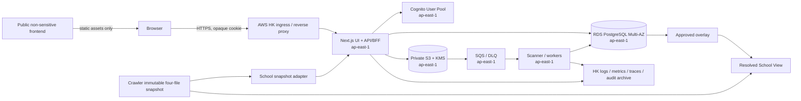
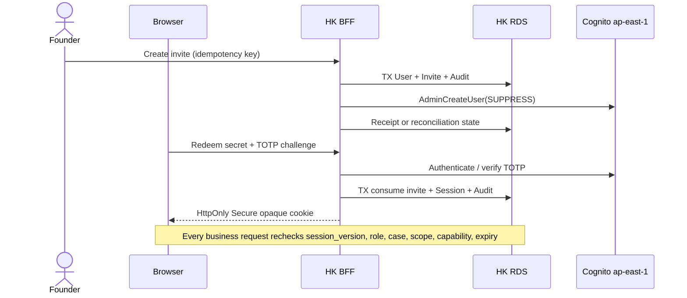
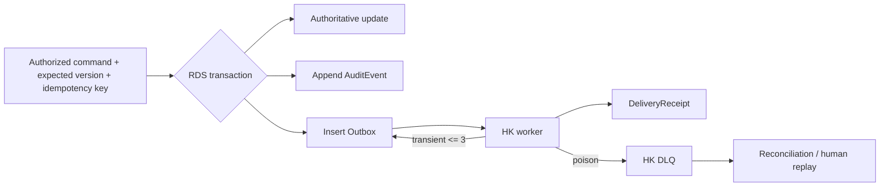
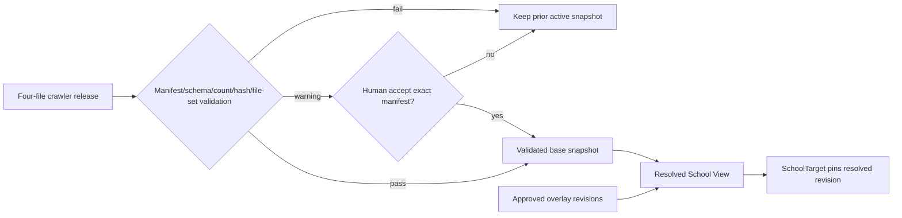
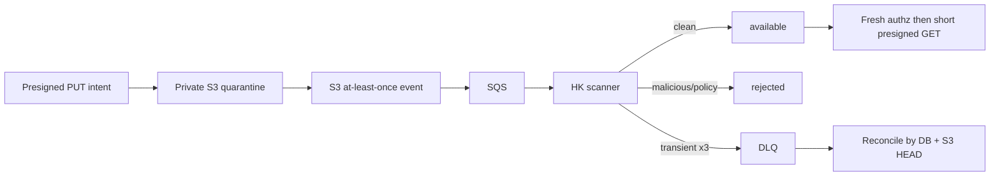
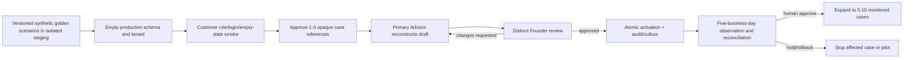
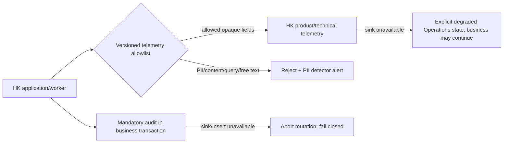

# Tianxing K12 Release 1 Phase Implementation Plan

> **For agentic workers:** implement one ticket at a time. Each ticket must reopen `agents.md`, the closest repository instructions, this plan, and its cited `DEC-xxx`; use deterministic evidence before human review. This plan does not authorize commits, cloud changes, data writes, migration execution, snapshot sync, push, or deployment.

| Control | Value |
| --- | --- |
| Document version | `v0.11` |
| Date | 2026-08-12 (Asia/Hong_Kong) |
| Status | **`P3-02` local deterministic evidence is `needs_human`; `DEC-067`/`DEC-068` implementation baselines are approved; `DP-01`–`DP-12` and all production actions remain separately approval-gated** |
| Task ID | `prd-phase-implementation-plan-2026-07-31` |
| Release | Release 1, single-organization K12 operations core + bounded External Portal + aggregate-only PlatformBilling |
| Approved phase topology | Phase 0 -> Phase 1 -> Phase 2 -> Phase 3 -> Phase 4 |
| Section 18 status | **Approved by the user on 2026-08-01, amended on 2026-08-11, and implementation contracts approved on 2026-08-12** under `DEC-067`/`DEC-068`. Ticket-level human gates and the explicitly unauthorized operations in section 1.5 remain in force. |

Implementation checkpoint: local source, focused-test, and implementation-record artifacts now cover `P0-01` through `P3-02`; P3-02 deterministic evidence remains `needs_human` because identified contract gaps are explicitly deferred. `DEC-067` and `DEC-068` now fix the P3-03 reconstruction and P3-07 AWS source/plan implementation baselines. This is local contract evidence only: Terraform plan/apply, PostgreSQL/RDS adapters, Portal/Billing contracts and migrations, browser/a11y/load evidence, cloud placement, restore, production migration execution, customer access and release gates remain pending. `DP-01`–`DP-12` and `DEC-060` remain fail-closed gates. No database write, migration execution, Cognito/AWS/Vercel action, real data use, crawler publish/sync, warning acceptance, commit, push, deployment, notice delivery, or release change is implied.

**Goal:** Deliver a ticket-ready path from deterministic synthetic verification to an empty production tenant, bounded read-only external access and aggregate-only billing control, then to 1-3 customer-reconstructed existing cases and a monitored 5-10-case K12 pilot, while keeping sensitive data in Hong Kong and preserving reconciliation, restore and rollback evidence.

**Architecture:** A Next.js 16 modular monolith is self-hosted in AWS `ap-east-1`; Route Handlers are thin BFF adapters over server-only owning modules and private RDS PostgreSQL. Cognito proves identity, RDS owns authorization/session state, S3/KMS/SQS/scanner owns private document bytes, and the immutable crawler snapshot is resolved with approved RDS overlays.

**Tech stack:** Next.js 16.2.7, React 19.2.4, TypeScript, pnpm, PostgreSQL/RDS, Cognito User Pools, S3 Standard, KMS, SQS/DLQ, Node workers, Terraform plan files, and a Phase 0-selected SQL-first migration tool.

## 1. Plan Contract

### 1.1 Problem, stakeholders, and outcome

The production problem is not the absence of screens. The current CRM is mock data, crawler mutations use unversioned runtime-created Neon tables, authenticated authorization is absent, and sensitive processing is not yet proven to stay in Hong Kong. Release 1 must first deliver a complete but business-data-empty production tenant, prove deterministic behavior with versioned synthetic scenarios, then let customer-authorized users reconstruct 1-3 existing cases before controlled expansion to 5-10 live K12 cases. Case ownership, field provenance, least privilege, auditability, concurrency safety, document durability, reconciliation, and rollback evidence remain mandatory. Engineering must not receive or handle real Student/Guardian/case PII; customer inputs to engineering are limited to approved non-identifying case shapes, exception patterns, roles, and success criteria.

Stakeholder outcomes:

| Stakeholder | Required outcome |
| --- | --- |
| Founder/Admin | See every pilot case's state, next task, owner, deadline, exception, and approval; revoke access and restore a known-good state. |
| Primary Advisor | Create and advance assigned K12 cases, collaborate through bounded grants, and use schools/documents/tasks without hidden spreadsheet state. |
| Case Collaborator | See and mutate only granted scopes/capabilities until explicit expiry; never export sensitive data. |
| Contractor | Operate only assigned task workspace with redacted context. |
| Data Reviewer | Review school changes against immutable crawler evidence without editing the snapshot. |
| Engineering/Operations | Reconstruct every release, migration, failure, reconciliation, and restore using non-PII evidence. |
| Privacy/Security owner | Prove storage, processing, logs, backups, temporary copies, and support paths remain in Hong Kong. |
| Guardian/Applicant | View only one explicitly granted case through a revocable, expiring, read-only portal session; never receive internal or sibling data. |
| Platform Administrator/Finance | View aggregate tenant/billing facts and prepare charge-notice drafts without acquiring tenant PII or tenant membership. |

### 1.2 Source of truth

Read in this order when a conflict is found:

1. `agents.md` and the closest repository `AGENTS.md`.
2. `docs/PHASE3_EMPTY_TENANT_PILOT_REVISION_PLAN.md`, adopted 2026-08-11, for Phase 3/4 rollout, onboarding, telemetry, reconstruction, and acceptance semantics. It does not itself authorize production action.
3. `PRD.md` v2.2, 2026-08-11.
4. `docs/PRD_IMPLEMENTATION_DECISIONS.md` v0.14, including `DEC-061`–`DEC-068` and the continuing open guard `DEC-060`.
5. `MDN_Web_開發課程評讀與程式設計洞見.md`.
6. `docs/research/aws-s3-hong-kong-assessment.md`.
7. `docs/research/aws-postgresql-hong-kong-assessment.md`.
8. `docs/research/aws-identity-hong-kong-assessment.md`.
9. `erp-frontend/AGENTS.md`, `erp-frontend/package.json`, current frontend source, and local Next.js 16 authentication/data-security/self-hosting/Route Handler documentation.
10. `automated_tracker_for_school_listing/hk-school-platform/AGENTS.md`, `docs/AGENTS.md`, `apps/crawler/docs/PRODUCTION_WORKFLOW.md`, and current publish/schema/test source.

Historical documents and generated snapshots are evidence, not authority for new business semantics. The workspace root is not a Git repository; use `git -C erp-frontend ...` and `git -C automated_tracker_for_school_listing ...`.

### 1.3 Release 1 scope

**In scope:** invitation and TOTP login; opaque BFF sessions; internal User lifecycle; role plus case authorization; Student, Guardian, relationship, K12 ServiceCase, versioned Assessment, SchoolTarget, Task/assignment, private document versions/scanning, provisional school/change request/approved overlay/resolved view, in-app notifications, append-only tenant/platform audit, future batch-migration controls, dashboard projections, synthetic golden scenarios, production empty-tenant readiness, customer-side historical reconstruction, privacy-safe telemetry, bounded single-case read-only External Portal, aggregate-only PlatformBilling/contract versions/charge-notice drafts, 1-3 first cases, and a monitored 5-10 active-case pilot. `[DEC-001, DEC-003-DEC-046, DEC-050, DEC-052, DEC-056-DEC-058, DEC-061-DEC-068]`

**Out of scope:** engineering receipt or processing of real Student/Guardian/case PII; production synthetic business rows; initial-pilot source snapshot backfill or cutover; Excel/CSV import UI or execution; portal public registration/write/comment/upload/document download; external Email/SMS/WhatsApp notifications; AI customer reports; tax invoice/payment/refund/accounting/revenue recognition; automated crawler-to-frontend sync; public partner login; second tenant activation; tenant-to-global knowledge promotion; public RDS/S3; cross-region failover; and long-term dual-write. `DEC-036` and the implemented backfill runner remain dormant future batch-migration controls, not initial-rollout work. `[DEC-001-DEC-003, DEC-018, DEC-024, DEC-033, DEC-036, DEC-047-DEC-049, DEC-051-DEC-060, DEC-064]`

### 1.4 Assumptions, constraints, and approval boundaries

- The approved application architecture is a modular monolith. The existing Next.js 16 application remains the UI shell; authenticated ERP pages, BFF Route Handlers, and all server-only modules run in AWS `ap-east-1`. Background workers are separate processes using the same owning-module contracts. `[DEC-018, DEC-021, DEC-056]`
- Vercel may host only verified static, non-sensitive public assets. It must not receive authenticated requests, PII, personalized cache, previews, logs, traces, or support payloads. If this cannot be proven, the production ERP is entirely served from AWS Hong Kong. `[DEC-021, DEC-054]`
- Cognito proves identity only. RDS User/session/role/case/scope/capability/expiry policy is authoritative. The browser gets only a random opaque cookie. `[DEC-007, DEC-020]`
- RDS PostgreSQL is private; S3 is private, versioned, SSE-KMS encrypted, and accessed through narrow presigned intents after fresh server authorization. `[DEC-019, DEC-024]`
- The crawler four-file snapshot is an immutable base. Human changes are RDS overlay revisions. No source or snapshot file is hand-edited. `[DEC-016, DEC-050]`
- New business writes use `record_version` or an equivalent ETag; stale writes return structured `409`. There is no last-write-wins. `[DEC-010, DEC-032, DEC-044]`
- Current `modules/crm/infrastructure/mock-students.ts`, the 16 display fields, and runtime `CREATE TABLE IF NOT EXISTS` are not migration inputs or production contracts. `[DEC-012, DEC-026, DEC-031]`
- No real Student/Guardian/case PII, document content, or source-system extract may enter Git, agent prompts, fixtures, tickets, screenshots, general telemetry, or non-Hong-Kong support paths. Engineering receives only approved non-identifying shapes and opaque references; authorized customer users enter real data directly in production.
- Live monitoring is supplementary evidence for adoption, workflow fit, and operations. It never replaces deterministic authorization, state, schema/migration, concurrency, replay, partial-failure, rollback, or restore gates. Product/technical telemetry fails open into an explicit degraded Operations state; mandatory audit remains transaction-bound and fails closed.
- Phase estimates are planning ranges, not procurement approval. Identical transient operations may be retried at most three times with bounded backoff; deterministic failures are changed once then rechecked; two repeats with no new evidence stop in `needs_human`.

The phase topology was approved on 2026-08-01. Human approval remains mandatory before: selecting unresolved business semantics; provisioning/changing AWS or Vercel; using a real invite channel; importing real records; executing any staging/production migration; enabling a feature flag for real users; accepting crawler warnings; cutover; pilot expansion; restore/PITR endpoint switch; purge; KMS deletion; commit/push/deploy.

### 1.5 Explicitly unauthorized operations

This plan does not authorize creating AWS/Cognito/Vercel resources, running migrations, writing Neon/RDS, copying crawler snapshots, full crawls, paid LLM calls, warning acceptance, production-like schedules, data deletion, frontend `pnpm lint`/`pnpm build`, commits, pushes, deployments, or production rollback. Each is a later action with an exact payload, owner, evidence, and approval.

### 1.6 Definition of plan complete

The plan is complete when all current decisions are mapped, every requested component/entity/flow has an owner and enforceable contract, each phase has deterministic entry/exit evidence and rollback boundaries, open semantics are isolated in a register, and the dependency-ordered backlog contains only session-sized tickets with repository/files, DEC IDs, evidence, cleanup, and approval gates.

## 2. Decision Traceability

The ledger namespace contains 68 IDs. Under the adopted Phase 3/4 and R1X scope revisions, 67 are closed/current: 59 `accepted`, one `accepted_with_constraint` (`DEC-007`), and seven `amended` (`DEC-001`, `DEC-011`, `DEC-016`, `DEC-031`, `DEC-033`, `DEC-054`, `DEC-057`). `DEC-060` remains open. Reconstruction, telemetry, placement, Portal/Billing, and the P3-03/P3-07 implementation contracts are accepted as `DEC-061`–`DEC-068`.

Machine-checkable status inventory:

- `accepted` (59): `DEC-002`, `DEC-003`, `DEC-004`, `DEC-005`, `DEC-006`, `DEC-008`, `DEC-009`, `DEC-010`, `DEC-012`, `DEC-013`, `DEC-014`, `DEC-015`, `DEC-017`, `DEC-018`, `DEC-019`, `DEC-020`, `DEC-021`, `DEC-022`, `DEC-023`, `DEC-024`, `DEC-025`, `DEC-026`, `DEC-027`, `DEC-028`, `DEC-029`, `DEC-030`, `DEC-032`, `DEC-034`, `DEC-035`, `DEC-036`, `DEC-037`, `DEC-038`, `DEC-039`, `DEC-040`, `DEC-041`, `DEC-042`, `DEC-043`, `DEC-044`, `DEC-045`, `DEC-046`, `DEC-047`, `DEC-048`, `DEC-049`, `DEC-050`, `DEC-051`, `DEC-052`, `DEC-053`, `DEC-055`, `DEC-056`, `DEC-058`, `DEC-059`, `DEC-061`, `DEC-062`, `DEC-063`, `DEC-064`, `DEC-065`, `DEC-066`, `DEC-067`, `DEC-068`.
- `accepted_with_constraint` (1): `DEC-007`.
- `amended` (7): `DEC-001`, `DEC-011`, `DEC-016`, `DEC-031`, `DEC-033`, `DEC-054`, `DEC-057`.
- `open` (1): `DEC-060`; guard only, never an implementation premise.

| Decision set | Plan location | Delivery tickets | Scope treatment |
| --- | --- | --- | --- |
| `DEC-001`, `002`, `003`, `025`, `033`, `040`, `041` | Sections 1, 7-12 | `P0-01`, `P1-01`-`P1-18`, `P2-10`, `P3-00`-`P3-19`, `P4-01`-`P4-10` | Release 1 boundary; amended rollout is synthetic -> empty tenant -> 1-3 reconstructed cases -> 5-10 monitored cases. |
| `DEC-004`, `005`, `006`, `012`, `013`, `026`, `027`, `028`, `042`, `043`, `045` | Sections 4-6, 8-12 | `P0-05`-`P0-08`, `P1-05`-`P1-13`, `P2-01`-`P2-05` | Domain identity, schema manifests, state, deletion, and duplicate correction. |
| `DEC-007`, `008`, `009`, `010`, `011`, `020`, `029`, `044`, `046` | Sections 3-6, 8-12 | `P0-03`, `P0-09`, `P1-02`-`P1-04`, `P1-17`, `P2-04`, `P2-07` | Cognito is constrained; 7-day grants supersede the old 30-day default. |
| `DEC-014`, `015`, `016`, `050` | Sections 3-7, 8-12 | `P0-07`, `P1-08`-`P1-10`, `P2-06`, `P2-10` | Immutable base plus approved RDS overlay; Neon reference is amended to RDS. |
| `DEC-017`, `018`, `019`, `021`, `022`, `023`, `024`, `030`, `037`, `038`, `039` | Sections 3-9 | `P0-02`, `P0-10`-`P0-12`, `P1-11`-`P1-13`, `P3-05`-`P3-12`, `P4-04`, `P4-06`, `P4-08` | Hong Kong-only sensitive system, private storage, privacy-safe operations, retention and restore evidence. |
| `DEC-031`, `032`, `034`, `035`, `036` | Sections 5-12 | `P0-04`, `P0-11`, `P1-14`-`P1-18`, `P2-11`, `P3-00`-`P3-19`, `P4-01`-`P4-10` | Empty-database schema migration, API, outbox/audit, deterministic gates and pilot; `DEC-036` is retained only for a future approved batch migration. |
| `DEC-047`, `048`, `049` | Sections 1, 4, 11-12 | `P0-01`, `P2-12` | Future contracts only; no AI or import execution in Release 1. |
| `DEC-051`, `052`, `053`, `054`, `055`, `056`, `057`, `058`, `059` | Sections 1, 3-5, 7-12 | `P0-02`, `P0-06`, `P0-09`, `P2-08`, `P3-00`-`P3-19`, `P4-01`-`P4-10` | Future-proof ownership/interface and data classes; amended pilot validation; no second tenant or knowledge workflow. |
| `DEC-061`, `DEC-062` | Sections 4-12 | `P3-00`, `P3-03`-`P3-06`, `P3-09`-`P3-19`, `P4-01`-`P4-10` | Historical reconstruction requires assigned Advisor, distinct Founder review and atomic activation; telemetry rejects PII, fails open into degraded Operations, and never weakens mandatory audit fail-closed behavior. |
| `DEC-063` | Sections 1, 3, 7-12 | `P3-07`-`P3-19`, `R1X-09`-`R1X-12` | Authenticated runtime and all sensitive data remain AWS Hong Kong; Cloudflare carries only approved public school releases; Vercel retires after AWS observation. |
| `DEC-064`, `DEC-065`, `DEC-066` | Sections 1, 3-12 | `R1X-00`-`R1X-12` | Bounded Portal and aggregate-only PlatformBilling are Release 1 scope; portal lookup is function-only; platform audit is separate. Open DP gates still block their dependent semantics and production activation. |
| `DEC-067` | Sections 4-12 | `P3-03`, `P3-04`, `P3-08`, `P3-11`, `P3-19`, `P4-01`-`P4-03`, `P4-08` | Reconstruction uses versioned existing-domain events, server time and immutable ordering; third change cycle stops; activation is append-only and emits only one PII-free event after repository approval verification. |
| `DEC-068` | Sections 3, 7-12 | `P3-07`, `P3-07A`, `P3-10`, `R1X-10` | Production source fixes private two-AZ ECS/RDS/WAF baselines and required external payloads; P3-07A alone produces the saved binary plan under separate approval, and only its SHA may identify a later separately approved apply. |
| `DEC-060` (`open`) | Section 11 | None until approved | Not implemented or inferred. |

Every implementation ticket below carries its own DEC list. A DEC mention is traceability, not authorization to execute the ticket.

## 3. Target Architecture and Component Boundary

### 3.1 Component contracts

| Component | Owner | Visible data / actions | Input -> output interface | Timeout / retry | Failure mode / recovery | Hong Kong residency evidence |
| --- | --- | --- | --- | --- | --- | --- |
| Public non-sensitive frontend | Product/Web | Public copy and immutable assets only; no auth, PII, personalized fetch, or sensitive analytics | Versioned static build -> hashed assets | Asset GET may retry; no writes | Serve previous static version; remove hosting if telemetry cannot be constrained | Build manifest, route inventory, cache/log inspection proving no sensitive payload; Vercel use remains separately approved. `[DEC-021,054]` |
| AWS API/BFF/ERP runtime | Application owner | Opaque cookie, authorized DTOs, commands; no raw secrets in client | HTTPS request + request ID + idempotency/ETag -> versioned success/error envelope | General API 10s hard timeout; DB operations no blind retry; return retryability | `401/403/404/409/422/429/503`; fail closed for auth and writes; read-only/degraded state is explicit | Region/IaC plan, ALB/ECS/task placement, DNS, log destinations, egress inventory, synthetic data-flow test. `[DEC-018,021,032]` |
| Cognito User Pools | Identity owner | Provider subject, auth challenge, TOTP, token revoke; no business roles | BFF admin/auth command -> provider result/typed provider error | 5s call; max 3 transient retries; revoke reconciled | No new session if unavailable; RDS disable is immediate, provider revoke becomes pending reconciliation | User pool/API/KMS/CloudTrail in `ap-east-1`; Pinpoint/email/SMS disabled; DPA and optional-feature inventory. `[DEC-007,020]` |
| RDS PostgreSQL | Data owner | All authoritative business data, session records, overlays, audit/outbox metadata | Owning module command/query -> transaction result/DTO | Statement 5s general, migration separately budgeted; transaction retry only for classified safe conflicts | Multi-AZ failover returns `503`; PITR creates new instance; reconciliation before endpoint switch | Private subnet/security-group evidence; instance/standby/backup/snapshot/KMS/log/restore target all `ap-east-1`. `[DEC-019,022,037,038]` |
| S3/KMS/SQS/DLQ/scanner | Document owner | Private bytes, checksum, scan input/result; opaque object keys | Authorized upload intent -> quarantined version; event -> scan result | Presigned intent <= open-decision TTL; scanner <= 120s/object; max 3 transient attempts then DLQ | Never make unscanned content available; reconciliation repairs missed/duplicate events; region outage pauses upload/download | Bucket/key/queue/scanner/log/audit location, public-access and replication drift checks, no CRR/MRAP/CloudFront/Acceleration. `[DEC-017,024,030]` |
| Audit/log/metric/trace | AuditOperations owner | Allowlisted IDs, state, latency, error class; audit can reference actor/resource IDs but application logs contain no raw PII/token/content | Structured event -> HK sink + immutable audit row where required | Telemetry is non-blocking except mandatory audit in the business transaction; bounded buffering | Mandatory audit failure aborts mutation; telemetry loss alerts and reconciles without replaying business mutation | Sink/archive/backup/support-access inventory; automated PII scan; 30-day app logs and one-year audit. `[DEC-023,032,039]` |
| Crawler immutable snapshot | Crawler release owner | Public-school facts, evidence, review queue, summary, manifest; read-only | Exact four-file release + manifest -> validated `PublishedSnapshot` | Validation 60s local target; no network retry during release judgment | Any file/schema/count/hash mismatch preserves previous active snapshot; warning requires human | Source is non-PII; copies and manifest receipts identified. No snapshot copy in this plan. `[DEC-050]` |
| School overlay/resolved view | SchoolIntelligence owner | Approved field revisions, provenance, pinned resolved versions | Base snapshot ID + overlay revision + policy -> resolved DTO | DB-local; stale revision returns `409` | Conflicts create review item; disable bad revision and resolve prior value; never mutate base | Overlay, review, audit, cache/index all in HK RDS/runtime; cache is rebuildable. `[DEC-014-016,042]` |
| Background jobs/reconciliation | Owning module + Operations | Outbox, scan, revoke, projection, expiry, retention candidates; minimum necessary data | Versioned job + idempotency key -> receipt/status/dead-letter | Per-job limits; max 3 transient retries; poison job to DLQ | No silent partial success; named reconciliation scans stuck state; manual replay uses same key | Queue, worker, DLQ, logs, temp storage and support evidence all `ap-east-1`. `[DEC-020,023,032,052]` |
| Future/out-of-scope integrations | Future owner | No Release 1 production access | Disabled adapter interface only -> `FEATURE_DISABLED` | No calls | Fail closed; no credentials or provider resources | AI/import/external notification/portal/multi-tenant evidence required in later decision. `[DEC-047-049,051-060]` |

### 3.2 Module seams and file map

The production code stays a modular monolith. Each module exposes one small `contract.ts`; callers do not write another module's tables or parse its internal errors. Route Handlers are adapters, not business owners.

| Module | Planned source | Owns | Public interface obligations |
| --- | --- | --- | --- |
| Shared runtime | `erp-frontend/modules/shared/**` | request context, error envelope, idempotency, clocks, typed transaction | actor/session/request ID, version, stable code, retryability, audit effect |
| Identity | `erp-frontend/modules/identity/**` | User, Session, Invite, Cognito adapter, revoke reconciliation | no business role in Cognito; opaque session and provider error mapping |
| TenantAccess | `erp-frontend/modules/access/**` | Release 1 organization, role, collaborator, ScopeGrant, policy | resource-level authz and safe disclosure; expiry on every request |
| CRM | `erp-frontend/modules/crm/**` | Student, Guardian, relationship, duplicate candidate/merge | identity/contact DTO minimization and lifecycle constraints |
| CaseWorkflow | `erp-frontend/modules/cases/**` | ServiceCase, Assessment, manifests/answers, SchoolTarget, transitions | schema/state validation and record-version conflict |
| Task | `erp-frontend/modules/tasks/**` | Task, TaskAssignment, assignment/approval states | contractor redaction, assignee/approver guards |
| SchoolIntelligence | `erp-frontend/modules/schools/**` | snapshot registry, provisional school, change request, overlay/resolved revision | provenance, pinning, conflict and rollback |
| Document | `erp-frontend/modules/documents/**` | metadata, version, scan, presigned intent, retention/legal hold | bytes never traverse non-HK runtime; available-only download |
| Notification | `erp-frontend/modules/notifications/**` | in-app notification, delivery receipt, dedupe | minimal content, idempotent delivery |
| AuditOperations | `erp-frontend/modules/audit/**`, `erp-frontend/modules/operations/**` | audit query, telemetry policy, reconciliation/restore evidence | append-only audit, PII-safe diagnostics |
| Adapters | `erp-frontend/app/api/v1/**`, `erp-frontend/workers/**` | HTTP/cookie and queue adaptation only | validate input, call one owning interface, map typed result |
| Database/IaC/tests | `erp-frontend/db/**`, `erp-frontend/infra/terraform/**`, `erp-frontend/tests/**` | migrations, deployment definitions, deterministic harness | immutable checksums, drift report, synthetic fixtures, evidence manifest |

Next.js-specific rules: secure authorization occurs in the server-only module close to data, not only in layout/proxy/UI; Route Handlers and Server Actions are public entry points; DTOs are minimal; request-specific authenticated routes are dynamic and non-cacheable; multi-instance self-hosting uses a reverse proxy, consistent build/deployment ID, graceful drain, and no user-specific shared cache.

## 4. Data Model and Invariants

### 4.1 Global rules

- UUIDs are immutable internal identities. Display names, email, phone, dates of birth, URLs, and crawler names are attributes, never relationship keys.
- All authoritative mutable records have `record_version bigint NOT NULL`, `created_at`, `updated_at`, and actor provenance. Conditional updates increment exactly once; zero affected rows maps to `409 STALE_VERSION`.
- Release 1 rows carry the single approved `organization_id`; this is not a second-tenant launch. The column/composite FK design may be introduced only where it does not imply unapproved subscription semantics. `[DEC-002,051,053]`
- `pending_delete` is a lifecycle overlay, not a business-state shortcut. Purge requires Founder approval, retention/legal-hold/reference checks, and non-PII tombstone audit. `[DEC-030,045]`
- Audit/outbox entries required by a mutation are inserted in the same DB transaction. External effects are never inside the DB transaction and never blindly retried. `[DEC-032,052]`
- A-type authoritative facts, B-type approved versions, and C-type rebuildable projections are stored and restored differently. Audit is evidence, not backup. `[DEC-052]`

### 4.2 Entity contracts

`NN` means database `NOT NULL`; nullable fields are explicitly described. Exact K12 field catalogue, retention periods, and some transition guards remain open and cannot be encoded as arbitrary defaults.

| Entity | Identity / ownership | Required constraints | Lifecycle and optimistic concurrency | Delete/retention, audit, enforcement owner |
| --- | --- | --- | --- | --- |
| User | UUID; Identity module; `(provider, provider_subject)` unique; normalized email case-insensitive unique | `status`, provider subject, `session_version` NN; email is not FK | `invited/active/disabled`; `record_version`; disable increments session version | Disable, then policy-driven purge; invite/login/MFA/role/disable/revoke audited; Identity DB + Cognito adapter. `[DEC-007,020]` |
| Session | UUID; Identity; browser holds only hash-addressed opaque secret | secret hash unique NN; User FK; provider-token ciphertext/key version NN while active; expiry/revoked fields | `active -> revoked/expired`; session version captured; no record overwrite on revoke | Expiry cleanup after approved retention; create/refresh/revoke/reject audited; Identity module. |
| Invite | UUID; Identity; one User target; secret only as one-way hash | unique active target per policy; email/role request, expiry, inviter FK NN; consumed time nullable | `created -> redeemed/expired/revoked`; `record_version`; delivery state records only the approved channel policy and opaque delivery receipt | Remove secret hash after retention window; create/view-once/redeem/revoke audited; exact provider payload remains separately approval-gated. |
| ReferralSource | UUID; CRM reference data; Release 1 organization | name/type/status NN; no User/account FK; optional external reference not unique identity | `active -> inactive`; `record_version`; case association preserves historical label/version | Retain while referenced; create/change/inactivate audited; CRM module. No partner login/read right. `[DEC-002]` |
| Student | UUID; CRM; single Release 1 organization | organization FK, display identity and status NN; names/DOB/phone not unique; no legal ID fields | `active -> pending_delete -> purged`; `record_version`; merge by revision only | Retention open; all sensitive reads/writes/merge/delete audited; CRM + DB. `[DEC-004,006,042,045]` |
| Guardian | UUID; CRM | organization FK NN; email/phone nullable and not globally unique; no automatic merge | same lifecycle/version as Student | Retention open; sensitive read/merge/delete audited; CRM + DB. `[DEC-005,042,045]` |
| StudentGuardianRelationship | UUID; CRM; Student and Guardian composite organization FKs | relationship type, legal flag, contact purposes, effective dates NN; partial unique one current primary contact per Student; at least one current primary is a deferred transaction invariant | effective interval; `record_version`; handoff closes prior and opens new atomically | History retained with Student policy; consent/contact changes audited; CRM transaction. `[DEC-005]` |
| ServiceCase | UUID plus unique human `case_number`; CaseWorkflow; Student FK | `application_type=K12` in R1, intake year, admission type, primary Advisor, state NN; partial unique `(student_id,intake_year,admission_type)` for non-ended cases | accepted eight-stage state; prior-stage rollback requires Founder/reason; lifecycle overlay; `record_version` | Never reopen ended case; retention open; all transitions/owner transfer/delete audited; CaseWorkflow + DB. `[DEC-003,004,008,027,045]` |
| CaseCollaborator | UUID; TenantAccess; Advisor + Case | unique active `(case_id,user_id)`; Advisor only; effective dates NN | active until removed/expired/case end/user disable; `record_version` | History retained with case; add/remove/expiry audited; Access policy. `[DEC-008,029]` |
| ScopeGrant | UUID; TenantAccess; collaborator/case | scope and `view/comment/edit` capability NN; expires at <= case end; sensitive grants require Founder approval/reason; no export capability | `pending_approval/active/revoked/expired`; `record_version`; default grant period 7 days | No silent renewal; grant/use/revoke/expire audited; policy evaluates current time per request. `[DEC-009-011,029,046]` |
| Assessment | UUID; CaseWorkflow; one ServiceCase and manifest | Case/Manifest FKs NN; unique active assessment per `(case_id,manifest_id)`; status NN | `draft -> background_complete -> selection_ready` only when manifest blockers pass; `record_version` | Retain with case; answer/status changes audited; CaseWorkflow. `[DEC-012,013,026]` |
| SchemaManifest | immutable UUID/content hash; CaseWorkflow | unique `(application_type,composition_version)` and content hash; four module refs NN | `draft -> approved -> retired`; immutable after approval; no mutable record version | Never rewrite manifests referenced by assessments; approval audited; schema registry. `[DEC-012,026]` |
| Answer | `(assessment_id,field_id)`; CaseWorkflow | manifest field FK; semantic state NN; exactly one of typed value or `unknown/not_applicable/declined_to_provide`; source/visibility/updater NN | answer `record_version`; derived values also store rule version | Retain with case; field-level before/after audit for sensitive updates; schema validator + DB checks. `[DEC-013,043,044]` |
| School | stable platform UUID/key; SchoolIntelligence | canonical identity NN; name/URL not sole identity; current base/resolved references nullable until available | `provisional/under_review/verified/retired`; `record_version` | No hard delete after reference; identity/merge/retire audited; SchoolIntelligence. `[DEC-014,042]` |
| ProvisionalSchool | School subtype keyed by `school_id`; SchoolIntelligence | creator, reason, district/system/stage NN; official URL nullable until discovered and verified | follows School lifecycle; `record_version` | Preserve verification history; create/submit/review audited; cannot be AI/verified fact. `[DEC-014]` |
| SchoolChangeRequest | UUID; SchoolIntelligence | School FK, field, base school version, old/proposed value, reason, evidence, requester NN; reviewer != requester | `submitted -> approved/rejected/withdrawn`; `record_version`; identity changes require Founder | Retain as evidence; every decision audited; DB guard + reviewer policy. `[DEC-015]` |
| OverlayRevision | immutable UUID/revision number; SchoolIntelligence | School/base snapshot/change request/field provenance/approver NN; unique revision sequence | `active -> superseded/disabled`; append-only; activation uses current version guard | Never overwrite; disable bad revision to restore prior resolution; audited; resolver. `[DEC-016]` |
| SchoolTarget | UUID; CaseWorkflow | Case/School/intake/admission FKs NN; unique `(case_id,school_id,intake_year,admission_type)`; pinned resolved revision; DDL/evidence rules by route | accepted independent target states; `record_version`; case state cannot invent target fact | Retain with case; every state/result/pin change audited; CaseWorkflow. `[DEC-004,027,058]` |
| CaseOutcome | UUID; CaseWorkflow; one SchoolTarget, with one current outcome revision | target FK, controlled outcome code/date/evidence/source/actor NN; current revision unique per target; organization/case consistency FK | created when target reaches accepted/rejected/waitlisted/withdrawn/not-submitted/aborted terminal fact; corrections append revision; `record_version` | Retain within legal case policy; outcome/correction audited; target terminal guard requires it. `[DEC-058]` |
| ServiceGoalOutcome | UUID; CaseWorkflow; optional one current revision per ServiceCase | case FK, approved goal version, result/evidence/actor NN | appended only when organization uses an approved service goal; cannot rewrite CaseOutcome; `record_version` | Retain with case; create/correct audited. Optional in R1 and never substitutes target outcomes. `[DEC-058]` |
| Task | UUID; Task module; Case nullable only for approved operational task type | title/type/priority/due/status NN; ServiceCase/SchoolTarget relation checked; assignee semantics in assignment | accepted Task states plus an open initial-state guard; `record_version`; completion != approval | Soft-delete/cancel only; transition/reason audited; Task module. `[DEC-028]` |
| TaskAssignment | UUID; Task module; Task + assignee | one current assignment per Task; actor role and redacted scope snapshot NN | accept/reject/reassign closes prior assignment atomically; `record_version` | Retain assignment history; view/accept/reject/reassign audited; Task + Access. `[DEC-008,028]` |
| Document | UUID; Document module; owning case/student/task | classification, owner relation, active version pointer, retention/legal-hold flags NN | lifecycle includes pending delete/deleted; `record_version`; active pointer conditional | 30-day soft delete; total retention open; download/export/delete/restore audited; Document module. `[DEC-017,030,045,046]` |
| DocumentVersion | UUID; Document module; opaque S3 bucket/key/version ID unique | checksum, size, detected type, uploader, state NN; no PII in key | `pending_upload -> quarantined -> scanning -> available/rejected/scan_failed`; superseded/pending-delete states; `record_version` | Bytes remain versioned; only scanned, allowed version may be restored/active; Document module + S3. |
| ScanResult | UUID; Document module; Version + policy version | unique `(document_version_id,scan_policy_version)`; verdict/signature engine/times NN | `queued/running/clean/rejected/failed`; duplicate event returns existing result | Retain per document policy; scan/retry/DLQ/reconcile audited; worker + DB unique constraint. `[DEC-024]` |
| Outbox | UUID; Shared/AuditOperations; aggregate owner | unique idempotency key; event type/version/payload reference/status/attempt/next time NN | `pending -> processing -> delivered/dead_letter`; lease version prevents concurrent worker | Retain receipt metadata per audit policy; creation same transaction as mutation; worker owns retry. `[DEC-023,032,052]` |
| DeliveryReceipt | UUID; Notification/owning effect | unique `(effect_type,idempotency_key)`; outbox FK; outcome/provider reference NN | `delivered/failed/compensated`; append attempts, never erase | One-year when part of audit; effect/compensation audited; effect adapter. |
| AuditEvent | time-sortable UUID; AuditOperations; actor/resource/request | event type/version, actor, action, resource, outcome, before/after redacted hashes, request ID, occurred time NN | append-only; no update/delete through app role | One year, HK only; legal extension explicit; DB permissions and insert-in-transaction. `[DEC-032,039]` |
| CaseReconstruction | UUID; CaseWorkflow; one draft lineage per approved opaque pilot reference | assigned Primary Advisor, distinct Founder reviewer, source reference, draft version, current-state claim, gap summary NN; organization/case consistency enforced | `draft -> submitted -> changes_requested -> draft`; `submitted -> approved -> activated`; activation once only; `record_version` | Pre-activation drafts stay outside operational projections; activated history is immutable and corrections append a reasoned revision; CaseWorkflow owns. `[Phase 3/4 reconstruction adoption prerequisite]` |
| HistoricalCaseEvent | UUID; CaseWorkflow; one CaseReconstruction | event type/version, `occurred_at`, `recorded_at`, recorder, source evidence or approved gap NN; no future occurrence; stable sequence | draft-only append/correct; activation validates legal historical order without emitting old notifications/tasks | Retain with case history; reported original actor is provenance, never impersonated as system User/audit actor. `[Phase 3/4 reconstruction adoption prerequisite]` |
| HistoryGap | UUID; CaseWorkflow; one reconstruction/version | type, reason, owner, resolution target, Founder decision, record version NN | `open -> resolved/waived`; waiver requires distinct Founder review and remains visible | Never silently dropped; visible after activation until resolved or formally waived. `[Phase 3/4 reconstruction adoption prerequisite]` |
| ImportBatch | UUID; future Import module contract only | source hash/idempotency/mapping/schema/status/count/hash/reject report NN when feature exists | `uploaded -> mapped -> validated -> approved -> applied/rejected/corrected`; immutable applied batch | Not built in R1; corrective batch, not audit deletion; future owner. `[DEC-049]` |
| AIReportVersion | UUID; future ReportingAI contract only | immutable input/prompt/model/knowledge/source/evaluator references and human status NN when feature exists | `draft -> reviewed -> approved/rejected -> superseded`; immutable version | Not built in R1; cannot overwrite source or self-approve; future owner. `[DEC-047,048]` |
| PublishedSnapshot | immutable content-addressed ID; SchoolIntelligence read registry | manifest FK, source run, active flag, activation time NN; one active supported snapshot | `candidate -> validated -> active/rejected/superseded`; activation transactional; `record_version` only on registry pointer | Keep previous valid version for rollback; validate/audit activation; snapshot adapter. `[DEC-050]` |
| Manifest | immutable content hash; crawler release owner | exact four targets, schema version, counts, per-file SHA-256, generated/published time, health/warnings/approver receipt NN | created once; no mutation; warning acceptance is separate human receipt | Retain with snapshot provenance; crawler publish plus consuming validator enforce. `[DEC-050]` |

### 4.3 State machines and guards

| Aggregate | Legal transitions in Release 1 | Guard / owner | Explicitly unresolved |
| --- | --- | --- | --- |
| ServiceCase | `signed -> background_collection -> school_selection_confirmed -> interview_preparation -> application_submitted -> awaiting_result -> offer_confirmed -> closed`; rollback only to immediately prior stage | CaseWorkflow validates manifest blockers, target evidence, actor capability, expected version; Founder approves selection, close, and rollback with reason. `[DEC-027]` | Pause, mid-stream cancellation, multi-school join details, re-sign and exact close evidence: `OD-04`. No implementation may invent them. |
| SchoolTarget | `candidate -> preparing -> submitted -> interview -> waitlisted/accepted/rejected/withdrawn`; terminal results do not collapse to case success | CaseWorkflow route-specific policy validates DDL/material/evidence and actor; each target has its own version. `[DEC-027,058]` | Route-specific transition/DDL/material catalogue: `OD-05`. |
| Task | Required states include `accepted`, `rejected`, `reassigned`, `completed`, `approved`, `overdue`, `cancelled`; `completed` never implies `approved` | Task module validates assignee/approver/case permission, due time, reason and expected version. `[DEC-028]` | Initial state and exact actor/transition matrix: `OD-06`. |
| ScopeGrant | `pending_approval -> active -> revoked/expired`; ordinary grants may start active; sensitive grants cannot | TenantAccess evaluates expiry, user/case state, scope and capability on every request. `[DEC-009-011,029]` | Break-glass, bulk grant and Primary Advisor absence: `OD-07`. |
| DocumentVersion | `pending_upload -> quarantined -> scanning -> available`; `scanning -> rejected/scan_failed`; `scan_failed -> scanning` by bounded retry; `available -> superseded/pending_delete/deleted` | Document module plus scanner unique result; active pointer only to allowed `available` version. `[DEC-017,024,030]` | Total class retention and file RPO/RTO: `OD-02`, `OD-03`. |
| School | `provisional -> under_review -> verified -> retired` | Data Reviewer for ordinary review; Founder for identity/merge/split/retire. `[DEC-014,015]` | Field reducer precedence is specified in `P0-08` without changing approval semantics. |
| SchoolChangeRequest | `submitted -> approved/rejected/withdrawn` | Reviewer cannot be requester; identity-class fields require Founder. `[DEC-015]` | Core transition is closed; evidence catalogue is an implementation contract. |
| Invite/Session/User | Invite `created -> redeemed/expired/revoked`; Session `active -> revoked/expired`; User `invited -> active -> disabled` | Identity module; secret hash; TOTP; opaque session; RDS disable precedes provider reconciliation. Session policy is 15-minute idle, 8-hour absolute, maximum three active sessions, fourth login rejected without eviction, and five-minute sensitive-action TOTP freshness. `[DEC-007,020; OD-08]` | Policy resolved 2026-08-06: one HK-processed, DPA-reviewed transactional channel; secret displayed once, single-use, 24-hour expiry. Exact provider payload remains a separate execution gate. |
| PublishedSnapshot | `candidate -> validated -> active/rejected -> superseded`; only a validated candidate may atomically replace active pointer | Snapshot validator; warning requires exact human approval receipt. `[DEC-050]` | No automatic sync in R1. |
| CaseReconstruction | `draft -> submitted -> changes_requested -> draft`; `submitted -> approved -> activated` | Assigned Primary Advisor records; a different Founder reviews. Submission freezes the submitted version. Activation is one transaction containing authoritative facts, history, approved gaps, mandatory audit and required outbox; historical entries suppress live side effects. | Ledger synchronization is required before implementation; no self-approval, batch reconstruction, or engineering-side PII handling may be inferred. |

## 5. Explicit Data Flows

### 5.1 Flow diagrams

### 5.2 Flow contract matrix

Each row is a complete operational contract. `TX` denotes the durable transaction boundary, not a checkpoint.

| ID / flow | Transaction boundary and durable state | Idempotency / authorization / audit | Retryable vs non-retryable; timeout/DLQ/reconciliation | Compensation / rollback |
| --- | --- | --- | --- | --- |
| `F01` Invite -> TOTP -> opaque session | TX1 creates User/Invite/Audit; Cognito create is external; TX2 records provider receipt; login TX consumes invite and creates Session/Audit. | Invite command key; unique secret hash; Founder invite capability; TOTP at Cognito; audit create/redeem/login failure. `[DEC-007,020]` | Cognito timeout/5xx retry <=3; invalid/expired/replayed secret and failed TOTP are non-retryable; unreconciled provider create is job state. | Revoke invite and disable orphan provider user; login failure creates no session; cookie deletion alone never revokes DB session. |
| `F02` User disable -> session revoke -> Cognito reconciliation | One RDS TX disables User, increments `session_version`, revokes sessions, appends audit/outbox; Cognito revoke follows commit. | `disable:{user}:{version}`; Founder/Admin capability; audit actor/reason/version/provider receipt. | Provider timeout retry <=3 then DLQ; disabled user is immediately denied; reconciliation polls pending revokes. | Re-enable is a new approved command and never restores old sessions; mismatch blocks new login until reconciled. |
| `F03` Create Student + ServiceCase | One TX inserts Student, K12 Case, primary Advisor, Assessment manifest reference, audit/outbox. | Client request key + unique case constraint; actor must create K12 case and assign advisor; audit created IDs. | Unique/validation/auth failures non-retryable; deadlock may retry once using same key; 5s statement. | TX rollback leaves no partial Student/Case; duplicate retry returns original response; later removal uses pending-delete. |
| `F04` Grant/revoke collaborator scope | One TX creates collaborator/grants or sets revoke; audit/outbox same TX. Sensitive grant may persist pending approval first. | Grant key; Primary Advisor ordinary grant, Founder sensitive approval; Advisor role and expiry <= case end; audit grant/use/revoke/expire. | Stale version `409`; expiry worker retryable but request-time policy is authoritative; no reliance on worker timing. | Revoke is immediate RDS truth; invalidate DTO/cache; export is forbidden because viewed data cannot be clawed back. |
| `F05` Resolve four-layer K12 schema | Read approved base + stage + system + route; TX creates immutable composition and assessment reference. | Composition content hash; authorized case actor; manifest approval audit. `[DEC-026]` | Missing/incompatible module is non-retryable `422 SCHEMA_COMPOSITION_INVALID`; never fall back to mock fields. | Discard unreferenced candidate; referenced manifest stays immutable; upgrade creates a new version and explicit decision. |
| `F06` Assessment update / stale conflict | TX checks answer version, schema, semantic state and capability; updates answer/version and audit. | Request key + `(assessment,field,expected_version)`; field visibility and capability; field audit. | DB transient retry once; stale `409` returns safe current version/diff token; 5s. | Client keeps draft, fetches current DTO and explicitly reapplies; no silent overwrite. |
| `F07` Provisional school / change request | TX1 creates provisional School; TX2 submits request; approval TX appends overlay revision, updates pointer and audit. | Separate create/request/decision keys; Advisor create, reviewer != requester, Founder for identity fields. | Missing official evidence `422`; stale base `409`; resolver retryable; conflict opens review item. | Reject/withdraw leaves base unchanged; disable bad overlay revision; never edit snapshot. |
| `F08` Snapshot + overlay -> resolved view | Snapshot activation TX registers validated manifest and switches base pointer; overlay approval is separate TX; resolution is deterministic with provenance. | Snapshot hash and overlay revision IDs; warning receipt; auth for private overlay; activation audit. | File/schema/count/hash mismatch is release failure; projection rebuild retryable; stale cache alerts. | Switch to prior validated snapshot and/or disable overlay; reconcile pinned targets and report mismatch. |
| `F09` Presigned upload -> scan | Intent TX creates pending version; S3 upload; confirm TX quarantines; scan TX is unique by object/version/policy and changes state/audit. | Upload key and scan tuple; fresh case/document capability; download only after clean. | URL expiry may create a new intent but not reuse a version; scan retry <=3 then DLQ; malicious is non-retryable; scan <=120s. | Expire abandoned intent; failed scan never activates; reconcile DB with S3 HEAD/event inventory. |
| `F10` Version rollback / soft delete / legal hold / purge | Rollback TX changes active pointer; delete marks pending; purge verifies approval/retention/hold and writes tombstone/audit before S3 receipt. | Keys per command; case permission, Founder for export/purge, legal-hold guard; audit view/download/delete/restore/purge. | S3 delete retry with receipt; policy rejection non-retryable; partial purge stays pending and reconciles. | Restore only clean allowed version within 30 days; S3 byte recovery and DB pointer restore are separate; purge is irreversible. |
| `F11` Task and Case/Target transitions | Each aggregate transition is one TX with expected version, guard, audit/outbox. Cross-aggregate reads evidence without inventing states. | Command key; assignee/approver/case capability; audit old/new/reason/evidence. | Stale/illegal `409`; missing blocker `422`; notification retryable, transition not replayed. | Prior-stage case rollback is a new Founder-audited transition; task/target use their own legal guards. |
| `F12` Transaction + outbox + in-app notification | Business TX includes mutation/Audit/Outbox. Worker lease TX creates one notification and receipt under unique effect key. | Aggregate command key becomes event/effect key; recipient access rechecked; effect audited. | Worker <=3 attempts then DLQ; poison payload waits for repair; lease timeout sweeper. | Lost access suppresses delivery; duplicate conflicts to existing receipt; notification failure does not undo business fact. |
| `F13` Customer reconstruction -> activation | Draft TXs append profile/case/target/task/document metadata, historical events and explicit gaps under one reconstruction version; activation TX writes authoritative facts, validated history, approved gaps, mandatory audit and required outbox. | Command keys + expected draft version; assigned Primary Advisor records, distinct Founder reviews; source evidence or approved gap required; no future `occurred_at`; historical writes suppress live effects. | Stale version `409`; invalid order/missing evidence/self-approval `422/403`; unknown commit resolves by idempotency receipt; mandatory audit failure aborts activation. | Before activation, request changes or discard the isolated draft. After activation, never rewrite history in place; append corrective revision, or stop the affected case/pilot. |
| `F14` Crawler four-file gate | Crawler creates immutable release; consumer records candidate; activation TX switches snapshot pointer only. | Manifest/content hash; publisher and warning approver; release audit. | Missing/extra/wrong file, schema, count or hash fail; warning waits for human and never retries itself to pass. | Keep prior snapshot; reject candidate with artifact; publish/copy/commit/deploy stay separately approved. |
| `F15` DB/S3 restore drill | Restore creates isolated HK targets; validation compares schema, constraints, counts/hashes, document linkage, audit continuity and sampled queries. | Drill/source backup IDs; Operations role; evidence manifest and audit. | Retry only classified infrastructure fault; reconciliation failure is deterministic; RTO clock continues; no region fallback. | Destroy isolated target only after evidence-retention approval; real switch uses validated target and manually handles post-RPO facts. |
| `F16` Product/technical telemetry | Application emits only versioned allowlisted event names, opaque actor/org/case/request/session/job IDs, role, stable outcome code, timing and build/schema/policy versions to the HK sink; telemetry is never authoritative business state. | Event-schema version; deny unknown fields; automated PII canary; no session replay, DOM/input/keystroke capture, document/name/contact/query/free-text values. | Sink failure does not retry or roll back a business mutation; bounded buffering may retry, then alerts and enters explicit degraded Operations state. | Drop nonconforming events; disable affected telemetry producer; reconstruct usage metrics only from compliant events. Mandatory audit is separate and still fails closed. |
| `F17` Future batch migration under `DEC-036` | Each approved batch TX records source/mapping/schema, rows, counts/hashes/rejects/checkpoint; cutover pointer/flag is separate after reports pass. This flow is dormant in the initial pilot. | Batch/source hash key; migration role only; exact-payload migration and approval audit. | Failed batch stops; safe restart same key; rejects never silently skip; repeated identical failure -> human. | Keep old read path in approved future window; corrective batch fixes target; flag rollback only while schema compatible; no dual-write. |

## 6. Migration, Cutover, and Rollback

### 6.1 Schema versioning selection gate

Ticket `P0-04` scores candidates against eight pass/fail conditions: PostgreSQL/RDS and SQL-first support; immutable ordered checksums and concurrent-runner lock; dry-run/plan plus transaction/timeout controls; empty/prior-schema drift detection; separate migration/application roles; pinned clean-container `pnpm` execution; no vendor cloud or out-of-HK schema telemetry; maintained license and plain-SQL exit.

Preferred evaluation order is SQL-first `node-pg-migrate`, Flyway Community, then an ORM-specific tool only if it passes all conditions. Selection is a Phase 0 technical gate, not authority to run migration.

Names use `YYYYMMDDHHMM_<sequence>_<expand|backfill|switch|contract>_<domain>.sql`; committed checksums never change. Destructive contract versions require evidence that every supported app stopped using the old shape. No automatic `down` is promised for destructive data changes.

### 6.2 Expand/contract sequence

The initial pilot and a future batch migration are separate release lanes. Initial production starts from an empty database and never executes source-data backfill or row cutover. The `DEC-036` lane remains available only after a separately approved future migration payload.

| Lane / stage | Action | Deterministic gate | Failure action |
| --- | --- | --- | --- |
| Initial / synthetic | Apply supported schema to isolated staging; load versioned synthetic golden scenarios | Migration checksum/drift pass; coverage matrix covers approved roles, transitions, exceptions and failures | Stop; repair schema/policy/scenario version and rerun affected deterministic gates |
| Initial / empty production | Apply the same reviewed schema to a new empty HK production database; prove business-table counts are zero | Migration ledger, schema/policy/build versions, zero Student/Guardian/ServiceCase/Task/Document rows | Keep customer access off; roll back compatible app or forward-repair schema; no corrective business-data write |
| Initial / role canary | Enable Founder/Admin, Primary Advisor and Operations access for login, navigation and empty-state smoke only | Role matrix, negative authorization, browser/a11y, mandatory-audit and telemetry distinction pass | Revoke sessions and disable flags; tenant remains empty |
| Initial / first-case canary | Founder approves 1-3 opaque references; customer Advisor reconstructs and distinct Founder activates one case at a time | Per-case source reconciliation, gaps, activation receipt, audit/outbox, privacy scan and rollback threshold pass | Stop affected case or entire pilot according to severity; no source cutover or dual-write |
| Initial / expand | After at least five business days and structured review, expand to 5-10 cases | Zero unexplained differences and open security/data-integrity blockers; signed human decision | Hold at current cohort or rollback; no automatic expansion |
| Future `DEC-036` / expand-backfill-switch-contract | Inventory approved source, freeze/delta, idempotent batches, reconcile, canary reads/writes, observe and later contract | Exact-payload approvals; counts/hashes/rejects/FKs; zero unexplained delta; one write owner | Preserve old read path; corrective batch; never dual-write or silently skip rejects |

Feature flags are server-owned, default off, scoped by environment/actor/case, and audited. They never bypass authz or schema guards. Initial canary order is synthetic staging -> empty production role smoke -> 1-3 reconstructed existing cases -> 5-10 monitored pilot cases. Production synthetic business records are forbidden. Live monitoring supplements but cannot replace deterministic release gates.

### 6.3 Freeze, delta, and reconciliation

- Mock students are not migrated. The initial pilot has no real source snapshot, backfill, freeze, delta, or cutover dependency.
- Real Student/Guardian/case data is entered only by authorized customer users through the reconstruction workflow. Engineering does not receive source extracts or real PII; Git and agent prompts contain only synthetic data, redacted manifests and opaque references.
- Crawler mutable Neon tables are inventoried separately; their migration does not make snapshot JSON mutable.
- Each reconstructed case records an opaque source reference, evidence/gaps, Advisor recorder, distinct Founder reviewer, activation receipt and per-case reconciliation. Any unexplained difference blocks that case and any cohort expansion.
- For a future `DEC-036` batch migration, prefer a write freeze. If impossible, delta capture needs a monotonic cursor, immutable log, replay key, cutoff, final zero-delta check, per-entity counts/hashes/rejects and approved source/mapping versions.
- CI and runtime telemetry reject simultaneous writes to old and new stores if the future batch path is ever enabled. Long-term dual-write remains forbidden. `[DEC-031,036]`

### 6.4 Rollback decision matrix

| Failure | First response | Mechanism | Does not restore | Approval |
| --- | --- | --- | --- | --- |
| App regression, compatible schema | Disable flag / stop new image | Prior image + deployment ID + smoke | DB facts, effects, bytes | Release owner; production approval separate |
| Additive migration before use | Stop runner; inspect history lock | TX rollback or remove proven-unused object | Non-transactional work unless handled | Migration owner |
| Semantic defect after writes | Stop affected writes | Forward corrective migration with preview/count/hash | Effects outside repair | Data owner + Founder for business impact |
| DB corruption/loss | Fail closed; choose recovery point | RDS PITR to new HK instance, reconcile, approved switch | Post-RPO changes, S3, effects | Incident owner + Founder |
| Wrong document version | Block unsafe download | Conditional clean-version pointer; S3 version recovery if needed | Fully purged bytes | Document owner; Founder for sensitive restore |
| Wrong authorization | Revoke RDS and invalidate session/cache | New audited revoke + provider reconciliation | Already viewed data | Primary Advisor/Founder by scope |
| Duplicate/missed effect | Stop effect worker type | Receipt dedupe, compensation event, reconciliation | Business TX | Effect owner; human for external impact |
| Bad snapshot/overlay | Stop activation | Prior snapshot pointer / disable overlay; reconcile pins | Already pinned approved versions | Reviewer/Founder by class |
| Flag inconsistency | Freeze mutation | Server flag rollback + convergence check | Existing schema/data changes | Release owner |

PITR, checkpoint, feature flag, standby, S3 Versioning, and application rollback are distinct; none is universal.

## 7. Phase Plans

> **Approval notice:** the user approved the five-phase section 18 topology on 2026-08-01. This permits dependency-ordered local implementation only; every ticket-level human gate and externally consequential action remains separately approval-gated.

### 7.1 Phase 0 - Contracts / Harness / Threat Model

| Required field | Phase contract |
| --- | --- |
| Objective / stakeholder outcome | Produce executable contracts and local synthetic harnesses so engineers cannot invent identity, authorization, schema, error, migration, audit, or failure semantics while implementing. Founder and reviewers can point from every accepted decision to a testable module interface. `[DEC-031,032,034,040,056]` |
| In scope | Module interfaces, target file map, typed API/error envelope, policy matrix, migrations tool decision, schema migrations, synthetic fixtures, Cognito/S3/scanner fakes, outbox clock/idempotency harness, threat model, residency inventory template, telemetry allowlist, restore/backfill runners, open-decision guards. |
| Out of scope | Cloud resource creation, real Cognito calls, real PII, Neon/RDS writes, UI breadth, crawler publication/sync, pilot. |
| Entry criteria | This plan reviewed; section 18 topology explicitly approved or replaced; DEC ledger unchanged or conflicts resolved; both repo statuses captured; no secrets opened. |
| Repositories/modules | `erp-frontend/modules/**`, `db/**`, `tests/**`, `infra/terraform/**` plan-only skeleton; root plan/evidence templates. Crawler source is read-only in this phase. |
| Dependencies / irreversible decisions | Must not encode `OD-01`-`OD-08` as defaults. Migration and IaC tool selection are reversible technical choices with recorded scorecards. No infrastructure choice is resource authorization. |
| Deliverables | Versioned contracts; initial expand migrations; API schema; permission and data-class matrices; test commands; synthetic dataset; threat/residency model; migration/restore evidence format; rollback runbook draft. |
| Schema/API/UI/workflow changes | Schema defines requested entities and constraints; `/api/v1` envelope and stable codes; UI routes remain dark; workflow transition registries contain only accepted semantics and refuse open transitions. |
| Migration/backfill/cutover | Migration tool chosen; empty/prior-schema plan and drift fixture; no real execution. Backfill runner consumes synthetic versioned snapshots and emits counts/hash/reject report. |
| Security/privacy | STRIDE-style trust/data-flow review; PII classification; server-only import guard; log allowlist/redaction tests; no public DB/S3; no secrets/real PII in fixtures. |
| Concurrency/idempotency/partial failure | Expected-version and idempotency primitives tested with two writers and duplicate commands; fake provider/object/job adapters inject timeout, unknown commit, duplicate, reordered and poison events. |
| Observability/retention/alerting | Define request/job/run IDs, structured event schema, redaction, 30-day app/one-year audit policy, named owner fields, alert catalogue proposal; do not provision sinks. |
| Performance/capacity | Contract targets: general API P95 <500ms, main page P95 <2s, 100 active cases, DB statement budget 5s; synthetic 100-case fixture and query-plan thresholds prepared. |
| Deterministic acceptance evidence | `AC-01`-`AC-08`, `AC-13`, `AC-15`-`AC-18`: schema constraint tests, API contracts, negative policy matrix, migration pass/warn/fail, concurrency/replay, PII scan, architecture/residency review. |
| Rollback/restore/repair | Delete only unreferenced local generated test databases; revert additive migration only before use; preserve failed fixtures/artifacts; corrective migration path documented. |
| Human approval gates | Architecture/module map, migration tool, threat model, all open-decision blocks, and exact synthetic non-production cloud test payload for Phase 1. |
| Cost/time/retry budget | 10-15 engineering days planning estimate; cloud cost `$0`; no external requests; each deterministic gate two correction attempts, then `needs_human`. |
| Stopping conditions | Any accepted DEC contradiction; migration tool lacks drift/lock/plain-SQL exit; policy has an unowned invariant; PII enters fixture/log; section 18 approval is withdrawn or superseded. |
| Exit criteria | All Phase 0 tickets pass; zero silent defaults for open decisions; vertical slice contracts compile against fakes; failure artifacts and owner/escalation recorded; human Phase 1 go/no-go. |
| Downstream dependency | Phase 1 cannot create a route/table/resource until its owning Phase 0 interface, migration, authz and test fixture are accepted. |

### 7.2 Phase 1 - End-to-End Vertical Slice

| Required field | Phase contract |
| --- | --- |
| Objective / stakeholder outcome | Deliver one thin production-shaped path in an authorized HK staging environment: Founder invites Advisor -> TOTP -> Student -> K12 Case -> Primary Advisor -> bounded Collaborator -> provisional School/change request -> SchoolTarget -> scanned document -> Task -> case transition -> audit/revoke/conflict/rollback. `[DEC-040,041]` |
| In scope | Exact scenario above; AWS HK staging adapters/resources only after exact approval; same-origin opaque session; minimal draft assessment composition; one legal case transition; in-app notification; responsive case workspace; all named negative cases. |
| Out of scope | Full K12 field catalogue, all transition routes, real customer data, production migration/cutover, external notification, automated crawler sync, AI/import/multi-tenant functionality. |
| Entry criteria | Phase 0 exit; exact staging IaC plan approved; AWS DPA/data-flow gate accepted for synthetic use; invite test delivery mechanism defined; session/invite TTL approved for staging; no production credentials. |
| Repositories/modules | `erp-frontend` all owning modules, `/app/api/v1/**`, authenticated pages/components, workers, DB migrations, Terraform; crawler repo unchanged. |
| Dependencies / irreversible decisions | Cognito password hashes are non-exportable; provider-exit runbook is mandatory. KMS deletion and DB contract migrations are not part of the slice. Public hosting decision does not weaken HK authenticated boundary. |
| Deliverables | Deployable staging artifact; vertical scenario fixtures; audit timeline; permission expiry/revoke; document scan and rollback; outbox receipt; migration and app rollback rehearsal; release evidence bundle. |
| Schema/API/UI/workflow changes | Minimal tables for User/Session/Invite/Student/Case/Collaborator/Grant/Assessment/School/Change/Overlay/Target/Document/Task/Outbox/Audit. `/api/v1` commands require request ID, idempotency and expected version. Case workspace exposes overview/assessment/schools/tasks/documents/timeline with permission-denied states. |
| Migration/backfill/cutover | Run approved migrations only in isolated HK staging; synthetic seed through public interfaces; verify clean rebuild and prior-image compatibility; feature off by default. No Neon data is copied. |
| Security/privacy | Cognito TOTP only; `AdminCreateUser(SUPPRESS)`; HttpOnly/Secure/SameSite cookie; CSRF/origin checks; resource authz on every route; no PII cache/log; private RDS/S3 and KMS; scanner quarantine. |
| Concurrency/idempotency/partial failure | Duplicate invite/case/upload/task command returns prior result; two answer/case/overlay writers yield one success and one `409`; Cognito revoke and scan/outbox failures reconcile from durable state. |
| Observability/retention/alerting | Synthetic trace from request through audit/outbox/worker; alert on auth failures, stuck revoke/scan/outbox, DLQ, policy denial anomaly and PII scan. Evidence uses opaque synthetic identifiers. |
| Performance/capacity | Vertical APIs P95 <500ms under representative low concurrency; authenticated first view P95 <2s in staging; upload intent <500ms excluding bytes/scan; scan result target <=120s. |
| Deterministic acceptance evidence | `AC-02`-`AC-20`; full positive E2E plus unauthorized case, missing scope/capability, collaborator export, stale write, replay, scan failure, outbox retry, Cognito partial revoke, permission expiry and inconsistent resolved-view rollback. |
| Rollback/restore/repair | Disable slice flag, previous compatible app image, drop only isolated unused staging resources after approval, corrective DB migration, overlay revision disable, document pointer restore, grant revoke, outbox dedupe. |
| Human approval gates | Staging resources and budget; migration plan and checksum; invite transport; warning/error disposition; browser/a11y evidence; Phase 2 go/no-go. No production resource or data approval is implied. |
| Cost/time/retry budget | 20-30 engineering days estimate. DB+connection core stop at `$150/month`; pilot S3 alert `$25/month`; total staging budget requires approval before provisioning. Provider/job max 3 transient attempts; E2E repair loop max 2. |
| Stopping conditions | Any cross-case data exposure; non-HK copy; public RDS/S3; unresolved audit gap; stale write overwrites; unscanned download; migration mismatch; two identical failures; approved monthly budget exceeded. |
| Exit criteria | Positive and all negative scenarios pass; restore/app rollback evidence exists; zero unexplained reconciliation difference; exact evidence reviewed by Founder, security/privacy, data and operations owners. |
| Downstream dependency | Phase 2 may broaden only through the same module interfaces, policy engine, error contract, migrations, audit/outbox and evidence format. |

### 7.3 Phase 2 - K12 Workflow and Data Breadth

| Required field | Phase contract |
| --- | --- |
| Objective / stakeholder outcome | Extend the proven slice across approved K12 profiles, guardians, route manifests, target/task/document operations, school governance and dashboard projections without changing the security or ownership model. |
| In scope | Approved field catalogue; Guardian/relationships; all approved K12 schema modules; accepted case/target/task guards; contractor redaction; school change/merge corrective revisions; dashboard; document legal hold/export controls; crawler manifest gate; one-way backfill tool. |
| Out of scope | Semantics still open after decision deadline; real backfill; Portal implementation (moved to DP-gated `R1X-01`–`R1X-04`); external notification; AI/import execution; automatic snapshot copy; second tenant. |
| Entry criteria | Phase 1 pass; `OD-02`, `OD-04`-`OD-07` closed to the degree required by breadth; formal K12 field/type/enum/visibility catalogue approved; route evidence templates approved. |
| Repositories/modules | `erp-frontend` CRM/Case/Task/School/Document/Notification/Audit UI and contracts; targeted crawler publish/schema/test files only for four-file manifest strengthening. |
| Dependencies / irreversible decisions | Do not use PostgreSQL enum for still-evolving business states; versioned registry/check constraints permit controlled policy evolution. Contract/drop operations remain deferred. |
| Deliverables | Complete Release 1 module breadth, role-shaped workspaces, approved schema manifests, target/task workflow, school governance, dashboard projection, export controls, strengthened crawler manifest, and a dormant deterministic backfill contract for future `DEC-036` use. |
| Schema/API/UI/workflow changes | Expand tables/fields/indexes; paginated/filterable DTOs; all workbench tabs; non-K12 visible but server-disabled; explicit empty/error/denied/stale states; no client-only business validation. |
| Migration/backfill/cutover | Additive migrations and synthetic/prior-shape backfill contract tests only. The initial pilot does not invoke source backfill/cutover; manifest version migration creates new assessment versions or explicit mappings, never rewrites answers. No production switch. |
| Security/privacy | Guardian/contact minimization; contractor task DTO; export Founder approval/watermark/expiry; legal-hold guard; sensitive read audit; crawler facts remain non-PII base. |
| Concurrency/idempotency/partial failure | Guardian primary-contact handoff, Advisor transfer, target/task transitions, merge/undo, overlay activation and projection updates are versioned; projections and notifications reconcile. |
| Observability/retention/alerting | Queue age, grant expiry, stale projection, review conflict, export cleanup, document lifecycle, audit write and crawler snapshot age metrics; exact catalogue reviewed in `P2-08`. |
| Performance/capacity | 100 active/1,000 retained cases fixture; school filter 2,000 rows P95 <500ms; list APIs bounded pagination; main pages P95 <2s. |
| Deterministic acceptance evidence | `AC-01`-`AC-18`, `AC-21`-`AC-24`; all role/capability combinations, schema blockers, state guards, merge undo, file lifecycle, manifest fail/warn/pass, browser/a11y/PII checks. |
| Rollback/restore/repair | Disable individual breadth flags; keep prior manifest and snapshot; corrective revisions/batches; rebuild C-type projections; never delete history to undo merge or approval. |
| Human approval gates | Field catalogue, state/actor matrix, retention/export policy, crawler warning acceptance, synthetic golden-scenario manifest, and Phase 3 reconstruction/telemetry ledger synchronization. No Phase 3 real dataset approval is required because engineering receives no real source extract. |
| Cost/time/retry budget | 25-35 engineering days estimate; no real data or production spend. Test failure loop max 2; crawler gate fixtures are local only; no full crawl/LLM. |
| Stopping conditions | Field/guard remains open; cross-role leak; projection becomes truth; source provenance lost; crawler gate can activate mismatched set; retention cannot be enforced. |
| Exit criteria | All approved breadth implemented behind flags; 100-case synthetic evidence passes; future backfill contract remains deterministic and disabled; no real data or production action occurred. |
| Downstream dependency | Phase 3 freezes this schema/policy version for synthetic staging and empty production. Reconstruction and product-telemetry code cannot pass until their upstream PRD/ledger wording is synchronized. Any behavior-affecting change creates a new version and invalidates affected evidence. |

### 7.4 Phase 3 - Empty-Tenant Production Readiness

| Required field | Phase contract |
| --- | --- |
| Objective / stakeholder outcome | Deliver a complete, login-ready production tenant with zero Student, Guardian, ServiceCase, Task and Document business rows, and deterministic proof that it can safely accept the first customer-entered case. This phase does not claim real-workflow fit. `[DEC-001,031,034,057 as amended]` |
| In scope | Reviewed AWS HK production infrastructure; private RDS/Cognito/S3/KMS/SQS/scanner/observability; empty schema migration; production adapters; versioned synthetic staging scenarios; reconstruction entry point; customer roles and empty states; privacy-safe telemetry; bounded ExternalPortalAccess; aggregate-only PlatformBilling; function-only portal lookup; separate platform audit; browser/a11y, negative authz, failure injection, rollback and restore rehearsals. |
| Out of scope | Production synthetic cases; engineering access to real Student/case PII; real source snapshot; batch import/backfill/cutover; more than 3 first-case references; activation of a real case; automated snapshot sync; second tenant. |
| Entry criteria | Phase 2 exit, completed `P3-00` authority synchronization, and frozen build/schema/policy versions. Each cloud, migration, account, telemetry, rollback and restore execution waits for its own exact-payload approval. The synthetic scenario manifest is a Phase 3 gate output, not a phase-entry prerequisite. |
| Repositories/modules | `erp-frontend` owning modules, Route Handlers, UI, migrations, production adapters, `infra/terraform/**`, deterministic tests and redacted release evidence. No crawler output edit and no real PII artifact. |
| Dependencies / irreversible decisions | Infrastructure apply, production migration, account invitation and feature enablement remain separate exact-payload approvals. Reconstruction, AWS source/plan, telemetry and Portal/Billing architecture are fixed by `DEC-061`–`DEC-068`; `DP-01`–`DP-12` remain per-ticket blockers and changes invalidate affected evidence. |
| Deliverables | One authority-adoption receipt plus the revised seven top-level gate receipts: synthetic coverage; reviewed production platform; empty application/schema deployment; customer empty-state access; telemetry/alerts; rollback/restore; signed first-case go/no-go. Reconstruction readiness is deterministic evidence within the synthetic and empty-deployment gates, not an eighth release gate. |
| Schema/API/UI/workflow changes | Add reconstruction draft/history-gap persistence and thin command adapters only after adoption prerequisite; implement complete empty/loading/error/denied states; no unreviewed state transition or client-owned rule. |
| Migration/backfill/cutover | Apply the approved schema to empty staging and empty production databases. Assert business-row counts are zero. No source freeze, source mapping, real backfill, row cutover or dual-write. `DEC-036` remains dormant. |
| Security/privacy | Engineering sees only synthetic data, approved non-identifying shapes and opaque references. No PII in Git, prompts, tickets, fixtures, screenshots, telemetry or non-HK support. Negative authz, residency, public-exposure and secondary-copy probes are release gates. |
| Concurrency/idempotency/partial failure | Test reconstruction draft version conflicts, replay, self-approval denial, activation unknown commit, scan/outbox/revoke failures and adapter unavailability. Production adapters fail closed; mandatory audit aborts mutation. |
| Observability/retention/alerting | Product/technical telemetry uses versioned allowlists, opaque IDs and 30-day retention; no replay/input/DOM/free text. Telemetry failure is fail-open with explicit degraded Operations state; mandatory audit remains fail-closed and one-year retained. |
| Performance/capacity | Run versioned 100-active/1,000-retained synthetic load in isolated staging; compare API/school P95 <500ms and main-page P95 <2s. Live monitoring is not the capacity oracle. |
| Deterministic acceptance evidence | `AC-01`-`AC-24` as applicable plus `AC-25`-`AC-27`; all approved roles/transitions/exceptions and empty/long/loading/error/denied states; zero production business rows; telemetry PII canary; timed restore and rollback. |
| Rollback/restore/repair | Revoke sessions, disable flags, roll back compatible app, forward-repair schema, and restore the known empty HK baseline. A failed restore keeps first-case entry disabled; no business-data repair is permitted because the tenant must remain empty. |
| Human approval gates | PRD/ledger adoption; IaC plan/apply; production migration; account invite payload; telemetry notice/retention; restore target; first-case go/no-go naming 1-3 opaque references, assigned Advisors, distinct Founder reviewers, owners and budget. |
| Cost/time/retry budget | Phase 3 has 21 session-sized templates (`P3-00`–`P3-19` plus `P3-07A`) and 13 `R1X-*` extension templates; P3-07A plan and P3-10 apply each require separate exact-payload approval; deterministic failure changed once then rechecked; two repeats without new evidence -> `needs_human`. |
| Stopping conditions | Any production business row before go/no-go; unauthorized read; out-of-HK/public copy; mandatory-audit failure; PII in Git/prompt/telemetry; unapproved reconstruction semantics; restore/RPO/RTO miss; repeated no-new-evidence failure. |
| Exit criteria | Production business tables remain empty; deterministic matrix, role/empty-state browser evidence, telemetry/PII scan, private-HK probes, rollback and restore pass; required `R1X-01`–`R1X-10` local/nonprod evidence passes before `R1X-11`; Founder/Security/Privacy/Data/Operations sign a 1-3-case go/no-go. First portal grant and first charge notice still require separate decisions. |
| Downstream dependency | Phase 4 uses the exact build/schema/policy/telemetry/reconstruction versions that passed. Any behavior change invalidates affected evidence. No case may be activated until its own customer review receipt exists. |

### 7.5 Phase 4 - Monitored Existing-Case Pilot

| Required field | Phase contract |
| --- | --- |
| Objective / stakeholder outcome | Let customer-authorized users reconstruct existing cases one at a time, first 1-3 then at most 5-10, and prove business fit, delegation, visibility, privacy, recovery and operational support before broader rollout. `[DEC-001,035,057 as amended; reconstruction/telemetry adoption prerequisite]` |
| In scope | Customer-side reconstruction; distinct Founder review; explicit history gaps; per-case activation/reconciliation; 1-3 first cohort; five-business-day observation; conditional expansion to 5-10; delegation loop; privacy-safe telemetry plus structured interviews; incident/runbooks and restore evidence. |
| Out of scope | More than 10 active cases, 24/7 on-call, external notifications, portal writes/public registration/document download, tax invoice/payment/accounting, AI/import, auto snapshot sync, second tenant activation, cross-region failover. |
| Entry criteria | Phase 3 signed pass; tenant is business-data empty; production infrastructure/schema/accounts/telemetry/runbook/rollback approvals exist; reconstruction and telemetry ledger entries are current; exact 1-3 opaque references, assigned Advisors, distinct Founder reviewers and interview schedule approved. |
| Repositories/modules | Approved production build of `erp-frontend`; crawler remains existing manual release boundary; no unapproved snapshot copy or Vercel sensitive path. |
| Dependencies / irreversible decisions | Production write and purge/contract operations are separate approvals. Region outage remains fail-closed/degraded without cross-region replica. |
| Deliverables | Reviewed reconstruction and activation receipts; per-case source reconciliation and gap disposition; first-cohort observation; approved 5-10 expansion if eligible; delegation loop; daily operational/privacy review; structured customer evidence; signed expand/hold/rollback decision. |
| Schema/API/UI/workflow changes | No schema/contract change inside pilot without returning through expand/test/canary. Feature flags are per case/actor and audited. |
| Migration/backfill/cutover | No batch migration, source freeze or row cutover. Each customer-entered case changes authority only at its atomic activation receipt. Customer source is used for reconstruction and reconciliation, not dual-write. `DEC-036` stays available for a separately approved future batch path. |
| Security/privacy | Live authz and sensitive-read review; grant expiry; export disabled unless approved; logs scanned; private resources and HK secondary-copy inventory continuously checked. |
| Concurrency/idempotency/partial failure | Daily stuck job/revoke/scan/outbox reconciliation; replay/duplicate metrics; unknown commit outcomes escalated, never blind replayed. |
| Observability/retention/alerting | Operations reviews errors, latency, denials, stuck jobs, PII scans and reconciliation every business day for the first cohort; Product holds weekly structured interviews. Telemetry outage enters degraded state but does not block business; mandatory audit outage blocks mutation. |
| Performance/capacity | Measure actual P95 and saturation; stop expansion if API/page targets miss twice or DB+connection core exceeds `$150/month` without approved explanation. |
| Deterministic acceptance evidence | Each case reconciles with zero unexplained difference; all gaps are visible and owned; at least one complete delegation loop; Founder sees every pilot next action without chat; grants expire/revoke; zero cross-case exposure; audit/restore continuity; metrics plus interviews support the decision. |
| Rollback/restore/repair | Per-case flag off, stop writes, prior compatible app, corrective data migration, grant revoke, document/overlay restore, PITR only for broad DB incident. |
| Human approval gates | Every production deploy/rollback/purge; each case submission/approval/activation; expansion from 1-3 to 5-10; warning acceptance; final Release 1 expand/hold/rollback. Founder reviewer must differ from the recording Advisor. |
| Cost/time/retry budget | Four-week pilot recommendation; 5-10 cases; DB and S3 thresholds above; total AWS/runtime/log budget must be approved. Job retries <=3; incident repair max two repeats without new evidence. |
| Stopping conditions | Cross-case exposure, non-HK copy, mandatory-audit failure, unrecoverable corruption, unavailable rollback, unscanned document, unexplained reconciliation difference, repeated SLO breach, cost threshold, or required owner unavailable. An unsupported business shape pauses only that case if Security/Data confirm isolation; systemic integrity/security failures stop the pilot. |
| Exit criteria | Founder signs delegation outcome; technical/privacy/operations owners sign evidence; unresolved risks have owners/deadlines; broader rollout remains a new approved decision. |
| Downstream dependency | No batch migration, second tenant, external integration, public portal, AI/import, automatic sync or expansion beyond 10 follows automatically. `DEC-060`, future `DEC-036` execution gates and later release decisions remain required. |

## 8. Requirements-to-Evidence Matrix

Evidence roots are `erp-frontend/artifacts/verification/<release-id>/` for synthetic/generated artifacts and an approved HK evidence store for real-case or sensitive artifacts. Git receives only redacted manifests, checksums and opaque references. A failing check must preserve location, expected, actual, command/version and owner.

| AC | Requirement / deterministic check | Fixture or scenario | Expected result | Failure artifact | Owner | Release gate |
| --- | --- | --- | --- | --- | --- | --- |
| `AC-01` | Unit: identity, normalization, state guards, schema composition, redaction, resolver | Table-driven edge cases and property generators | Invariants hold; counterexample minimized | `unit/junit.xml`, `unit/counterexamples.json` | Owning module | P0/P2 |
| `AC-02` | Integration: real PostgreSQL constraints/transactions | Duplicate active case, one primary guardian, reviewer=self, stale versions | Constraint/transaction maps to stable `409/422`; no partial row | `integration/db-results.json` | Data owner | P0/P1/P3 |
| `AC-03` | API contract | Every `/api/v1` success/error and malformed body | Versioned envelope, request ID, stable code/retryability; no raw exception | `contract/openapi-diff.json`, response corpus | API owner | P0/P1/P3 |
| `AC-04` | Negative authorization | Founder, Advisor A/B, Collaborator scopes, Contractor, disabled/expired actor | Unauthorized UI/direct API/ID guessing/search/export returns safe `403/404`; no side channel data | `authz/matrix.json` | Security owner | Every phase |
| `AC-05` | Invite/TOTP/session | Valid, expired, replayed invite; invalid TOTP; stolen old cookie; disabled User | Only valid TOTP creates opaque session; replay/old version denied | `identity/scenarios.json` | Identity owner | P1/P3/P4 |
| `AC-06` | Concurrency | Two writers update same answer/case/overlay/assignment/reconstruction draft | Exactly one success, one `409`; winning facts/audit consistent | `concurrency/results.json` | Module owner | P1/P3/P4 |
| `AC-07` | Idempotency/replay | Repeat every create/transition/reconstruction/effect key; unknown commit outcome | Same response/receipt, one durable fact/effect | `replay/ledger.json` | Reliability owner | P1/P3/P4 |
| `AC-08` | Partial failure | Cognito revoke timeout, DB failover, scan timeout, missed S3 event, poison outbox, reconstruction activation interruption | RDS denial remains authoritative; bounded retry/DLQ/reconciliation reaches named state; no partial activation | `failure-injection/run.json` | Operations | P1/P3/P4 |
| `AC-09` | Document authorization/scan | Wrong case, expired URL, duplicate/reordered event, malicious/failed scan | No public/read-before-clean; one scan result; failed object never active | `documents/scenarios.json` | Document owner | P1/P3/P4 |
| `AC-10` | Version/delete/legal hold | Rollback clean version; delete/restore day 29; purge under hold | Clean restore succeeds; hold/policy blocks purge; audit continuous | `documents/lifecycle.json` | Document/privacy | P1/P2 |
| `AC-11` | Transaction/outbox | Commit business mutation while worker down; duplicate delivery | Fact/audit/outbox atomic; later one notification/receipt | `outbox/reconciliation.json` | Notification owner | P1/P3/P4 |
| `AC-12` | Resolved school rollback | Base A + overlays, new conflicting base, disable bad revision | Provenance/pin deterministic; rollback matches prior resolved hash | `schools/resolution.json` | Data owner | P1/P3 |
| `AC-13` | Migration fail/warn/pass and drift | Empty DB, N-1 DB, checksum edit, partial batch, unsupported extension | Pass only supported state; drift/checksum blocks; partial batch resumable | `migration/plan.json`, `migration/reconcile.json` | Migration owner | Every migration |
| `AC-14` | Future batch-backfill reconciliation (`DEC-036`) | Synthetic versioned source plus injected reject/delta; no real pilot source | Counts/hashes/FKs match; rejects/deltas explicit; no dual write; contract remains disabled for initial pilot | `backfill/report.json` | Data owner | P2/future migration |
| `AC-15` | Desktop/mobile browser smoke | 1440x900, 1280x800, 390x844, 375x812; long text/empty/loading/error/denied/stale and reconstruction review | No overlap/overflow; core journey usable; network/console expected only | `browser/report.html`, screenshots/video | QA owner | P1/P2/P3/P4 |
| `AC-16` | Keyboard/focus/a11y | Login/TOTP, case tabs, forms, conflict dialog, permission denied, document status | Logical order, visible focus, labels/status announcement, 44px core targets, no color-only state | `a11y/manual-checklist.json`, automated scan | QA/accessibility | P1/P3/P4 |
| `AC-17` | PII log scanning | Synthetic canary PII/token/invite/document strings through errors and jobs | Zero raw matches in app log/trace/DLQ/support artifact; audit contains approved IDs only | `privacy/pii-scan.json` | Privacy owner | Every phase |
| `AC-18` | Residency and exposure | IaC plan + synthetic data-flow; public network and cross-region probes | Sensitive resources/copies only `ap-east-1`; public RDS/S3 and cross-region paths absent | `residency/inventory.json`, policy results | Security/privacy | P1/P3/P4 |
| `AC-19` | Backup/restore reconciliation | Monthly DB restore and quarterly DB+document restore in isolated HK target | Schema/count/hash/link/audit/sample queries pass; no production endpoint switch | `restore/report.json` | Operations | P3/P4 |
| `AC-20` | RPO/RTO measurement | Timed restore from known source with injected post-point facts | Actual DB RPO <=5m and RTO <=4h; document RPO <=24h and RTO <=8h; any miss fails the gate | `restore/timeline.json` | Operations/Founder | P3/P4 |
| `AC-21` | Crawler manifest/schema/count/hash | Pass, missing file, extra file, wrong hash/count/schema, warning fixture | Only exact four-file supported pass activates; warning requires exact human receipt | `crawler-gate/results.json` | Crawler/Data owner | P2/P4 |
| `AC-22` | Performance/capacity | 100 active/1,000 retained cases, 2,000 schools, low concurrency <20 | General API/school filter P95 <500ms; main page P95 <2s; saturation recorded | `performance/summary.json` | Performance owner | P2/P3/P4 |
| `AC-23` | Dependency/provider outage | Cognito/S3/scanner/product-telemetry sink/mandatory-audit sink unavailable | Identity/document-dependent writes fail closed; allowed reads are explicitly degraded; product telemetry fails open into degraded Operations state; mandatory audit failure aborts mutation | `resilience/outages.json` | Operations | P1/P3/P4 |
| `AC-24` | Release evidence integrity | Tamper with build/schema/policy/snapshot/evidence manifest | Checksum/signature mismatch blocks gate; generated system is not sole judge | `release/evidence-verification.json` | Release owner | Every go/no-go |
| `AC-25` | Empty production tenant | Apply reviewed migration to new HK database, then run role/route probes | Student/Guardian/ServiceCase/Task/Document counts remain zero; customer roles can log in and see correct empty/denied states | `empty-tenant/readiness.json` | Data/Release owner | P3 |
| `AC-26` | Historical reconstruction | Legal/illegal order, future occurrence, missing evidence, approved gap, self-approval, changes requested, concurrent edit, replay, activation and correction | Only assigned Advisor records; distinct Founder approves; no live side effect before/for historical activation; activation atomic; history immutable | `reconstruction/scenarios.json` | Case/Data owner | P3/P4 |
| `AC-27` | Telemetry privacy and failure semantics | Allowlisted event, unknown property, PII canary, session replay/input capture attempt, telemetry sink outage, mandatory-audit outage | Only opaque allowlisted event persists; forbidden capture rejected; telemetry outage is explicit fail-open degradation; audit outage aborts mutation | `telemetry/privacy-resilience.json` | Privacy/Operations | P3/P4 |

Frontend `pnpm lint` and `pnpm build` are listed as separately authorized future release checks; this plan does not authorize running them and does not claim they pass. Focused test commands are defined by Phase 0 but only run within the authorization of each implementation ticket.

## 9. Decision Register

| ID | Unresolved decision | Recommended answer (not approved) | Impact if unresolved | Latest decision stage |
| --- | --- | --- | --- | --- |
| `OD-01` | **Resolved 2026-08-06:** Invite activation secret channel, delivery proof and TTL | **Approved policy:** one HK-processed, DPA-reviewed transactional channel; display secret once; 24-hour single-use invite; never log raw value. The provider, sender identity, DPA reference, recipient payload and delivery-receipt format remain separate exact-payload execution inputs. | Local P1-03 contract may proceed; real Advisor invite or pilot login still requires exact channel approval | Resolved for local P1-03; exact payload mandatory before Phase 3 customer-role smoke and Phase 4 |
| `OD-02` | **Resolved 2026-08-07:** document classification and post-close retention | **Approved:** `identity_and_case_evidence` retains for 7 years after case closure; `operational_attachment` retains for 2 years after closure; `temporary_upload` not attached to a case expires after 30 days. Founder is purge owner; a legal hold overrides all schedules; every purge needs its policy/class/hold evidence and audit receipt. Unknown class is rejected. | Enables P2 retention/export policy without allowing an unclassified purge | Implement as versioned policy; no real purge is authorized by this decision |
| `OD-03` | **Resolved 2026-08-07:** document RPO/RTO and HK outage mode | **Approved:** document RPO is 24 hours and RTO is 8 hours, measured in an isolated HK restore drill. There is no cross-region replica. During an HK-region incident, upload, download and export fail closed; Operations records a manual queue of request IDs only and resumes solely after the HK service is healthy and reconciliation passes. | Enables P3 restore/outage verification | Measured evidence remains mandatory before pilot |
| `OD-04` | **Resolved 2026-08-07:** case pause/cancel/re-sign/multi-school join/close guards | **Approved:** Advisor may pause a non-terminal case with reason; Founder may resume it to the immediately prior stage with reason. Founder may cancel only before `application_submitted`, with reason. Re-sign creates a new case and never rewrites a closed/cancelled case. Each SchoolTarget is joined separately under its own route policy. Founder may close only when all targets are terminal with required outcomes and no open task remains. | Defines bounded exception paths while preserving immutable history | P1-14 implements only its stated core transition/rollback slice; other paths need focused ticket coverage |
| `OD-05` | **Resolved 2026-08-07:** route-specific SchoolTarget templates | **Approved:** Release 1 uses versioned `hk_k12_standard_v1` templates. `preparing -> submitted` requires a due date, checklist-complete receipt and official submission reference; `submitted -> interview` requires invitation evidence and interview time; each terminal outcome requires official portal/letter evidence or an Advisor-attested source reference. Missing evidence blocks the transition. | Enables P2 target breadth without database-enum guesses | Templates remain versioned data, not hard-coded route assumptions |
| `OD-06` | **Resolved 2026-08-07:** Task initial state and actor transition matrix | **Approved:** Task starts `assigned`. Current Assignee may `accept`, `reject` and `complete`; reject/complete require reason. Current Primary Advisor may `reassign` or `cancel`, with reason. A Founder distinct from the current Assignee may approve only a completed task, with reason. Every command requires a fresh TOTP session and expected record version; all other actor/state pairs fail closed. | Enables P1-13 Task workflow | Completion and approval are separate immutable facts |
| `OD-07` | **Resolved 2026-08-07:** Primary Advisor absence, break-glass and bulk grants | **Approved:** no bulk grant exists in Release 1. Founder may issue one `case_summary:view` break-glass grant only when the Primary Advisor is disabled or unavailable for 24 hours; it lasts at most 4 hours, requires incident ID and reason, cannot include sensitive scope/export/edit, alerts Operations, and receives next-business-day Founder review. | Enables Phase 2 absence handling without permanent elevated access | P1-06 remains intentionally limited to ordinary bounded grants |
| `OD-08` | **Resolved 2026-08-02:** session idle/absolute TTL, refresh and concurrent devices | **Approved:** 15-minute idle expiry; 8-hour absolute expiry with no extension beyond it; maximum three active sessions; reject a fourth login without evicting an existing session; sensitive actions require TOTP re-authentication within five minutes | No longer blocks `P0-05`; implementation must preserve stable limit/re-auth denial contracts and version revocation | Resolved before `P0-05` implementation |
| `OD-09` | **Resolved 2026-08-07:** formal K12 field/type/visibility catalogue | **Approved:** four versioned modules are `student_profile`, `family_context`, `education_profile` and `school_preferences`; fields use the P0-07 typed semantic-state contract, default to Advisor-visible, and each module declares its own `background_collection`/`school_selection_confirmed` blockers. P2-02 must publish the exact owned field list and validation enum in an immutable manifest. | Enables Phase 2 catalogue implementation without migrating mock values | No field is live until its immutable manifest is approved |
| `OD-10` | **Resolved 2026-08-07:** public non-sensitive frontend hosting | **Approved:** authenticated ERP, API, session, database and document paths run only in AWS `ap-east-1`. Vercel may serve an isolated public plane only when it has no PII, session, ERP API, crawler review queue or authenticated cache/log path. | Fixes the hosting boundary before production architecture work | Requires reviewed infrastructure payload before provisioning |
| `OD-11` | **Resolved 2026-08-07:** metric/alert catalogue and cloud budget | **Approved:** Founder is the business-hours escalation owner. Pilot alerts fire at 50/80/100% of monthly limits: RDS $150, S3 $25, and total runtime/logging $300. A 100% alert pauses new nonessential work; it never deletes data or disables mandatory security/audit controls. The Section 8 detector/runbook inventory is the minimum catalogue. | Enables P2 operations/alert contract | Exact provider budget actions still require their approved cloud payload |
| `OD-12` | **Resolved 2026-08-07:** crawler warning acceptance | **Approved:** Data Reviewer recommends; Founder accepts one exact manifest SHA-256, warning list, reviewer recommendation, reason, timestamp and 24-hour expiry. A receipt is non-reusable and a changed manifest or warning set invalidates it. | Enables P2 crawler gate activation | No snapshot publication/sync is authorized by this decision |
| `OD-13` | **Resolved 2026-08-07:** future production source freeze and rollback window | **Approved future batch rule:** a 4-hour write freeze precedes any `DEC-036` cutover; the old source is then read-only for 14 days with no dual write. Rollback before new writes restores the approved prior endpoint; after new writes, only an approved corrective migration/reconciliation may proceed. | Does not apply to the initial reconstruction pilot, which has no batch cutover; preserved for future migration | Any future cutover still requires its ticket-level runbook and exact approvals |
| `OD-14` | **Resolved 2026-08-07:** `DEC-060` multi-tenant/subscription/retention/support scope | **Approved:** it remains outside Release 1. No second organization, subscription, retention/support workflow, route, credential or migration is created without a separate post-Release-1 design decision. | Preserves Release 1 single-organization boundary | This is a permanent Release 1 guard, not a feature authorization |

## 10. Dependency-Ordered Implementation Backlog

Tickets are vertical tracer bullets where possible. “Approval” means the listed human must approve the exact payload at execution time; it is not granted here. Any code ticket uses TDD: failing focused test, minimal implementation, full required focused gate, then redacted evidence. Commit/push/deploy remain separate unauthorized actions.

### Phase 0 tickets (12)

| Ticket / single outcome | Repository and exact files/modules | Dependencies / DEC IDs | Acceptance and evidence | Rollback/cleanup / human approval |
| --- | --- | --- | --- | --- |
| `P0-01` Decision guard and trace registry rejects open semantics | Root: this plan; create `modules/shared/domain/decision-guards.ts`, `tests/unit/shared/decision-guards.test.ts` | None; `DEC-001-060` | All 60 decision IDs classified: 59 current non-open premises and one open guard; attempts to enable AI/import/multi-tenant/open transition fail; `AC-01` | Remove unreferenced guard only; architecture owner approves mapping |
| `P0-02` Module/file ownership and residency policy are machine-readable | Create `modules/shared/architecture/module-registry.ts`, `infra/terraform/policies/residency.rego`, `tests/architecture/module-boundaries.test.ts`, `tests/infra/residency-policy.test.ts` | `P0-01`; `DEC-018,021,024,052,056` | Cross-module writes/imports and non-HK/public/replication fixtures fail; `AC-18` | Revert policy version; security/privacy approve model, not resources |
| `P0-03` Versioned API envelope and request context work end to end | Create `modules/shared/presentation/api-contract.ts`, `modules/shared/presentation/request-context.ts`, `app/api/v1/health/route.ts`, `tests/contract/api-envelope.test.ts` | `P0-02`; `DEC-032,044` | Stable codes/request ID/retryability, safe 4xx/5xx, no raw error; `AC-03,17` | Remove unused route; API/security approval |
| `P0-04` Migration tool and drift harness produce reproducible plans | Modify `package.json`; create `db/migrate.config.*`, `db/migrations/README.md`, `tests/migration/drift.test.ts`, `scripts/db/plan-migration.ts` | `P0-02`; `DEC-031,034,036` | Scorecard passes Section 6.1; clean/N-1/drift/checksum fixtures yield pass/warn/fail; `AC-13` | Uninstall unadopted candidate, preserve score/evidence; migration owner approves tool |
| `P0-05` Identity/access schema enforces provider/session/grant invariants | Create `db/migrations/..._expand_identity_access.sql`, `modules/identity/domain/contract.ts`, `modules/access/domain/contract.ts`, `tests/integration/identity-access-schema.test.ts` | `P0-04`, `OD-08`; `DEC-007-011,020,029,046` | Provider uniqueness, opaque session, version revoke, 7-day/sensitive grant/export denial constraints; `AC-02,04` | Additive-only pre-use rollback; identity/security approve migration plan |
| `P0-06` CRM schema enforces ReferralSource, Student/Guardian identity and primary-contact history | Create `db/migrations/..._expand_crm.sql`, `modules/crm/domain/contract.ts`, `tests/integration/crm-schema.test.ts` | `P0-04`; `DEC-002`, `DEC-004`, `DEC-005`, `DEC-006`, `DEC-042`, `DEC-045` | Referral has no login right; no auto merge/legal IDs; one active primary contact and history; `AC-02` | Additive-only pre-use rollback; data/privacy approval |
| `P0-07` Case/assessment/target/outcome schema composes structural K12 manifests | Create `db/migrations/..._expand_cases.sql`, `modules/cases/domain/contract.ts`, `schema/k12/*.json`, `tests/integration/case-schema.test.ts` | `P0-04`; `OD-09` is Phase 2 catalogue gate, not engine gate; `DEC-003`, `DEC-004`, `DEC-012`, `DEC-013`, `DEC-026`, `DEC-027`, `DEC-043`, `DEC-044`, `DEC-058` | Synthetic composition, active-case/target uniqueness, semantic answers, immutable manifest, target outcome required, non-K12 denial; `AC-01,02` | Retire candidate manifest; never rewrite referenced version/outcome; Founder/data approval |
| `P0-08` School resolver deterministically combines immutable base and overlay | Create `db/migrations/..._expand_school_overlay.sql`, `modules/schools/domain/contract.ts`, `modules/schools/domain/resolver.ts`, `tests/unit/schools/resolver.test.ts` | `P0-04`; `DEC-014-016,042,050` | Provenance/pin/reviewer separation/merge corrective revision/rollback hash; `AC-12` | Disable candidate overlay revision; Data Reviewer/Founder approve reducer |
| `P0-09` Task schema and transition registry refuse unapproved actions | Create `db/migrations/..._expand_tasks.sql`, `modules/tasks/domain/contract.ts`, `modules/tasks/domain/transition-policy.ts`, `tests/unit/tasks/transitions.test.ts` | `P0-04`, `OD-06`; `DEC-008,028,044` | Initial/actor matrix approved and enforced; completion != approval; contractor relation safe; `AC-01,04` | Revert unreferenced policy version; Founder/Advisor approve actor matrix |
| `P0-10` Document schema and object adapter enforce quarantine/version/legal hold | Create `db/migrations/..._expand_documents.sql`, `modules/documents/domain/contract.ts`, `modules/documents/infrastructure/object-store.ts`, `tests/unit/documents/lifecycle.test.ts` | `P0-04`; `OD-02/03` gate retention/restore, not structural schema; `DEC-017`, `DEC-024`, `DEC-030`, `DEC-045`, `DEC-046` | Only clean version active; configurable retention, 30-day delete/hold guards, opaque keys; `AC-09,10` | Remove synthetic objects only; privacy/document owner approval |
| `P0-11` Audit/outbox/idempotency/telemetry primitives are atomic and redacted | Create `db/migrations/..._expand_audit_outbox.sql`, `modules/audit/domain/contract.ts`, `modules/notifications/domain/contract.ts`, `modules/shared/domain/idempotency.ts`, `tests/integration/outbox-audit.test.ts` | `P0-03/04`; `DEC-023,032,033,039,052` | Mutation+audit+outbox atomic; duplicate effect one receipt; PII canary absent; `AC-07,11,17` | Corrective migration only after use; audit/operations approval |
| `P0-12` Synthetic harness and threat/restore evidence template reproduce failures | Create `tests/fixtures/release1/**`, `tests/fakes/{cognito,s3,scanner,clock}.ts`, `scripts/evidence/create-manifest.ts`, `docs/security/release1-threat-model.md`, `docs/runbooks/restore.md` | `P0-01`-`P0-11`; `DEC-018,022,034,037,038,057` | All requested failures injectable; evidence checksums; no real PII/secrets; `AC-08,17,19,24` | Delete generated non-sensitive artifacts; security/privacy/operations sign Phase 0 exit |

### Phase 1 tickets (18)

| Ticket / single outcome | Repository and exact files/modules | Dependencies / DEC IDs | Acceptance and evidence | Rollback/cleanup / human approval |
| --- | --- | --- | --- | --- |
| `P1-01` Approved HK staging network/runtime serves a non-sensitive health route | Create `infra/terraform/environments/staging/**`, `infra/terraform/modules/{network,web-runtime}/**`, `docs/runbooks/staging-runtime.md` | Phase 0, `OD-10/11`; `DEC-018,021,035` | IaC plan proves HK/private egress/log policy; health route works; `AC-18,24` | Terraform destroy exact staging payload; explicit cloud/budget approval before apply |
| `P1-02` Private HK RDS runs versioned schema with unprivileged app role | Create `infra/terraform/modules/rds/**`; modify `db/**`, `modules/shared/infrastructure/db.ts`; add `tests/integration/staging-db.test.ts` | `P1-01`, `P0-04`; `DEC-019,022,031,037` | Private/TLS, migration history, app cannot DDL/bypass controls; `AC-13,18` | Restore/destroy staging only under approval; migration plan approval |
| `P1-03` Founder invite -> Cognito TOTP -> opaque BFF session succeeds | Create `modules/identity/application/service.ts`, `modules/identity/infrastructure/{cognito-adapter,in-memory-session-repository}.ts`, `app/api/v1/auth/**`, `app/login/**`, tests | `P1-02`, `OD-08` and resolved `OD-01`; `DEC-007,020,040,041` | SUPPRESS, one-use invite, TOTP, no PII cookie, DB policy lookup; `AC-05,17` | Revoke synthetic user/invite/session; exact Cognito resource and invite-channel approval |
| `P1-04` Disable immediately denies and eventually reconciles Cognito revoke | Create `modules/identity/application/revoke-workflow.ts`, `workers/reconcile-cognito.ts`, tests | `P1-03`, `P0-11`; `DEC-007,020,023,032` | RDS denial survives provider timeout; <=3 retry/DLQ/reconcile receipt; `AC-05,08` | New approved re-enable only; Identity/Operations review |
| `P1-05` Advisor atomically creates Student + K12 Case + Primary Advisor | Create `modules/crm/application/service.ts`, `modules/cases/application/service.ts`, `app/api/v1/cases/route.ts`, integration tests | `P1-03`, `P0-06/07/11`; `DEC-003,004,008,032,040` | One TX, duplicate key same result, duplicate active case rejected; `AC-02,07` | TX rollback or pending-delete corrective command; data owner approval |
| `P1-06` Primary Advisor grants/revokes one bounded collaborator scope | Create `modules/access/domain/policy.ts`, `modules/access/application/service.ts`, `app/api/v1/cases/[caseId]/collaborators/**`, tests | `P1-05`, `P0-05`; `DEC-008-011,029,046` | 7-day expiry, sensitive pending approval, export denied, revoke immediate; `AC-04,06` | Audited revoke; Founder approves sensitive fixture |
| `P1-07` One four-layer assessment manifest supports safe answer update/conflict | Create `modules/cases/domain/schema-resolver.ts`, `modules/cases/application/assessment-service.ts`, assessment routes/components/tests | `P1-05`, `P0-07`; `DEC-012,013,026,043,044` | Same UI/server schema, semantic states, two writes -> success+409; `AC-01,06` | Keep client draft; retire only unreferenced manifest |
| `P1-08` Advisor creates provisional School and submits change evidence | Create `modules/schools/application/service.ts`, provisional/change routes and UI, tests | `P1-05`, `P0-08`; `DEC-014,015,041` | Required identity/reason, no guessed URL, requester cannot review; `AC-03,04` | Withdraw request/retire provisional via audit; Data Reviewer approval |
| `P1-09` Approved overlay resolves a pinned SchoolTarget and rolls back consistently | Create `modules/schools/application/resolved-view.ts`, `modules/cases/application/school-target-service.ts`, routes/tests | `P1-08`; `DEC-016,027,041,044` | Pin includes base+overlay+provenance; bad revision disable restores prior hash; `AC-12` | Disable revision/snapshot pointer; Data Reviewer/Founder approval by field |
| `P1-10` Private HK S3 upload intent creates one quarantined version | Create `infra/terraform/modules/document-store/**`, `modules/documents/application/upload-service.ts`, upload route/tests | `P1-01/02`, `P0-10`; `DEC-017,018,024` | Public/cross-case/expired intent denied; checksum/size/type/opaque key; `AC-09,18` | Delete synthetic staging versions under approval; exact S3/KMS/SQS plan approval |
| `P1-11` HK scanner handles duplicate, failure and DLQ without unsafe availability | Create `workers/scan-document.ts`, `workers/reconcile-documents.ts`, scan repository/tests | `P1-10`, `P0-11`; `DEC-017,024,032` | Unique scan tuple, clean/reject/fail, <=3 retry/DLQ/missed-event recovery; `AC-08,09` | Quarantine remains inaccessible; replay same key; Operations approval |
| `P1-12` Document clean-version rollback and soft-delete restore are audited | Create `modules/documents/application/version-service.ts`, document version/delete routes/UI/tests | `P1-11`; `DEC-017,030,045` | Only clean allowed restore; hold blocks delete; pointer conflict 409; `AC-10` | New pointer revision; no history overwrite; document/privacy review |
| `P1-13` Assignee advances Task through completion and separate approval | Create `modules/tasks/application/service.ts`, task routes/UI/tests | `P1-05/06`, `P0-09`; `DEC-008,028,041,044` | Actor/reason/version guards; completed != approved; stale 409; `AC-04,06` | Reassign/cancel under approved guards; Founder/Advisor matrix approval |
| `P1-14` Advisor performs one guarded Case transition and Founder rollback | Create `modules/cases/application/transition-service.ts`, case transition route/UI/tests | `P1-07/09/13`; `DEC-010,027,041,044` | Blockers and authority enforced; prior-stage rollback reason/audit; `AC-01,06` | New audited rollback transition; no row rewrite; Founder approval |
| `P1-15` Transactional outbox produces one minimal in-app notification | Create `workers/deliver-in-app.ts`, notification repository/UI/tests | `P1-13/14`, `P0-11`; `DEC-023,032,033` | Fact+audit+outbox atomic; duplicate one receipt; content says only pending item; `AC-07,11` | Suppress if access lost; notification failure never reverses fact |
| `P1-16` Case workspace completes the full role-aware vertical journey | Modify `app/layout.tsx`, `components/layout/**`; create `app/(erp)/cases/**`, `components/cases/**`, browser tests | `P1-03`-`P1-15`; `DEC-041,055` | Desktop/mobile/keyboard/focus/empty/error/denied/conflict journey; `AC-15,16` | Feature flag off; retain old mock pages outside production route; UX/QA approval |
| `P1-17` Negative vertical suite proves all named denials/failures | Create `tests/e2e/vertical-slice-negative.spec.ts`, `tests/failure-injection/vertical-slice.test.ts` | `P1-16`; `DEC-034,041,044` | Unauthorized case/scope/export, stale/replay/scan/outbox/revoke/expiry/resolved rollback all expected; `AC-04,06-12,23` | Preserve failure artifacts; no oracle weakening; Security/QA review |
| `P1-18` Staging migration/app/restore rollback evidence supports go/no-go | Create `scripts/release/verify-vertical-slice.ts`, `docs/runbooks/vertical-slice-rollback.md`, evidence manifest | `P1-17`; `DEC-022,031,034,038,040,041` | Compatible prior image, corrective migration, DB/doc restore and checksums pass; `AC-19,20,24` | Destroy isolated restore only after evidence approval; Phase 2 human go/no-go |

### Phase 2 tickets (15)

| Ticket / single outcome | Repository and exact files/modules | Dependencies / DEC IDs | Acceptance and evidence | Rollback/cleanup / human approval |
| --- | --- | --- | --- | --- |
| `P2-01` Guardian relationships support siblings and atomic primary handoff | Modify `modules/crm/**`; create guardian routes/UI/tests | Phase 1, `P0-06`; `DEC-005,042,045` | Shared contact allowed, no auto merge, one current primary and history; `AC-02,04` | Corrective relationship revision; data/privacy approval |
| `P2-02` Approved K12 field catalogue resolves all four-layer manifests | Modify `schema/k12/**`, schema resolver/UI/tests | `P2-01`, `OD-09`; `DEC-003,012,013,026,043` | Every field typed/versioned/visible/blocked; non-K12 server denied; `AC-01,03` | New manifest version; no old answer rewrite; Founder approval |
| `P2-03` Case/SchoolTarget breadth and CaseOutcome enforce approved route guards | Modify `modules/cases/domain/transition-policy.ts`, `modules/cases/application/outcome-service.ts`, target/outcome routes/UI/tests | `P2-02`, `OD-04/05`; `DEC-004`, `DEC-027`, `DEC-044`, `DEC-058` | All approved transitions/evidence tested; every terminal target has outcome; close guard checks all targets; unsupported rejected; `AC-01,06` | Corrective outcome revision or policy flag rollback; Founder/Advisor approval |
| `P2-04` Contractor task workspace exposes only redacted assigned context | Modify `modules/tasks/**`, `modules/access/**`; create contractor page/negative tests | `P2-03`, `OD-06/07`; `DEC-008,028,055` | No identity contact/family/internal note/full case; direct API denied; `AC-04,15,16` | Revoke assignment/grant; Security/Founder approval |
| `P2-05` Duplicate candidates merge and undo only by corrective revision | Create `modules/crm/application/merge-service.ts`, duplicate UI/tests; extend school resolver tests | `P2-01`; `DEC-042` | Candidate only, approved merge aliases/provenance, undo preserves history; `AC-01,02,12` | Corrective undo revision; Founder/Data Reviewer approval |
| `P2-06` School governance covers field/identity review and snapshot conflict | Modify `modules/schools/**`, admin school UI/tests | `P2-03/05`, `OD-12`; `DEC-014-016,042,050` | Self-review denied; identity Founder gate; matching override closes, conflict reviews; `AC-04,12` | Disable revision/restore snapshot pointer; human decision required |
| `P2-07` Document legal hold/export/cleanup obey approved policy | Modify `modules/documents/**`, export routes/worker/UI/tests | `P1-12`, `OD-02/03`; `DEC-030,045,046` | Founder export, one-use/watermark/HK storage/expiry; hold blocks purge; `AC-04,10,17` | Revoke URL/delete expired export under policy; privacy/legal approval |
| `P2-08` Dashboard projection is rebuildable and permission-shaped | Create `modules/operations/domain/case-dashboard-projection.ts`, dashboard API/UI/rebuild tests | `P2-03/04`; `DEC-001,052,055,057` | Founder all, Advisor assigned, collaborator scoped; rebuild hash equals live; `AC-04,22` | Drop/rebuild C-class projection; no authority loss |
| `P2-09` Alert catalogue and business-hours runbooks are actionable | Create `modules/operations/domain/alert-catalogue.ts`, `docs/runbooks/{auth,scan,outbox,pii,region}.md`, tests | `P2-07/08`, `OD-11`; `DEC-023,035,039,057` | Every alert has detector/owner/threshold/runbook/stop state; PII-safe payload; `AC-17,23` | Disable noisy rule with reviewed replacement; Operations/privacy approval |
| `P2-10` Crawler publisher and consumer enforce exact four-file manifest | Crawler: modify `tools/publish_run_outputs.py`, `test_publish_run_outputs.py`; frontend: modify snapshot adapter/tests | `P2-06`, `OD-12`; `DEC-016,050` | Manifest schema/count/SHA-256/file set; fail/warn/pass; warning receipt; `AC-21` | Keep previous snapshot; no publish/sync in ticket without separate approval |
| `P2-11` One-way backfill runner emits deterministic reconciliation | Create `scripts/backfill/**`, `modules/operations/domain/import-ledger.ts`, migration tests | `P2-02/03/05`; `DEC-031,036` | Source/mapping versions, counts/hashes/rejects, resume key, no dual write; `AC-13,14` | Corrective batch/old read path; Data owner approves mapping, no real run |
| `P2-12` Future AI/import/multi-tenant adapters remain disabled by contract | Create `modules/future/domain/feature-contracts.ts`, `tests/architecture/future-scope.test.ts`; modify nav placeholders | `P0-01`, Phase 2; `DEC-025`, `DEC-047`, `DEC-048`, `DEC-049`, `DEC-051`, `DEC-052`, `DEC-053`, `DEC-054`, `DEC-055`, `DEC-056`, `DEC-057`, `DEC-058`, `DEC-059`; `DEC-060` is guard-only | No route/job/credential; non-K12 says developing; governance types compile only; `AC-03,24` | Remove placeholder without data impact; Product approval |
| `P2-13` One versioned permission policy drives server capability checks, page guards and navigation | Create Access policy migration/repository/evaluator and navigation registry; modify `/api/v1/auth/me`, protected layouts, Route Handlers, Services and Access read UI/tests | Identity local runtime, `P1-06/16`, `P2-04`; `DEC-007-011,020,029,053,057,069` | Bootstrap policy preserves the five-role matrix; no direct role arrays remain on migrated paths; page/API/resource denial matrix, activation hash, audit and rollback pass | Activate prior approved version; fail closed with no active policy; Founder/Security review before activation |
| `P2-14` Typed runtime configuration removes scattered operational constants without weakening security bounds | Create validated runtime config composition; migrate session/invite policy, timeout/retry/upload TTL, storage region/bucket and default timezone consumers/tests | `P2-13`; `DEC-017,020,023,030,069` | One owner and schema per setting; production has no unsafe fallback; local defaults explicit; invalid values stop startup; existing behavior retained | Restore prior reviewed config version; restart only after validation; Operations/Security approval |
| `P2-15` Organization presentation configuration replaces fixed dates, preview authority and duplicated labels | Create organization settings/presentation catalogue adapters; modify Today, navigation, Assessment, Dashboard, SchoolTarget and crawler presentation/tests | `P2-13/14`; `DEC-003,012,052,055,069` | Organization timezone drives dates; no fixed 2026-08 filter or preview authority; schema-owned labels follow manifest; desktop/mobile/locale/empty/error states pass | Revert to previous approved catalogue; presentation fallback cannot widen data or access; Product/UX approval |

### Phase 3 tickets (21 templates: one adoption prerequisite, one binary-plan producer, plus 7 release gates)

| Gate | Required execution tickets | Gate outcome |
| --- | --- | --- |
| `G3-0` Authority adoption prerequisite | `P3-00` | PRD, ledger and this plan carry one coherent rollout under `DEC-061` and `DEC-062`. |
| `G3-1` Synthetic golden coverage | `P3-01`-`P3-04` | Versioned synthetic scenarios and reconstruction interfaces cover every approved role, transition, exception and failure before production access. |
| `G3-2` Reviewed AWS HK platform | `P3-07`, `P3-07A`, `P3-08`-`P3-10` | Local IaC source passes; a separately approved exact payload produces the saved binary plan without apply; adapter evidence passes; only then may another approval authorize applying that exact binary SHA and probes. |
| `G3-3` Empty application and schema | `P3-11`, `P3-12` | Approved schema and application deploy separately; production business-row counts remain zero. |
| `G3-4` Customer empty-state access | `P3-13`, `P3-14` | Named roles authenticate and complete empty/error/denied/reconstruction-draft browser and a11y smoke. |
| `G3-5` Privacy-safe telemetry | `P3-05`, `P3-06`, `P3-15` | Local allowlist/degraded-state contracts and the approved production monitoring baseline pass without weakening audit. |
| `G3-6` Rollback, restore and residency | `P3-16`-`P3-18` | Failure suite, application rollback and isolated empty-baseline restore each produce independent receipts. |
| `G3-7` First-case decision | `P3-19` | Signed decision authorizes only 1-3 opaque references or leaves the tenant empty. |
| `G3-X` Portal/Billing/AWS extension join | `R1X-00`-`R1X-11` | Authority, DP-gated contracts, production adapters and two-task E2E evidence join before exact-approved production deploy; first grant/notice remain separate go/no-go. |

| Ticket / single outcome | Repository and exact files/modules | Dependencies / DEC IDs | Acceptance and evidence | Rollback/cleanup / human approval |
| --- | --- | --- | --- | --- |
| `P3-00` Phase 3/4 authority is synchronized under assigned decision IDs | Update `PRD.md`, `docs/PRD_IMPLEMENTATION_DECISIONS.md`, this plan and revision-plan status in the same documentation ticket | Phase 2; amended `DEC-001,031,057`; accepted `DEC-061,062`; revision plan | All authority documents carry the same rollout, inventories/dependencies resolve, and no conflicting superseded rollout wording remains; `AC-24` | Documentation-only rollback; completed by user/Product/Data/Privacy approval on 2026-08-11 |
| `P3-01` Synthetic golden-scenario manifest covers the approved behavior surface | Create `tests/fixtures/release1/phase3/**`, `tests/release/phase3-synthetic-readiness.test.ts`, versioned evidence manifest | `P3-00`; `DEC-026-029,034,044,057,058` | All roles, legal/illegal transitions, scopes/expiry, exceptions, empty/long/error/denied, concurrency/replay/failure cases mapped and checksummed; `AC-01,04,06-08,24` | Keep flags off; revise manifest/version, never weaken oracle; Product/Security review |
| `P3-02` Synthetic deterministic matrix passes against existing module interfaces | Extend focused integration/failure tests and `scripts/evidence/create-manifest.ts`; store redacted generated evidence | `P3-01`; P0-P2 contracts; `DEC-034,044,057` | Coverage matrix has zero unrepresented approved guard; negative authz, concurrency, replay, partial failure and capacity thresholds pass; `AC-01,04,06-08,17,22,24` | Preserve minimal counterexample; two no-new-evidence repeats -> `needs_human` |
| `P3-03` Reconstruction domain contract enforces draft, review, gap and activation invariants | Create `modules/cases/{domain,application,infrastructure}/reconstruction/**`, one additive migration, module-registry entry and focused tests | `P3-00/01`; `DEC-027,032,034,044,061,067`; P3-02 remains `needs_human` evidence, not silent authority | Existing versioned event types and opaque evidence refs only; server UTC/order guards; assigned Advisor and reviewer-recorder separation; third change cycle `needs_human`; repository-verified pilot ref; one-TX append-only activation emits only PII-free `case_reconstruction.activated.v1`; `RECONSTRUCTION_*`/`VERSION_CONFLICT`; `AC-02,06-08,26` | Drop only unused additive objects or forward repair; no production approval row; Data/Founder schema approval |
| `P3-04` Reconstruction Route Handlers and UI expose the owning interface without cross-table logic | Create `app/api/v1/cases/reconstructions/**`, reconstruction UI/form/review states and contract/component tests | `P3-03`; `DEC-032,055,057,061,067` | Versioned envelopes; thin handlers; submit/change/approve/activate actions; no self-approval or pre-activation dashboard entry; `AC-03,04,15,16,26` | Disable reconstruction flag; preserve drafts; Product/Founder approval |
| `P3-05` Product telemetry policy rejects PII and forbidden capture by construction | Create `modules/operations/telemetry-{contract,policy}.ts`, module-registry entry, schema/PII tests and retention manifest | `P3-00/01`; `DEC-023,039,062` | Opaque allowlisted fields only; no replay/DOM/input/keystroke/free text/query/content; 30-day retention; `AC-17,27` | Disable producer and reject nonconforming events; Privacy approval |
| `P3-06` Telemetry runtime enters an explicit degraded state without weakening audit | Create `modules/operations/application/telemetry-service.ts`, local fake/HK adapter interface, alert/runbook and failure tests | `P3-05`, `P2-09`; `DEC-023,032,035,039,062` | Sink outage is fail-open/degraded; mandatory audit outage aborts mutation; no business replay; `AC-08,17,23,27` | Disable telemetry adapter; mandatory audit remains enabled; Operations/Privacy review |
| `P3-07` Production IaC source and static policy evidence satisfy HK/private/budget policy locally | Create `infra/terraform/environments/production/**`, production source-policy tests and fail-closed plan-manifest contract; do not plan or apply | `P3-01`, `OD-10/11`; `DEC-018-024,035,037,039,068` | Source fixes private two-AZ ECS, one NAT/AZ, required endpoints, `1 vCPU/2 GiB` min/desired 2 max 4, PG17 `db.t4g.small` 20 GiB gp3 Multi-AZ/7d, managed WAF and configurable rate; all deployment values required externally; evidence contract reserves saved binary `.tfplan` SHA as apply identity; `AC-18,24` | Revert unreferenced IaC source; cloud/security/privacy/budget source review, no plan/apply/resource authority |
| `P3-07A` Exact reviewed production payload produces the saved binary plan without apply | After P3-07 review, run `terraform plan -out` only under a separate exact production payload/tooling approval; save the binary outside sensitive Git data and generate a separately redacted plan summary/review receipt | `P3-07`; exact account/backend/CIDR/ACM/image/recipient/rate payload and tooling approval; `DEC-018-024,035,037,039,068` | Binary `.tfplan` SHA-256, provider lock/source hashes and redacted summary bind one reviewed payload; secrets absent; no resources changed and no apply; `AC-18,24` | Stop on prompt, drift, secret, payload or hash mismatch; discard unapproved artifact under approved evidence-retention procedure; no apply/resource authority |
| `P3-08` Core PostgreSQL repositories preserve identity, authorization and case transactions | Create production repositories under `modules/{identity,access,crm,cases}/**`; add isolated PostgreSQL tests | `P3-03/07`; `DEC-007-011,020,029,031,032,044,046,067` | Provider/session uniqueness, request-time authz, FK/version/idempotency and cross-CRM/Case activation transaction pass; absent adapter returns typed `503`; `AC-02,04,06-08,23,26` | Keep production wiring off; additive pre-use rollback/forward repair; Identity/Security/Data review |
| `P3-09` Supporting repositories and effect adapters preserve ownership and atomic audit | Create production repositories under `modules/{schools,tasks,documents,audit,notifications}/**`; add isolated integration/failure tests | `P3-05/06/07`; P1/P2 contracts; `DEC-014-017,023,024,028,030-032,039,052` | Cross-module writes denied; document availability, outbox idempotency, projection rebuild and mandatory-audit rollback pass; absent adapter fails closed; `AC-02,08,09,11,12,23,27` | Keep workers/wiring off; no real object/message/data access; module/Security/Operations review |
| `P3-10` Exact reviewed AWS HK plan is applied and matches production probes | Apply only the separately approved P3-07A saved binary `.tfplan`; store resource/probe receipts outside sensitive Git data | Complete `G3-1` receipt (`P3-01`-`P3-04`), `P3-07A`, and `P3-08`-`P3-09`; `DEC-018-024,035,037,039,068`; separate exact-payload apply approval | Applied artifact SHA-256 exactly matches P3-07A binary; redacted JSON/lock/source hashes are supplementary only; required external values and configurable WAF rate match approval; RDS/S3 private, resources/logs/backups HK-only, no cross-region/public path, budget alerts configured; `AC-18,24` | Stop on any identity/payload mismatch; exact rollback/destroy requires separate cloud approval |
| `P3-11` Approved schema migration reaches the empty production database | Execute only the approved migration payload; store migration ledger and zero-row receipt | `P3-08`-`P3-10`; `DEC-019,031,034,067` | Checksums/drift pass; Student/Guardian/ServiceCase/Task/Document counts are zero; no seed/backfill or fabricated reconstruction approval row; `AC-02,13,25` | Keep app/customer access off; TX rollback where valid or forward schema repair; exact migration approval |
| `P3-12` Approved application deploy serves only the zero-row tenant | Deploy the pinned build and run route/adapter/mandatory-audit probes | `P3-06`, `P3-09`-`P3-11`; `DEC-021,023,032,034` | Build/schema/policy versions match; no mock fallback; routes fail closed without adapters; business counts remain zero; `AC-03,23-25` | Keep customer access off; prior compatible app rollback under separate approval |
| `P3-13` Exact customer role invitations create only approved accounts | Execute approved Founder/Primary Advisor/Operations invite payload and record redacted identity receipts | Complete `G3-1` receipt and `P3-12`, `OD-01/08`; `DEC-007-011,020` | Named users redeem single-use invite, TOTP/session/role matrix passes, no business row created; `AC-04,05,25` | Revoke sessions/invites; Identity/Founder exact-payload approval |
| `P3-14` Empty/reconstruction surfaces pass browser, keyboard and a11y smoke | Create/run `tests/e2e/empty-tenant-browser.spec.ts` and representative manual checklist | `P3-04/13`; `DEC-034,055,057` | Desktop/mobile long/empty/loading/error/denied states and reconstruction draft smoke pass; `AC-15,16,25` | Disable UI flag; no data repair; QA/Product sign-off |
| `P3-15` Production telemetry baseline proves allowlist, retention and alert receipts | Apply only approved telemetry/dashboard/alert config and run PII/degraded-state canaries | `P3-06`, `P3-10`, `P3-12`-`P3-14`; `DEC-023,035,039,057,062` | Allowlisted receipts only; zero PII match; 30-day retention; alert ownership; telemetry fail-open and audit fail-closed receipts; `AC-17,23,27` | Disable telemetry producer/config without disabling audit; cloud/privacy/product-notice approval |
| `P3-16` Security/reliability suite proves denial, replay and partial-failure behavior | Create/run `tests/release/empty-tenant-security-reliability.spec.ts` and failure manifest | `P3-08/09`, `P3-12`-`P3-15`; `DEC-032,034,044,057` | Zero unauthorized access; stale/replay/unknown commit/scan/outbox/revoke/sink failures match contracts; `AC-04,06-09,11,23,27` | Stop at first exposure; revoke access and preserve redacted evidence; Security sign-off |
| `P3-17` Deployment rollback restores the prior compatible application | Execute the exact approved rollback rehearsal and store route/version receipts | `P3-12/16`; `DEC-031,034,057` | Prior build serves compatible empty schema; route/authz/audit probes pass; no business rows/effects created; `AC-23-25` | No schema/data rewrite; failed rollback blocks first-case gate; Release/Operations approval |
| `P3-18` Isolated empty-baseline DB/document restore meets measured targets | Execute approved `docs/runbooks/restore.md` against isolated HK targets | `P3-10/11/16`; `OD-03`; `DEC-022,030,037,038,057` | Schema/count/hash/audit probes; DB RPO<=5m/RTO<=4h and document RPO<=24h/RTO<=8h; `AC-19,20,25` | Never switch production endpoint on failure; retain evidence then approved target cleanup; Operations/Founder gate |
| `P3-19` First-case decision authorizes only 1-3 opaque references or keeps tenant empty | Create `docs/release-evidence/phase3/first-case-go-no-go.md` | `P3-00`-`P3-18` plus `P3-07A`; amended `DEC-001,031,057`; `DEC-067` | All gate checksums; zero business rows; named users/reviewers/owners/budget/interviews/rollback and exact 1-3 refs become the repository-verifiable approval source; `AC-24,25` | `no-go` keeps tenant empty and activation off; Founder/Security/Privacy/Data/Operations approval |

### Release 1 Portal/Billing/AWS extension tickets (13)

`R1X-00` synchronizes only the approved scope and architecture authority. Open business semantics move to the ticket that owns them; no ticket may infer a DP baseline from this plan.

| Ticket / single outcome | Repository and exact files/modules | Dependencies / DEC IDs | Acceptance and evidence | Rollback/cleanup / human approval |
| --- | --- | --- | --- | --- |
| `R1X-00` Portal/Billing scope and architecture authority are synchronized | Update `PRD.md`, decision ledger, phase/revision plans and implementation record | Completed `P3-01`; user approvals; `DEC-064-066` | No contradictory Release 1 exclusion; stable IDs and DP gates mapped; no feature/runtime/data change | Documentation correction only; completed 2026-08-11 |
| `R1X-01` Portal contract, policy, migration and fakes | `modules/external-portal/domain/{contract,policy}.ts`, `modules/external-portal/application/repository-port.ts`, migration `011`, registry, fakes and focused schema/policy tests | `R1X-00`; `DP-01-05,10`; `DEC-064,065` | Identity/expiry/scope/revoke/error matrix; tenant-local FK/RLS; function-only lookup contract; no raw secret | Additive unused objects only; Security/Privacy/Data approval; no migration execution |
| `R1X-02` Portal issue/revoke/rotate interface | Portal service/repository and internal grant routes/tests | `R1X-01`; production Access/Identity repositories | One-TX authz/audit/idempotency; raw key single-display; rotate revokes old grant | Feature off; audited revoke; Product/Security review |
| `R1X-03` Portal redeem/session/workspace interface | Portal session service/repository and portal API routes/tests | `R1X-01/02`; `DEC-065` | Generic public auth failure; rate limit; two-transaction lookup/authz; request-time grant/case/viewer checks | Revoke sessions/pepper version; Security review |
| `R1X-04` Internal grant and external portal pages | `/cases/[caseId]/access`, `/portal/**`, component/browser tests | `R1X-02/03` | Desktop/mobile/a11y; secret single-display; no internal nav/PII/cache leakage; denied/expired states | Feature off and session revoke; Product/Security/Privacy review |
| `R1X-05` Platform actor, billing contract, metrics and migration | `modules/platform-billing/**`, migration `012`, separate platform audit contract/migration, fakes/tests | `R1X-00`; `DP-06-08,10`; `DEC-064,066` | Integer money/effective ranges; aggregate-only role/RLS; independent append-only audit; no tenant PII | Additive unused objects only; Finance/Security/Data approval |
| `R1X-06` Cases emits PII-free billing projection | Cases event/rebuild interface plus PlatformBilling projection/checkpoint/tests; migration `013` | `R1X-05`; production Cases/Audit repositories | Rebuild/idempotency; approved count policy; no direct cross-module table write or PII | Drop/rebuild C-class projection; Data/Finance review |
| `R1X-07` Monthly snapshot and charge-notice draft workflow | PlatformBilling policy/service/repository/routes/tests | `R1X-05/06`; `DP-06-08,10` | Deterministic pinned calculation; cutoff/version/concurrency; platform audit rollback | Void/supersede revision only; Finance approver review |
| `R1X-08` Platform tenant/billing admin UI | `/platform/**`, aggregate routes and browser/authz tests | `R1X-07` | Aggregate-only UI; empty/error/exception states; tenant detail/export denied | Feature off; Platform Security/Finance review |
| `R1X-09` Production composition root and core RDS/effect adapters | Shared HK composition plus owning production repositories/adapters | `P3-08/09`; `R1X-02/03/06/07`; `DP-09/10`; `DEC-063-066` | No adapter/mock/Neon fallback; RLS/transaction/audit/partial-failure evidence | Wiring off; forward repair; Security/Data/Operations review |
| `R1X-10` AWS nonprod two-task end-to-end suite | Production IaC/runtime, standalone image and release tests | `P3-07`; `R1X-04/08/09`; `DEC-068` | Auth/portal/billing/document/cache/load/drain/rollback/restore across two tasks while preserving the approved capacity/network baseline | No apply in local ticket; exact cloud plan approval |
| `R1X-11` Exact-approved production deploy and empty-tenant gate | Pinned migration/image/config receipts and zero-row probes | All prior; `DP-09-11`; existing Phase 3 approvals | Zero business rows; pinned receipts; first portal grant/notice remain separate go/no-go | AWS-only compatible rollback; exact-payload approval |
| `R1X-12` Vercel retirement after AWS observation | Release evidence and provider retirement runbook | Successful AWS cutover/observation; `DP-12`; `DEC-063` | Producer drain; domain/Git disconnect; secret rotation; no Vercel standby | Deletion/cancellation remains separate destructive approval |

### Phase 4 tickets (10 templates)

| Ticket / single outcome | Repository and exact files/modules | Dependencies / DEC IDs | Acceptance and evidence | Rollback/cleanup / human approval |
| --- | --- | --- | --- | --- |
| `P4-01.<case-sequence>` One approved first-cohort case is reconstructed and submitted without engineering PII access | Operate reconstruction UI/API once for the next exact `P3-19` reference; store only redacted evidence refs | `P3-19`; prior sequence receipt if any; `DEC-061,067` | Assigned Advisor records approved event types/opaque evidence refs and submits a frozen version; engineering artifacts contain no PII; one receipt per case; maximum three instances; `AC-17,26` | Keep that draft isolated; access incident revokes user/session; deterministic case failure pauses the case; Customer Data owner |
| `P4-02.<case-sequence>` A distinct Founder reviews, activates and reconciles the same case | Operate review/activation once and create that case's redacted activation/reconciliation receipt | Matching `P4-01.<case-sequence>`; `DEC-027,032,034,044,061,067` | Recorder-distinct reviewer; third changes request -> `needs_human`; activation fact/history/audit and sole PII-free activation event atomic; source comparison has zero unexplained difference; `AC-02,06-08,24,26` | Request changes creates a next draft only within the limit; after activation append corrective revision or stop case; systemic mismatch stops cohort; Founder/Data approval |
| `P4-03` The first-cohort join closes only after every approved case receipt exists | Verify the exact `P3-19` cohort manifest against all paired `P4-01/02.<case-sequence>` receipts | All bounded instances for the approved 1-3 references; `DEC-067` | No missing, duplicate or late receipt; every case activated/reconciled or explicitly removed by a new human decision; unexplained differences zero; `AC-24,26` | Missing/late result keeps join open; no observation clock or expansion starts; Founder/Data review |
| `P4-04` First cohort completes five business days of daily operations and structured review | Operate telemetry dashboards and emit exactly five dated daily receipts plus at least one customer interview receipt | `P4-03`; `DEC-023,035,039,062` | Errors/latency/denials/jobs/PII/reconciliation reviewed each business day; a missing day blocks completion; non-use interpreted through interview; `AC-17,22,23,27` | Telemetry outage -> degraded state; mandatory audit outage -> mutation stop; no blind retry or fabricated receipt; Operations/Product |
| `P4-05` One live delegation loop completes without unapproved disclosure | Operate case/task/collaboration/document modules; evidence refs only | `P4-03`; `DEC-008-010,028,041,057` | Founder -> Advisor -> bounded collaborator/contractor -> approved Task; grant expiry/revoke immediate; `AC-04,05,15` | Revoke grant/assignment and flag case off; Founder/pilot participant approval |
| `P4-06` Daily privacy/security reconciliation finds no cross-case or secondary-copy leak | Execute PII, authz, residency, export and support-access checks | `P4-03`-`P4-05`; `DEC-018,023,039,046,057` | Zero PII telemetry/log match, public resource, cross-case access or out-of-HK copy; `AC-04,17,18,27` | Stop pilot/revoke sessions; Security/Privacy owner |
| `P4-07` Human gate expands from 1-3 to at most 5-10 cases or holds | Create `docs/release-evidence/phase4/cohort-expansion-decision.md` | `P4-03`-`P4-06`; amended `DEC-001,057` | Five-business-day observation; zero open integrity/security blockers and unexplained differences; exact added references/owners/budget; `AC-24` | `hold` preserves current cohort; `rollback` stops affected/all cases by severity; all control owners |
| `P4-08.<case-sequence>` One approved expansion case completes reconstruction, review, activation and reconciliation | Execute the same `P4-01/02` interfaces for the next exact `P4-07` reference; create one paired receipt | `P4-07`; prior expansion sequence receipt if any; `DEC-061,067` | One case reaches zero unexplained difference under identical event/order/review/activation guards; maximum nine instances and total cohort <=10; late/deterministic failure pauses that case and blocks later sequences; `AC-17,24,26,27` | Stop the affected sequence; whole-pilot stop rules still apply; no batch import or dual write; Founder/Data approval |
| `P4-09` Final-branch live-fact DB/document restore reconciles without switching production | Execute one exact-approved isolated HK restore after the `P4-07` branch is known; on `expand`, wait for every approved `P4-08.<case-sequence>` receipt | `P4-06/07`; every approved `P4-08.<case-sequence>` instance on `expand`; `OD-03`; `DEC-022,030,037,038,057` | Receipt binds the exact final branch cohort manifest/hash; counts/hashes/case distribution/document links/audit continuity pass; DB RPO<=5m/RTO<=4h and document RPO<=24h/RTO<=8h; `AC-19,20` | Never switch endpoint on failed drill; stop expansion/close and remediate once; Operations/Founder approval |
| `P4-10` Release 1 pilot closes with explicit expand, hold or rollback | Verify all approved expansion and restore receipts, then create `docs/release-evidence/phase4/final-decision.md` | `P4-01`-`P4-09` and every approved `P4-08.<case-sequence>` instance; amended `DEC-001,057`; `DEC-060` guard | Total 5-10 cases or an explicit hold/rollback; business fit + delegation + per-case correctness + interviews + SLO/jobs/audit/restore/privacy matrix + risks/budget; `AC-19,20,22,24,26,27` | Missing/late receipt blocks close; hold/rollback keeps future batch migration, second tenant and future features disabled; Founder and all control owners |

Backlog total: **86 ticket templates** (`12 + 18 + 12 + 21 + 13 + 10`). Phase 3 has 21 templates after adding the single-outcome `P3-07A` binary-plan producer, plus 13 Portal/Billing/AWS extension templates; `R1X-00` is complete while every later R1X ticket preserves its own DP and production gate. `P4-01`, `P4-02`, and `P4-08` are bounded per-case templates: each execution handles one case, emits one receipt, runs sequentially within its cohort, and does not change the template count. Infrastructure plan, apply, production migration, customer invitation, real-case activation, commit, push and deploy remain separate approval-gated actions.

## 11. Release Risk Register

| Risk | Detection | Preventive control | Recovery / stop owner |
| --- | --- | --- | --- |
| Authenticated traffic touches Vercel/out-of-HK telemetry | Data-flow probe, log inventory, DNS/cache review | AWS-only authenticated origin; static public allowlist | Fail closed/remove route; Security/Privacy |
| RDS/S3 becomes public or replicated cross-region | IaC policy/drift and network probes | Private subnet, Block Public Access, SCP/policy deny | Block release and remediate; Security |
| Case/scope leak through search/count/timing | Direct API/ID guessing/search negative suite | Resource policy close to data, safe DTO/404 rules | Stop pilot/revoke sessions; Security |
| Unknown commit causes duplicate case/effect | Idempotency ledger and receipt mismatch | Request/effect keys, transactional outbox | Reconcile/corrective event; Reliability |
| Reconstruction/telemetry implementation drifts from accepted authority | DEC traceability and contract tests | `DEC-061`/`DEC-062` are versioned authority; behavior changes require a ledger amendment and invalidate affected evidence | Stop dependent implementation; Product/Data/Privacy/user decision |
| Engineering receives real student/case PII through prompts, Git, fixtures or support artifacts | Secret/PII scans plus artifact review | Customer-side entry only; synthetic fixtures, opaque refs and redacted manifests | Stop access/pilot, quarantine under incident policy, notify Privacy/Security |
| Historical reconstruction falsifies actor/time or emits stale side effects | `AC-26`, audit/outbox reconciliation | Separate occurred/recorded times, recorder identity, legal sequence, side-effect suppression | Pause case; request changes or append corrective revision; Data/Founder |
| Founder self-approves or a partial activation enters live projections | Reviewer identity/transaction tests | Distinct actor constraint; one activation TX containing facts/history/gaps/audit/outbox | Fail closed; keep draft isolated; Security/Data |
| State machine does not represent a live case | Phase 4 per-case counterexample and interview | Versioned policy; explicit unsupported transition; staged cohort | Pause affected case; systemic issue stops pilot; Founder/Data |
| Snapshot/overlay rollback disagrees with pinned target | Resolved hash reconciliation | Immutable base/revisions and pinned IDs | Pointer/revision rollback and repair; Data owner |
| Scan event missing/reordered | Quarantine age and DB-vs-S3 reconciliation | Unique scan key, SQS/DLQ, available-only guard | Requeue/reconcile; Document owner |
| Empty production migration creates or retains business rows | `AC-25` count and route probes | New empty database; no seed/backfill; access off until zero-count receipt | Block first case; restore empty baseline or forward repair; Data/Release owner |
| Future batch migration is accidentally enabled for initial pilot | Route/job/credential/flag inventory | `DEC-036` adapter disabled; no source payload or migration role | Disable path; reconcile for unexpected writes; Data/Security |
| Telemetry captures PII or becomes an authorization/release oracle | Event-schema/PII canary and deterministic-gate review | Allowlist, opaque IDs, no session replay/input/content; telemetry supplementary only | Drop/disable producer, incident review; Privacy/Product |
| Telemetry outage blocks work or audit outage permits mutation | Failure injection and degraded-state/audit receipts | Telemetry fail-open with alert; mandatory audit transaction-bound fail-closed | Enter degraded Operations state or abort mutation respectively; Operations |
| Backup exists but restore is unusable | Timed isolated restore and business queries | Monthly/quarterly drill | No-go/remediate; Operations/Founder |
| Retention default violates legal/business need | Retention/hold decision and purge preview | No purge before approved class schedule | Block purge; Privacy/Legal |
| Cost or capacity grows beyond evidence | Budget/CPU/memory/connection/egress alerts | RDS/S3 thresholds, bounded pilot | Stop expansion and investigate; Operations/Founder |
| AI/import governance expands Release 1 | Route/job/credential inventory | Disabled adapters and decision guard | Remove flag/credential; Product/Security |

## 12. Final Self-Check

- [x] All 68 DEC IDs are inventoried: 59 accepted + one constrained + seven amended = 67 closed/current, with `DEC-060` open.
- [x] P3-07 source review, separately approved P3-07A binary-plan production, and separately approved P3-10 apply are distinct gates; only the saved binary `.tfplan` SHA-256 crosses the last two gates.
- [x] Reconstruction, telemetry, AWS/R2 placement, Portal/Billing architecture and P3-03/P3-07 implementation contracts are accepted as `DEC-061`–`DEC-068`; dependent tickets cite their exact authority and open DP gates.
- [x] All 17 flows specify owner/interface, authz, audit, retry, durable state and rollback/compensation; `F13` is reconstruction and dormant `DEC-036` batch migration is `F17`.
- [x] State machines list legal accepted transitions and reject unresolved transitions.
- [x] Every mutation uses optimistic concurrency and an explicit partial-failure strategy.
- [x] Sensitive data and secondary copies are constrained to Hong Kong; residency must be proven by evidence.
- [x] RDS and S3 are private; no cross-region failover or replica is proposed.
- [x] Initial rollout has no real snapshot/backfill/cutover dependency; `DEC-036` preserves future freeze/delta/reconciliation and no-dual-write controls.
- [x] Empty production business-row invariants, 1-3 first cohort, five-business-day observation and human-gated 5-10 expansion are explicit.
- [x] Real Student/case PII stays out of Git, prompts, fixtures, screenshots and general telemetry; engineering does not handle it.
- [x] Live monitoring supplements deterministic gates; telemetry fails open into a degraded state while mandatory audit fails closed.
- [x] Checkpoint, standby, PITR, feature flag, application rollback and backup are not conflated.
- [x] AI is neither source of truth nor release judge; AI/import/multi-tenant contracts do not expand Release 1.
- [x] Portal and PlatformBilling expand Release 1 only through default-deny interfaces; `DP-01`–`DP-12` cannot be inferred from scope approval.
- [x] Crawler snapshot, copy, commit/push and deployment remain independent approval gates.
- [x] Frontend lint/build, cloud/resource creation, migration, real-data writes, commit, push and deploy remain unauthorized until separately approved.

## 13. Plan Terminal State

The merged planning artifact is `passed` for dependency ordering. Local implementation evidence is complete through `P3-02`, whose release state remains `needs_human`; `DEC-067`/`DEC-068` now authorize only their bounded local implementation contracts. `R1X-01` and `R1X-05` remain `needs_human` until their cited DP sets are approved. Phase 3 advances through its existing seven release gates plus the 13 R1X extension templates; Phase 4 retains ten bounded templates. Production/cloud/data actions remain blocked until their cited prerequisites and exact-payload human approvals pass. Section 1.5 restrictions remain unchanged, and this document itself authorizes no Terraform plan/apply, migration, production write, invite, notice delivery, deploy, commit, push or release change.
