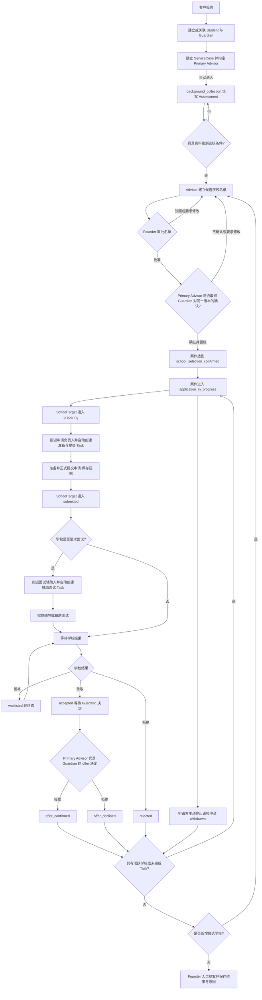

# K12 案件与逐校申请业务流程

| 属性 | 内容 |
| --- | --- |
| 文件状态 | `adopted_amendment` |
| 业务确认日期 | 2026-08-24 |
| 适用范围 | Release 1 K12 案件、候选学校、逐校申请、面试辅助、录取选择、结案与通知边界 |
| 权威决策 | `DEC-071`、`DEC-073`、`DEC-074` |
| 不包含 | 代码实现、数据库迁移、测试执行、云资源或生产操作授权 |

## 1. 这份文档解决什么问题

本文件把本轮已经确认的 K12 业务流程固定为后续产品确认和开发设计的基线。出现冲突时：

1. 用户后续明确决定优先；
2. 本文件与 `DEC-071` 优先于旧的八阶段案件流程；
3. 旧代码、测试和实施记录只证明旧合同曾被实现，不得反向覆盖新业务要求。

本轮客户业务问题已经全部确认；仍标为“待设计”或“实施差异”的内容属于开发设计，不得被误解为业务仍未确认。

## 2. 核心业务对象

| 对象 | 业务含义 | 本轮边界 |
| --- | --- | --- |
| `Student` | 接受教育申请服务的学生 | 可参与多个不同案件，不等于系统内部账号 |
| `Guardian` | 家长或监护人 | 是外部业务参与者；其确认必须可追溯，不因此自动成为内部 `User` |
| `ServiceCase` | 一次签约服务的整体案件 | 记录全局里程碑、负责人和最终结案，不承载某一所学校的详细进度 |
| `SchoolTarget` | 案件中的一所候选或申请学校 | 每所学校独立推进、独立产生结果 |
| `Assessment` | 学生背景资料与选校依据 | 由 Primary Advisor 直接维护；本轮不为背景收集另建 `Task` |
| `Task` | 需要明确责任人、完成条件和审计的工作 | 复用现有实体；只在本文件确认的节点自动产生，不新增平行任务实体 |

“家长确认记录”“候选名单版本”和“结案决定”是必须保存的业务事实，但本文件不强制为它们各自新增实体。实施设计应优先复用现有聚合、版本字段和审计能力；只有现有模型不能满足一致性与追溯要求时，才提出新增实体并单独评审。

Release 1 从客户已经在线下完成签约开始，不管理签约前的 Lead（潜在客户／销售线索）、咨询和 Quote（报价）生命周期，也不为该销售过程新增 Lead、Quote 或 Contract 业务实体。签约后才建立或关联 Student、Guardian 和 ServiceCase；如需保存已签合同文件，复用案件 Document 能力并关联到该 ServiceCase。此处的客户服务合同文件不等于 Platform Billing 中用于计数展示的合同参考版本。

## 3. 角色与责任

| 参与者 | 本流程职责 |
| --- | --- |
| Primary Advisor | 负责案件日常推进、背景资料、候选学校名单、申请准备与提交；当前阶段也默认负责面试辅助；可在系统中暂停或恢复自己负责的案件，并代录 Guardian 的名单与 offer 确认 |
| Founder | 审批或驳回候选学校名单；可在系统中暂停或恢复任何案件；在满足条件后人工决定结案并保存理由 |
| Guardian | 在 Founder 批准后确认最终申请学校；学校录取后决定接受或拒绝 offer；可提出暂停或恢复请求，但不直接执行系统操作 |
| Application Assignee | 被指派完成某一学校的申请准备与提交；可由 Primary Advisor 或获明确案件授权的 Case Collaborator 担任，必须逐校指定 |
| Interview Support Assignee | 被指派辅助学生面试；默认是 Primary Advisor，也可由已获案件授权的正式 Advisor 或经 TaskAssignment 明确指派的 Contractor 担任，只取得该面试 Task 必需的脱敏信息 |

Contractor 只能因一条明确的面试 TaskAssignment 取得该任务的脱敏工作区，不因此成为 CaseCollaborator，也不能负责正式提交申请或查看完整学生资料。Contractor 拒绝 Task，或 Task 完成、取消、重新分派、案件结束时，该任务访问立即失效。

## 4. ServiceCase 全局流程

`ServiceCase` 只表达整个案件的业务里程碑：

```text
signed
  -> background_collection
  -> school_selection_confirmed
  -> application_in_progress
  -> closed
```

规则：

1. `signed`：客户已在线下完成签约的事实和案件起始里程碑。Release 1 不处理此前的销售过程；建立或关联 Student、Guardian 和 ServiceCase，并指定 Primary Advisor 后，不要求员工再手动推进。
2. `background_collection`：建案成功后自动进入，Assessment 从 `draft` 开始，由 Primary Advisor 持续补充。缺失项和阻断项直接记录在 Assessment/案件进度中，不自动生成背景收集 Task。
3. `school_selection_confirmed`：Founder 已批准名单，Guardian 已确认同一版本的最终申请学校，并已保存确认记录。
4. `application_in_progress`：至少一所已确认学校进入申请处理；逐校的准备、提交、面试、候补和结果只记录在 `SchoolTarget`。
5. `closed`：只可由 Founder 人工执行，并满足第 10 节结案条件。

Assessment 的背景阻断项全部满足后，记录 `background_complete`，并允许 Primary Advisor 建立候选学校名单；这表示可以离开纯背景收集工作，不是进入 `background_collection` 的条件。候选名单审批和 Guardian 确认完成前，案件仍未达到 `school_selection_confirmed`。

正式 K12 Assessment 采用现有已批准的 15 字段 v1 manifest，不采用旧页面的 16 字段展示作为业务契约：

| 模块 | 字段、类型与枚举 | `background_complete` blocker | `school_selection_confirmed` blocker |
| --- | --- | --- | --- |
| `student_profile` | `date_of_birth: date`；`residency_status: hk_permanent_resident/hk_non_permanent_resident/dependent_visa/other`；`primary_languages: cantonese/mandarin/english/other`（可多选） | 3 项全部 | `date_of_birth`、`residency_status` |
| `education_profile` | `current_stage: kindergarten/primary/secondary`；`current_year_level: text`；`current_curriculum: hk_local/ib/cambridge/other` | 3 项全部 | `current_stage`、`current_year_level` |
| `school_preferences` | `target_stage: kindergarten/primary/secondary`；`preferred_systems: hk_local/hk_international`（可多选）；`preferred_districts: hong_kong_island/kowloon/new_territories/any`（可多选）；`preferred_admission_route: entry/transfer`；`fee_band: government_aided/private/international/undecided` | `target_stage`、`preferred_admission_route` | 5 项全部 |
| `family_context` | `primary_contact_language: cantonese/mandarin/english/other`；`education_priority: academic/balanced/language_immersion/supportive_environment/other`；`transport_arrangement: family_transport/school_bus/public_transport/undecided`；`fee_preference: government_aided/private/international/undecided` | `primary_contact_language`、`education_priority` | 4 项全部 |

Primary Advisor 可读写 Assessment；获得 `education_profile:view/edit` 明确 grant 的 CaseCollaborator 按 capability 只读或编辑；Founder 和 Admin 只读。其他 Advisor、Contractor、Data Reviewer、Guardian、Student 和 Portal 默认不可查看原始 Assessment。`unknown` 与 `declined_to_provide` 不满足 blocker；`not_applicable` 只有 manifest 对该字段明确允许时才满足，当前 v1 未允许任何 blocker 通过 `not_applicable`。字段、enum 或允许语义日后变更必须建立新 manifest version，不能静默改变旧案件。

进行中的案件必须支持“暂停”。暂停用于家长要求暂缓等暂时不能继续办理、但又不应结案的情况；暂停期间案件不得按正常业务流程继续推进。只有在该案件尚未向任何学校正式提交申请，即没有 SchoolTarget 已达到 `submitted` 或其后续状态时，才允许暂停整个案件。只要已有一所学校正式提交，就不再允许案件级暂停；若申请方决定不继续，必须按具体学校记录 `withdrawn`，不得用案件暂停代替逐校撤回。Primary Advisor 可直接暂停或恢复自己负责的案件，不需要 Founder 事前审批；Founder 可执行任何案件的暂停或恢复。Guardian 只能提出请求，由有权员工在系统中执行。每次暂停必须填写简短自由文字原因，并保存操作者和操作时间；Release 1 不设置固定原因分类。暂停不是结案，也不得覆盖或丢失暂停前已经达到的业务里程碑。恢复后回到暂停前里程碑，已有未完成 Task 继续使用原记录，不自动取消、完成或重建。暂停由主状态、附加状态还是其他现有字段表达仍待设计，本轮不因此新增实体。

`interview_preparation`、`application_submitted`、`awaiting_result` 和“学校已录取”不再作为整个案件的线性主阶段，因为同一案件中的不同学校可能同时处于这些状态。

所有现有学校均已结束但尚未结案时，业务进入“需要决定下一步”的条件：新增学校，或由 Founder 确定结案。具体页面呈现方式待设计；本轮不要求新增 `awaiting_next_step` 实体或持久化案件状态。

## 5. 候选学校名单审批与家长确认

必须按以下顺序执行：

1. Primary Advisor 建立候选学校名单。
2. Advisor 提交名单给 Founder 审批。
3. Founder 选择批准，或驳回并要求修改。
4. Founder 驳回时，名单退回 Advisor 修改；修改后的版本必须重新提交 Founder。
5. Founder 批准后，才可以请求 Guardian 确认。
6. Guardian 不确认时，名单退回修改；任何修改版本都必须重新经过 Founder 批准，再交 Guardian 确认。
7. Guardian 确认后，保存确认记录，案件才进入申请处理。

确认记录至少能够证明：

- Guardian 确认的是哪一个不可歧义的名单版本或内容快照；
- 名单中包含哪些 SchoolTarget；
- 确认人、确认时间、确认结果和使用的确认渠道；
- Founder 对同一版本的批准记录；
- 若拒绝或要求修改，保留原因和后续版本关系。

不得以“Founder 已批准”代替 Guardian 确认，也不得只保存当前名单而覆盖历史确认内容。

Release 1 由案件 Primary Advisor 通过平台外人工电话、微信或面谈取得 Guardian 确认后，在系统中代录上述事实。若存在确认截图或文件，则关联到案件；没有书面附件时，只要必填确认事实完整，仍可完成确认。Guardian Portal 保持只读，不由 Guardian 直接写入。此代录规则同样适用于 Guardian 对 offer 的接受或拒绝。

已确认名单发生任何变化时，必须建立新名单版本，并重新取得 Founder 批准和 Guardian 确认。不变的 SchoolTarget 及其既有 Task 原样保留，不重复创建；新增学校仅在新版确认后进入 `preparing` 并建立申请 Task；仍在进行中的移除学校记为 `withdrawn`，其未完成 Task 取消但保留历史；已进入终态的 SchoolTarget 保留原结果，不得改写为 `withdrawn`。旧名单、SchoolTarget 和 Task 都不得删除或覆盖。

## 6. SchoolTarget 逐校流程

每所学校独立推进，允许同一案件中的学校处于不同状态：

```text
candidate -> preparing -> submitted
submitted -> interview                         （学校需要面试时）
submitted / interview -> waitlisted / accepted / rejected
waitlisted -> accepted / rejected
accepted -> offer_confirmed / offer_declined
preparing / submitted / interview / waitlisted -> withdrawn
                                                   （申请方主动停止）
```

状态语义：

| 状态 | 业务含义 | 是否终态 |
| --- | --- | --- |
| `candidate` | 仍在候选名单中，尚未开始正式申请 | 否 |
| `preparing` | Guardian 已确认申请该校，正在准备申请材料 | 否 |
| `submitted` | 已正式向学校提交，并保存提交时间、渠道、提交人、清单完成状态，以及学校参考号或其他提交凭证 | 否 |
| `interview` | 学校要求面试，正在准备或等待面试完成 | 否 |
| `waitlisted` | 学校给出候补结果，仍可能转为录取或拒绝 | 否 |
| `accepted` | 学校已发出 offer，但 Guardian 尚未作最终选择 | 否 |
| `offer_confirmed` | Guardian 已确认接受该校 offer | 是 |
| `offer_declined` | Guardian 已明确拒绝该校 offer | 是 |
| `rejected` | 学校拒绝申请 | 是 |
| `withdrawn` | Student/Guardian 一方主动终止该校申请 | 是 |

补充规则：

- 不需要面试的学校从 `submitted` 直接等待学校结果，不创建虚假的 `interview` 记录。
- `waitlisted` 不是拒绝，也不是终态；只要存在候补学校，案件就不能按“全部结束”结案。
- `accepted` 不是家长已选校；必须继续取得 Guardian 对 offer 的接受或拒绝记录。
- 从尚未确认的候选名单中移除学校，不等于 `withdrawn`；`withdrawn` 只适用于已经确认要申请后由申请方主动停止。
- 从已确认名单移除仍在进行中的学校必须记录为 `withdrawn`；若该校已有未完成 Task，Task 取消但保留完整历史。已终态学校保留原结果。

## 7. 申请准备与提交 Task

当一所已确认的 SchoolTarget 进入 `preparing` 时：

1. 必须为该 SchoolTarget 指定 Application Assignee；可选择 Primary Advisor 或已获该案件明确授权的 Case Collaborator。
2. 系统自动创建一条与该 SchoolTarget 绑定的“准备并提交申请” Task。
3. Assignee 同时负责材料准备和正式提交，不拆成两个无必要的 Task。
4. Release 1 不设置所有学校通用的固定材料清单。每个 SchoolTarget 按该校当期官方要求建立自己的清单；申请表、成绩／在读资料以及该校明确要求的其他材料，只有在该校要求时才成为必填。
5. 只有在正式提交完成，并保存提交时间、提交渠道、提交人、材料清单完成状态，以及“学校参考号或至少一份其他提交凭证”后，该 Task 才能完成，SchoolTarget 才能进入 `submitted`。若学校不提供参考号，必须明确记录“学校未提供参考号”，并保留确认页截图、确认邮件 PDF、盖章回执或邮寄凭证等其他提交凭证。
6. 提交凭证复用现有 Case Document 并关联到 SchoolTarget／Task，不新增 Material 或 SubmissionEvidence 实体。
7. Founder、案件当前 Primary Advisor 和该校当前 Application Assignee 可以下载本次申请必需的已扫描可用文件；Application Assignee 的访问仅限该校申请，不再担任该校负责人或既有案件授权失效后不得继续下载。Admin、Data Reviewer、其他未授权 Advisor、仅负责面试辅助的人、Guardian、Student 和 Portal 均不可下载。
8. 重试必须避免为同一 SchoolTarget 和同一申请轮次重复创建 Task。

Task 通用流转固定如下：

1. 新 Task 从 `assigned` 开始，由当前 Assignee 接受或拒绝；拒绝必须填写原因，并结束当前 TaskAssignment，Task 保留并等待 Primary Advisor 重派。
2. 拒绝或需要换人时，由 Primary Advisor 在同一条 Task 上重新分派并保留 Assignment 历史；新 Assignee 重新从待接受开始，不创建替代 Task。
3. `overdue` 由未完成 Task 的 `due_at` 自动计算为提示与提醒标记，不是阻断后续操作的独立业务状态；逾期后仍可接受、重新分派或完成。
4. Assignee 保存该 Task 类型要求的完成记录和证据后即可完成；Release 1 不要求 Founder 逐条验收或另行进入 `approved`。
5. 拒绝、重新分派、取消和完成都保留操作人、时间、原因或完成记录及 audit，不覆盖历史。

## 8. 面试辅助 Task

学校明确要求面试时：

1. SchoolTarget 进入面试处理分支。
2. 必须指定 Interview Support Assignee；默认由 Primary Advisor 承担，也可指派已作为 CaseCollaborator 的正式 Advisor，或通过单一 TaskAssignment 指派 Contractor。
3. 系统自动创建一条与该 SchoolTarget 绑定的“辅助面试” Task。
4. Assignee 完成面试准备或辅导，并保存必要的完成记录。
5. Task 完成不代表学校面试结果；SchoolTarget 继续等待学校给出候补、录取或拒绝结果。
6. 不要求面试的学校不得生成该 Task。

非 Primary Advisor 的面试辅助人只能查看该 Task、目标学校、面试时间／方式／语言、辅导要求，以及 Primary Advisor 整理的必要背景摘要。不得查看完整 Assessment、Guardian／联系方式、内部备注、案件文件、下载／导出、其他学校或其他案件。该限制同样适用于 Contractor；分配 Task 不得自动开放整份案件资料，也不新增角色或实体。

## 9. Task 创建边界

本轮只确认以下边界：

- 背景资料收集与 Assessment 填写不创建 Task；
- 申请准备与提交按第 7 节自动创建一条逐校 Task；
- 学校要求面试时按第 8 节自动创建一条逐校 Task。

除上述两类自动 Task 外，不增加其他自动触发。Primary Advisor 可以按真实工作需要为自己负责的案件人工创建临时 Task；人工 Task 不自动推进 ServiceCase 或 SchoolTarget。

若案件在允许的阶段被暂停，已经存在的未完成 Task 必须原样保留，不得自动取消、完成或重复创建；案件恢复后继续处理同一条 Task。学校规定的申请截止日期属于外部事实，暂停期间继续生效且不得自动顺延。内部 Task 的截止时间同样继续计算，不自动顺延；达到 `due_at` 后显示为逾期并继续发送内部提醒给案件的 Primary Advisor、Founder 和该 Task 的实际 assignee（若与 Primary Advisor 不同），不发送给 Guardian。逾期提示不阻止 Task 后续完成。

已确认名单移除学校或客户终止整体服务时，受影响的未完成 Task 必须取消并保留历史；这与暂停时保留原 Task 的规则不同。取消不得删除 Task、完成记录或审计历史。

Founder 审批名单、Guardian 确认名单、等待学校结果、Guardian 决定 offer 和 Founder 结案不自动生成 Task；Primary Advisor 只有在确有工作需要时才人工创建临时 Task。它们可按下列规则生成站内通知，但通知不等于 Task。

Release 1 遵循旧规则，只提供站内通知，不向 Guardian 或 Student 发送外部业务 Email，也不发送 WhatsApp 或 SMS。Email 不是 Release 1 的名单或 offer 确认渠道。

站内通知规则固定如下：

1. Task 分配或重派时通知新的 Assignee；Task 被拒绝时通知案件 Primary Advisor。
2. 候选名单提交审批时通知 Founder；Founder 批准或驳回后通知 Primary Advisor；批准后待 Guardian 确认也由 Primary Advisor 跟进。
3. Task 到期前 3 天和 1 天提醒实际 Assignee 与 Primary Advisor；逾期后每天提醒实际 Assignee、Primary Advisor 和 Founder，直至完成或取消。暂停期间继续计算和提醒。
4. 所有 SchoolTarget 已进入终态且没有未完成 Task 时，通知 Primary Advisor 与 Founder 选择新增学校或人工结案。
5. 同一接收人、同一业务 effect、同一天只生成一条通知。可见文案仅表达“有待办事项”，不得包含 Student、Guardian、Case、SchoolTarget、学校或文件细节；不向 Guardian 或 Student 生成站内业务通知。

## 10. 结果处理与人工结案

结案必须同时满足：

1. 所有已确认申请的 SchoolTarget 都已进入终态：`offer_confirmed`、`offer_declined`、`rejected` 或 `withdrawn`；
2. 不存在 `preparing`、`submitted`、`interview`、`waitlisted` 或 `accepted` 等仍需处理的学校；
3. 不存在未完成的案件 Task；
4. Founder 明确选择结案，并保存结案结果、原因、操作者和时间。

满足前置条件也不得自动结案。

当所有现有学校都拒绝或以其他非成功结果结束时，业务必须给出两条分支：

1. 新增候选学校，重新执行 Founder 审批和 Guardian 确认；
2. 不再新增学校，由 Founder 明确决定无 offer 结案。

有 `offer_confirmed` 时可记录成功结案；没有 `offer_confirmed` 时仍可由 Founder 选择无 offer 结案。案件级结案结果不得篡改逐校的真实结果。

客户要求终止整体服务时，所有仍在进行中的 SchoolTarget 记为 `withdrawn`，相关未完成 Task 取消但保留历史；随后由 Founder 人工结案并保存终止原因。日后重新签约必须建立新的 ServiceCase，不得重开或覆盖旧案件。

## 11. 端到端流程图



“暂停”是提交首所学校申请之前的例外路径，可发生在多个尚未提交的进行中里程碑上；恢复后回到暂停前里程碑并继续原有 Task。该跨流程箭头为避免遮挡未画入主图。

## 12. 业务问题已全部确认

本轮最后三项已经由客户确认：

1. 站内通知按第 9 节的事件、收件人、到期前 3 天／1 天和每日逾期规则执行。
2. 正式 K12 Assessment 使用第 4 节的 15 字段、blocker、语义状态和角色可见性。
3. `advancing_case_count_v1` 计入 `background_collection`、`school_selection_confirmed`、`application_in_progress`；暂停以及所有学校均拒绝但尚未结案的案件继续计入。排除 `signed`、已记录整案终止但尚待结案、`pending_delete` 和 `closed`。一个案件在香港月末 cutoff 最多计 0 或 1，不按学校数或天数折算，不生成应付金额。

至此，签约前 Lead／Quote／Contract 边界、案件与逐校流程、暂停／终止／重签、名单与 offer 确认、Task 通用流转、面试辅助人及最小数据权限、逐校材料／提交证据和下载角色、站内通知、Assessment、推进中案件计数均已确认。

暂停的数据表示、确认记录的物理结构、DDL、API、ACL、audit、幂等、旧数据迁移、通知 worker、病毒扫描、对象存储和文件版本机制仍属于开发设计。下一步应编制新业务需求与旧实现的差异计划，而不是继续由开发猜测业务语义。

## 13. 实施影响与当前边界

现有代码和测试曾按旧的八阶段 `ServiceCase` 以及旧 SchoolTarget 终态集合实现。后续实施前必须单独制定迁移与兼容方案，至少覆盖：

- 案件状态机与页面摘要；
- SchoolTarget 状态、终态判定和 Guardian offer 决定；
- 候选名单的 Founder 审批与 Guardian 确认记录；
- 两类自动 Task、人工临时 Task、同 Task 重派、计算型逾期和无逐项 Founder 验收的新 policy；
- Advisor／Contractor 面试工作区、逐校材料清单、提交证据和 Application Assignee 限校文件权限；
- 人工结案、无 offer 分支与既有数据迁移；
- API、权限、审计、测试和前端工作台。

本文件只落地业务要求。它不授权修改代码、执行 migration、导入数据、创建云资源、commit、push 或 deploy。
