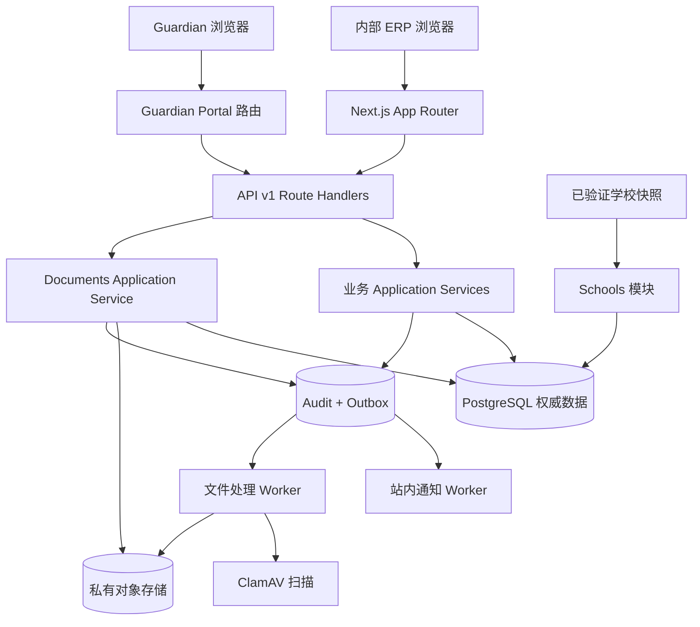
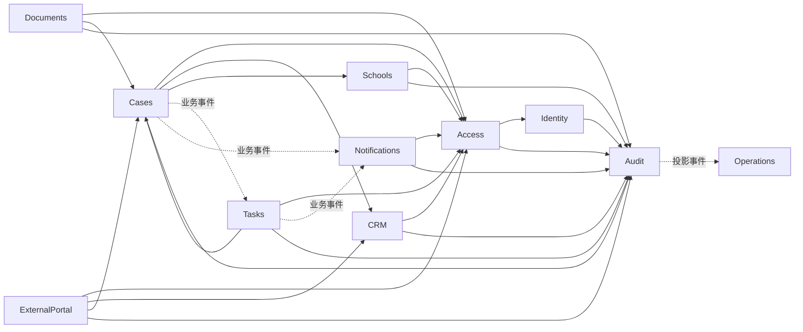

# Release 1 总体架构设计

状态：`approved`  
确认依据：项目负责人于 2026-08-25 指示进入下一设计环节  
设计日期：2026-08-25  
业务基线：`BR-BASELINE-20260825-v32`  
代码参考快照：`Tianxingguoji@a0c862f34a88`

返回[系统设计索引](README.md)。

## 1. 设计结论

Release 1 继续采用 **Next.js 模块化单体 + PostgreSQL 权威数据库 + 异步 Worker**。

本阶段不拆微服务。当前问题来自业务规则和模块所有权不一致，而不是单体架构本身。先在一个可部署应用内建立严格模块边界，可以降低部署、事务和排错复杂度，同时为以后按模块拆分保留接口。

## 2. 系统边界

系统内包含：

- 内部 ERP：Founder、Admin、Advisor、Contractor 使用。
- Guardian Portal：单 Case、7 天、只读、字段白名单。
- K12 业务模块：CRM、Case、选校、逐校申请、Task、Document、School。
- 平台公共能力：Identity、Access、Notification、Audit、Operations。
- 文件处理 Worker：对象收据、病毒扫描、重试和状态更新。
- 站内通知 Worker：消费业务事件并生成最小信息通知。

系统外包含：

- Guardian、Student 使用的外部 Email、SMS、WhatsApp。
- AI/知识库正式业务流程。
- 正式导入、非 K12 申请流程和签约前销售流程。
- Platform Billing、推进中案件计数、合同参考值和平台财务角色。
- 自动爬虫调度；Release 1 只消费经过治理的版本化学校快照。

依据：`BR-001`、`BR-002`、`BR-003`、`BR-060`、`BR-063`。

## 3. 运行结构



约束：

- 浏览器不能直接访问数据库、对象存储或内部模块 repository。
- 所有业务请求经过服务端 Session、组织成员和权限判断。
- 文件没有公开 URL，只签发短时、受控的上传或下载能力。
- Worker 只能消费已提交的 outbox/queue 事实，不能绕过模块授权修改其他业务表。

## 4. 模块分层

```text
app / components / workers       入口适配层
              |
              v
public / server / client         模块公开契约
              |
              v
application                     用例与事务协调
              |
              v
domain                          业务规则与状态机
              ^
              |
infrastructure                  PostgreSQL、对象存储、队列适配
```

依赖方向：

- `domain` 不依赖 application、infrastructure、Next.js 或数据库。
- `application` 只依赖 domain 和公开 port，不直接依赖具体 repository 实现。
- `infrastructure` 实现 application 定义的 port。
- 跨模块只能通过根级公开入口、明确的查询 port 或业务事件。
- 一个模块不能直接写另一个模块拥有的表。

## 5. 目标模块所有权

| 模块 | 唯一负责的业务事实 | 不负责 |
| --- | --- | --- |
| `Identity` | User、Session、Invite、登录身份状态 | 业务角色、员工显示资料、Case 权限 |
| `Access` | OrganizationMembership、RoleBinding、EmployeeProfile、CaseCollaborator、ScopeGrant | Student、Case、Task 业务状态 |
| `CRM` | Student、Guardian、Student-Guardian 关系、客户软删除流程和 ReferralSource 来源目录 | ServiceCase、Case 来源关联历史、客户合并 |
| `Cases` | ServiceCase、CaseReferralSourceAssignment、Assessment、候选名单版本、Founder/Guardian 确认记录、SchoolTarget、offer 决定和结案 | ReferralSource 目录、Task 状态、文件内容、学校公共资料 |
| `Tasks` | Task、TaskAssignment、接受/拒绝/重派/完成/取消 | 推进 Case 或决定学校申请结果 |
| `Schools` | School、provisional、快照、ChangeRequest、overlay、resolved view | Case 的候选名单和申请进度 |
| `Documents` | Document、DocumentVersion、ScanResult、文件生命周期和下载授权 | Student/Case/Task 主业务状态 |
| `Notifications` | 站内 Notification、DeliveryReceipt、提醒去重 | 修改 Task、Case 或 SchoolTarget |
| `Audit` | 追加式 AuditEvent、Outbox | 作为业务事实或授权来源 |
| `Operations` | 可重建看板、告警和运行状态投影 | 修改权威业务数据或替代授权判断 |
| `ExternalPortal` | PortalViewer、PortalGrant、PortalSession、请求时构建的对客白名单 DTO | 内部 User、Portal 写入、文件和 Assessment |
| `Shared` | request context、幂等、稳定错误等技术原语 | 任何具体业务实体或业务流程 |

`PlatformBilling` 和 `Data Reviewer` 不属于 Release 1 目标模块/角色图。

## 6. 模块依赖关系



实线 `A --> B` 表示 A 使用 B 的公开契约；虚线表示业务事件从生产者流向消费者。两者都不表示可以直接写对方数据库表。

特别约束：

- `Cases -> Tasks`：Cases 发布“应创建/取消申请或面试 Task”的事实；Tasks 幂等处理并拥有 Task。
- `Tasks -> Cases`：Task 完成只产生事实；是否允许推进 SchoolTarget 由 Cases 重新判断。
- `Documents -> Cases`：Documents 查询 Case、SchoolTarget 和 Application Assignee 授权事实，再自行决定是否签发下载能力。
- `Notifications` 只消费事件，不参与业务事务决策。
- `Operations` 只读可重建投影，不能被业务服务当成权威数据源。

跨模块的同步/异步细节将在“业务流程与状态机设计”中逐条冻结。

## 7. 数据权威与一致性

| 数据类型 | 权威来源 | 原则 |
| --- | --- | --- |
| 结构化业务数据 | PostgreSQL | 组织范围、版本、RLS、不可静默覆盖 |
| 文件内容 | 私有对象存储 | PostgreSQL 保存 metadata、版本、状态和对象引用 |
| 学校爬虫数据 | 不可变版本化快照 | 只有验证后才能进入 Schools resolved view |
| 审计 | PostgreSQL 追加式 AuditEvent | 必需审计与业务修改同事务 |
| 异步效果 | Transactional Outbox / Queue | 至少一次投递，消费者必须幂等 |
| 看板和统计 | 可重建 projection | 不能作为授权或业务事实 |

业务写入的一般路径：

```text
请求
  -> 验证 Session / Membership / Role / Case 关系
  -> 检查 expected version 与业务前置条件
  -> 写本模块业务事实
  -> 同事务写 Audit + Idempotency result
  -> 如有异步 effect，同事务写 Outbox
  -> 提交
  -> Worker 幂等处理跨模块效果
```

## 8. API 与入口原则

- 正式业务 API 统一使用 `/api/v1/**`。
- Route Handler 只负责 HTTP、Session、输入输出映射和稳定错误，不承载业务状态机。
- 页面只能通过 browser-safe `client.ts` 或 Server Component 的 server entrypoint 访问模块。
- `public.ts` 保持运行时中立；`server.ts` 只用于服务端；`client.ts` 只用于浏览器适配。
- legacy `/api/cases`、mock 和 preview 不作为目标设计，后续按纵向流程退出。

## 9. 运行环境原则

- `local-synthetic`：Node 22、PostgreSQL 17、LocalStack、ClamAV 和确定性合成数据。
- `production-aws`：只允许香港生产适配器，发现本地或 mock 适配器时启动失败。
- 运行时组合必须显式配置并 fail closed，禁止自动回退到 JSON、memory、mock 或 legacy 数据源。
- 本地通过只证明 Local Dev；AWS 生产仍需独立部署和验收证据。

## 10. 总体架构决策

| ID | 决策 | 理由 |
| --- | --- | --- |
| `SD-ARCH-001` | Release 1 保持模块化单体 | 当前团队和流程不需要微服务的部署复杂度 |
| `SD-ARCH-002` | 每个业务事实只有一个模块 owner | 防止跨模块直接写表和规则漂移 |
| `SD-ARCH-003` | PostgreSQL 是结构化业务权威 | 支持事务、版本、RLS、审计和幂等 |
| `SD-ARCH-004` | 跨模块副作用使用 outbox + 幂等消费者 | 业务事务成功后可靠创建 Task、通知和投影 |
| `SD-ARCH-005` | 授权由服务端关系事实实时判断 | UI 隐藏和缓存不能代替授权 |
| `SD-ARCH-006` | `/api/v1/**` 是唯一目标 API | 逐步退出 legacy 和 preview 路径 |
| `SD-ARCH-007` | Portal 与内部身份彻底分离 | 家长不成为内部 User，权限始终单 Case、只读、限时 |
| `SD-ARCH-008` | Platform Billing 不进入 Release 1 依赖图 | 遵守 `BR-003`，避免旧代码继续影响 Case/Portal |

## 11. 当前代码需要纠正的架构偏差

这些是后续设计/开发输入，本阶段不修改产品代码：

1. `module-registry.ts` 仍登记 Platform Billing、MergeRevision、Subscription 等旧 owner；ReferralSource 的 CRM ownership 继续保留。
2. `AGENT.md` 的旧 Release 1 摘要仍包含 Platform Billing，与当前 `BR-003` 冲突。
3. Identity Session 当前只选择一个 RoleBinding，没有合并兼容角色权限。
4. 多个模块 runtime 仍固定 `RuntimeUnavailable`，页面仍混用 mock/preview/legacy 数据。
5. Cases、Tasks、Notifications 之间尚未形成已确认业务流程对应的可靠事件闭环。
6. `audit_operations` 在现有 registry 中被合并登记；目标职责仍按 Audit 和 Operations 分开治理。

## 12. 本环节验收标准

项目负责人需要确认以下四点：

1. 保持模块化单体，不拆微服务。
2. 接受第 5 节的模块所有权。
3. 接受跨模块不能直接写表，业务副作用通过公开契约和 outbox 协作。
4. Platform Billing 不出现在 Release 1 目标依赖图。

确认后，下一环节为“模块职责与依赖契约”，逐个模块冻结输入、输出、owner 和禁止依赖。
