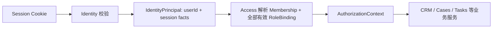

# Identity 模块契约

状态：`approved`  
确认依据：项目负责人于 2026-08-25 接受本模块契约  
设计日期：2026-08-25

返回[模块契约索引](README.md)。

业务依据：`BR-002`、`BR-010`、`BR-011`、`BR-012`、`BR-013`、`BR-060`。  
现状依据：[Identity 与 Access 现状分析](../../current-state-analysis/10-identity-access.zh-CN.md)。

## 1. 一句话职责

Identity 只回答：

> 这是哪个内部 User，这个登录凭证和 Session 现在是否有效？

它不回答该 User 在公司里担任什么角色，也不决定能否查看某个 Case。

## 2. 负责与不负责

| Identity 负责 | Identity 不负责 |
| --- | --- |
| 内部 `User` 登录身份与账号状态 | OrganizationMembership |
| 邀请凭证、激活和认证提供者绑定 | Founder/Admin/Advisor/Contractor 角色 |
| Session 创建、校验、过期和撤销 | EmployeeProfile、employment type、avatar |
| normalized email 的权威值 | CaseCollaborator、ScopeGrant、TaskAssignment |
| 登录安全事件和身份审计事实 | CRM Student、Guardian 或 Portal viewer |
| 本地合成认证与生产认证 provider port | 任何业务资源授权 |

Guardian、Student 和 Portal viewer 都不是内部 `User`，不得进入 Identity 的内部 Session 模型。

## 3. 核心对象

本环节只冻结对象职责，不冻结数据库字段：

| 对象 | 含义 | 关键约束 |
| --- | --- | --- |
| `User` | 一个内部登录账号 | 使用不可变 UUID；normalized email 是权威登录标识；状态失效后所有 Session 失效 |
| `Invite` | 一次限时内部账号激活凭证 | 只保存目标身份和组织上下文，不保存基础角色 |
| `ProviderBinding` | User 与 Cognito 或本地认证主体的绑定 | provider subject 不作为业务角色或员工身份 |
| `Session` | User 已通过认证的短期服务端会话 | 只证明 User 身份；不固化单一 RoleBinding |
| `IdentityDeliveryReceipt` | 内部邀请/认证消息的技术投递结果 | 不属于 Guardian/Student 外部业务通知 |

EmployeeProfile 由 Access 拥有；其 email 通过 User 的 normalized email 投影返回，不重复保存。

## 4. 请求身份链

关键变化：

- IdentityPrincipal 不包含 `role`。
- IdentityPrincipal 不要求用户选择角色。
- OrganizationMembership 和角色集合由 Access 在请求时重新读取。
- Access 合并 Founder + Advisor 等兼容角色的 capability。
- Contractor 角色互斥和任务级授权也由 Access/Tasks 判断。

## 5. 对外查询契约

| 查询 | 调用方 | 返回 | 不得返回 |
| --- | --- | --- | --- |
| `resolveSession` | 服务端请求入口 | userId、sessionId、session version、重新认证时间等身份事实 | 单一 role、业务 capability、Case 数据 |
| `getUserStatus` | Access | User 是否 active、当前 identity version | Password、secret、provider token |
| `getUserEmailProjection` | Access 员工资料接口 | userId、normalized email | Session、角色、员工类型 |
| `findInviteIdentity` | 内部账号启用流程 | Invite 状态和目标 User 身份 | 原始激活 secret |

所有查询都是服务端契约，不提供浏览器直接读取 User 列表的通用接口。

## 6. 对外命令契约

| 命令 | 业务调用入口 | Identity 的职责 |
| --- | --- | --- |
| `createInvite` | Access 的账号邀请用例 | 生成限时凭证、保存 hash、绑定认证 provider、记录投递结果 |
| `redeemInvite` | 账号激活入口 | 校验一次性凭证、绑定正确 User、激活身份 |
| `createSession` | 登录/激活成功后 | 生成 opaque Session secret，只保存 hash |
| `revokeSession` | 当前 User 登出或安全操作 | 立即撤销指定 Session |
| `revokeAllSessions` | Access 授权的账号禁用/安全操作 | 提升 identity/session version，使旧 Session 全部失效 |
| `disableUser` | Access 的成员管理用例 | 禁用登录身份并撤销全部 Session |

Access 负责判断谁可以发起邀请或禁用账号；Identity 负责确保身份状态变化本身安全、幂等并可审计。Identity 的账号管理命令只通过 server-only port 提供给 Access onboarding 用例，Route Handler 不得绕过 Access 直接调用。

## 7. 发布的事实

| 事实 | 主要消费者 | 用途 |
| --- | --- | --- |
| `identity.invite_created` | 身份投递 Worker | 发送内部账号激活信息 |
| `identity.invite_redeemed` | Access | 激活对应 Membership/EmployeeProfile onboarding 流程 |
| `identity.user_activated` | Access、Audit | 允许 Access 重新判断成员状态 |
| `identity.user_disabled` | Access、Operations | 使业务授权立即失败并产生安全告警 |
| `identity.sessions_revoked` | Audit、Operations | 安全审计和异常会话观察 |

事实只携带 opaque ID、状态、版本和受控 reason code，不携带 email、Cookie、token 或 secret。

## 8. 依赖规则

| 类型 | 允许 |
| --- | --- |
| 业务模块依赖 | 无 |
| 平台模块依赖 | `Shared`、`Audit` 的公开契约 |
| 外部技术 port | 认证 provider、内部邀请投递 channel、时钟和加密随机源 |
| 允许消费者 | `Access`、认证 Route Handler、身份 Worker |

明确禁止：

- Identity 导入 Access 的内部 role/capability 类型。
- Identity Session repository JOIN RoleBinding 后选择一个 role 返回。
- CRM、Cases、Tasks、Schools 或 Documents 直接读取 Identity 表。
- Cognito group 或 token claim 被直接当作业务授权结果。
- Portal session 复用内部 User session。

## 9. 安全不变量

- Cookie 和激活凭证使用高熵 opaque secret；数据库只保存不可逆 hash。
- Session cookie 为 HttpOnly；生产必须 Secure，Cookie 不进入 URL 或日志。
- User disabled、Session revoked、identity version 变化在下一个请求立即生效。
- Invite 一次性、限时、可撤销；失败响应不泄露账号是否存在。
- 登录、激活、撤销和禁用写入追加式安全审计。
- exact TTL、最大并发 Session 数和敏感操作重新认证时长在“权限与安全设计”环节冻结；当前代码中的数值只是现状，不在本契约中批准。

## 10. 入口与运行时

| 环境 | 认证方式 | 约束 |
| --- | --- | --- |
| `local-synthetic` | 确定性合成内部账号 | 只能连接本地 PostgreSQL，不可进入生产构建 |
| `database-test` | 隔离测试账号 verifier | 只能用于明确测试环境，不显示角色选择器 |
| `production-aws` | Cognito User Pool / OIDC adapter | 只证明身份；业务权限仍由 Access 服务端判断 |

不同环境实现同一个 Identity application port，不能把 mock 或 local adapter 静默带入 production-aws。

## 11. 与当前代码的差异

| 优先级 | 当前实现 | 目标契约 |
| --- | --- | --- |
| `P0` | `IdentitySessionActor` 含 organizationId 和单一 role | IdentityPrincipal 不含 role；Access 单独解析组织和全部角色 |
| `P0` | Session repository 依赖 `OrganizationRole` 并 JOIN RoleBinding 后 `LIMIT 1` | Session repository 只校验 User/Session 身份事实 |
| `P0` | Invite 保存 `requestedRole` | role、employment type 和 EmployeeProfile onboarding 归 Access |
| `P0` | local synthetic 登录要求选择角色 | 登录只选择/验证账号，不选择业务角色 |
| `P0` | Identity domain 同时判断 organization/membership status | Identity 判断 User/Session；Access 判断 OrganizationMembership |
| `P1` | local/test 邀请和完整 managed login runtime 不可用 | 各环境必须显式实现或明确拒绝其不支持的用例 |

这些差异先进入后续开发拆分，本环节不修改产品代码或数据库。

## 12. 设计决策

| ID | 决策 |
| --- | --- |
| `SD-ID-001` | Identity 只拥有认证身份，不拥有业务角色 |
| `SD-ID-002` | Session 不保存或返回单一当前 role |
| `SD-ID-003` | normalized email 只在 User 保存，EmployeeProfile 只做投影 |
| `SD-ID-004` | Guardian Portal 使用独立身份与 Session 模型 |
| `SD-ID-005` | 认证 provider 只是 adapter，不能决定业务权限 |

## 13. 本模块验收标准

项目负责人需要确认：

1. Session 只证明 User，不携带单一业务角色。
2. Membership、RoleBinding 和 EmployeeProfile 全部归 Access。
3. 邀请的角色/员工资料由 Access 管理，Identity Invite 不再保存 requested role。
4. Guardian、Student 和 Portal viewer 不成为内部 User。

确认后进入下一个模块：Access。
