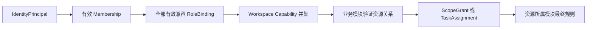

# Access 模块契约

状态：`approved`  
确认依据：项目负责人于 2026-08-25 接受本模块契约，并确认 Founder 与 Admin 可以组合  
设计日期：2026-08-25

返回[模块契约索引](README.md)。

业务依据：`BR-010`、`BR-011`、`BR-012`、`BR-013`。  
现状依据：[Identity 与 Access 现状分析](../../current-state-analysis/10-identity-access.zh-CN.md)。

## 1. 一句话职责

Access 只回答：

> 这个已登录的内部 User 在公司中有哪些有效基础角色和工作区能力？在指定 Case/Scope 下是否获得了限时协作授权？

它不拥有 Student、Case、TaskAssignment 或业务状态机，也不能因为前端显示了按钮就判定有权限。

## 2. 负责与不负责

| Access 负责 | Access 不负责 |
| --- | --- |
| 单一 Release 1 Organization 及其状态 | User、Invite、ProviderBinding、Session |
| OrganizationMembership | Student、Guardian、ServiceCase、Assessment |
| RoleBinding 和角色兼容性 | Primary Advisor、Application Assignee、Interview Support Assignee |
| EmployeeProfile 和任职类型约束 | Task、TaskAssignment 和任务状态 |
| Workspace Capability 合并 | 文件、学校、通知的业务状态 |
| CaseCollaborator、ScopeGrant 和限时授权 | Guardian Portal 身份或 PortalGrant |

Release 1 不增加 `Data Reviewer`，也不保留旧的 Subscription、Entitlement、SupportGrant 或 Platform Billing 职责。

## 3. 核心对象

本环节冻结对象职责，不冻结数据库字段：

| 对象 | 含义 | 关键约束 |
| --- | --- | --- |
| `Organization` | 内部员工所属公司 | Release 1 只允许一个 active Organization；不提前设计多组织产品能力 |
| `OrganizationMembership` | User 是否是公司当前成员 | 每个 User 在公司中最多一个有效成员身份；停用后所有工作区授权立即失败 |
| `RoleBinding` | Membership 获得的基础角色 | 只允许 Founder、Admin、Advisor、Contractor；支持兼容多角色 |
| `EmployeeProfile` | 成员的公司内显示资料 | 与 Membership 一对一；不直接授予权限 |
| `CaseCollaborator` | Advisor 在一个 Case 中的协作关系 | 不是基础角色；必须依附有效 Advisor RoleBinding 和有效 Case |
| `ScopeGrant` | Collaborator 在 Case 内的限时 Scope + Capability | 最长 7 天；可撤销、可过期；导出永远拒绝 |

不为“角色组合”“待邀请员工”或“Contractor 工作区”新增独立业务实体；使用现有对象状态和模块公开契约表达。

## 4. 员工与角色规则

员工模型固定为：

```text
Identity.User
  -> Access.OrganizationMembership
       -> Access.RoleBinding (0..n)
       -> Access.EmployeeProfile (1:1)
```

EmployeeProfile 最小业务信息：

| 信息 | 规则 |
| --- | --- |
| display name | 必填；数据库/API 兼容名为 `display_name`，业务和页面名称统一为“昵称” |
| employment type | `FULL_TIME` 或 `PART_TIME` |
| avatar key | 可空，只保存受控对象引用 |
| email | 通过 Identity 的 normalized email 投影返回，不重复保存 |

Release 1 不保存员工真实姓名。默认头像不增加持久化字段，直接取昵称的第一个字符；昵称缺失时使用中性占位符。

资格约束：

- FULL_TIME 可以分配 Founder、Advisor。
- PART_TIME 可以分配 Contractor。
- Admin 不受 employment type 限制。
- employment type 不自动赋予角色。
- 修改 employment type 后若与现有角色冲突，拒绝修改，不静默撤销角色。

## 5. 多角色合并

- 同一 Membership 的全部有效兼容 RoleBinding 自动合并，不提供“当前角色”或登录角色切换。
- Founder、Admin、Advisor 三者之间可以兼容组合，也可以三者同时存在。
- Admin 只有同时取得 Advisor 角色时，才能按 Advisor 权限参与客户业务。
- Contractor 必须单独存在，不能与任何其他基础角色组合。
- 角色撤销后，依赖该角色的能力在下一个服务端请求立即消失。

Access 返回的是 `roles[]` 和合并后的 `workspaceCapabilities[]`，不得只挑优先级最高的一个 role。

## 6. 授权判断链



职责分工：

- Access 解析 User 的 Membership、角色集合、工作区能力和 ScopeGrant。
- Cases 判断 Case 是否有效、谁是 Primary Advisor，以及具体 Case 操作是否允许。
- Tasks 判断当前 TaskAssignment 是否仍有效，并签发 Contractor 单任务脱敏视图。
- Documents、CRM、Schools 等 owner 仍需按自己的资源规则做最终授权。

任何业务模块都不能仅凭浏览器传入的 role、membershipId、case relation 或 capability 作出决定。

## 7. Workspace Capability 原则

| 角色 | Release 1 工作区边界 |
| --- | --- |
| Founder | 公司级决策、Founder 专属审批，以及经业务模块规则允许的客户业务监督 |
| Admin | 内部账号、成员和日常系统配置；单独登录时不得读取 ServiceCase、Assessment 或客户资料 |
| Advisor | 客户、Case、申请、Task、Document 等日常业务；仍受具体 Case 关系和资源规则限制 |
| Contractor | 只具备进入受限任务工作区的资格；不能获得全局 Task、Case 或客户读取能力 |

具体 capability 名称和 API 权限矩阵在“权限与安全设计”环节冻结；该矩阵不得突破以上角色边界。

## 8. Case Collaborator 与 ScopeGrant

Scope 固定为：

`case_summary`、`education_profile`、`school_targets`、`task_workspace`、`communications`、`identity_contact`、`internal_notes`。

Capability 固定为：

`view`、`comment`、`edit`。

包含关系固定为：

```text
edit > comment > view
```

- `edit` 自动包含 `comment` 和 `view`。
- `comment` 自动包含 `view`。
- `export` 不属于可授予 capability，所有 ScopeGrant 默认拒绝导出。
- 普通授权从生效时间起最长 7 天，可提前撤销。
- `identity_contact` 和 `internal_notes` 先进入 pending approval；必须由 Founder 批准且禁止申请人自批。
- Collaborator、Advisor 角色、Membership、Case 或 Grant 任一失效，访问立即失败。

Cases 是协作授权的业务入口：Cases 先用自己的权威事实校验 active Case 和当前 Primary Advisor，再通过 Access 的 server-only command 创建、批准或撤销 Access 所拥有的 Collaborator/Grant；普通 Route Handler 不得绕过 Cases 直接写入。

## 9. Contractor 单任务授权

- Contractor 只能通过 Tasks 所拥有的当前 active TaskAssignment 获得访问。
- Tasks 在每次请求中结合 Access 的 active Membership 和唯一 Contractor role 重新判断。
- 返回 DTO 只含完成该任务所需的脱敏字段，不暴露整个 Case、Student、Guardian 或其他 Task。
- Task 拒绝、完成、取消、重派，或 Case 结束后，Tasks 立即拒绝原工作区访问。
- TaskAssignment 不会把 Contractor 变成 Advisor、CaseCollaborator 或申请提交负责人。

Access 不复制 TaskAssignment，也不为 Contractor 建立新的工作区实体。

## 10. 对外查询契约

| 查询 | 主要调用方 | 返回 |
| --- | --- | --- |
| `resolveWorkspaceContext` | 服务端请求入口、业务模块 | organizationId、membershipId、`roles[]`、合并后的 `workspaceCapabilities[]`、授权版本 |
| `getEmployeeProfile` | 员工管理界面 | display name、employment type、avatar key、Identity email 投影 |
| `listOrganizationMembers` | Founder、Admin 管理用例 | 受控员工摘要和有效角色集合 |
| `evaluateWorkspaceCapability` | CRM、Cases、Tasks、Schools、Documents | allowed/denied 和稳定 reason code |
| `evaluateCaseScopeGrant` | Cases 及资源 owner | Collaborator/Grant 当前是否允许请求的 Scope + Capability |

查询结果不得返回密码、Session secret、原始邀请 secret，也不得把客户端缓存的授权结果当成下次请求依据。

## 11. 对外命令契约

| 命令 | 业务入口 | 关键规则 |
| --- | --- | --- |
| `inviteMember` | Founder/Admin 成员管理 | Access 校验目标员工资料和角色包，再调用 Identity server-only invite port |
| `activateMemberOnboarding` | Identity invite redeemed 事实 | 幂等激活 Membership、RoleBinding 和 EmployeeProfile onboarding |
| `updateOwnDisplayName` | 当前已登录员工 | 只允许修改自己的 display name；不能修改 Identity email、employment type 或角色 |
| `updateEmployeeProfile` | Founder/Admin 成员管理 | 校验 employment type 与当前角色兼容 |
| `assignRole` / `revokeRole` | Founder/Admin 成员管理 | 校验角色资格、组合兼容性和最后一个 Founder 等安全规则 |
| `disableMembership` | Founder/Admin 成员管理 | 使工作区访问立即失败，并请求 Identity 撤销相关 Session |
| `grantCaseScope` / `revokeCaseScope` | Cases server-only 协作用例 | 校验 Case 权威事实、Scope、Capability、期限和申请人关系 |
| `approveSensitiveScope` | Founder 审批入口 | Founder 专属、禁止自批、检查 Grant 版本和有效期 |

普通浏览器 API 只能调用有 Access/Cases 授权包装的 application use case，不能直接调用 repository 或 Identity 账号命令。

## 12. 发布的事实

| 事实 | 主要消费者 |
| --- | --- |
| `access.membership_activated` / `disabled` | Identity、Audit、Operations |
| `access.role_assigned` / `revoked` | Audit、Operations、授权缓存失效器 |
| `access.employee_profile_updated` | 员工列表投影、Audit |
| `access.case_collaborator_granted` / `revoked` | Cases、Notifications、Operations |
| `access.scope_grant_pending_approval` / `activated` / `revoked` / `expired` | Cases、Notifications、Operations |

事件只携带 opaque ID、状态、版本和受控 reason code，不携带客户 PII、email 或授权页面内容。

## 13. 依赖规则

| 类型 | 允许 |
| --- | --- |
| 业务模块依赖 | `Identity` 的公开身份查询和 server-only 账号命令 |
| 平台依赖 | `Shared`、`Audit` 的公开契约 |
| 允许消费者 | 服务端入口、CRM、Cases、Tasks、Schools、Documents、Notifications |

明确禁止：

- Access 读取或写入 Cases、Tasks、CRM、Documents 的私有表。
- Identity 直接决定 RoleBinding 或 workspace capability。
- Admin 基础角色自动获得客户业务读取能力。
- Contractor 因为拥有 `tasks.read` 一类全局 capability 而读取其他任务。
- 业务模块绕过 Access，以 UI、Cookie role 或客户端传值代替服务端授权。
- PortalGrant、Subscription、Entitlement、SupportGrant 继续归入 Access。

## 14. 安全与一致性不变量

- 默认拒绝；User、Organization、Membership、RoleBinding 任一无效即拒绝。
- 角色、员工类型、ScopeGrant 变更使用 expected version，拒绝陈旧写入。
- 高风险写入与 AuditEvent、Outbox、Idempotency result 同事务提交。
- 数据库使用 organization scope/RLS；应用层仍需显式授权，RLS 不是唯一防线。
- 禁止自批敏感 ScopeGrant；禁止通过撤销最后一个 Founder 使组织失去治理人。
- 所有拒绝使用稳定 reason code，外部响应不泄露目标账号或客户是否存在。
- 运行时未配置时 fail closed，不回退到 JSON、memory、mock 或 legacy 权限源。

## 15. 与当前代码的差异

| 优先级 | 当前实现 | 目标契约 |
| --- | --- | --- |
| `P0` | 角色集合仍包含 Data Reviewer | Release 1 只有四个基础角色 |
| `P0` | Session JOIN RoleBinding 后只选择一个 role | Access 返回全部兼容角色及 capability 并集 |
| `P0` | Admin 拥有 Assessment、Student、School/Crawler 等客户业务能力 | Admin 单独登录只管理账号、成员和日常配置 |
| `P0` | ScopeGrant 要求 capability 完全相等 | 实现 edit > comment > view 包含关系 |
| `P0` | Contractor 仍有全局 tasks.read/tasks.transition 语义 | 只通过当前 TaskAssignment 获得单任务脱敏视图 |
| `P0` | 未见 Contractor 角色互斥约束 | 服务层和数据库层共同拒绝不兼容组合 |
| `P1` | 没有 EmployeeProfile | 新增一对一最小资料和 Identity email 投影 |
| `P1` | Access runtime 固定 unavailable | 各目标环境显式接通 adapter，未配置时 fail closed |
| `P1` | registry 仍登记 Subscription、Entitlement、SupportGrant | 从 Release 1 Access ownership 移除 |

这些差异进入后续开发拆分；本环节不修改产品代码或数据库。

## 16. 设计决策

| ID | 决策 |
| --- | --- |
| `SD-ACC-001` | Access 拥有 Membership、RoleBinding、EmployeeProfile、CaseCollaborator 和 ScopeGrant |
| `SD-ACC-002` | 角色集合在每次服务端请求时解析并自动合并，不切换角色 |
| `SD-ACC-003` | Admin 基础角色与客户业务权限严格分离 |
| `SD-ACC-004` | Contractor 角色互斥，客户数据只由 Tasks 的当前单任务关系释放 |
| `SD-ACC-005` | capability 使用 edit > comment > view 的包含关系，export 永远拒绝 |
| `SD-ACC-006` | EmployeeProfile 不保存 email，使用 Identity 权威投影 |
| `SD-ACC-007` | Case 权威关系由 Cases 校验，Access 只拥有协作授权记录和规则 |

## 17. 本模块验收标准

项目负责人需要确认：

1. Release 1 只保留 Founder、Admin、Advisor、Contractor 四个基础角色。
2. 兼容角色自动合并，登录时不选择或切换角色。
3. EmployeeProfile 由 Access 管理，email 只做 Identity 投影。
4. Admin 单独登录不能读取 Case、Assessment 或客户资料。
5. Contractor 角色互斥，只能通过当前 TaskAssignment 读取单任务脱敏数据。
6. Founder、Admin、Advisor 可以兼容组合；Contractor 与任何其他基础角色互斥。

确认后进入下一个模块：CRM。
