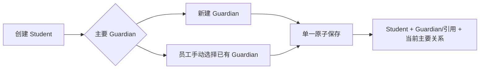
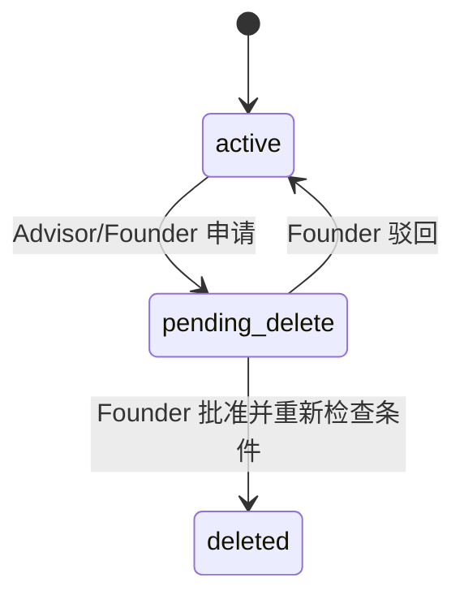

# CRM 模块契约

状态：`approved`  
确认依据：项目负责人于 2026-08-25 接受本模块契约，并在后续明确恢复独立 ReferralSource 来源目录  
设计日期：2026-08-25  
业务基线：`BR-BASELINE-20260825-v32`

返回[模块契约索引](README.md)。

业务依据：`BR-020` 至 `BR-029`。  
现状依据：[CRM 现状分析](../../current-state-analysis/20-crm.zh-CN.md)。

## 1. 一句话职责

CRM 只回答：

> 学生和 Guardian 的客户主档是什么，他们之间当前及历史关系是什么，谁是当前主要联系人，公司可用于 Case 的客户来源有哪些？

CRM 不拥有某一次签约、申请或学校结果；这些属于 Cases。

## 2. 负责与不负责

| CRM 负责 | CRM 不负责 |
| --- | --- |
| Student 客户主档 | ServiceCase、Assessment、申请流程 |
| Guardian 客户主档 | ServiceCase 和 Case 来源关联历史 |
| ReferralSource 来源目录 | Case 当前选择哪个来源 |
| Student-Guardian 当前关系和版本历史 | 内部 User、员工角色、Guardian Portal 身份 |
| 当前唯一主要联系人 | PortalGrant、通知投递、文件 |
| 疑似重复警告规则 | 客户自动关联、自动合并或人工合并 |
| Student/Guardian 软删除流程 | 物理删除、最终 purge 或软删除恢复 |

Release 1 不增加 PrimaryContact、DuplicateCandidate、MergeRevision 或 DeletionRequest 业务实体；ReferralSource 是项目负责人明确要求保留的正式业务实体。

## 3. 核心对象

本环节只冻结对象职责，不冻结数据库字段：

| 对象 | 含义 | 关键约束 |
| --- | --- | --- |
| `Student` | 学生客户主档 | 不可变 UUID；可关联多个 Case；不是登录账号 |
| `Guardian` | 家长或监护人本人 | 不可变 UUID；不是内部 User；可关联多个 Student |
| `StudentGuardianRelationship` | 两者之间有时间范围的关系版本 | 保存关系类型及各项独立职责；每名 Student 当前恰好一名主要联系人 |
| `ReferralSource` | 公司维护的客户来源目录项 | 不可变 UUID；受控来源类型；active 才能被新 Case 选择 |

以下概念不单独建实体：

- 主要联系人：Relationship 上的 `is_primary_contact`。
- 年龄：由 Guardian 的 `date_of_birth` 和当前日期计算。
- 疑似重复：创建/编辑时的查询判断和警告结果。
- 删除申请：主档的 `pending_delete` 状态、版本、受控原因和审计事实。

## 4. 主档最小规则

### Student

| 信息 | 规则 |
| --- | --- |
| display name | 必填 |
| date of birth | 可空 |
| contact email / phone | 均可空 |
| gender | 可空；male、female、other、not_disclosed |
| status | active、pending_delete、deleted |

### Guardian

| 信息 | 规则 |
| --- | --- |
| display name | 必填 |
| email / phone | 至少填写一个 |
| date of birth | 可空；不保存 age |
| gender | 可空；male、female、other、not_disclosed |
| status | active、pending_delete、deleted |

共同约束：

- `null` gender 表示尚未收集；`not_disclosed` 表示本人明确不提供。
- 不得根据姓名、称谓、头像、学校或其他资料推断 gender。
- 姓名、生日、email、phone、gender 都不是身份键或唯一条件。
- CRM 不保存 HKID、内地身份证号、护照号或证件影像。
- `other` 无法映射到学校申请选项时由业务人员处理，不得静默改值。

## 5. Student 与 Guardian 关系

Relationship 保存：

- `relationship_type`，严格使用 `BR-022` 的受控选项。
- `relationship_description`；选择 `other` 时必填。
- legal guardian、primary contact、emergency contact、billing contact、notification consent 五项独立标志。
- `starts_at` 和可空 `ends_at`，用于保留关系版本历史。

规则：

- relationship type 不得根据 Guardian gender 自动选择。
- 父母或亲属关系不自动等于法定监护人。
- 主要联系人只表示日常优先沟通，不自动取得监护权、账单职责、通知同意、最终选校确认权或 Portal 权限。
- CRM 不设置“次要联系人”身份或联系人排序。
- 结束关系只关闭当前关系版本，不删除 Guardian 或历史关系。

## 6. 建档与主要联系人

- Student 首次建档必须同时建立一名当前主要联系人。
- 新 Guardian 或手动选择已有 Guardian 都必须支持。
- 系统不得根据姓名、email、phone、生日或其他资料自动选择已有 Guardian。
- Student、可选的新 Guardian 和 Relationship 在同一事务中保存，任一失败全部回滚。
- 首次建档后可添加其他 Guardian；默认不是主要联系人。
- 更换主要联系人时，新人必须已经是当前关联 Guardian。
- 交接必须原子关闭旧关系版本并建立新版本，不能出现零个或多个当前主要联系人。
- 旧主要联系人交接后仍是关联 Guardian，不自动解除关系。
- 当前主要联系人的关系不能直接结束；必须先完成交接。

## 7. 疑似重复警告

Student 与 Guardian 分别按自己的主档查询：

- 只有非空的姓名、email 或 phone 至少一项相同时显示警告。
- date of birth、gender 或其他字段相同不触发警告。
- 警告只辅助人工判断，不自动关联、不自动合并，也不自动创建 Relationship。
- Release 1 不提供人工合并、撤销合并或 merge correction。
- 警告结果不建立持久化 DuplicateCandidate 实体。

email/phone 的精确规范化方式在数据设计中冻结，但不得加入模糊姓名、生日或其他新匹配信号。

## 8. ReferralSource

- 每条来源保存 display name、`BR-028` 的受控 source type、可空 description 和 active/inactive 状态。
- `other` 类型必须填写 description。
- 同一 ReferralSource 可以被多个 Case 引用；CRM 不保存具体 Case 关联。
- inactive 来源不能用于新 Case 或来源变更，但历史 Case 关联继续有效。
- ReferralSource 不物理删除；修改使用 expected version 并保留审计。
- Case 当前来源及更换历史由 Cases 拥有的 CaseReferralSourceAssignment 表达。

## 9. 软删除状态机

约束：

- Founder 可以发起申请并作出决定；不禁止 Founder 处理自己发起的申请。
- Admin 和 Contractor 不参与客户资料删除申请或决定。
- Student 有未结案 Case 时，不得申请或批准删除。
- Guardian 有任何当前有效 Student 关系时，不得申请或批准删除。
- Founder 批准时必须在当前事务中重新检查条件和 expected version。
- `pending_delete` 仍出现在正常列表和搜索中，并明确显示状态。
- `deleted` 在 Release 1 的业务页面、列表、搜索、详情、筛选和业务 API 中完全不可见。
- deleted Student 不得创建新 Case；deleted Student/Guardian 不得建立新 Relationship。
- deleted 是终态：不恢复、不 purge，数据库和业务代码都禁止物理删除。

Student 删除审批需要的“是否存在未结案 Case”由顶层 application coordinator 通过 Cases 公开查询取得，并与 CRM 状态转换放入同一受控事务边界；CRM 不直接读取 Cases 私有表。锁顺序按[非功能基线第 6 节](../60-nfr-delivery/10-nfr-baseline.zh-CN.md)执行。

## 10. 授权边界

| 角色/关系 | CRM 权限边界 |
| --- | --- |
| Founder | 管理客户资料、处理删除申请和最终批准/驳回 |
| Advisor | 按 Access capability 和业务关系处理客户资料，可申请删除 |
| Admin | 默认不能读取或修改客户资料 |
| Contractor | 不进入 CRM；只从 Tasks 取得单任务脱敏 DTO |
| Guardian Portal | 不直接调用 CRM；只能读取 ExternalPortal 请求时构建的单 Case 白名单 DTO |

所有命令和查询先使用 Access 的多角色 AuthorizationContext，再检查具体业务关系。浏览器隐藏、客户端 role 或 URL 中的 ID 都不是授权证据。

## 11. 对外查询契约

| 查询 | 主要调用方 | 返回 |
| --- | --- | --- |
| `listStudents` / `getStudent` | 内部 CRM 页面、Cases | active 和 pending_delete 的受控摘要/详情 |
| `getGuardian` | 内部 CRM 页面、Cases | 未删除 Guardian 的受控详情 |
| `listCurrentGuardianRelationships` | 内部 CRM 页面、Cases | 当前关系及唯一主要联系人 |
| `getGuardianRelationshipHistory` | 有权内部员工 | 关系版本历史，不含已删除主档的业务详情 |
| `searchGuardiansForManualLink` | Guardian 关联用例 | 最小联系提示，必须由员工明确选择 |
| `findPotentialDuplicates` | 建档/编辑用例 | 命中的字段类型和最小候选提示，不返回自动决定 |
| `resolveCustomerEligibility` | Cases、ExternalPortal | 主档状态和受控关系事实，不返回完整 CRM 档案 |
| `listReferralSources` / `getReferralSource` | Cases 建案/来源变更、内部来源管理 | active 来源或指定历史来源的受控摘要 |

deleted 主档不通过任何 Release 1 业务查询返回。

## 12. 对外命令契约

| 命令 | 关键规则 |
| --- | --- |
| `createStudentWithPrimaryGuardian` | 新建或手选已有 Guardian；同事务创建 Student 和主要关系 |
| `updateStudent` / `updateGuardian` | expected version；重新执行必要的重复警告，不自动关联 |
| `addGuardianRelationship` | 新建或手选已有 Guardian；新增关系默认非主要 |
| `handoffPrimaryContact` | successor 必须已关联；原子关闭旧版本并建立新版本 |
| `endGuardianRelationship` | 主要联系人必须先交接；只结束当前版本 |
| `requestSoftDeletion` | Advisor/Founder；先检查 Case/Relationship 前置条件 |
| `approveSoftDeletion` / `rejectSoftDeletion` | Founder 专属；批准时重验条件，驳回恢复 active |
| `createReferralSource` / `updateReferralSource` | Founder 管理来源目录；校验受控类型和 expected version |
| `deactivateReferralSource` | Founder 停用；停用后禁止新关联，历史保留 |

所有写命令都必须幂等、使用 expected version，并与 AuditEvent、Outbox 和 Idempotency result 原子提交。

## 13. 发布的事实

| 事实 | 主要消费者 |
| --- | --- |
| `crm.student_created` / `updated` | Cases、Audit、Operations |
| `crm.guardian_created` / `updated` | Cases、Audit、Operations |
| `crm.guardian_relationship_created` / `ended` | Cases、ExternalPortal、Audit |
| `crm.primary_contact_handed_off` | Cases、ExternalPortal、Audit |
| `crm.soft_deletion_requested` | Founder 站内通知、Audit、Operations |
| `crm.soft_deletion_approved` / `rejected` | Cases、Audit、Operations |
| `crm.referral_source_created` / `updated` / `deactivated` | Cases、Audit、Operations |

事件只携带 opaque ID、状态、版本和受控 reason code，不携带姓名、email、phone、生日或其他 PII。

## 14. 依赖规则

| 类型 | 允许 |
| --- | --- |
| 业务依赖 | `Access` 的公开授权契约 |
| 平台依赖 | `Shared`、`Audit` 的公开契约 |
| 事务协调 | 顶层 coordinator 可同时使用 CRM 与 Cases 的公开 port 完成删除条件重验 |
| 允许消费者 | Cases、ExternalPortal、受权内部 CRM/来源管理入口 |

明确禁止：

- CRM 直接读取或写入 Identity、Access、Cases、Tasks、Documents 的私有表。
- Cases、ExternalPortal 或页面直接写 CRM 表。
- CaseReferralSourceAssignment、ServiceCase 或 PortalGrant 不得归入 CRM；CRM 只拥有来源目录。
- CRM 发布包含 PII 的 outbox payload、审计 metadata、错误或日志。
- runtime 静默回退到 mock、JSON、legacy 或内存数据。

## 15. 安全与一致性不变量

- 所有数据按 organization scope 隔离，并由应用授权和 RLS 双重限制。
- Student、Guardian 和 Relationship 使用不可变 UUID；业务字段不能代替 ID。
- 首次建档、主要联系人交接和删除批准必须各自在明确事务边界内原子完成。
- 任意写入使用幂等键和 expected version；相同重试才复用原幂等键。
- 审计、outbox、日志和稳定错误不得包含客户 PII 或完整请求体。
- deleted 数据只在数据库永久保留，不通过业务 repository 或 DTO 暴露。
- 未配置目标环境 runtime 时 fail closed；本地验证不代表 production-aws 已验证。

## 16. 与当前代码的差异

| 优先级 | 当前实现 | 目标契约 |
| --- | --- | --- |
| `P0` | Student/Guardian 状态仍含 `purged` | 改为 active、pending_delete、deleted；永久禁止 purge |
| `P0` | Student 缺 gender；Guardian 缺 gender/date of birth | 补齐已确认最小资料；age 只计算不保存 |
| `P0` | 关系类型只有 father/mother/other_guardian | 使用 `BR-022` 全部受控选项并增加 other 说明 |
| `P0` | 重复判断包含 date of birth，且保留 merge/correction | 只按非空姓名/email/phone 警告；移除全部 merge 能力 |
| `P0` | 删除只有申请，没有 Founder approve/reject 闭环 | 完成 active -> pending_delete -> active/deleted 状态机 |
| `P0` | 无 Guardian relationship termination | 新增结束关系命令并保护主要联系人 |
| `P0` | ReferralSource 表和 Case 关联历史已存在，但来源类型只有 bank/insurance/other_partner | 保留来源实体和关联历史；类型改为 BR-028 的 11 个受控值，并补 description/other 约束 |
| `P1` | 首次建档只能新建 Guardian | 同时支持员工手动选择已有 Guardian |
| `P1` | 后续关联只能选择已有 Guardian | 同时支持新建 Guardian 后原子关联 |
| `P1` | application service 仍使用单一 IdentitySessionActor.role | 改用 Access 的多角色 AuthorizationContext |
| `P1` | production-aws CRM runtime 主动 unavailable | 实现显式生产 adapter；未接通前保持 fail closed |

这些差异进入后续开发拆分；本环节不修改产品代码或数据库。

## 17. 设计决策

| ID | 决策 |
| --- | --- |
| `SD-CRM-001` | CRM 拥有 Student、Guardian、版本化 StudentGuardianRelationship 和 ReferralSource 来源目录 |
| `SD-CRM-002` | 主要联系人是关系标志，不是独立实体 |
| `SD-CRM-003` | 首次建档必须原子建立唯一主要联系人 |
| `SD-CRM-004` | 重复匹配只产生警告，不持久化候选、不关联、不合并 |
| `SD-CRM-005` | 删除只做永久保留的软删除；没有 purge 和恢复 |
| `SD-CRM-006` | CRM 拥有 ReferralSource 目录；Cases 拥有 Case 当前来源和更换历史 |
| `SD-CRM-007` | deleted 数据不出现在 Release 1 任何业务读取路径 |

## 18. 本模块验收标准

项目负责人需要确认：

1. CRM 保留 Student、Guardian、StudentGuardianRelationship 和 ReferralSource 四个核心业务对象。
2. 首次建档必须同时建立唯一主要联系人，可新建或手动选择已有 Guardian。
3. 疑似重复只警告，不建立候选实体、不自动关联、不合并。
4. 主要联系人交接和 Guardian 关系结束均保留完整版本历史。
5. 软删除只有 active -> pending_delete -> active/deleted；deleted 永久不可业务查看，也不物理删除。
6. ReferralSource 目录归 CRM；每个 Case 最多一个当前来源，其关联与更换历史归 Cases。

确认后进入下一个模块：Schools。
