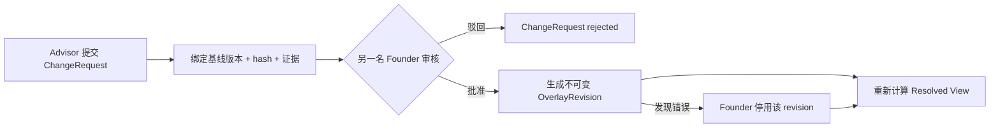

# Schools 模块契约

状态：`approved`  
确认依据：项目负责人于 2026-08-25 指示继续进入下一模块  
设计日期：2026-08-25

返回[模块契约索引](README.md)。

业务依据：`BR-051`。  
现状依据：[Schools 现状分析](../../current-state-analysis/50-schools.zh-CN.md)。

## 1. 一句话职责

Schools 只回答：

> 当前可用的学校目录是什么，每个字段来自哪一版快照或哪次 Founder 批准的修订？

它不拥有某个 Case 为什么选择该校，也不记录逐校申请进度。

## 2. 负责与不负责

| Schools 负责 | Schools 不负责 |
| --- | --- |
| 稳定 School 身份和验证状态 | Case 候选名单、SchoolTarget、申请状态 |
| provisional School | 学生与学校匹配决策 |
| 不可变 crawler snapshot | crawler 抓取调度本身 |
| SchoolChangeRequest 和 Founder 审核 | Git 发布或应用部署 |
| 不可变 overlay revision 及停用回滚 | 外部公开网站的发布流程 |
| 可追溯 resolved school view | Task、Document 或 Notification 状态 |
| warning manifest 的 Founder 一次性批准记录 | Data Reviewer 角色或审核流程 |

## 3. 核心对象

本环节冻结职责，不冻结数据库字段：

| 对象 | 含义 | 关键约束 |
| --- | --- | --- |
| `School` | 一个稳定的学校目录身份 | 使用不可变 UUID；名称和网址不是身份键；不得物理删除 |
| `CrawlerSnapshot` | 一次完整、版本化的外部学校数据输入 | 内容不可变；candidate、active、retired 只改变使用状态，不改写内容 |
| `SchoolChangeRequest` | Advisor 针对精确基线提交的修改意图 | 保存操作、原因、证据、基线 hash 和提交人；只能批准或驳回 |
| `OverlayRevision` | Founder 批准后生效的不可变修订 | 可通过后续停用动作回滚；不得改写历史 |

以下概念不单独建业务实体：

- provisional School：School 的未验证状态。
- resolved view：Snapshot 与有效 OverlayRevision 的确定性投影。
- merge、split、disable、主要官网修改：ChangeRequest 的受控操作类型。
- warning manifest approval：绑定精确 manifest 的不可变批准记录和审计事实。

## 4. Provisional School

- 学校不在目录时，具有 Advisor 角色和对应 capability 的员工可以创建 provisional School。
- provisional 必须醒目标记“未验证”，不能伪装成已验证 crawler 记录。
- 创建时必须记录最小识别资料、原因、提交人和版本。
- 学校名称、官网或相似资料只能产生人工提示，不能自动关联、合并或覆盖已有 School。
- provisional 可以被 Cases 引用，但 Schools 必须同时返回未验证标志；是否适合进入具体申请由 Cases 的业务规则决定。
- provisional 转为已验证、合并、拆分或停用仍必须经过 SchoolChangeRequest 和 Founder 审核。

## 5. 学校修改流程



规则：

- 只有 Advisor capability 可以提交 provisional 和 ChangeRequest；Founder 如需提交，必须同时具有 Advisor 角色。
- 所有普通字段、学校身份、合并、拆分、停用和主要官网修改统一由 Founder 审核。
- 提交者不能审核自己的请求；Founder + Advisor 提交的请求必须由另一名 Founder 审核。
- Admin 可拥有日常技术配置能力，但不能批准、驳回或直接发布学校业务资料。
- Contractor 不进入学校目录治理流程。
- ChangeRequest 必须绑定提交时的 snapshot/resolved revision、原值 hash、修改理由和可核验证据。
- 基线已变化时不得盲目批准；必须显示冲突并重新确认或重新提交。
- 驳回只结束请求，不产生生效 overlay。
- 批准原子生成 OverlayRevision、审计和 outbox 事实。

Release 1 没有 Data Reviewer；不保留其推荐、初审或普通字段审核步骤。

## 6. Resolved School View

```text
当前 active CrawlerSnapshot
  + 按版本顺序应用全部 approved 且未 disabled 的 OverlayRevision
  = ResolvedSchoolView
```

- 同一字段存在多次有效修订时，最新适用 revision 胜出。
- 每个返回字段都带 snapshot、overlay revision 和 value hash provenance。
- 停用最新 revision 后，自动显露前一个有效 revision 或 snapshot 原值。
- 新 snapshot 与现有 overlay 值相同，可提出“修订已冗余”的 reconciliation 建议。
- 新 snapshot 与 overlay 基线冲突时，保留当前已批准值并进入 Founder 复核，不静默丢弃修订。
- resolved view 可以物化以提升读取速度，但其权威来源始终是不可变 snapshot 和 approved overlay。

Cases 创建 SchoolTarget 时取得 `SchoolReferencePin`：schoolId、snapshotId、适用 overlay revision 集合/解析版本和 resolution hash。后续目录变化不得静默改写既有 SchoolTarget 的历史引用。

## 7. Crawler Snapshot 准入

- crawler 只提供候选输入，不能直接改写 School 或 active resolved view。
- candidate manifest 必须绑定精确文件集合、数量、schema、hash、health 和 warning 集合。
- `health=fail` 不能激活。
- `health=pass` 只表示数据候选通过检查；仍需显式执行独立的 snapshot 激活动作。
- `health=warn` 不得自动接受或发布；必须由 Founder 对精确 manifest hash 和完整 warning 集合一次性批准。
- warning 批准不需要 Data Reviewer 推荐；提交/发布者不能审批自己提交的候选。
- 批准记录必须一次性并与 manifest 精确绑定；是否设置有效时长在权限与安全设计中冻结。

以下动作彼此独立，任何一个成功都不能自动证明另一个已授权或完成：

1. crawler 产生候选快照。
2. Founder 批准 warning manifest。
3. 快照复制或激活。
4. Git/公开学校数据发布。
5. 应用部署。

## 8. 对外查询契约

| 查询 | 主要调用方 | 返回 |
| --- | --- | --- |
| `searchResolvedSchools` | Cases、内部学校目录 | 最小目录结果、验证状态和 resolution identity |
| `getResolvedSchool` | Cases、内部学校详情 | resolved fields、provenance、conflicts 和 reference pin |
| `validateSchoolReferencePin` | Cases | pin 是否可追溯，不自动升级为最新版 |
| `listChangeRequests` / `getChangeRequest` | Advisor、Founder 治理界面 | 受控请求、证据摘要、状态和版本 |
| `getSnapshotCandidate` | Founder warning 审批入口 | 精确 manifest identity、health 和 warning 集合 |

浏览器不得直接读取原始 crawler 文件目录、repository 或未准入 snapshot。

## 9. 对外命令契约

| 命令 | 关键规则 |
| --- | --- |
| `createProvisionalSchool` | Advisor；创建未验证 School，不自动合并 |
| `submitSchoolChange` | Advisor；绑定基线、hash、证据和 reason |
| `reviewSchoolChange` | Founder；禁止自审；approve 或 reject |
| `disableOverlayRevision` | Founder；expected version、原因和审计；不删除 revision |
| `reviewOverlayReconciliation` | Founder；决定关闭冗余 overlay 或保留冲突修订 |
| `approveWarningManifest` | Founder；绑定精确 manifest/warnings，一次性、禁止自审 |
| `activateSnapshot` | 独立受权运行入口；重新校验 manifest 和批准记录 |

所有命令都必须幂等，使用 expected version，并与 AuditEvent、Outbox 和 Idempotency result 原子提交。

## 10. 发布的事实

| 事实 | 主要消费者 |
| --- | --- |
| `schools.provisional_created` | Cases、Audit、Operations |
| `schools.change_request_submitted` | Founder 站内通知、Audit |
| `schools.change_request_approved` / `rejected` | Advisor 站内通知、Audit、Operations |
| `schools.overlay_revision_disabled` | Cases、Audit、Operations |
| `schools.warning_manifest_approved` | snapshot activation runtime、Audit |
| `schools.snapshot_activated` | Cases、Operations、目录缓存失效器 |

事件只携带 opaque ID、状态、版本、hash 和受控 reason code，不携带整份学校 payload 或外部页面内容。

## 11. 依赖规则

| 类型 | 允许 |
| --- | --- |
| 业务依赖 | `Access` 的公开授权契约 |
| 平台依赖 | `Shared`、`Audit` 的公开契约 |
| 外部输入 | 版本化 crawler snapshot handoff port |
| 允许消费者 | Cases、学校治理入口、受权 snapshot activation runtime |

明确禁止：

- Schools 读取或写入 Cases、CRM、Tasks、Documents 的私有表。
- Cases 或页面直接读取 crawler 文件、overlay 表或 mock 数据。
- crawler、Admin 配置入口或部署脚本绕过 Founder 审核修改学校业务事实。
- 名称或官网 URL 被当作 School ID、自动合并键或 Case 关系键。
- runtime 在生产静默回退到 Git snapshot、mock、JSON 或 legacy 数据。

## 12. 安全与一致性不变量

- School、snapshot 内容、approved/rejected/disabled revision 和 resolved revision 历史不得物理删除或改写。
- 所有读取按 organization scope 隔离，并由应用授权和 RLS 双重限制。
- ChangeRequest 审批、overlay 停用和 snapshot 激活必须重验 expected version 和基线 hash。
- 提交者与审核者分离；Founder 权限必须由 Access 当前事实重新判断。
- 所有外部证据 URL、manifest 和文件集合先验证，再进入持久化或解析流程。
- runtime 未接通时 fail closed；路由和测试存在不代表 production-aws 已接通。

## 13. 与当前代码的差异

| 优先级 | 当前实现 | 目标契约 |
| --- | --- | --- |
| `P0` | Data Reviewer 可以审核普通字段和 warning receipt | 所有学校资料和 warning manifest 只由 Founder 审核 |
| `P0` | Admin 拥有 schools.manage/crawler.manage，业务与技术能力混在一起 | 技术配置不能带来学校审核、发布或客户业务权限 |
| `P0` | School、治理和 resolved view runtime 固定 unavailable | 接通显式 PostgreSQL adapter；未配置继续 fail closed |
| `P1` | 页面/兼容入口仍可使用 mock 或旧 crawler 路径 | 所有目录消费者统一读取 Schools resolved view |
| `P1` | warning receipt 仍要求 Data Reviewer recommendation | 只保留 Founder 对精确 manifest 的批准记录 |
| `P1` | resolver 只选择最高编号 overlay revision | 按顺序合并全部有效 revision，保留逐字段 provenance |
| `P1` | server entrypoint 仍公开 mock school adapter | mock 仅属于测试夹具，不进入模块正式 server contract |

这些差异进入后续开发拆分；本环节不修改产品代码、数据库、crawler 数据或发布状态。

## 14. 设计决策

| ID | 决策 |
| --- | --- |
| `SD-SCH-001` | provisional 是 School 的验证状态，不建立独立业务实体 |
| `SD-SCH-002` | crawler snapshot 永久不可变，人工修正只通过 approved overlay |
| `SD-SCH-003` | Release 1 所有学校资料变更只由 Founder 审核，禁止自审 |
| `SD-SCH-004` | resolved view 合并全部有效 overlay，并保留逐字段 provenance |
| `SD-SCH-005` | Cases 使用不可变 SchoolReferencePin，不被目录更新静默改写 |
| `SD-SCH-006` | warning manifest 由 Founder 对精确候选一次性批准，无 Data Reviewer |
| `SD-SCH-007` | crawler、快照激活、Git 发布和应用部署分别授权、分别留证 |

## 15. 本模块验收标准

项目负责人需要确认：

1. provisional 只是 School 的未验证状态，不单独建实体。
2. Advisor 提交修改，Founder 审核，且提交者不能审核自己。
3. 所有普通字段、身份、合并、拆分、停用、官网和 warning manifest 都只由 Founder 决定。
4. resolved view 合并快照与全部有效 overlay，并保留逐字段来源。
5. Cases 保存 SchoolReferencePin，后续学校资料变化不改写既有申请历史。
6. crawler、Founder warning 批准、快照激活、Git 发布和应用部署互相独立。

确认后进入下一个模块：Cases。
