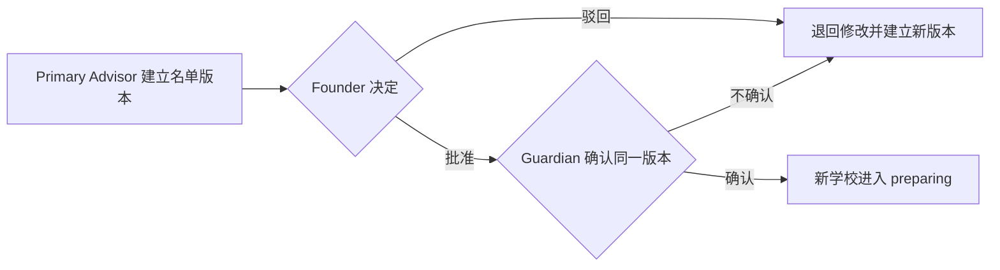
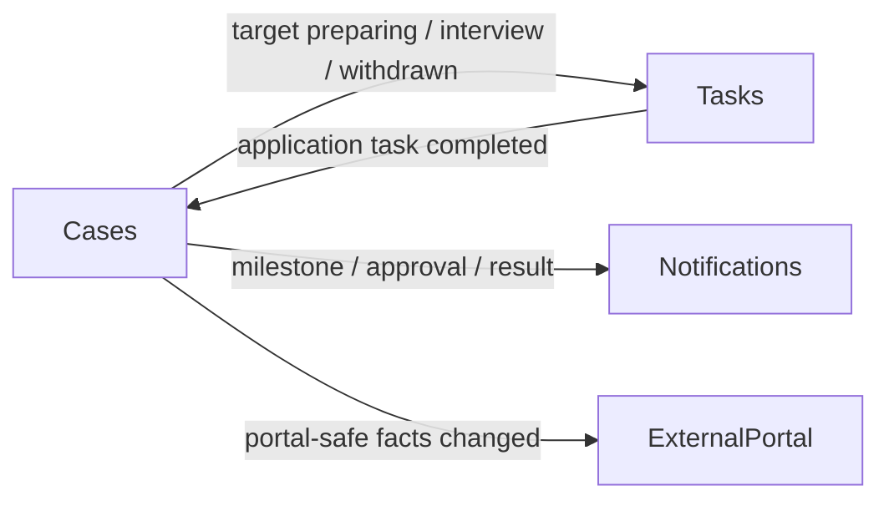

# Cases 模块契约

状态：`approved`  
确认依据：项目负责人于 2026-08-25 指示继续进入下一模块，并在后续明确要求 Case 关联独立 ReferralSource  
设计日期：2026-08-25  
业务基线：`BR-BASELINE-20260825-v32`

返回[模块契约索引](README.md)。

业务依据：`BR-030` 至 `BR-034`、`BR-039`，并引用 `BR-011` 至 `BR-013`、`BR-020`、`BR-027`、`BR-028`、`BR-035` 至 `BR-037`、`BR-050`、`BR-060`。  
现状依据：[Cases 现状分析](../../current-state-analysis/30-cases.zh-CN.md)。

## 1. 一句话职责

Cases 只回答：

> 一个已签约 K12 案件当前处于哪个全局里程碑，背景资料、选校确认和每所学校的申请结果是什么？

它不拥有 Task 执行、文件内容、学校公共资料或 Guardian Portal Session。

## 2. 负责与不负责

| Cases 负责 | Cases 不负责 |
| --- | --- |
| ServiceCase、Primary Advisor 关系和全局里程碑 | Student、Guardian 客户主档 |
| CaseReferralSourceAssignment：Case 当前来源和更换历史 | ReferralSource 来源目录本身 |
| Assessment manifest pin、答案和 blocker | EmployeeProfile、RoleBinding、CaseCollaborator 授权记录 |
| 候选学校名单版本、Founder 决定和 Guardian 代录确认 | 学校目录字段、crawler snapshot 或 overlay 治理 |
| SchoolTarget、Application Assignee 和逐校状态 | Task、TaskAssignment 和任务完成状态 |
| 申请提交事实、学校结果和 Guardian offer 决定 | 文件内容、扫描状态或对象存储 |
| 对客阶段、对客更新时间及明确发布的 Portal 消息/行动项 | PortalViewer、PortalGrant、PortalSession 或外部会话 |
| 暂停、恢复、终止服务和 Founder 人工结案 | Notification 投递、OperationsProjection 或外部通信 |

## 3. 核心对象

本环节冻结业务职责，不冻结数据库字段：

| 对象 | 含义 | 关键约束 |
| --- | --- | --- |
| `ServiceCase` | 一次线下签约后的 K12 服务案件 | 关联一个 Student 和当前 Primary Advisor；永久保留，不删除或软删除 |
| `Assessment` | 该 Case 使用的固定 manifest 与版本化答案 | manifest 一经绑定不得静默升级；blocker 由该版本决定 |
| `CandidateSchoolListVersion` | 一次完整候选学校集合及其审批状态 | 学校集合不可原地覆盖；修改必须新建版本并重新两层确认 |
| `SchoolTarget` | Case 对一所学校的一轮申请 | 持有 SchoolReferencePin、当前 Application Assignee、逐校状态和版本历史 |
| `CaseReferralSourceAssignment` | Case 对 CRM ReferralSource 的当前及历史关联 | 每个 Case 同时最多一个当前来源；更换时关闭旧版本 |

以下概念不单独建业务实体：

- Application：由 SchoolTarget 表达。
- Offer：由 accepted 状态和 Guardian 决定记录表达。
- CaseOutcome：由 SchoolTarget 终态及追加式结果/纠正记录表达。
- GuardianConfirmation、FounderApproval、ClosureResult：作为对应聚合的不可变记录。
- Material、SubmissionEvidence：复用 SchoolTarget、Task、Case Document 引用和审计事实。
- Portal 消息/行动项：作为 ServiceCase 聚合内的版本化对客发布记录，不新增顶层业务实体。

## 4. 建案与全局里程碑

Release 1 只允许正式 K12 建案。非 K12 只能显示“正在开发中”。

建案规则：

- 线下签约完成后，引用 CRM 中现有 active Student 创建 ServiceCase。
- 如需新建 Student/Guardian，由顶层 application coordinator 先调用 CRM；Cases 不写 CRM 表。
- 必须指定当前 active Advisor RoleBinding 作为 Primary Advisor。
- 绑定已批准的 K12 Assessment manifest 版本。
- 可关联 CRM 中一个当前 active ReferralSource；不在 ServiceCase 重复保存可漂移的来源目录字段。
- 同一 Case 同时最多一个当前来源；更换时关闭旧关联并建立新版本，保留来源显示名称、类型、说明和来源版本快照。
- 同一事务先保存 signed 事实，再自动进入 background_collection；不得留下长期停在 signed 的已提交 Case。

全局里程碑固定为：

```text
signed
  -> background_collection
  -> school_selection_confirmed
  -> application_in_progress
  -> closed
```

- Assessment background blocker 完成后保存 background_complete 事实。
- Founder 批准且 Guardian 确认同一名单版本后，保存 school_selection_confirmed 里程碑。
- 至少一所已确认学校进入 preparing 后，保存 application_in_progress 里程碑。
- closed 只能由 Founder 在全部条件满足后人工执行。
- 客户端不得任意指定下一个里程碑；里程碑由已确认事实触发。

## 5. Assessment

- Release 1 使用 `BR-032` 的不可变 15 字段 K12 v1 manifest。
- manifest 字段、枚举或 blocker 改变时建立新版本；旧 Case 继续使用原版本。
- Assessment 从 draft 开始；background blocker 满足后记录 background_complete。
- school selection blocker 是否满足按当前答案即时计算，不额外增加业务状态。
- unknown 和 declined_to_provide 不满足 blocker；v1 不允许 not_applicable 例外。
- CRM 的 date_of_birth 是当前 Student 主档事实；Assessment 中同名字段是该 Case 的版本化背景答案，可初始化但不得与 CRM 静默双向同步。

访问规则：

| 访问者 | Assessment 权限 |
| --- | --- |
| 当前 Primary Advisor | 读写全部字段，完成 background |
| Case Collaborator | 只按 education_profile 的 view/edit grant 访问对应字段 |
| Founder | 只读 |
| Admin 基础角色 | 默认不可查看 |
| Admin + Advisor | 只有满足 Primary Advisor 或 Case Collaborator 关系时，按对应 Advisor 权限访问 |
| 其他 Advisor、Contractor、Guardian、Student、Portal | 默认不可查看原始 Assessment |

## 6. 候选学校名单版本



每个 CandidateSchoolListVersion 必须保存：

- 版本号、完整学校集合及每校 SchoolReferencePin。
- 创建人、创建时间和变更说明。
- Founder 的批准或驳回、操作者、时间、理由和 expected version。
- Guardian 的确认人、结果、时间、渠道、代录人，以及所对应的 Founder 批准记录。

规则：

- 只有当前 Primary Advisor 可以创建或提交候选名单版本。
- 建立候选名单前必须已完成 background blocker。
- Guardian 确认时重新检查 school selection blocker 和 Founder 对同一版本的批准。
- Release 1 由 Primary Advisor 通过电话、微信或面谈取得决定后代录；Portal 不写入确认。
- 截图或文件可关联 Case，但不是完成确认的强制条件。
- 修改任何学校集合都建立新版本，并重新经过 Founder 批准和 Guardian 确认。
- 主要联系人身份不自动代表最终选校确认权；代录时必须明确记录实际确认 Guardian。

## 7. 已确认名单变化

新名单版本完成两层确认后，Cases 按 School ID 和申请轮次计算差异：

| 差异 | 处理 |
| --- | --- |
| 未变化学校 | 保留原 SchoolTarget、Application Assignee、Task 和状态 |
| 新增学校 | 创建/启用 candidate Target，指定 Application Assignee，进入 preparing 并请求 Tasks 创建申请 Task |
| 移除的进行中学校 | 转为 withdrawn，请求 Tasks 取消未完成 Task，保留全部历史 |
| 已终态学校 | 保留原结果，不因新名单删除或改写 |

所有学校都拒绝后仍可建立新名单版本；系统不得因为旧名单已全部终态而阻止新增学校。

## 8. SchoolTarget 与申请处理

状态机固定为：

```text
candidate -> preparing -> submitted
submitted -> interview
submitted / interview -> waitlisted / accepted / rejected
waitlisted -> accepted / rejected
accepted -> offer_confirmed / offer_declined
preparing / submitted / interview / waitlisted -> withdrawn
```

终态只有：offer_confirmed、offer_declined、rejected、withdrawn。

关键规则：

- candidate 只表示候选；完成两层确认后才能进入 preparing。
- 进入 preparing 前必须指定 Application Assignee：Primary Advisor 或有明确案件授权的 Case Collaborator。
- Cases 发布幂等任务请求；Tasks 创建一条“准备并提交申请”Task，不拆成两个 Task。
- Tasks 完成申请 Task 后发布提交事实；Cases 重验当前 Target、Assignee 和凭证后才进入 submitted。
- 提交事实必须包含时间、渠道、提交人、清单完成状态，以及学校参考号或“无参考号”声明加至少一份其他凭证引用。
- 不需要面试时可跳过 interview。
- 进入 interview 时保存面试事实并请求 Tasks 创建必要的面试辅助 Task；辅助 Task 完成不改变学校结果。
- accepted 表示已收到 offer，仍等待 Guardian 决定，不是终态。
- offer_confirmed/offer_declined 由 Primary Advisor 取得 Guardian 决定后代录，保存 Guardian、结果、时间、渠道和代录人。
- 结果纠正只能追加新版本，不覆盖原结果或状态历史。

## 9. 暂停与恢复

- 只有在该 Case 没有任何 SchoolTarget 历史达到 submitted 或后续状态时，才允许案件级暂停。
- 当前 Primary Advisor 可暂停/恢复自己负责的 Case；Founder 可操作任何符合条件的 Case。
- Guardian 只能提出请求，由有权员工执行。
- 暂停必须保存自由文字原因、操作者和时间。
- 暂停不覆盖当前里程碑；恢复回到暂停前里程碑。
- 暂停期间禁止正常推进 Assessment、名单和 SchoolTarget。
- 原 Task 保留，不完成、不取消、不重建。
- 外部申请截止日期和 Task due_at 继续计算，不自动顺延，逾期提醒继续。
- 学校已正式提交后如需停止，只能把对应 SchoolTarget 转为 withdrawn，不能暂停整个 Case。

## 10. 终止服务与人工结案

客户终止整体服务时：

1. Cases 将全部进行中 SchoolTarget 转为 withdrawn，并保存终止原因和操作者。
2. Cases 发布事件，请求 Tasks 取消相关未完成 Task 并保留历史。
3. Founder 等待任务取消完成后，再执行人工结案。

结案必须重新检查：

- 所有已确认 SchoolTarget 均为 offer_confirmed、offer_declined、rejected 或 withdrawn。
- 不存在 preparing、submitted、interview、waitlisted 或 accepted。
- Tasks 权威查询确认不存在未完成 Case Task。
- Founder 明确提交结案结果和原因。

满足条件也绝不自动结案。

- 全部学校拒绝时保留“建立新名单版本”或“Founder 明确无 offer 结案”两条分支。
- 有 offer_confirmed 可记录成功结案；没有 offer 也可由 Founder 人工结案，但不能改写逐校结果。
- 重新签约创建新 ServiceCase，不重开旧 Case。
- ServiceCase、SchoolTarget 和全部历史永久保留，禁止软删除、物理删除和 purge。

## 11. 对外查询契约

| 查询 | 主要调用方 | 返回 |
| --- | --- | --- |
| `listCases` / `getCaseWorkspace` | 内部案件页面 | 当前里程碑、生命周期、Primary Advisor、下一步和异常摘要 |
| `getCaseAuthorizationFacts` | Access、Tasks、Documents | 当前 Case、Primary Advisor、Application Assignee 和 Target 关系事实 |
| `getAssessment` | 有权内部用户 | manifest、答案、blocker 和字段级访问结果 |
| `listCandidateSchoolVersions` | Primary Advisor、Founder | 版本集合和两层确认状态 |
| `listSchoolTargets` / `getSchoolTarget` | 内部案件页面、Tasks | Target、SchoolReferencePin、Assignee、状态和受控证据摘要 |
| `getCustomerDeletionGuard` | CRM 删除协调器 | Student 是否仍有未结案 Case |
| `getTaskProvisioningFacts` | Tasks | 创建/取消 Task 所需的 opaque Case/Target/Assignee 事实 |
| `getPortalVisibleFacts` | ExternalPortal | 对客阶段/时间、确认名单中的学校进度及明确发布的消息/行动项 |
| `evaluateClosureEligibility` | Founder 结案协调器 | Target 条件；未完成 Task 由 Tasks 权威查询补充 |

## 12. 对外命令契约

| 命令 | 关键规则 |
| --- | --- |
| `createK12Case` | 引用 active Student、active Primary Advisor、approved manifest；记录 signed 后自动进入 background |
| `updateAssessmentAnswer` / `completeBackground` | manifest 校验、字段授权、blocker、expected version |
| `createCandidateListVersion` | Primary Advisor；完整学校集合和 SchoolReferencePin |
| `reviewCandidateList` | Founder approve/reject；expected version |
| `recordGuardianListDecision` | Primary Advisor 代录；绑定同一 approved version 和实际 Guardian |
| `applyConfirmedListChanges` | 保留不变项、新增 preparing、移除项 withdrawn，并发出 Task 请求 |
| `recordSchoolTargetEvent` | 重验状态机、权限、证据和 expected version |
| `recordGuardianOfferDecision` | Primary Advisor 代录；只允许 accepted -> offer_confirmed/offer_declined |
| `publishPortalMessage` / `publishPortalActionItem` | 当前 Primary Advisor；纯文本、明确 customer-visible、expected version |
| `updatePortalActionItem` / `withdrawPortalPublication` | 当前 Primary Advisor；保留版本历史，不删除原发布记录 |
| `pauseCase` / `resumeCase` | 重验历史 Target、角色、原因和 paused previous milestone |
| `terminateService` | withdrawal 全部进行中 Target并请求 Task 取消；不直接 closed |
| `closeCase` | Founder；重验所有 Target、Tasks 和结案原因；绝不自动执行 |

所有写命令都必须幂等，并与本模块事实、AuditEvent、Outbox 和 Idempotency result 原子提交。

## 13. 业务事件与跨模块协作



关键事件：

- `cases.service_case_created`、`background_completed`、`paused`、`resumed`、`closed`。
- `cases.candidate_list_submitted`、`approved`、`rejected`、`guardian_confirmed`。
- `cases.school_target_preparing`、`interview_required`、`withdrawn`、`result_recorded`。
- `cases.application_task_requested`、`interview_task_requested`、`task_cancellation_requested`。
- `cases.portal_safe_facts_changed`，只携带 Case opaque ID、版本和 effect code，不复制对客正文。

Cases 消费 `tasks.application_submission_completed` 后重新验证当前事实，再推进 Target；Task 完成事件不能绕过 Cases 状态机。

## 14. 依赖规则

| 类型 | 允许 |
| --- | --- |
| 业务依赖 | `Access`、`CRM`、`Schools` 的公开契约 |
| 平台依赖 | `Shared`、`Audit` 的公开契约 |
| 异步协作 | 与 Tasks、Notifications、ExternalPortal 通过 outbox 事实协作 |
| 顶层协调 | CRM 删除和 Case 结案 coordinator 可组合 CRM/Cases/Tasks 公开查询 |
| 允许消费者 | Tasks、Documents、Notifications、ExternalPortal、内部案件入口 |

明确禁止：

- Cases 写 CRM、Access、Schools、Tasks、Documents 或 Portal 私有表。
- Tasks 完成直接修改 SchoolTarget，或 Cases 直接写 Task。
- Case 页面直接读取 crawler snapshot、对象存储或 mock/legacy 数据。
- Portal、Guardian 或 Student 直接调用 Cases 写命令。
- Case stage、角色、Primary Advisor、Assignee 或 SchoolReferencePin 仅信任客户端传值。

## 15. 安全与一致性不变量

- ServiceCase、Assessment manifest pin、名单版本、Target 和结果历史不可物理删除或静默覆盖。
- 所有请求使用 Access 当前多角色 AuthorizationContext，并重新检查 organization 和 Case 关系。
- 高风险写入使用 expected version；相同重试才复用原 idempotency key。
- 两层选校确认必须绑定同一不可变名单版本。
- 学校版本、提交证据、Guardian 决定和 Task 事件都使用 opaque ID/hash 关联，不在 outbox 或日志复制 PII/文件内容。
- 跨模块副作用通过 outbox 至少一次投递，消费者必须幂等；失败进入 Operations 告警，不静默跳过。
- runtime 未配置时 fail closed；本地/测试通过不代表 production-aws 已接通。

## 16. 与当前代码的差异

| 优先级 | 当前实现 | 目标契约 |
| --- | --- | --- |
| `P0` | 没有 CandidateSchoolListVersion、Founder 同版本决定或 Guardian 确认 | 建立完整版本与两层确认闭环 |
| `P0` | SchoolTarget 缺 offer_confirmed/offer_declined | 增加两个真正终态和 Guardian offer 决定记录 |
| `P0` | waitlisted、accepted 被当成终态 | 仅 offer_confirmed、offer_declined、rejected、withdrawn 为终态 |
| `P0` | preparing -> submitted 强制学校参考号 | 允许“明确无参考号 + 至少一份替代凭证” |
| `P0` | terminate/close 固定拒绝 | 实现终止服务和 Founder 人工结案命令 |
| `P0` | Case service 可直接创建 Student | Cases 只引用 CRM Student；跨模块建档由顶层 coordinator 组织 |
| `P0` | BR-032 旧文字及部分代码允许 Admin 读取 Assessment | Admin 基础角色默认拒绝；已在业务基线 v31 纠正 |
| `P1` | Assessment 有额外 selection_ready 状态 | school selection readiness 改为 blocker 计算结果 |
| `P1` | CaseReferralSourceAssignment 已存在但只允许 bank/insurance/other_partner | 保留并纠正为正式 Case 子对象；关联 CRM 的 BR-028 来源目录并保留更换历史 |
| `P1` | Portal-safe DTO 存在，但对客消息/行动项缺明确权威写入契约 | 由 ServiceCase 聚合保存版本化发布记录，Portal 只读 |
| `P1` | application service 使用单一 IdentitySessionActor.role | 改用 Access 多角色 AuthorizationContext 和案件关系 |
| `P1` | getCaseRuntime 固定 unavailable，页面仍混用 preview/legacy | 接通显式 PostgreSQL runtime；正式入口只使用 `/api/v1/**` |

这些差异进入后续开发拆分；本环节不修改产品代码或数据库。

## 17. 设计决策

| ID | 决策 |
| --- | --- |
| `SD-CASE-001` | Cases 只拥有 ServiceCase、Assessment、CandidateSchoolListVersion、SchoolTarget 四个核心对象 |
| `SD-CASE-002` | signed 作为建案事实保存，当前里程碑在同事务自动进入 background_collection |
| `SD-CASE-003` | Assessment manifest 和答案按 Case 版本化，不与 CRM 主档静默同步 |
| `SD-CASE-004` | 选校申请必须追溯到同一名单版本的 Founder 批准和 Guardian 确认 |
| `SD-CASE-005` | Application、Offer 和 Outcome 不新增顶层实体，由 SchoolTarget 状态和追加记录表达 |
| `SD-CASE-006` | Cases 请求 Task，Tasks 执行 Task；任何 Task 事件都由 Cases 重验后才能推进 Target |
| `SD-CASE-007` | 所有学校终态也不自动结案，Founder 保留新增学校或明确结案两条分支 |
| `SD-CASE-008` | ServiceCase 永久保留，重新签约创建新 Case |
| `SD-CASE-009` | 对客消息/行动项属于 ServiceCase 内的版本化发布记录，Portal 不拥有内容真相 |
| `SD-CASE-010` | CRM 拥有 ReferralSource 目录；Cases 拥有 CaseReferralSourceAssignment 当前关系和不可变历史 |

## 18. 本模块验收标准

项目负责人需要确认：

1. Cases 只保留四个核心对象，不新增 Application、Offer、Outcome 或确认实体。
2. 建案保存 signed 事实后自动进入 background_collection。
3. 候选名单必须完成 Founder 与 Guardian 对同一版本的两层确认。
4. SchoolTarget 使用完整状态机，accepted 不是终态，offer 决定必须保存 Guardian 确认记录。
5. Cases 与 Tasks 通过可靠事件协作，Task 完成不能直接越过 Cases 状态机。
6. 暂停不顺延期限；全部学校终态也不自动结案，只能新增学校或由 Founder 人工结案。
7. Admin 基础角色默认不能查看 Case/Assessment，遵循已批准的 Access 契约。
8. 每个 Case 最多关联一个当前 ReferralSource；更换来源必须保留旧关联历史。

确认后进入下一个模块：Tasks。
