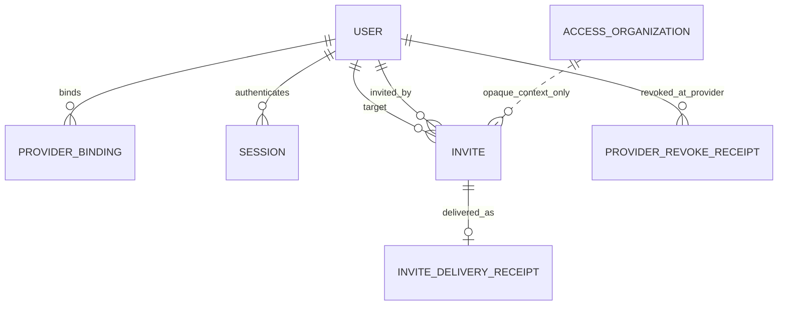

# Identity 领域模型与数据设计

状态：`approved`  
确认依据：项目负责人于 2026-08-25 接受 Identity 模块全部表、字段、必填性、现状与用途  
设计日期：2026-08-25  
业务基线：`BR-BASELINE-20260825-v31`

返回[领域模型与数据设计索引](README.md)。

业务依据：`BR-002`、`BR-010`、`BR-011`、`BR-012`、`BR-013`。  
模块依据：[Identity 模块契约](../10-module-contracts/10-identity.zh-CN.md)。  
现状依据：[Identity 与 Access 现状分析](../../current-state-analysis/10-identity-access.zh-CN.md)。  
代码参考：`modules/identity/**`、migration `001`、`009`、`010`、`017`、`018`、`028`。

## 1. 设计结论

Identity 目标模型保留五类对象：

| 对象 | 类型 | 负责的事实 |
| --- | --- | --- |
| `User` | 聚合根 | 内部账号、权威 normalized email、账号状态和全局 Session 失效版本 |
| `ProviderBinding` | User 子实体 | User 与受控认证 provider subject 的不可混淆绑定 |
| `Session` | 聚合根 | 一个内部 User 当前是否持有有效服务端会话 |
| `Invite` | 聚合根 | 一次面向内部 User、带组织上下文的限时激活凭证 |
| `IdentityDeliveryReceipt` | 追加式技术记录 | 邀请投递或认证 provider 撤销 effect 的最终结果 |

Identity 不保存 OrganizationMembership、RoleBinding、EmployeeProfile、employment type、Case 权限或单一当前角色。

## 2. 领域关系



关系说明：

- 一个 User 可以有多个历史 Session；并发 active 数量由后续安全策略限制。
- 一个 User 对每种受控 provider 最多一个 ProviderBinding。
- 一个 User 可以有多个历史 Invite，但同一 organization 同时最多一个 `created` Invite。
- Invite 保存 organization opaque ID 作为激活上下文，但 Identity 不读取 Access 的角色或 Membership。
- `ACCESS_ORGANIZATION` 是外部 owner 的概念引用，不是 Identity 实体。

## 3. 聚合边界

| 聚合 | 内部对象 | 一致性边界 |
| --- | --- | --- |
| User | User、ProviderBinding | email 唯一；provider subject 唯一；User 失效版本单调增加 |
| Session | Session | secret 唯一；只绑定 User；失效后不能重新 active |
| Invite | Invite、成功投递回执 | 凭证一次性；状态终态不可逆；投递成功最多一条 |
| Provider revoke effect | Provider revoke receipt | 每个 outbox/effect key 只记录一个最终结果 |

Access 发起邀请和禁用账号，但不能直接写这些聚合；它只能调用 Identity 的 server-only command。

## 4. User 生命周期

```text
invited -> active -> disabled
```

- `invited`：内部账号 identity 已预留，但尚未完成激活。
- `active`：可以建立 Identity Session；是否属于组织和拥有什么权限仍由 Access 判断。
- `disabled`：终态；下一个请求立即拒绝，全部旧 Session 失效。
- Release 1 不支持 `disabled -> active`、物理删除、账号合并或 email 自助修改。
- Invite 过期/撤销不会物理删除 invited User；后续重新邀请可复用同一 User。

## 5. User 目标逻辑表

表：`identity_users`

| 字段 | 必填 | 现状 | 用途 |
| --- | --- | --- | --- |
| `id` | 是 | 已有 | User UUID 主键，创建后不可变 |
| `normalized_email` | 是 | 已有 | 唯一登录邮箱；trim 后小写；直接 PII |
| `status` | 是 | 已有 | `invited`、`active`、`disabled` |
| `session_version` | 是 | 已有 | 一次性使该 User 的全部旧 Session 失效 |
| `record_version` | 是 | 已有 | 乐观锁，防止并发静默覆盖 |
| `created_by_user_id` | 否 | 已有 | 创建账号的 User；系统 bootstrap 可空 |
| `activated_at` | 条件必填 | 新增 | 进入 active 时写入，之后不可修改 |
| `disabled_at` | 条件必填 | 新增 | 进入 disabled 时写入 |
| `disabled_by_user_id` | 条件必填 | 新增 | 发起禁用的实际 User；系统动作可空并由 Audit 记录 |
| `disable_reason_code` | 条件必填 | 新增 | 受控禁用原因，不保存自由文字 PII |
| `created_at` | 是 | 已有 | UTC 创建时间 |
| `updated_at` | 是 | 已有 | UTC 最后更新时间，不早于 created_at |

关键约束：

- `normalized_email = lower(btrim(normalized_email))`，并使用唯一索引。
- normalized email 是 EmployeeProfile email 的唯一权威来源，Access 不重复保存。
- `invited` 时激活/禁用字段为空；`active` 时只有 `activated_at`；`disabled` 时激活和禁用证据完整。
- `active -> disabled` 与 `revokeAllSessions` 都递增 `session_version`，使旧 Session 的 captured version 失效。
- `normalized_email` 在 Release 1 创建后不可修改；未来如需更换邮箱，必须先确认单独的重新验证流程。

## 6. ProviderBinding

表：沿用 `identity_provider_identities`，领域名称为 `ProviderBinding`。

| 字段 | 必填 | 现状 | 用途 |
| --- | --- | --- | --- |
| `id` | 是 | 已有 | ProviderBinding UUID 主键 |
| `user_id` | 是 | 已有 | FK -> `identity_users.id` |
| `provider` | 是 | 已有 | 认证 provider code；production-aws 只允许 `cognito` |
| `provider_subject` | 是 | 已有 | provider 返回的 opaque subject，不代表业务权限 |
| `record_version` | 是 | 已有 | 兼容现有表；不可变绑定保持为 1 |
| `created_by_user_id` | 否 | 已有 | 创建绑定的 User；系统 provisioning 可空 |
| `created_at` | 是 | 已有 | 创建时间 |
| `updated_at` | 是 | 已有 | 兼容现有表；不可变绑定应等于 created_at |

约束：

- 唯一 `(provider, provider_subject)`，避免一个 provider identity 绑定多个 User。
- 唯一 `(user_id, provider)`，Release 1 每个 User/Provider 只有一个绑定。
- 绑定创建后不可修改或物理删除；User disabled 时保留历史绑定。
- 不保存 provider password、temporary password、access token、refresh token 或角色 claim。
- local-synthetic/database-test 身份数据只属于对应测试 adapter；不得以测试 binding 进入 production-aws。

## 7. Session 生命周期

```text
active -> revoked
active -> expired
```

- Session 创建后，`user_id`、secret identity、captured version、认证方式、创建时间和 absolute deadline 不可变。
- `revoked` 与 `expired` 都是终态，不能恢复 active。
- 每次解析先检查 User active、captured version、Session 状态及时间窗口。
- Identity 解析完成只返回 `userId`、`sessionId`、captured version 和 reauthentication facts。
- Membership、organization status、全部 roles 和 capability 由 Access 在下一步重新读取。

## 8. Session 目标逻辑表

表：`identity_sessions`

| 字段 | 必填 | 现状 | 用途 |
| --- | --- | --- | --- |
| `id` | 是 | 已有 | Session UUID 主键 |
| `user_id` | 是 | 已有 | FK -> `identity_users.id`；Session 唯一身份归属 |
| `secret_hash` | 是 | 已有 | 唯一不可逆 verifier；raw secret 永不落库 |
| `secret_version` | 是 | 新增 | verifier/pepper policy 版本；算法以后冻结 |
| `captured_session_version` | 是 | 已有 | 创建时复制 User.session_version |
| `authentication_method` | 是 | 改名 | 取代现有 `session_kind`，表达受控认证 adapter |
| `status` | 是 | 已有 | `active`、`revoked`、`expired` |
| `provider_credential_ciphertext` | 条件必填 | 改名 | 取代 `provider_token_ciphertext`；保存确有需要的加密 provider credential |
| `provider_credential_key_version` | 条件必填 | 改名 | 取代 `provider_token_key_version`；与 ciphertext 同时存在 |
| `last_seen_at` | 是 | 已有 | 最近一次成功解析时间 |
| `idle_expires_at` | 是 | 已有 | idle deadline；内部 Session 固定 8 小时 |
| `absolute_expires_at` | 是 | 已有 | 不可延长的 absolute deadline；内部 Session 固定 24 小时 |
| `reauthenticated_at` | 否 | 已有 | 最近一次敏感操作重认证时间 |
| `revoked_at` | 条件必填 | 已有 | revoked 时必填 |
| `revoked_by_user_id` | 否 | 已有 | 用户主动退出或安全操作的实际 User |
| `revoke_reason_code` | 条件必填 | 改名 | 取代 `revoke_reason`；受控撤销原因 |
| `record_version` | 是 | 已有 | 乐观锁，每次更新 +1 |
| `created_at` | 是 | 已有 | UTC 创建时间 |
| `updated_at` | 是 | 已有 | UTC 最后更新时间 |
| `organization_id` | 目标停用 | 已有旧字段 | 仅保留历史值；新 Session 不再依赖 |
| `membership_id` | 目标停用 | 已有旧字段 | 仅保留历史值；Membership 由 Access 请求时解析 |
| `session_slot` | 保留并纠正 | 已有旧字段 | 每 User 最多 3 个 active Session 的并发槽位；不得被客户端选择 |

Identity Session 从未直接保存 `role_binding_id` 或 `role`，但当前 repository 会 JOIN Access 表并返回单一 role；目标查询必须删除这项依赖。现有旧列先保留历史数据并停止新逻辑依赖，是否物理移除在 corrective migration 评审时单独决定。

Release 1 采用最多 3 个 active Session、8 小时 idle、24 小时 absolute 和 5 分钟敏感操作重认证；以[非功能基线第 4 节](../60-nfr-delivery/10-nfr-baseline.zh-CN.md)为准。旧 Portal 的 15 分钟/8 小时不能误用于内部 Session。

## 9. Session 数据库约束与索引方向

- 唯一 `secret_hash`；普通查询不能按 raw secret 或 User email 搜索 Session。
- 索引 `(user_id, status)` 支持禁用账号/全局撤销；对 active expiry 建受控索引支持清理。
- active Session 必须引用 active User，且 `captured_session_version = User.session_version`；由 Identity transaction/trigger 保证。
- `idle_expires_at <= absolute_expires_at`，`last_seen_at <= idle_expires_at`。
- revoked 状态必须有 `revoked_at` 和 reason code；非 revoked 状态不得伪造撤销证据。
- provider ciphertext 和 key version 必须同时有值或同时为空；Session 终态不继续保存可用 provider credential。
- 最大 3 个 active Session 必须在同一 User 的并发事务中原子执行；slot 只能由服务端分配。

## 10. Invite 生命周期

```text
created -> redeemed
created -> expired
created -> revoked
```

- Invite 只用于内部账号激活，一次性、限时、可撤销。
- Invite 保存 organization context，但不保存 requested role、employment type 或 EmployeeProfile。
- Invite credential 只保存不可逆 verifier；raw credential 只交给受控 provider/投递 channel。
- terminal Invite 不能重新 created；需要再次邀请时建立新的 Invite ID 和 credential。
- Invite 固定签发后 72 小时失效；数据层同时要求 `expires_at > created_at`。

## 11. Invite 目标逻辑表

表：`identity_invites`

| 字段 | 必填 | 现状 | 用途 |
| --- | --- | --- | --- |
| `id` | 是 | 已有 | Invite UUID 主键 |
| `organization_id` | 是 | 已有 | Access 已校验的组织上下文；不代表角色 |
| `target_user_id` | 是 | 已有 | FK -> `identity_users.id` |
| `invited_by_user_id` | 是 | 已有 | 发起邀请的实际内部 User |
| `secret_hash` | 是 | 已有 | 唯一不可逆激活凭证 verifier；raw secret 不落库 |
| `credential_version` | 是 | 新增 | 激活凭证/pepper policy 版本 |
| `status` | 是 | 已有 | `created`、`redeemed`、`expired`、`revoked` |
| `expires_at` | 是 | 已有 | 到期时间；必须晚于 created_at |
| `redeemed_at` | 条件必填 | 改名 | 取代 `consumed_at`；redeemed 时必填 |
| `expired_at` | 条件必填 | 新增 | expired 时必填 |
| `revoked_at` | 条件必填 | 已有 | revoked 时必填 |
| `revoked_by_user_id` | 条件必填 | 新增 | revoked 时的实际内部 User |
| `revoke_reason_code` | 条件必填 | 改名 | 取代 `revoke_reason`；受控撤销原因 |
| `record_version` | 是 | 已有 | 乐观锁，每次状态变化 +1 |
| `created_at` | 是 | 已有 | UTC 创建时间 |
| `updated_at` | 是 | 已有 | UTC 最后更新时间 |
| `requested_role` | 目标停用 | 已有旧字段 | 保留历史值；新邀请的角色意图归 Access |

约束与索引：

- 唯一 active candidate：`(organization_id, target_user_id) WHERE status = 'created'`。
- 按 `(status, expires_at)` 查找到期待过期记录。
- 每种 terminal status 只能出现对应 terminal timestamp，其他 terminal 字段为空。
- `requested_role` 不属于目标字段；角色包由 Access 的 onboarding 数据和命令管理。
- `organization_id` 是 Access 已校验后传入的跨模块 opaque reference；目标不建立 `identity_invites -> access_organizations` 物理 FK，避免 Identity 反向依赖 Access。
- 为供 Identity 自己的 tenant receipt 校验，Invite 提供唯一 `(id, organization_id)` 复合键。

## 12. IdentityDeliveryReceipt

Identity 使用两个窄技术表，不建立通用业务消息实体：

### `identity_invite_delivery_receipts`

| 字段 | 必填 | 现状 | 用途 |
| --- | --- | --- | --- |
| `id` | 是 | 已有 | 投递回执 UUID 主键 |
| `organization_id` | 是 | 已有 | 与 Invite 相同的组织上下文 |
| `invite_id` | 是 | 已有 | Identity 内部复合 FK；每个 Invite 最多一条成功回执 |
| `channel_policy_id` | 是 | 已有 | 受控内部账号投递 policy code |
| `receipt_reference` | 是 | 已有 | provider 返回的非 PII opaque reference |
| `delivered_at` | 是 | 已有 | provider 确认成功投递时间 |
| `created_at` | 是 | 已有 | UTC 回执写入时间 |

- 只记录成功投递；失败尝试由 Outbox、Audit 和 OperationalAlert 记录。
- `(invite_id, organization_id)` 使用 Identity 内部复合 FK 指向 Invite，阻止回执组织与 Invite 不一致。
- 不保存 email、邮件正文、provider raw response 或激活 secret。

### `identity_cognito_revoke_receipts`

Release 1 production provider 为 Cognito，可沿用现有 provider-specific receipt：

| 字段 | 必填 | 现状 | 用途 |
| --- | --- | --- | --- |
| `id` | 是 | 已有 | Provider 撤销回执 UUID 主键 |
| `organization_id` | 是 | 已有 | 原身份撤销 effect 的组织上下文 |
| `outbox_id` | 是 | 已有 | 与 organization_id 组成 FK -> Audit Outbox |
| `user_id` | 是 | 已有 | FK -> `identity_users.id` |
| `effect_idempotency_key` | 是 | 已有 | organization 内唯一 effect key |
| `outcome` | 是 | 已有 | `delivered` 或 terminal `failed` |
| `attempt_count` | 是 | 已有 | 与 Outbox terminal attempt 一致 |
| `failure_code` | 条件必填 | 已有 | failed 时必填；delivered 时为空 |
| `created_at` | 是 | 已有 | 追加式回执写入时间 |

- 每个 effect key 唯一，记录追加后不可 update/delete。
- 不保存 provider token、请求/响应正文或客户资料。

若未来增加第二个 production provider，再评审是否抽象为通用 ProviderRevocationReceipt；Release 1 不提前增加实体。

## 13. 数据分类

| 分类 | 字段/对象 | 处理 |
| --- | --- | --- |
| 直接 PII | `normalized_email` | 只在 User 权威保存；禁止日志、Audit payload 和普通列表泄露 |
| secret/verifier | Session/Invite hash、provider ciphertext、test credential | server-only；不进入 DTO、日志、错误或 outbox |
| 受限 identity metadata | provider subject、delivery receipt reference | 只供 Identity adapter/审计关联 |
| 普通 opaque metadata | UUID、状态、版本、时间、reason code | 按最小查询契约返回 |

Identity 不保存 display name、avatar、employment type、Guardian/Student 联系信息或 Portal secret。

## 14. 数据访问与隔离

- `identity_users`、ProviderBinding 和 Session 是全局内部 identity 数据，不复制 organization_id 来伪造租户归属。
- 它们只能通过 Identity-owned server repository/受控函数访问；业务模块不能直接 SELECT email、Session 或 provider binding。
- Access 通过 `getUserStatus` / `getUserEmailProjection` 读取最小投影，再解析 Membership 和 roles。
- Invite 和 delivery receipt 含 organization context，按 organization 做 RLS/transaction scope；该 context 不能反向成为 Identity 的业务授权判断。
- 其他模块可以保存 `user_id` 作为实际 actor/assignee 的稳定引用，但仍由各 owner + Access 检查其当前资格。
- Cognito claim、custom organization attribute 或 provider subject 都不是业务授权来源。

数据库 role、SECURITY DEFINER 函数、RLS policy 和 provider secret 的精确权限矩阵在权限与安全设计阶段冻结。

## 15. 原子性与历史

- Identity 状态写入与 Shared IdempotencyRecord、必需 AuditEvent、必要 OutboxMessage 在同一 PostgreSQL 事务提交。
- User 激活与 Invite redeemed 必须保持一致；不能出现 Invite 已 redeemed 但 User 仍 invited 的已提交状态。
- User disable/session_version 增加与本地 Session 立即失效同事务；Cognito 撤销通过 outbox + provider receipt 完成。
- Session 解析每次读取当前 User status/version，不能只信 Cookie 或缓存。
- User、ProviderBinding、Invite、Session metadata 和 delivery receipt 在 Release 1 不物理删除；Session/Invite 终态后立即使 verifier 和可用 provider credential 失效或清空。
- Audit 保存谁做了什么；Identity 表保存当前状态和必要 terminal receipt，不复制完整 AuditEvent。

## 16. 测试专用数据

`identity_database_test_credentials` 不是 Release 1 production 领域表：

| 字段 | 必填 | 现状 | 用途 |
| --- | --- | --- | --- |
| `user_id` | 是 | 已有，仅测试 | PK/FK -> User |
| `verifier_version` | 是 | 已有，仅测试 | password verifier 算法版本 |
| `password_salt` | 是 | 已有，仅测试 | 测试密码 salt；server-only |
| `password_verifier` | 是 | 已有，仅测试 | 测试密码 verifier；server-only |
| `status` | 是 | 已有，仅测试 | `active` 或 `revoked` |
| `failed_attempt_count` | 是 | 已有，仅测试 | 当前失败次数 |
| `failure_window_started_at` | 条件必填 | 已有，仅测试 | 失败计数窗口开始时间 |
| `locked_until` | 否 | 已有，仅测试 | 临时锁定截止时间 |
| `credential_version` | 是 | 已有，仅测试 | 防止并发覆盖/旧 verifier 使用 |
| `created_at` | 是 | 已有，仅测试 | 创建时间 |
| `updated_at` | 是 | 已有，仅测试 | 最后更新时间 |

- 只服务隔离 `database-test` adapter，不进入 production-aws runtime、备份或业务查询。
- password verifier、失败次数和锁定时间不得由 `tianxing_app` 或普通 API 读取。
- local-synthetic principal 只属于确定性本地数据，不允许进入生产构建或正式 migration seed。
- 测试 adapter 必须返回与 production 相同的 IdentityPrincipal 形状：不含 role、Membership 或 organization。

测试数据库是否保留独立表、schema 或基线扩展，在环境/非功能设计中决定；它不能改变 production 目标模型。

## 17. 当前表映射

| 当前结构 | 目标处理 |
| --- | --- |
| `identity_users` | 保留；补 lifecycle receipt/约束；normalized email 继续唯一权威 |
| `identity_provider_identities` | 保留为 ProviderBinding；强化不可修改/不可删除边界 |
| `identity_sessions` | 保留表；新逻辑停止依赖 organization/membership/session slot，改为纯 User Session |
| `identity_invites` | 保留表；停止新写/读取 `requested_role`，补 credential version 和完整 terminal receipt |
| `identity_invite_delivery_receipts` | 保留；继续追加式单次成功回执 |
| `identity_cognito_revoke_receipts` | 保留；作为 provider-specific 追加式 effect receipt |
| `identity_database_test_credentials` | 标记 test-only，不属于 production 领域模型 |

## 18. Corrective migration 输入

后续 migration 设计至少需要处理：

1. 为 User 增加 activation/disable receipt 字段及一致性约束。
2. 让 ProviderBinding 的 identity 字段不可修改，并禁止物理删除。
3. 将 Session 新写入从 organization/membership/role 解耦；保留历史值，不重写旧 migration。
4. 移除 Session repository/SQL function 对 Access 表和单一 RoleBinding 的依赖。
5. 停止 Invite `requested_role` 新写入，并由 Access 单独保存 onboarding 角色意图。
6. 移除 Invite 对 `access_organizations` 的反向物理 FK，保留并校验 opaque organization context。
7. 为 Invite 增加 credential version、expired/revoked receipt 和状态一致性约束。
8. 将 local/database-test credential 与 production 权限和 runtime 明确隔离。
9. 修正 Identity public/domain type，使 IdentityPrincipal 不再 import `OrganizationRole`。

精确 DDL、backfill、兼容读写顺序、回滚和验证命令要等本阶段所有模块确认后再拆开发票；本阶段不执行 migration。

## 19. 暂不冻结

以下内容属于后续环节：

- Session/Invite 精确 TTL、并发 Session 上限和敏感操作重认证时长。
- Cookie、hash/pepper、cipher/KMS、Cognito token 和密钥轮换细节。
- 登录、邀请、Provider provisioning、失败补偿和账号禁用的完整状态机顺序。
- API payload、页面字段、登录错误文案和交互。
- 技术记录保留周期、Session 清理批次和生产数据库角色权限矩阵。

## 20. 设计决策

| ID | 决策 |
| --- | --- |
| `SD-DATA-ID-001` | Identity 使用 User、ProviderBinding、Session、Invite 和窄技术 receipt，不增加通用身份实体 |
| `SD-DATA-ID-002` | User normalized email 全局唯一且只保存一份；EmployeeProfile 通过投影读取 |
| `SD-DATA-ID-003` | Session 只绑定 User，不保存 organization、Membership、RoleBinding 或 role |
| `SD-DATA-ID-004` | Invite 保存 organization context，但不保存 requested role 或员工资料 |
| `SD-DATA-ID-005` | User/Invite/Session 使用不可逆终态并保留必要 lifecycle receipt |
| `SD-DATA-ID-006` | database-test credential 和 local synthetic principal 不属于 production 领域数据 |

## 21. 本模块验收标准

项目负责人需要确认：

1. Identity 目标对象为 User、ProviderBinding、Session、Invite 和必要技术回执。
2. Session 只绑定 User，不保存 organization、Membership 或任何业务角色。
3. Invite 保存组织上下文，但不保存 requested role；角色 onboarding 归 Access。
4. normalized email 只在 User 保存，ProviderBinding 不包含角色或员工资料。
5. User、Invite、Session 终态不可恢复，Identity 业务历史不物理删除。
6. 内部 Session 固定最多 3 个、8 小时 idle、24 小时 absolute；Portal 另为 15 分钟 idle、8 小时 absolute。
7. database-test/local-synthetic 数据不能进入 production-aws 领域模型。

确认后进入 Access 领域模型与数据设计。
