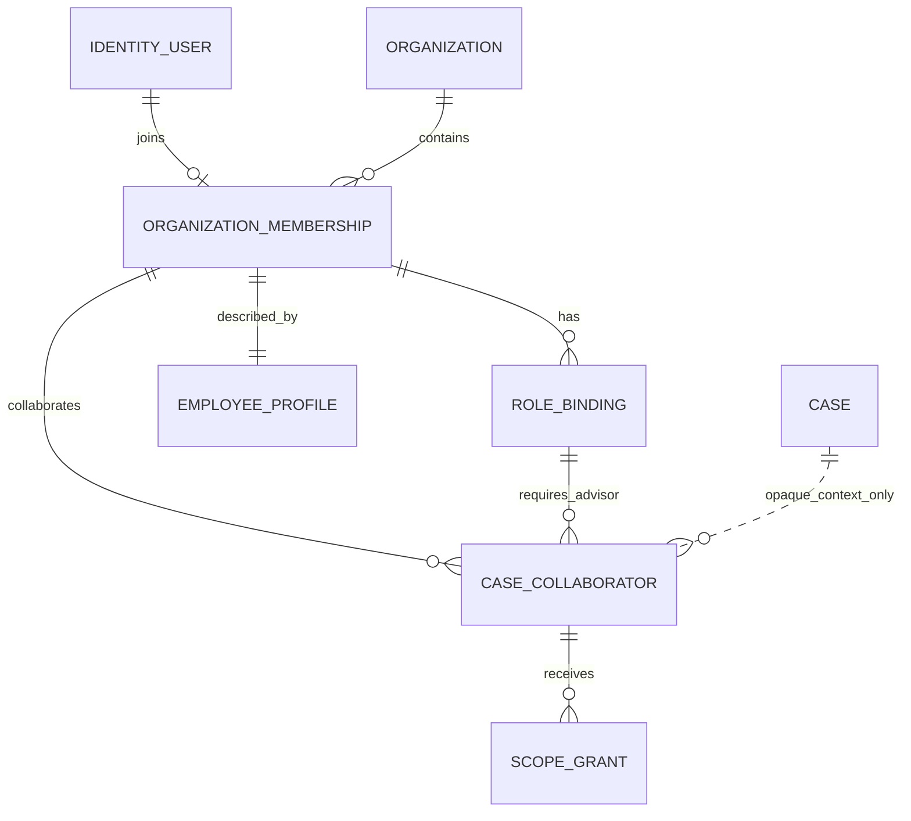

# Access 领域模型与数据设计

状态：`approved`  
确认依据：项目负责人于 2026-08-25 查看完整字段设计、确认已落地本地文档并指示继续  
设计日期：2026-08-25  
业务基线：`BR-BASELINE-20260825-v31`

返回[领域模型与数据设计索引](README.md)。

业务依据：`BR-010`、`BR-011`、`BR-012`、`BR-013`。  
模块依据：[Access 模块契约](../10-module-contracts/20-access.zh-CN.md)。  
现状依据：[Identity 与 Access 现状分析](../../current-state-analysis/10-identity-access.zh-CN.md)。  
代码参考：`modules/access/**`、migration `001`、`028` 及依赖 Access 表的后续 migration。

## 1. 设计结论

Access Release 1 使用六类持久化对象：

| 对象 | 类型 | 负责的事实 |
| --- | --- | --- |
| `Organization` | 聚合根 | 公司工作区 identity、显示名称和启停状态 |
| `OrganizationMembership` | 聚合根 | 一个 Identity User 是否是当前公司成员 |
| `RoleBinding` | Membership 子实体 | Membership 获得或失去的基础业务角色 |
| `EmployeeProfile` | Membership 一对一子实体 | 员工显示名称、任职类型和头像引用 |
| `CaseCollaborator` | 聚合根 | Advisor 在一个 Case 中的限时协作关系 |
| `ScopeGrant` | Collaborator 子实体 | Collaborator 在指定 Scope 中获得的 Capability |

不为角色组合、Workspace Capability、Contractor 工作区、待邀请员工或 email 新建表：

- 兼容角色由有效 `RoleBinding` 集合表示。
- Workspace Capability 由受版本控制的角色策略计算，不保存可漂移副本。
- Contractor 的单任务权限由 Tasks 的当前 `TaskAssignment` 判断。
- 待激活员工使用 invited Membership、RoleBinding 和 EmployeeProfile 表达。
- email 的唯一权威来源是 `Identity.User.normalized_email`。

## 2. 领域关系



关系说明：

- Release 1 同时最多一个 active Organization。
- 一个 User 在该 Organization 中最多一个 Membership；Release 1 不支持停用后恢复。
- 一个 Membership 可以同时拥有多个兼容的 active RoleBinding。
- EmployeeProfile 与 Membership 一对一，不独立存在。
- CaseCollaborator 固定引用创建时的 Advisor RoleBinding；该 Binding 撤销后不会因日后重新分配 Advisor 而自动恢复。
- `case_id` 是 Cases 拥有的 opaque ID；Access 不读取 Cases 私有表，也不建立跨模块级联删除。

## 3. 核心生命周期

```text
Organization: active -> disabled

Membership: invited -> active -> disabled
                     \-> disabled

RoleBinding: active -> revoked

CaseCollaborator: active -> removed
                        \-> expired

ScopeGrant:
  普通 Scope: active -> revoked / expired
  敏感 Scope: pending_approval -> active -> revoked / expired
                               \-> revoked
```

- disabled、revoked、removed、expired 都是 Release 1 终态。
- 到期判断以 `now >= expires_at` 为准，不能等待后台任务更新状态后才拒绝访问。
- 任何角色、协作者或授权的重新分配都创建新行，不复活旧行。

## 4. Organization 目标逻辑表

表：`access_organizations`

| 字段 | 必填 | 现状 | 用途 |
| --- | --- | --- | --- |
| `id` | 是 | 已有 | Organization UUID 主键，创建后不可变 |
| `display_name` | 是 | 已有 | 公司工作区显示名称，不作为授权或唯一业务编号 |
| `status` | 是 | 已有 | `active` 或 `disabled`；Release 1 同时最多一个 active |
| `record_version` | 是 | 已有 | 乐观锁，防止并发静默覆盖 |
| `created_by_user_id` | 否 | 已有 | 创建 Organization 的 User；bootstrap 可空 |
| `disabled_at` | 条件必填 | 新增 | status 进入 disabled 时写入 |
| `disabled_by_user_id` | 条件必填 | 新增 | 执行停用的 User；系统动作可空并由 Audit 记录 |
| `disable_reason_code` | 条件必填 | 新增 | 受控停用原因，不保存自由文字 PII |
| `created_at` | 是 | 已有 | UTC 创建时间 |
| `updated_at` | 是 | 已有 | UTC 最后更新时间 |

关键约束：

- 只允许一个 active Organization；disabled Organization 不能恢复。
- status 为 disabled 时，三项停用回执保持一致。
- Organization inactive 时，全部 Membership、RoleBinding 和 Grant 即时失效，但历史行不物理删除。

## 5. OrganizationMembership 目标逻辑表

表：`access_organization_memberships`

| 字段 | 必填 | 现状 | 用途 |
| --- | --- | --- | --- |
| `id` | 是 | 已有 | Membership UUID 主键 |
| `organization_id` | 是 | 已有 | 所属 Organization；也是 RLS 租户边界 |
| `user_id` | 是 | 已有 | 对应 Identity User；一个 Organization 内唯一 |
| `status` | 是 | 已有 | `invited`、`active` 或 `disabled` |
| `record_version` | 是 | 已有 | 乐观锁和授权缓存失效版本输入 |
| `created_by_user_id` | 否 | 已有 | 创建 Membership 的实际 User；bootstrap 可空 |
| `activated_at` | 条件必填 | 新增 | invited 进入 active 时写入 |
| `disabled_at` | 条件必填 | 新增 | Membership 进入 disabled 时写入 |
| `disabled_by_user_id` | 条件必填 | 新增 | 执行停用的 User；系统动作可空并由 Audit 记录 |
| `disable_reason_code` | 条件必填 | 新增 | 受控停用原因 |
| `created_at` | 是 | 已有 | UTC 创建时间 |
| `updated_at` | 是 | 已有 | UTC 最后更新时间 |

关键约束：

- `organization_id + user_id` 唯一；Release 1 不物理删除或重建同一个成员身份。
- invited Membership 不获得工作区权限，即使预先存在 RoleBinding。
- active 必须有 EmployeeProfile；没有 active RoleBinding 时仍是成员，但不获得任何工作区能力。
- disabled 是终态；下一个服务端请求立即拒绝全部工作区访问。
- Membership 不保存 email、员工类型、角色数组或单一当前角色。

## 6. RoleBinding 目标逻辑表

表：`access_role_bindings`

| 字段 | 必填 | 现状 | 用途 |
| --- | --- | --- | --- |
| `id` | 是 | 已有 | RoleBinding UUID 主键；每次重新分配创建新 ID |
| `organization_id` | 是 | 已有 | 所属 Organization；必须与 Membership 一致 |
| `membership_id` | 是 | 已有 | 获得角色的 Membership |
| `user_id` | 是 | 已有 | Membership 对应 User；用于复合一致性和授权查询 |
| `role` | 是 | 已有，需纠正 | 新写入只允许 `founder`、`admin`、`advisor`、`contractor` |
| `status` | 是 | 已有 | `active` 或 `revoked` |
| `record_version` | 是 | 已有 | 乐观锁和授权版本输入 |
| `created_by_user_id` | 否 | 已有 | 分配角色的 User；bootstrap/系统 onboarding 可空 |
| `revoked_at` | 条件必填 | 新增 | status 进入 revoked 时写入 |
| `revoked_by_user_id` | 条件必填 | 新增 | 执行撤销的 User |
| `revoke_reason_code` | 条件必填 | 新增 | 受控撤销原因 |
| `created_at` | 是 | 已有 | 角色分配记录创建时间 |
| `updated_at` | 是 | 已有 | 最后更新时间 |

关键约束：

- 同一 Membership、同一 role 同时最多一个 active Binding。
- Founder、Admin、Advisor 可以任意兼容组合并自动合并能力。
- Contractor 必须是 Membership 唯一 active 基础角色。
- FULL_TIME 可分配 Founder、Advisor 或 Admin；PART_TIME 可分配 Contractor 或 Admin。
- Contractor 仍不能与 Admin 或任何其他角色同时存在。
- 撤销最后一个 active Founder 必须拒绝。
- 历史 `data_reviewer` 行先撤销并仅作历史保留；新写入和授权解析不再接受该角色。

## 7. EmployeeProfile 目标逻辑表

表：`access_employee_profiles`

| 字段 | 必填 | 现状 | 用途 |
| --- | --- | --- | --- |
| `membership_id` | 是 | 新增 | 主键及 Membership 外键；确保严格一对一，不另增 Profile ID |
| `organization_id` | 是 | 新增 | 所属 Organization；用于 RLS，必须与 Membership 一致 |
| `display_name` | 是 | 新增 | 员工列表、负责人和审批人展示名称 |
| `employment_type` | 是 | 新增 | `FULL_TIME` 或 `PART_TIME`；只限制角色资格，不授予权限 |
| `avatar_key` | 否 | 新增 | 受控头像对象引用，不保存文件正文或公开 URL |
| `record_version` | 是 | 新增 | 乐观锁；修改资料时必须携带 expected version |
| `created_at` | 是 | 新增 | UTC 创建时间 |
| `updated_at` | 是 | 新增 | UTC 最后更新时间 |

关键约束：

- EmployeeProfile 不能脱离 Membership 独立存在。
- `display_name` trim 后必须非空；它不是登录名或唯一值。
- 修改 employment_type 前必须检查全部 active RoleBinding；不兼容时拒绝，不能静默撤销角色。
- 不保存 email；员工接口通过 Membership.user_id 读取 Identity 的 normalized email 投影。
- 头像删除只清空 `avatar_key`；头像对象安全、扫描和清理策略留到文件/安全设计。

## 8. CaseCollaborator 目标逻辑表

表：`access_case_collaborators`

| 字段 | 必填 | 现状 | 用途 |
| --- | --- | --- | --- |
| `id` | 是 | 已有 | Collaborator UUID 主键 |
| `organization_id` | 是 | 已有 | Case 所属 Organization，也是 RLS 边界 |
| `case_id` | 是 | 已有 | Cases 拥有的 opaque Case ID |
| `user_id` | 是 | 已有 | 被授权协作的 Advisor User |
| `membership_id` | 是 | 已有 | 被授权者当时的 Membership |
| `advisor_role_binding_id` | 是 | 已有 | 被授权者当时的确切 Advisor RoleBinding |
| `required_role` | 是 | 已有 | 数据库复合外键用常量，固定为 `advisor` |
| `status` | 是 | 已有 | `active`、`removed` 或 `expired` |
| `starts_at` | 是 | 已有 | 协作关系生效时间 |
| `expires_at` | 是 | 已有 | 协作关系截止时间，最长 7 天 |
| `granted_by_user_id` | 是 | 已有 | 通过 Cases 用例发起授权的实际 User |
| `removed_at` | 条件必填 | 已有 | status 进入 removed 时写入 |
| `removed_by_user_id` | 条件必填 | 已有 | 执行提前移除的 User |
| `removal_reason_code` | 条件必填 | 改名 | 原 `removal_reason`；改为受控原因代码 |
| `expired_at` | 条件必填 | 新增 | 状态被归档为 expired 时记录；授权仍按 expires_at 即时失效 |
| `record_version` | 是 | 已有 | 乐观锁 |
| `created_at` | 是 | 已有 | UTC 创建时间 |
| `updated_at` | 是 | 已有 | UTC 最后更新时间 |

关键约束：

- 同一 Case、同一 User 同时最多一个 active Collaborator。
- 只有有效 Membership 的 active Advisor RoleBinding 可以成为 Collaborator。
- Advisor RoleBinding、Membership、Organization 或 Case 任一失效，协作访问立即失败。
- 后续重新获得 Advisor 角色不能复活引用旧 RoleBinding 的 Collaborator。
- Access 只保存 `case_id`，Cases 在每次命令和读取时验证 Case 当前事实。

## 9. ScopeGrant 目标逻辑表

表：`access_scope_grants`

| 字段 | 必填 | 现状 | 用途 |
| --- | --- | --- | --- |
| `id` | 是 | 已有 | ScopeGrant UUID 主键 |
| `organization_id` | 是 | 已有 | 所属 Organization，必须与 Collaborator 一致 |
| `case_id` | 是 | 已有 | 授权适用的 opaque Case ID |
| `collaborator_id` | 是 | 已有 | 获得授权的 CaseCollaborator |
| `scope` | 是 | 已有 | 七种固定 Case 数据范围之一 |
| `capability` | 是 | 已有 | `view`、`comment` 或 `edit` |
| `status` | 是 | 已有 | `pending_approval`、`active`、`revoked` 或 `expired` |
| `starts_at` | 是 | 已有 | 授权生效时间 |
| `expires_at` | 是 | 已有 | 授权截止时间，不得晚于 Collaborator 截止时间 |
| `requested_by_user_id` | 是 | 已有 | 发起授权申请的实际 User |
| `request_reason` | 条件必填 | 已有 | 敏感 Scope 必填的业务理由；普通 Scope 可空 |
| `approved_by_user_id` | 条件必填 | 已有 | 敏感 Scope 激活时的 Founder User |
| `approved_at` | 条件必填 | 已有 | Founder 批准敏感 Scope 的时间 |
| `revoked_by_user_id` | 条件必填 | 已有 | 执行撤销的 User |
| `revoked_at` | 条件必填 | 已有 | status 进入 revoked 时写入 |
| `revoke_reason_code` | 条件必填 | 改名 | 原 `revoke_reason`；受控撤销或拒绝原因 |
| `expired_at` | 条件必填 | 新增 | 状态被归档为 expired 时记录；授权仍按 expires_at 即时失效 |
| `record_version` | 是 | 已有 | 乐观锁；审批和撤销必须检查 expected version |
| `created_at` | 是 | 已有 | UTC 创建时间 |
| `updated_at` | 是 | 已有 | UTC 最后更新时间 |

Scope 固定为：

- `case_summary`
- `education_profile`
- `school_targets`
- `task_workspace`
- `communications`
- `identity_contact`
- `internal_notes`

关键约束：

- `edit` 包含 `comment + view`；`comment` 包含 `view`。
- export 永远拒绝，不进入 capability 枚举。
- 同一 Collaborator、同一 Scope 同时最多一条 pending/active Grant；升级能力时终止旧 Grant 并新建。
- 普通 Scope 最长 7 天，可以直接 active。
- `identity_contact` 和 `internal_notes` 必须先 pending，由 active Founder 批准，且禁止申请人自批。
- Grant 必须位于 Collaborator 的 starts/expires 时间窗口内。
- Collaborator、Membership、Advisor RoleBinding、Organization 或 Case 任一失效，Grant 即时失效。

## 10. 不建立数据表的授权事实

| 概念 | 表达方式 | 不建表原因 |
| --- | --- | --- |
| 角色组合 | 一个 Membership 的 active RoleBinding 集合 | 不需要组合实体或登录角色切换 |
| Workspace Capability | 版本化代码策略对 roles[] 求并集 | Release 1 没有自定义角色或客户可配置权限 |
| Capability 包含关系 | `edit > comment > view` 的纯规则 | 固定规则不能保存成可漂移配置 |
| Contractor 工作区 | Tasks 的 current TaskAssignment + 脱敏 DTO | Access 不复制 Task 或 Assignment |
| email | Identity normalized email 投影 | 防止两处 email 不一致 |
| pending employee | invited Membership + Profile + RoleBinding | 不增加重复 onboarding 实体 |

如果未来客户需要自定义角色和权限模板，应作为新的业务需求重新设计，不能直接把 Release 1 的固定策略改成万能 RBAC 配置表。

## 11. 授权解析与版本

每次服务端请求按以下顺序重新解析：

```text
有效 Identity User/Session
  -> active Organization
  -> active Membership
  -> 全部 active 且兼容的 RoleBinding
  -> Workspace Capability 并集
  -> 业务模块当前资源关系
  -> ScopeGrant 或 Tasks.TaskAssignment
  -> 资源 owner 的最终规则
```

- Access 返回 `roles[]`，不返回单一当前角色。
- 授权版本由 Membership.record_version 与全部相关 RoleBinding/Grant 版本组成或派生；精确 token/cache 形式留到权限与安全设计。
- 客户端传入的 role、membership ID、capability 或缓存结果都不是授权依据。

## 12. Organization、RLS 与外键

- 六张表全部显式保存或可直接确定 Organization；除 Organization 自身外均启用 RLS/FORCE RLS。
- EmployeeProfile、RoleBinding 和 Collaborator 使用复合约束保证 organization/membership/user 一致。
- Identity User 是稳定 identity，可使用物理外键；不能级联删除。
- `case_id` 不建立指向 Cases 私有表的级联外键；Cases 通过公开 command/query 验证。
- Access 表禁止业务 DELETE；终止关系只更新受控状态并保留历史。

## 13. 数据分类

| 数据 | 分类 | 规则 |
| --- | --- | --- |
| EmployeeProfile.display_name | 直接 PII | 仅内部有权员工可见，日志和事件不得复制 |
| EmployeeProfile.avatar_key | 受控文件引用 | server-only；不能作为公开 URL |
| Identity email 投影 | 直接 PII | 查询时读取，不落入 Access 表、Audit metadata 或事件 |
| role、employment_type、Membership status | 内部人事/授权数据 | 最小权限读取，变更必须审计 |
| case_id、user_id、membership_id | opaque identifier | 不代表已授权，不进入公开错误响应 |
| request_reason | 可能含敏感内部信息 | 限制长度和读取范围，事件只发 reason code/ID |

## 14. 当前表映射

| 当前结构 | 目标处理 |
| --- | --- |
| `access_organizations` | 保留；增加完整 disabled lifecycle receipt |
| `access_organization_memberships` | 保留；增加 activation/disable receipt 和终态约束 |
| `access_role_bindings` | 保留；移除 Data Reviewer 活跃语义，增加 revoke receipt、资格与组合约束 |
| EmployeeProfile 缺失 | 新增 `access_employee_profiles`，与 Membership 一对一 |
| `access_case_collaborators` | 保留；原因改为受控 code，增加 expiry receipt 和时间窗口约束 |
| `access_scope_grants` | 保留；实现 capability 包含关系，增加 expiry receipt 和同 Scope 唯一当前授权 |
| Subscription、Entitlement、SupportGrant registry ownership | 从 Release 1 Access 移除；不创建目标表 |
| Contractor 全局 tasks capability | 从 Access 角色策略移除；改由 Tasks 当前 Assignment 判断 |

## 15. Corrective migration 输入

后续 migration 设计至少需要处理：

1. 为 Organization 和 Membership 增加完整 activation/disable receipt 与终态约束。
2. 新增 EmployeeProfile 一对一表、RLS、PII 读取权限和任职类型约束。
3. 撤销历史 active Data Reviewer，停止新写入，并让授权解析只接受四种角色。
4. 为 RoleBinding 增加撤销回执、Contractor 互斥、任职类型资格和最后一个 Founder 保护。
5. 将 Session/授权查询从单 RoleBinding 改为全部兼容 active roles 的能力并集。
6. 将 Admin capability 收窄到账号、成员和日常系统配置。
7. 从 Contractor 的全局 workspace capability 移除 Tasks 读取/流转能力。
8. 修正 ScopeGrant capability 判断为 `edit > comment > view`。
9. 增加 Collaborator/Grant expiry receipt、受控 reason code 和 Grant 不超出 Collaborator 时间窗约束。
10. 将 module registry 的 Subscription、Entitlement、SupportGrant 所有权移出 Access。

精确 DDL、旧数据检查、backfill、兼容读写顺序、回滚和验证命令要等所有模块确认后再拆开发票；本阶段不执行 migration。

## 16. 暂不冻结

以下内容属于后续环节：

- 具体 Workspace Capability 名称和每个 API 的权限矩阵。
- 授权版本在 Session、cache 或 token 中的精确编码和失效方式。
- Founder/Admin 成员管理页面、邀请 payload 和错误文案。
- 头像上传、裁剪、扫描、替换和清理策略。
- 自动过期归档批次和历史授权保留周期。
- PostgreSQL 角色、函数权限和生产 RLS policy 的精确 DDL。

## 17. 设计决策

| ID | 决策 |
| --- | --- |
| `SD-DATA-ACC-001` | Access 使用 Organization、Membership、RoleBinding、EmployeeProfile、CaseCollaborator 和 ScopeGrant 六类持久化对象 |
| `SD-DATA-ACC-002` | 兼容角色由 RoleBinding 集合表达；Capability 用版本化固定策略计算，不建配置表 |
| `SD-DATA-ACC-003` | EmployeeProfile 使用 membership_id 作为主键，不保存 email 或另增 Profile ID |
| `SD-DATA-ACC-004` | Founder/Admin/Advisor 可组合；Contractor 与所有角色互斥；Data Reviewer 停止使用 |
| `SD-DATA-ACC-005` | Collaborator 引用确切 Advisor RoleBinding，角色重分配不会复活旧授权 |
| `SD-DATA-ACC-006` | ScopeGrant 每个 Scope 只保留一个当前最高 Capability，按 edit > comment > view 判断 |
| `SD-DATA-ACC-007` | Access 只保存 opaque case_id；Case 和 Task 的当前业务关系仍由 owning module 判断 |

## 18. 本模块验收标准

项目负责人需要确认：

1. Access 一共使用六张目标逻辑表，其中 EmployeeProfile 是唯一新增表。
2. EmployeeProfile 只保存显示名称、任职类型和头像引用，email 继续来自 Identity。
3. Workspace Capability、角色组合和 Contractor 工作区都不建表。
4. Founder、Admin、Advisor 可以组合；Contractor 互斥；Data Reviewer 不再使用。
5. Collaborator 和 ScopeGrant 最长 7 天，敏感 Scope 由 Founder 审批且禁止自批。
6. 全部 Access 业务数据只软终止或到期，不物理删除。

确认后进入 CRM 领域模型与数据设计。
