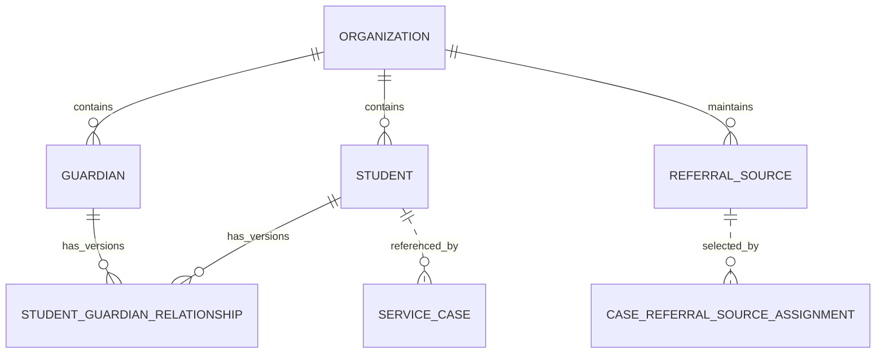

# CRM 领域模型与数据设计

状态：`approved`  
确认依据：项目负责人于 2026-08-25 确认保留 ReferralSource、与 Case 关联，并指示继续  
设计日期：2026-08-25  
业务基线：`BR-BASELINE-20260825-v32`

返回[领域模型与数据设计索引](README.md)。

业务依据：`BR-020` 至 `BR-029`。  
模块依据：[CRM 模块契约](../10-module-contracts/30-crm.zh-CN.md)。  
现状依据：[CRM 现状分析](../../current-state-analysis/20-crm.zh-CN.md)。  
代码参考：`modules/crm/**`、migration `002`、`030` 及相关后续 migration。

## 1. 设计结论

CRM Release 1 有四张目标业务表：

| 对象 | 目标表 | 负责的事实 |
| --- | --- | --- |
| `Student` | `crm_students` | 学生客户主档、当前软删除状态及当前删除申请 |
| `Guardian` | `crm_guardians` | Guardian 客户主档、当前软删除状态及当前删除申请 |
| `StudentGuardianRelationship` | `crm_student_guardian_relationships` | Student 与 Guardian 的版本化关系和主要联系人 |
| `ReferralSource` | `crm_referral_sources` | 公司维护的客户来源目录 |

当前数据库另有五张旧表，但已确认不属于目标业务模型：

| 旧表 | 目标处理 |
| --- | --- |
| `crm_duplicate_candidates` | 停止新读写；重复只做即时警告 |
| `crm_duplicate_merges` | 停止新读写；Release 1 不提供合并 |
| `crm_duplicate_alias_revisions` | 保留旧历史，不产生新版本 |
| `crm_duplicate_field_provenance_revisions` | 保留旧历史，不产生新版本 |
| `crm_duplicate_merge_corrections` | 停止新读写；Release 1 不提供撤销合并 |

因此本模块仍共审查九张现有或目标相关表：四张继续使用，五张目标停用。

## 2. 领域关系



- Student 与 Guardian 是独立客户 identity，都不等于 Identity User。
- 一个 Student 可关联多个 Guardian；一个 Guardian 可关联多个 Student。
- 主要联系人只是 Relationship 上的标志，不单独建表。
- Student 可拥有多个 ServiceCase，但 CRM 不保存 Case 或申请。
- CRM 保存 ReferralSource 目录；Case 当前来源及更换历史归 Cases。

## 3. 生命周期

Student 与 Guardian 使用相同状态机：

```text
active -> pending_delete -> active   （Founder 驳回）
                         \-> deleted （Founder 批准）
```

- `deleted` 是终态，不恢复、不 purge、不物理删除。
- `pending_delete` 仍出现在内部正常列表，并标记待审批。
- `deleted` 不通过 Release 1 页面、列表、搜索、详情或业务 API 返回。
- 驳回后清除当前 pending request 字段；申请与驳回历史由 AuditEvent 保留，不增加 DeletionRequest 表。

Relationship 使用时间版本：

```text
当前版本：starts_at 已生效且 ends_at 为空
历史版本：ends_at 已写入
```

关系类型、主要联系人或其他职责变化时，关闭旧版本并插入新版本，不覆盖旧业务事实。

## 4. Student 目标逻辑表

表：`crm_students`

| 字段 | 必填 | 现状 | 用途 |
| --- | --- | --- | --- |
| `id` | 是 | 已有 | Student UUID 主键，创建后不可变 |
| `organization_id` | 是 | 已有 | 所属 Organization，也是 RLS 边界 |
| `display_name` | 是 | 已有，需纠正 | 学生显示名称；deleted 后仍在数据库保留，不再清空 |
| `date_of_birth` | 否 | 已有 | 出生日期；不保存年龄 |
| `contact_email` | 否 | 已有 | 学生联系邮箱；不是唯一键 |
| `contact_phone` | 否 | 已有 | 学生联系电话；不是唯一键 |
| `gender` | 否 | 新增 | `male`、`female`、`other`、`not_disclosed`；null 表示未收集 |
| `status` | 是 | 已有，需纠正 | `active`、`pending_delete` 或 `deleted`；移除 `purged` |
| `deletion_requested_at` | 条件必填 | 已有 | status 为 pending_delete/deleted 时保存当前申请时间 |
| `deletion_requested_by_user_id` | 条件必填 | 已有 | 提交当前删除申请的 Advisor/Founder User |
| `deletion_request_reason_code` | 条件必填 | 改名 | 原 `deletion_reason`；当前申请的受控原因 |
| `deleted_at` | 条件必填 | 改名并纠正 | 取代旧 `purged_at`；Founder 批准并进入 deleted 的时间 |
| `deleted_by_user_id` | 条件必填 | 改名并纠正 | 取代 `purge_approved_by_user_id`；批准软删除的 Founder |
| `record_version` | 是 | 已有 | 乐观锁；资料修改和删除决定必须检查 expected version |
| `created_at` | 是 | 已有 | UTC 创建时间 |
| `updated_at` | 是 | 已有 | UTC 最后更新时间 |

目标停用的旧字段：

| 字段 | 必填 | 现状 | 用途 |
| --- | --- | --- | --- |
| `purge_approved_at` | 不再使用 | 已有旧字段 | 旧最终 purge 审批时间；仅保留历史，不再新写 |

关键约束：

- display_name trim 后必须非空，且 deleted 后仍永久保留。
- date_of_birth、email、phone、gender 都不是 identity key 或唯一条件。
- gender 不得推断；`other` 不能静默映射为 male/female。
- active 时删除流程字段为空；pending_delete 时申请字段齐全、deleted 字段为空；deleted 时申请与批准字段齐全。
- Student 存在未结案 Case 时，不允许申请或批准删除。
- 首次创建 Student 必须在同一事务中建立唯一当前主要联系人。

## 5. Guardian 目标逻辑表

表：`crm_guardians`

| 字段 | 必填 | 现状 | 用途 |
| --- | --- | --- | --- |
| `id` | 是 | 已有 | Guardian UUID 主键，创建后不可变 |
| `organization_id` | 是 | 已有 | 所属 Organization，也是 RLS 边界 |
| `display_name` | 是 | 已有，需纠正 | Guardian 显示名称；deleted 后仍在数据库保留 |
| `email` | 条件必填 | 已有 | 联系邮箱；与 phone 至少填写一个 |
| `phone` | 条件必填 | 已有 | 联系电话；与 email 至少填写一个 |
| `gender` | 否 | 新增 | `male`、`female`、`other`、`not_disclosed`；null 表示未收集 |
| `date_of_birth` | 否 | 新增 | 出生日期；年龄按当前日期计算，不保存 age |
| `status` | 是 | 已有，需纠正 | `active`、`pending_delete` 或 `deleted`；移除 `purged` |
| `deletion_requested_at` | 条件必填 | 已有 | status 为 pending_delete/deleted 时保存当前申请时间 |
| `deletion_requested_by_user_id` | 条件必填 | 已有 | 提交当前删除申请的 Advisor/Founder User |
| `deletion_request_reason_code` | 条件必填 | 改名 | 原 `deletion_reason`；当前申请的受控原因 |
| `deleted_at` | 条件必填 | 改名并纠正 | 取代旧 `purged_at`；Founder 批准并进入 deleted 的时间 |
| `deleted_by_user_id` | 条件必填 | 改名并纠正 | 取代 `purge_approved_by_user_id`；批准软删除的 Founder |
| `record_version` | 是 | 已有 | 乐观锁；资料修改和删除决定必须检查 expected version |
| `created_at` | 是 | 已有 | UTC 创建时间 |
| `updated_at` | 是 | 已有 | UTC 最后更新时间 |

目标停用的旧字段：

| 字段 | 必填 | 现状 | 用途 |
| --- | --- | --- | --- |
| `purge_approved_at` | 不再使用 | 已有旧字段 | 旧最终 purge 审批时间；仅保留历史，不再新写 |

关键约束：

- display_name 必填；email/phone 至少一个非空。
- gender 与 relationship_type 完全独立，不能根据称谓或性别推断关系。
- age 永远是派生值，不建立字段。
- Guardian 有任何当前有效 Student 关系时，不允许申请或批准删除。
- deleted Guardian 不能建立新关系，也不能通过业务查询返回。

## 6. StudentGuardianRelationship 目标逻辑表

表：`crm_student_guardian_relationships`

| 字段 | 必填 | 现状 | 用途 |
| --- | --- | --- | --- |
| `id` | 是 | 已有 | 关系版本 UUID；每个新版本使用新 ID |
| `organization_id` | 是 | 已有 | 所属 Organization，必须与 Student/Guardian 一致 |
| `student_id` | 是 | 已有 | 关联 Student |
| `guardian_id` | 是 | 已有 | 关联 Guardian |
| `relationship_type` | 是 | 已有，需纠正 | 使用 BR-022 的 27 个受控关系类型 |
| `relationship_description` | 条件必填 | 新增 | relationship_type 为 `other` 时必填简短说明 |
| `is_legal_guardian` | 是 | 已有 | 是否为当前法定监护人 |
| `is_primary_contact` | 是 | 已有 | 是否为 Student 当前唯一主要联系人 |
| `is_emergency_contact` | 是 | 已有 | 是否为紧急联系人 |
| `is_billing_contact` | 是 | 已有 | 是否为账单联系人 |
| `notification_consent` | 是 | 已有 | 是否同意接收允许范围内的通知 |
| `starts_at` | 是 | 已有 | 本关系版本生效时间 |
| `ends_at` | 否 | 已有 | 本关系版本结束时间；空表示当前版本 |
| `ended_by_user_id` | 条件必填 | 已有 | 关闭本关系版本的实际 User |
| `end_reason_code` | 条件必填 | 改名 | 原 `end_reason`；交接、修改或解除的受控原因 |
| `record_version` | 是 | 已有 | 关闭当前版本时的乐观锁 |
| `created_at` | 是 | 已有 | UTC 创建时间 |
| `updated_at` | 是 | 已有 | UTC 最后更新时间 |

关键约束：

- 同一 Student/Guardian 同时最多一个当前关系版本。
- 每个未 deleted Student 同一时间必须且只能有一个当前主要联系人。
- 五个职责标志互相独立，主要联系人不自动取得其他资格。
- 新增普通 Guardian 默认 `is_primary_contact=false`。
- 当前主要联系人不能直接解除；必须先完成原子交接。
- 交接时关闭相关旧版本并插入新版本；旧主要联系人继续保留非主要的当前关联版本。
- Relationship、Student 和 Guardian 禁止物理删除。

关系类型固定为：

```text
parent
father
mother
step_parent
stepfather
stepmother
adoptive_parent
adoptive_father
adoptive_mother
foster_parent
foster_father
foster_mother
grandparent
paternal_grandfather
paternal_grandmother
maternal_grandfather
maternal_grandmother
adult_sibling
adult_brother
adult_sister
uncle
aunt
court_appointed_guardian
institutional_guardian
other_relative
non_relative_guardian
other
```

## 7. 重复警告规则

重复判断是即时查询，不建立表：

| 字段 | 标准化后相同才警告 | 规则 |
| --- | --- | --- |
| display_name | 是 | trim + Unicode 规范化后精确比较；不使用模糊相似度 |
| email/contact_email | 是 | trim 后小写比较 |
| phone/contact_phone | 是 | 去除空格、括号和连接符后比较；不猜测国家区号 |
| date_of_birth | 否 | 相同也不触发警告 |
| gender | 否 | 相同也不触发警告 |

- 只比较双方都非空的值。
- 任意一项相同即可显示警告。
- 警告不自动关联、不自动合并、不自动创建关系。
- 可使用表达式索引支持查询，但标准化结果不成为新的业务字段或 identity key。

## 8. ReferralSource 目标逻辑表

表：`crm_referral_sources`

| 字段 | 必填 | 现状 | 用途 |
| --- | --- | --- | --- |
| `id` | 是 | 已有 | ReferralSource UUID 主键；Case 只用该 ID 关联 |
| `organization_id` | 是 | 已有 | 所属 Organization，也是 RLS 边界 |
| `display_name` | 是 | 已有 | 来源显示名称，例如具体学校、合作方、活动或广告渠道 |
| `source_type` | 是 | 已有，需纠正 | 使用 BR-028 的 11 个受控类型，取代旧 bank/insurance/other_partner |
| `description` | 条件必填 | 新增 | 来源补充说明；source_type 为 other 时必填 |
| `status` | 是 | 已有 | `active` 或 `inactive`；inactive 不能用于新 Case |
| `deactivated_at` | 条件必填 | 新增 | status 进入 inactive 的时间 |
| `deactivated_by_user_id` | 条件必填 | 新增 | 执行停用的实际 User |
| `deactivate_reason_code` | 条件必填 | 新增 | 受控停用原因 |
| `record_version` | 是 | 已有 | 乐观锁；修改或停用时检查 expected version |
| `created_at` | 是 | 已有 | UTC 创建时间 |
| `updated_at` | 是 | 已有 | UTC 最后更新时间 |

source_type 固定为：

```text
customer_referral
employee_referral
school_referral
partner_referral
website
social_media
paid_advertising
event
walk_in
other
unknown
```

关键约束：

- 同一来源可关联多个 Case；一个 Case 同时最多一个当前来源。
- CRM 不保存 case_id；Case 关联及更换历史由 Cases 的 CaseReferralSourceAssignment 保存。
- 只有 active 来源可建立新关联；inactive 后历史关联继续有效。
- 来源不物理删除；停用是终态。
- display_name、source_type 和 description 不是关联键，Case 始终引用不可变 UUID。

## 9. 旧 DuplicateCandidate 表

表：`crm_duplicate_candidates`，整表目标停用。

| 字段 | 必填 | 现状 | 用途 |
| --- | --- | --- | --- |
| `id` | 是 | 目标停用 | 旧重复候选 UUID |
| `organization_id` | 是 | 目标停用 | 旧所属 Organization |
| `entity_type` | 是 | 目标停用 | student 或 guardian |
| `left_record_id` | 是 | 目标停用 | 左侧客户记录 |
| `right_record_id` | 是 | 目标停用 | 右侧客户记录 |
| `left_display_label` | 是 | 目标停用 | 旧左侧 PII 显示快照 |
| `right_display_label` | 是 | 目标停用 | 旧右侧 PII 显示快照 |
| `matching_signals` | 是 | 目标停用 | 旧匹配信号，错误包含 date_of_birth |
| `status` | 是 | 目标停用 | review_required 或 merged |
| `merge_id` | 否 | 目标停用 | 旧合并记录引用 |
| `record_version` | 是 | 目标停用 | 旧乐观锁版本 |
| `created_by_user_id` | 是 | 目标停用 | 创建旧候选的 User |
| `created_at` | 是 | 目标停用 | 创建时间 |
| `updated_at` | 是 | 目标停用 | 更新时间 |

不再产生候选行；重复警告只在当前请求中返回最小候选提示。

## 10. 旧 DuplicateMerge 表

表：`crm_duplicate_merges`，整表目标停用。

| 字段 | 必填 | 现状 | 用途 |
| --- | --- | --- | --- |
| `id` | 是 | 目标停用 | 旧合并 UUID |
| `organization_id` | 是 | 目标停用 | 旧所属 Organization |
| `candidate_id` | 是 | 目标停用 | 旧候选引用 |
| `entity_type` | 是 | 目标停用 | student 或 guardian |
| `source_record_id` | 是 | 目标停用 | 旧被合并记录 |
| `canonical_record_id` | 是 | 目标停用 | 旧主记录 |
| `provenance_revision_id` | 是 | 目标停用 | 旧字段来源版本 |
| `status` | 是 | 目标停用 | active 或 corrected |
| `correction_id` | 否 | 目标停用 | 旧纠正记录引用 |
| `reason_code` | 是 | 目标停用 | 旧合并原因 |
| `record_version` | 是 | 目标停用 | 旧乐观锁版本 |
| `approved_by_user_id` | 是 | 目标停用 | 旧合并批准人 |
| `created_at` | 是 | 目标停用 | 创建时间 |
| `updated_at` | 是 | 目标停用 | 更新时间 |

Release 1 不允许创建新 merge，也不通过 alias 解析客户主档。

## 11. 旧 DuplicateAliasRevision 表

表：`crm_duplicate_alias_revisions`，整表目标停用。

| 字段 | 必填 | 现状 | 用途 |
| --- | --- | --- | --- |
| `id` | 是 | 目标停用 | 旧 alias revision UUID |
| `organization_id` | 是 | 目标停用 | 旧所属 Organization |
| `merge_id` | 是 | 目标停用 | 旧合并引用 |
| `correction_id` | 否 | 目标停用 | 旧纠正引用 |
| `entity_type` | 是 | 目标停用 | student 或 guardian |
| `source_record_id` | 是 | 目标停用 | 旧来源记录 |
| `target_record_id` | 是 | 目标停用 | 旧 alias 目标 |
| `revision_number` | 是 | 目标停用 | 旧版本序号 |
| `created_by_user_id` | 是 | 目标停用 | 创建版本的 User |
| `created_at` | 是 | 目标停用 | 创建时间 |

保留历史但停止生成新 revision，业务查询不再依赖 alias。

## 12. 旧 DuplicateFieldProvenanceRevision 表

表：`crm_duplicate_field_provenance_revisions`，整表目标停用。

| 字段 | 必填 | 现状 | 用途 |
| --- | --- | --- | --- |
| `revision_id` | 是 | 目标停用 | 旧来源版本 ID |
| `field_name` | 是 | 目标停用 | 旧合并字段名称 |
| `organization_id` | 是 | 目标停用 | 旧所属 Organization |
| `merge_id` | 是 | 目标停用 | 旧合并引用 |
| `correction_id` | 否 | 目标停用 | 旧纠正引用 |
| `entity_type` | 是 | 目标停用 | student 或 guardian |
| `selected_record_id` | 是 | 目标停用 | 旧字段来源记录 |
| `revision_number` | 是 | 目标停用 | 旧版本序号 |
| `created_by_user_id` | 是 | 目标停用 | 创建版本的 User |
| `created_at` | 是 | 目标停用 | 创建时间 |

保留旧历史，不再生成字段来源 revision。

## 13. 旧 DuplicateMergeCorrection 表

表：`crm_duplicate_merge_corrections`，整表目标停用。

| 字段 | 必填 | 现状 | 用途 |
| --- | --- | --- | --- |
| `id` | 是 | 目标停用 | 旧合并纠正 UUID |
| `organization_id` | 是 | 目标停用 | 旧所属 Organization |
| `merge_id` | 是 | 目标停用 | 被纠正的旧合并 |
| `source_record_id` | 是 | 目标停用 | 旧来源记录 |
| `canonical_record_id` | 是 | 目标停用 | 旧主记录 |
| `restored_alias_target_id` | 是 | 目标停用 | 旧恢复目标 |
| `reason_code` | 是 | 目标停用 | 旧纠正原因 |
| `record_version` | 是 | 目标停用 | 旧版本号 |
| `corrected_by_user_id` | 是 | 目标停用 | 执行纠正的 User |
| `created_at` | 是 | 目标停用 | 创建时间 |

Release 1 不提供 merge correction；历史行不物理删除。

## 14. Organization、RLS 与删除保护

- 四张目标表都显式保存 `organization_id` 并启用 RLS/FORCE RLS。
- Student/Guardian/Relationship 主键、organization identity 和 created_at 创建后不可修改。
- 所有目标表禁止业务 DELETE；deleted 只改变主档状态。
- deleted 主档仍保留全部 PII，数据库权限必须阻止业务 repository 绕过可见性过滤。
- 旧停用表撤销 application 新写权限；历史读取范围和最终保留策略留到数据治理设计。
- 所有写入与 IdempotencyRecord、AuditEvent、OutboxMessage 同事务提交。

## 15. PII 分类

| 字段 | 分类 | 规则 |
| --- | --- | --- |
| display_name、email、phone、date_of_birth、gender | 直接/敏感 PII | 不进入日志、错误、Audit metadata 或 Outbox payload |
| relationship_description、职责标志 | 客户关系敏感数据 | 仅有权内部员工按 Case/CRM 规则读取 |
| ReferralSource display_name/description | 内部业务资料，可能含联系人 PII | 最小权限读取，不进入事件或日志 |
| organization_id、Student/Guardian/ReferralSource ID | opaque ID | 不是授权证据，外部错误不暴露存在性 |
| deletion reason code | 受控业务数据 | 可进入审计；不使用自由文字复制 PII |

CRM 不保存 HKID、内地身份证号、护照号或证件影像。

## 16. 当前结构映射

| 当前结构 | 目标处理 |
| --- | --- |
| `crm_students` | 保留；补 gender，purged 改 deleted，永久保留 PII，完成 Founder approve/reject |
| `crm_guardians` | 保留；补 gender/date_of_birth，purged 改 deleted，永久保留 PII |
| `crm_student_guardian_relationships` | 保留；扩充关系类型、增加 description 和结束命令 |
| `crm_referral_sources` | 保留；来源类型改为 BR-028，增加 description 和完整停用回执 |
| 五张 `crm_duplicate_*` 表 | 停止新读写；保留历史，不再合并或纠正 |

## 17. Corrective migration 输入

后续 migration 设计至少需要处理：

1. 为 Student 增加 gender，并将 active/pending_delete/purged 改为 active/pending_delete/deleted。
2. 为 Guardian 增加 gender/date_of_birth，并实现 email/phone 至少一个。
3. 将旧 purge 字段改造为永久软删除回执；deleted 行不得清空 PII。
4. 增加 Founder approve/reject 所需状态约束，驳回恢复 active 并清除当前 pending request。
5. 将关系类型扩充为 BR-022 全集，增加 relationship_description 与 other 必填约束。
6. 增加关系结束和主要联系人交接所需的延迟唯一/恰好一个约束。
7. 保留 ReferralSource CRUD 和 Case 关联历史；将旧类型改为 BR-028 的 11 个值，增加 description/other 约束和完整停用回执。
8. 停止全部 duplicate candidate/merge/correction 新写入和 alias 读取。
9. 重复警告只比较非空 normalized name/email/phone，移除 DOB 信号。
10. 在迁移前只读统计旧 purged、merge、alias 和 referral source 数据；不得假设为空。
11. 旧 purged 行若已经清空 PII，不得伪造或推断恢复；必须作为不可业务读取的历史 tombstone 单独兼容。

精确 DDL、旧数据兼容、backfill、回滚和验证命令要等全部模块确认后再拆开发票；本阶段不执行 migration。

## 18. 暂不冻结

- 页面字段布局、称谓显示和年龄展示位置。
- email/phone 的国际化验证强度；Release 1 先保证非空和受控规范化。
- deleted Student 仍有历史未结束 Relationship 时的运营处理流程；本阶段不自动结束或删除关系。
- 旧 merge 历史表的最终保留期限和物理归档方式。
- ReferralSource 目录由 Founder 创建、修改和停用；Advisor 只读 active 目录，并由当前 Primary Advisor 为自己 Case 选择或变更来源；Admin、Contractor 和普通 Collaborator 拒绝。
- API payload、分页、搜索排序和具体错误文案。

## 19. 设计决策

| ID | 决策 |
| --- | --- |
| `SD-DATA-CRM-001` | CRM 目标保留 Student、Guardian、版本化 Relationship 和 ReferralSource 四张业务表 |
| `SD-DATA-CRM-002` | 主要联系人、年龄、重复警告和删除申请均不单独建实体 |
| `SD-DATA-CRM-003` | deleted 永久保留全部主档数据但不通过 Release 1 业务读取暴露 |
| `SD-DATA-CRM-004` | Relationship 的职责或类型变化关闭旧版本并插入新版本 |
| `SD-DATA-CRM-005` | 重复只按 normalized name/email/phone 即时警告，不持久化、不关联、不合并 |
| `SD-DATA-CRM-006` | ReferralSource 目录归 CRM 并继续使用；五张 duplicate/merge 表停止新读写 |

## 20. 本模块验收标准

项目负责人需要确认：

1. CRM 目标有 Student、Guardian、Relationship 和 ReferralSource 四张业务表。
2. 当前五张 duplicate/merge 旧表停止新读写，但历史暂不物理删除。
3. Student/Guardian 增加已确认字段，并使用 active/pending_delete/deleted 永久软删除。
4. 主要联系人继续是 Relationship 标志，不增加 PrimaryContact 表。
5. 重复判断只即时警告，不建立候选表、不关联、不合并。
6. 删除申请继续保存在主档当前状态中，驳回历史由 Audit 保存，不增加 DeletionRequest 表。
7. 每个 Case 最多关联一个当前 ReferralSource；关联和更换历史归 Cases，在 Cases 数据设计中逐字段审查。

确认后进入 Schools 领域模型与数据设计。
