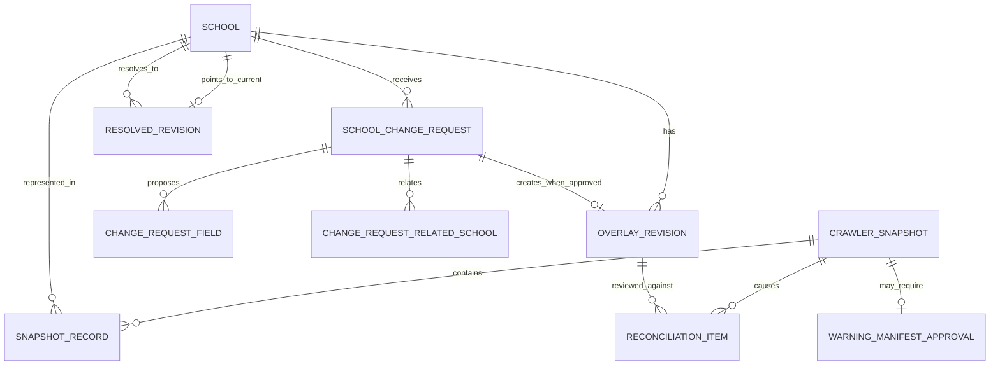

# Schools 领域模型与数据设计

状态：`approved`  
确认依据：项目负责人于 2026-08-25 接受完整 Schools 表结构与字段设计  
设计日期：2026-08-25  
业务基线：`BR-BASELINE-20260825-v32`

返回[领域模型与数据设计索引](README.md)。

业务依据：`BR-051`。  
模块依据：[Schools 模块契约](../10-module-contracts/40-schools.zh-CN.md)。  
现状依据：[Schools 现状分析](../../current-state-analysis/50-schools.zh-CN.md)。  
代码参考：`modules/schools/**`、migration `004` 及相关测试。

## 1. 设计结论

Schools Release 1 使用十张目标逻辑表：

| 对象 | 目标表 | 负责的事实 |
| --- | --- | --- |
| `School` | `schools_schools` | 稳定 School identity、验证状态、生命周期和当前 resolved 指针 |
| `CrawlerSnapshot` | `schools_snapshots` | 一次完整 crawler 候选输入的 manifest 与激活状态 |
| `SnapshotRecord` | `schools_snapshot_records` | 某 snapshot 内某 School 的不可变原始记录 |
| warning 批准回执 | `schools_warning_manifest_approvals` | Founder 对精确 manifest 和 warning 集合的一次性批准 |
| `SchoolChangeRequest` | `schools_change_requests` | Advisor 提交的修改意图、基线、证据和 Founder 决定 |
| ChangeRequest 字段项 | `schools_change_request_fields` | 请求修改的逐字段原值 hash 和建议值 |
| ChangeRequest 关联学校 | `schools_change_request_related_schools` | merge/split 请求涉及的目标学校 |
| `OverlayRevision` | `schools_overlay_revisions` | Founder 批准后真正生效的不可变修订回执 |
| reconciliation 项 | `schools_overlay_reconciliation_items` | 新 snapshot 与有效 overlay 的冗余或冲突复核 |
| resolved revision | `schools_resolved_revisions` | 可重建但不可改写的学校解析版本，供 Cases 固定引用 |

不另建 provisional、resolved current view、merge、split、disable 或主要官网实体：

- provisional 是 `School.verification_status`。
- 当前 resolved view 由 `School.current_resolved_revision_id` 指向。
- merge、split、disable、verify 是 ChangeRequest 的 `operation_type`。
- 主要官网是受控 identity 字段，不是独立对象。
- warning approval 不是独立业务聚合，只是一张不可变批准回执表。

当前 `schools_overlay_revisions` 同时承担“待审核请求”和“已批准 overlay”，目标必须拆开；批准时才生成 OverlayRevision，驳回不生成。

## 2. 领域关系



核心边界：

- School UUID 是唯一稳定 identity；名称、官网和 crawler key 都不是 identity key。
- Snapshot、SnapshotRecord、请求内容、批准回执和 ResolvedRevision 不物理删除。
- ChangeRequest 保存“想改什么”；OverlayRevision 保存“哪次批准使它生效”。
- ResolvedRevision 是可重建 projection，但一旦被 Cases pin，原记录永久保留。

## 3. School 目标逻辑表

表：`schools_schools`

| 字段 | 必填 | 现状 | 用途 |
| --- | --- | --- | --- |
| `id` | 是 | 已有 | School UUID 主键；创建后不可变 |
| `organization_id` | 是 | 已有 | 所属 Organization，也是 RLS 边界 |
| `source_school_key` | 否 | 已有，需纠正 | 当前 crawler key；不是 School identity，provisional 可空，只能经批准流程赋值或纠正 |
| `verification_status` | 是 | 新增 | `provisional` 或 `verified` |
| `lifecycle_status` | 是 | 新增 | `active`、`disabled` 或 `superseded`；merge/split 后原 School 可进入 superseded |
| `provisional_identity` | 条件必填 | 新增 | provisional 创建时的最小学校名称/识别文字 |
| `provisional_district` | 条件必填 | 新增 | provisional 创建时的地区 |
| `provisional_system` | 条件必填 | 新增 | provisional 创建时的学制/学校体系 |
| `provisional_stage` | 条件必填 | 新增 | provisional 创建时的学段 |
| `provisional_reason` | 条件必填 | 新增 | Advisor 创建未验证学校的业务原因 |
| `created_by_user_id` | 否 | 新增 | 手工创建 provisional 的 Advisor；crawler/system 建立可空并由 Audit 留证 |
| `current_resolved_revision_id` | 初始化后必填 | 新增 | 指向当前解析版本；是 current projection 指针，不覆盖历史 revision |
| `record_version` | 是 | 已有 | 乐观锁；验证、停用、合并、拆分和 current pointer 更新均检查 expected version |
| `created_at` | 是 | 已有 | UTC 创建时间 |
| `updated_at` | 是 | 已有 | UTC 最后更新时间 |

关键约束：

- crawler School 的 provisional 五项字段为空；provisional School 的五项字段全部非空。
- 名称、官网和 source_school_key 只能提示疑似重复，不能自动关联或合并。
- `verified`、`disabled`、`superseded` 只能由 Founder 批准的 OverlayRevision 原子驱动，不能直接改表。
- `current_resolved_revision_id` 必须指向同一 Organization、同一 School 的 revision。
- School 永久禁止物理删除；停用也保留全部引用和历史。

## 4. CrawlerSnapshot 目标逻辑表

表：`schools_snapshots`

| 字段 | 必填 | 现状 | 用途 |
| --- | --- | --- | --- |
| `id` | 是 | 已有 | Snapshot UUID 主键 |
| `organization_id` | 是 | 已有 | 所属 Organization，也是 RLS 边界 |
| `source_release_id` | 是 | 已有 | crawler 发布批次标识；仅用于追踪，不作为主键 |
| `schema_version` | 是 | 新增 | manifest/payload schema 版本，例如 `crawler-handoff/v1` |
| `manifest_sha256` | 是 | 已有 | 精确 manifest 内容身份 |
| `file_set_json` | 是 | 已有 | 严格 schema 的文件名、版本、数量、bytes 和 SHA-256 manifest |
| `health` | 是 | 新增 | `pass`、`warn` 或 `fail` |
| `warnings_json` | 是 | 新增 | 严格 schema 的完整 warning 字符串数组；无 warning 为 `[]` |
| `warnings_sha256` | 是 | 新增 | canonical warning 集合的 SHA-256，供批准回执精确绑定 |
| `record_count` | 是 | 已有 | 本 snapshot 的 School 记录数 |
| `source_publisher` | 是 | 新增 | manifest 声明的 crawler 发布者标识，不授予系统权限 |
| `source_published_at` | 是 | 新增 | manifest 声明的发布时间 |
| `source_notes` | 是 | 新增 | manifest notes；允许空字符串，但必须参与 manifest hash 校验 |
| `submitted_actor_kind` | 是 | 新增 | `user` 或 `service`；表示把候选交给系统的主体类型 |
| `submitted_actor_id` | 是 | 新增 | 提交主体 opaque ID；用于禁止自审，不作为授权来源 |
| `status` | 是 | 已有 | `candidate`、`active` 或 `retired` |
| `activated_at` | 条件必填 | 新增 | status 进入 active 的时间 |
| `activated_actor_kind` | 条件必填 | 新增 | 执行独立激活动作的 `user` 或 `service` |
| `activated_actor_id` | 条件必填 | 新增 | 执行独立激活动作的主体 ID |
| `retired_at` | 条件必填 | 新增 | active 被新 snapshot 替代的时间 |
| `retired_actor_kind` | 条件必填 | 新增 | 执行退役的主体类型 |
| `retired_actor_id` | 条件必填 | 新增 | 执行退役的主体 ID |
| `retire_reason_code` | 条件必填 | 新增 | 受控退役原因 |
| `record_version` | 是 | 当前 trigger 引用但表中缺失，需新增 | 乐观锁；只用于生命周期变化，不允许修改 manifest 内容 |
| `created_at` | 是 | 已有 | 候选准入时间 |
| `updated_at` | 是 | 已有 | 最后一次生命周期更新时间 |

关键约束：

- manifest 内容字段在插入后全部不可变，只允许 candidate → active → retired。
- 同一 Organization 同时最多一个 active Snapshot。
- `health=fail` 永不允许激活；`health=warn` 必须存在仍有效且精确匹配的 Founder 批准回执。
- health pass/warn 不是激活；激活必须是另一个显式、幂等、重新校验 hash 的动作。
- 当前 migration 的 snapshot trigger 使用不存在的 `record_version`，corrective migration 必须补列并验证历史行。

## 5. SnapshotRecord 目标逻辑表

表：`schools_snapshot_records`

| 字段 | 必填 | 现状 | 用途 |
| --- | --- | --- | --- |
| `id` | 是 | 已有 | SnapshotRecord UUID 主键 |
| `organization_id` | 是 | 已有 | 所属 Organization，必须与 Snapshot/School 一致 |
| `snapshot_id` | 是 | 已有 | 所属不可变 CrawlerSnapshot |
| `school_id` | 是 | 已有 | 对应稳定 School UUID |
| `source_school_key` | 是 | 已有 | 该 snapshot 当时使用的 crawler key |
| `fields_json` | 是 | 已有 | 由 `schema_version` 约束的不可变学校字段对象 |
| `provenance_json` | 是 | 已有 | crawler 对各字段的来源和采集信息；使用严格 schema |
| `record_sha256` | 是 | 已有 | canonical record 的 SHA-256 |
| `created_at` | 是 | 已有 | UTC 准入时间 |

关键约束：

- 一个 Snapshot 内，每个 source_school_key 和 School 各最多一条记录。
- 所有字段插入后不可更新、不可删除；修正只能进入新的 Snapshot 或 approved Overlay。
- JSONB 在这里合法，因为它保存版本化外部 snapshot；schema/version/hash 必须一同校验。

## 6. WarningManifestApproval 目标逻辑表

表：`schools_warning_manifest_approvals`

| 字段 | 必填 | 现状 | 用途 |
| --- | --- | --- | --- |
| `id` | 是 | 新增；旧实现只在外部 manifest 内嵌 receipt | 批准回执 UUID |
| `organization_id` | 是 | 新增 | 所属 Organization，必须与 Snapshot 一致 |
| `snapshot_id` | 是 | 新增 | 被批准的 candidate Snapshot |
| `manifest_sha256` | 是 | 新增 | 冗余绑定并校验 Snapshot 的精确 manifest hash |
| `warnings_sha256` | 是 | 新增 | 冗余绑定并校验完整 warning 集合 hash |
| `approved_by_user_id` | 是 | 新增 | 实际批准的 Founder User |
| `approval_reason` | 是 | 新增 | Founder 接受 warning 风险的业务理由 |
| `approved_at` | 是 | 新增 | 批准时间 |
| `expires_at` | 否 | 新增 | Release 1 固定为空；manifest 或 warning hash 变化时回执自然不再适用，后续版本如启用期限需新设计 |
| `created_at` | 是 | 新增 | 回执写入时间 |

关键约束：

- 一张 Snapshot 最多一张批准回执；回执 append-only，不更新、不删除。
- 只有当前 active Founder 可以批准；若提交主体是同一 User，必须拒绝。
- 只允许为 `health=warn` 的 candidate Snapshot 建立。
- 激活时重新比较 snapshot_id、manifest_sha256、warnings_sha256 和 expires_at。
- 移除旧 Data Reviewer recommendation；Founder 单独对完整 warning 集合作决定。

## 7. SchoolChangeRequest 目标逻辑表

表：`schools_change_requests`

| 字段 | 必填 | 现状 | 用途 |
| --- | --- | --- | --- |
| `id` | 是 | 从旧 overlay candidate 拆出 | ChangeRequest UUID 主键 |
| `organization_id` | 是 | 从旧表拆出 | 所属 Organization，必须与 School/基线一致 |
| `school_id` | 是 | 从旧表拆出 | 本请求直接治理的主体 School |
| `operation_type` | 是 | 新增 | `update_fields`、`verify`、`merge`、`split` 或 `disable` |
| `base_resolved_revision_id` | 是 | 新增；旧表只绑定 snapshot | 提交时看到的精确 resolved revision |
| `base_resolution_sha256` | 是 | 新增 | 提交时完整解析结果 hash；审核时防止盲目批准旧基线 |
| `request_reason` | 是 | 由旧 `reason` 改名 | Advisor 请求修改的业务理由 |
| `evidence_url` | 是 | 从旧 field evidence 提升到请求头 | 主要可核验证据 HTTPS URL |
| `evidence_excerpt` | 是 | 从旧 field evidence 提升到请求头 | 支撑本请求的简短证据摘要，不保存整页正文 |
| `status` | 是 | 从旧 overlay 状态拆出并纠正 | `submitted`、`approved` 或 `rejected` |
| `requested_by_user_id` | 是 | 已有，拆出 | 提交请求的 Advisor User |
| `submitted_at` | 是 | 新增 | 正式提交时间；Release 1 不持久化 draft |
| `reviewed_by_user_id` | 条件必填 | 从旧 approval 字段纠正 | approve/reject 的 Founder User |
| `reviewed_at` | 条件必填 | 从旧 approval 字段纠正 | Founder 决定时间 |
| `decision_reason` | 条件必填 | 新增 | Founder 批准或驳回理由 |
| `record_version` | 是 | 已有，拆出 | 乐观锁；审核必须携带 expected version |
| `created_at` | 是 | 已有，拆出 | UTC 创建时间 |
| `updated_at` | 是 | 已有，拆出 | UTC 最后更新时间 |

关键约束：

- 只有 Advisor capability 可以提交；Founder 若提交，必须同时有 Advisor 角色。
- 审核只允许另一名 active Founder；Admin、Contractor 和提交者都不能审核。
- submitted 只能进入 approved 或 rejected，决定后内容和状态均不可再改。
- approved 必须在同一事务生成一条 OverlayRevision；rejected 不得生成。
- 审核时必须重算当前 resolved hash；不一致则显示冲突并拒绝本次审核写入。

## 8. ChangeRequestField 目标逻辑表

表：`schools_change_request_fields`

| 字段 | 必填 | 现状 | 用途 |
| --- | --- | --- | --- |
| `organization_id` | 是 | 从旧 `schools_overlay_fields` 拆出 | 租户边界，必须与 ChangeRequest 一致 |
| `change_request_id` | 是 | 由旧 `revision_id` 改义 | 所属 ChangeRequest |
| `school_id` | 是 | 已有，改为随请求校验 | 被修改的主体 School，必须等于请求 school_id |
| `field_name` | 是 | 已有 | 受 snapshot schema/字段注册表约束的字段名 |
| `field_class` | 是 | 已有，需纠正审核规则 | `identity` 或 `general`；两类都只由 Founder 审核 |
| `proposed_value_json` | 是 | 已有 | canonical JSON 值；JSON null 也可作为明确建议值 |
| `base_value_sha256` | 是 | 已有 | 提交时该字段原值的 SHA-256 |
| `proposed_value_sha256` | 是 | 新增 | 建议值的 SHA-256，审批和 resolved provenance 使用 |
| `created_at` | 是 | 已有 | UTC 创建时间 |

关键约束：

- 同一 ChangeRequest 的 field_name 唯一，至少一项才能提交 `update_fields`。
- `school_key`、中英文校名和主要官网必须标为 identity；但 identity/general 都只由 Founder 审核。
- 请求一经 submitted，字段项不可新增、更新或删除。
- 这是对版本化学校 schema 做逐字段 provenance，不是可让用户任意建字段的通用 EAV。

## 9. ChangeRequestRelatedSchool 目标逻辑表

表：`schools_change_request_related_schools`

| 字段 | 必填 | 现状 | 用途 |
| --- | --- | --- | --- |
| `organization_id` | 是 | 新增 | 租户边界，必须与 Request/两所 School 一致 |
| `change_request_id` | 是 | 新增 | 所属 merge/split ChangeRequest |
| `school_id` | 是 | 新增 | 请求的主体 School，必须等于 ChangeRequest.school_id |
| `related_school_id` | 是 | 新增 | merge 目标或 split 结果 School |
| `relation_role` | 是 | 新增 | `merge_target` 或 `split_result` |
| `ordinal` | 是 | 新增 | split 结果的稳定显示/处理顺序，从 1 开始 |
| `created_at` | 是 | 新增 | UTC 创建时间 |

关键约束：

- merge 请求恰好一条 `merge_target`；split 请求至少两条 `split_result`。
- subject 和 related School 不能相同，也必须属于同一 Organization。
- Release 1 一次请求只治理一个 subject School；多个重复源合并到同一目标时分别提交请求，保留逐校审核边界。
- split 目标必须先具有稳定 School UUID；目录中不存在时，Advisor 先建立 provisional School。
- 请求提交后关联行不可改写或删除；非 merge/split 请求不得存在关联行。

## 10. OverlayRevision 目标逻辑表

表：`schools_overlay_revisions`

| 字段 | 必填 | 现状 | 用途 |
| --- | --- | --- | --- |
| `id` | 是 | 已有，需改义 | OverlayRevision UUID；只在请求批准时生成 |
| `organization_id` | 是 | 已有 | 所属 Organization |
| `school_id` | 是 | 已有 | 被修订的主体 School |
| `change_request_id` | 是 | 新增 | 唯一引用已 approved 的 ChangeRequest |
| `base_resolved_revision_id` | 是 | 取代旧 `base_snapshot_id` | 该 overlay 批准时绑定的完整基线 |
| `revision_number` | 是 | 已有 | 同一 School 内从 1 递增的治理修订号 |
| `content_sha256` | 是 | 新增 | 请求头、字段项和关联学校的 canonical 内容 hash |
| `status` | 是 | 已有，需纠正 | 仅 `approved` 或 `disabled`；不再保存 candidate/rejected |
| `approved_by_user_id` | 是 | 已有 | 批准请求并生成 overlay 的 Founder |
| `approved_at` | 是 | 已有 | 生效批准时间 |
| `disabled_by_user_id` | 条件必填 | 已有 | 后续停用本 revision 的 Founder |
| `disabled_at` | 条件必填 | 已有 | 停用时间 |
| `disable_reason_code` | 条件必填 | 由旧 `disable_reason` 纠正 | 受控停用原因；详细上下文进入 Audit |
| `record_version` | 是 | 已有 | 乐观锁；只允许 approved → disabled 一次 |
| `created_at` | 是 | 已有 | 与批准事务一致的创建时间 |
| `updated_at` | 是 | 已有 | 生命周期最后更新时间 |

关键约束：

- 一条 approved ChangeRequest 恰好生成一条 OverlayRevision；rejected 请求为零条。
- Overlay 内容来自 immutable ChangeRequest 及其子行，不复制一份可漂移字段数据。
- 不保存 `approved_role`；服务端每次根据 Access 当前事实重验 Founder，Audit 保存动作时授权上下文。
- 停用只允许另一名或符合后续安全策略的 active Founder，必须 expected version、原因、审计和 outbox 原子完成。
- 停用不删除 revision；resolved view 重新按 revision_number 应用全部仍 approved 的 revision。

## 11. OverlayReconciliationItem 目标逻辑表

表：`schools_overlay_reconciliation_items`

| 字段 | 必填 | 现状 | 用途 |
| --- | --- | --- | --- |
| `id` | 是 | 由旧 review queue 保留并改名 | reconciliation UUID |
| `organization_id` | 是 | 已有 | 所属 Organization |
| `school_id` | 是 | 已有 | 被复核的 School |
| `overlay_revision_id` | 是 | 由旧 `revision_id` 改名 | 与新 Snapshot 比较的 approved overlay |
| `snapshot_id` | 是 | 新增 | 触发本次比较的新 Snapshot |
| `kind` | 是 | 已有，需扩展 | `redundant` 或 `base_conflict` |
| `details_json` | 是 | 取代单字段 hash 列 | 严格 schema 的逐字段旧基线、新基线、overlay value hash 比较 |
| `status` | 是 | 已有，需简化 | `open` 或 `resolved` |
| `decision_code` | 条件必填 | 新增 | `disable_overlay`、`retain_overlay` 或 `replacement_requested` |
| `reviewed_by_user_id` | 条件必填 | 由旧 `resolved_by_user_id` 改名 | 处理复核的 Founder |
| `reviewed_at` | 条件必填 | 新增 | Founder 决定时间 |
| `decision_reason` | 条件必填 | 由旧 `resolution_reason` 改名 | Founder 处理理由 |
| `record_version` | 是 | 新增 | 乐观锁；只允许 open → resolved |
| `created_at` | 是 | 已有 | 检测到冗余/冲突的时间 |
| `updated_at` | 是 | 已有 | 最后更新时间 |

关键约束：

- 同一 overlay、snapshot、kind 最多一条 item；相同输入重算必须幂等。
- 新 snapshot 与 overlay 值相同可产生 redundant；基线改变且与 overlay 不同产生 base_conflict。
- 发现冲突时继续使用已批准 overlay，不自动顺延、覆盖或停用。
- 只有 Founder 可处理；`disable_overlay` 必须与 overlay 停用及新 resolved revision 同事务完成。
- details_json 是版本化比较 manifest，不是新的学校业务字段存储。

## 12. ResolvedRevision 目标逻辑表

表：`schools_resolved_revisions`

| 字段 | 必填 | 现状 | 用途 |
| --- | --- | --- | --- |
| `id` | 是 | 已有 | ResolvedRevision UUID；Cases pin 的稳定引用 |
| `organization_id` | 是 | 已有 | 所属 Organization |
| `school_id` | 是 | 已有 | 被解析的稳定 School |
| `base_kind` | 是 | 新增 | `provisional` 或 `snapshot` |
| `base_snapshot_id` | 条件必填 | 已有，需允许 provisional 为空 | base_kind 为 snapshot 时的不可变 Snapshot |
| `overlay_manifest_json` | 是 | 取代旧单一 `overlay_revision_id` | 严格 schema 数组：全部有效 revision ID、编号、content hash 和应用顺序 |
| `overlay_manifest_sha256` | 是 | 新增 | exact overlay 集合与顺序的 SHA-256 |
| `verification_status` | 是 | 新增 | 本解析版本当时的 provisional/verified 状态 |
| `lifecycle_status` | 是 | 新增 | 本解析版本当时的 active/disabled/superseded 状态 |
| `resolution_sha256` | 是 | 已有 | base、全部 overlay、字段、provenance、conflict 和状态的总 hash |
| `fields_json` | 是 | 已有 | 严格 schema 的最终学校字段对象 |
| `provenance_json` | 是 | 已有 | 每个字段来自 provisional、snapshot 或哪条 overlay 及 value hash |
| `conflicts_json` | 是 | 已有 | 严格 schema 的未解决冲突数组；无冲突为 `[]` |
| `created_at` | 是 | 已有 | 解析版本生成时间 |

关键约束：

- 整行 append-only，不更新、不删除；相同 School + resolution_sha256 幂等复用。
- resolved 算法按 revision_number 应用全部 approved 且未 disabled 的 OverlayRevision，不只取最大编号。
- provisional School 以 School 表的五项初始资料为 base；crawler School 以当前 active SnapshotRecord 为 base。
- 停用最新 overlay 后，前一条有效 overlay 或 base 值自然重新显露。
- `School.current_resolved_revision_id` 指向当前项；Cases 保存自己的 pin，目录更新不能替换已有 Case 引用。

## 13. 生命周期与原子写入

```text
ChangeRequest: submitted -> approved
                         \-> rejected

OverlayRevision: approved -> disabled

Snapshot: candidate -> active -> retired

ReconciliationItem: open -> resolved
```

必须原子完成的事务：

1. 创建 provisional：School + 首个 ResolvedRevision + current pointer + Audit + Outbox。
2. 批准 ChangeRequest：请求决定 + OverlayRevision + School 当前状态（如适用）+ 新 ResolvedRevision + pointer + Audit + Outbox。
3. 停用 Overlay：revision 状态 + 新 ResolvedRevision + pointer + reconciliation 决定（如适用）+ Audit + Outbox。
4. 激活 Snapshot：候选重新校验 + warning approval（如需）+ 旧 active 退役 + 新 active 激活 + 各 School resolved 重算/待处理批次 + Audit + Outbox。

幂等结果由 Shared 拥有，不在 Schools 重建重复幂等表。

## 14. RLS、授权与数据分类

- 十张表全部显式保存 `organization_id`，启用并 FORCE RLS。
- School、Snapshot、Request、Overlay 和 Resolved 的复合引用必须同时校验 organization_id。
- Advisor 只能创建 provisional 和提交请求；Founder 只能通过公开审核命令作决定。
- Admin 技术配置能力不能直接写这些业务表；Contractor 无 Schools 治理入口。
- 学校目录通常不是个人资料，但 evidence excerpt/URL 仍按内部数据处理，禁止保存学生、家长或员工敏感正文。
- User ID 是内部引用；响应中展示姓名时通过 Access/Identity 的授权投影解析，不复制员工姓名或邮箱。
- manifest、snapshot 和 URL 都是外部不可信输入，必须在持久化、读取和网络访问前分别验证。

## 15. 关键索引方向

| 查询 | 索引方向 |
| --- | --- |
| 当前目录 | `schools_schools(organization_id, lifecycle_status, verification_status)` + current pointer |
| 当前 active Snapshot | organization_id 上 status=active 的部分唯一索引 |
| Snapshot 查记录 | `(organization_id, snapshot_id, school_id)`、source_school_key 唯一 |
| Founder 待审核 | `(organization_id, status, submitted_at)` |
| 某 School 修订历史 | `(organization_id, school_id, revision_number)` 唯一 |
| 待 reconciliation | `(organization_id, status, created_at)` |
| pin/hash 验证 | `(organization_id, school_id, resolution_sha256)` 唯一 |

不为校名或官网建立唯一索引；如需疑似重复提示，只建立标准化搜索索引，不改变业务 identity。

## 16. 当前 schema 与目标差异

| 优先级 | 当前实现 | 目标处理 |
| --- | --- | --- |
| `P0` | `schools_snapshots` trigger 引用不存在的 `record_version` | corrective migration 补列并先核对历史行 |
| `P0` | candidate、reject、approve 与 disable 全塞在 `schools_overlay_revisions` | 拆成 ChangeRequest 与批准后才产生的 OverlayRevision |
| `P0` | `data_reviewer` 可审核普通字段、warning 和停用 overlay | 新授权和约束只接受 Founder；历史字段只保留读取 |
| `P0` | School 没有 provisional 最小资料、验证状态或生命周期 | 扩展 School，并让 provisional 首次创建即可形成 resolved revision |
| `P0` | warning receipt 只在 crawler 文件内嵌且要求 reviewer 推荐 | 新建精确 Founder approval 回执，移除推荐步骤 |
| `P1` | resolved revision 只保存一个 overlay_revision_id | 改为全部有效 overlay 的严格 manifest 和 hash |
| `P1` | resolver 实际只应用最高编号 overlay | 按升序应用全部有效 overlay，保留逐字段 provenance |
| `P1` | review queue 只有单字段 base_changed | 改为按 overlay/snapshot 的严格比较 manifest，支持 redundant 与 conflict |
| `P1` | runtime adapter 固定 unavailable，页面仍有 mock/legacy 路径 | 后续实现统一 PostgreSQL resolved view；未配置继续 fail closed |

历史 migration `004` 不修改。后续只新增 append-only corrective migration，并先输出旧数据分类、回填和冲突报告；本阶段不执行数据库变更。

## 17. 设计决策

| ID | 决策 |
| --- | --- |
| `DD-SCH-001` | School UUID 是稳定 identity；名称、官网和 crawler key 都不是 identity key |
| `DD-SCH-002` | provisional 最小资料保存在 School，不伪造 crawler Snapshot |
| `DD-SCH-003` | ChangeRequest 与 OverlayRevision 分表；只有批准才生成 overlay |
| `DD-SCH-004` | approved overlay 引用 immutable request 内容，不复制第二份可能漂移的字段数据 |
| `DD-SCH-005` | merge/split 使用请求子行表达，不增加独立 merge/split 业务实体 |
| `DD-SCH-006` | warning approval 是 Founder 对精确 manifest/warnings 的 append-only 回执 |
| `DD-SCH-007` | resolved revision 保存全部有效 overlay manifest，不再使用单 overlay 指针 |
| `DD-SCH-008` | 冲突继续使用已批准 overlay，只提醒 Founder，不自动覆盖或停用 |

## 18. 本模块验收标准

项目负责人需要确认：

1. 接受十张目标逻辑表，以及 ChangeRequest/OverlayRevision 分离。
2. 接受 provisional 最小资料直接保存在 School，不另建 provisional 实体。
3. 接受 merge/split 只是请求操作，并用关联学校子表保存目标。
4. 接受 warning approval 只由 Founder 对精确 manifest/warnings 留不可变回执。
5. 接受 resolved revision 应用全部有效 overlay，并允许 provisional 没有 base_snapshot_id。
6. 接受当前 migration `004` 不改，由后续 corrective migration 处理差异。

确认后进入下一个模块：Cases。
