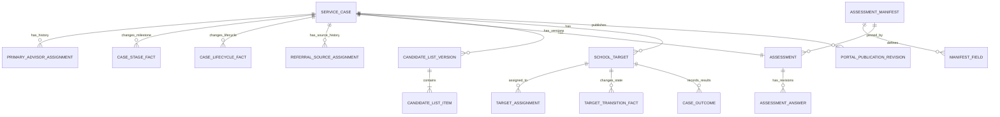

# Cases 领域模型与数据设计

状态：`approved`  
确认依据：项目负责人于 2026-08-25 接受 Cases 目标表结构，并确认候选学校名单采用“版本 + 学校项目”模型  
设计日期：2026-08-25  
业务基线：`BR-BASELINE-20260825-v32`

返回[领域模型与数据设计索引](README.md)。

业务依据：`BR-030` 至 `BR-034`、`BR-039`，并引用 `BR-028`、`BR-035` 至 `BR-037`。  
模块依据：[Cases 模块契约](../10-module-contracts/50-cases.zh-CN.md)。  
现状依据：[Cases 现状分析](../../current-state-analysis/30-cases.zh-CN.md)。  
代码参考：`modules/cases/**`、migration `003`、`015`、`024` 至 `027`、`032`、`036`。

## 1. 设计结论

Cases Release 1 使用十六张目标逻辑表：

| 分组 | 目标表 | 负责的事实 |
| --- | --- | --- |
| Case 主体 | `cases_service_cases` | Case identity、当前里程碑和工作流状态 |
| Case 主体 | `cases_primary_advisor_assignments` | Primary Advisor 当前关系与更换历史 |
| Case 主体 | `cases_service_case_transition_facts` | 全局里程碑变化历史 |
| Case 主体 | `cases_service_case_lifecycle_facts` | 暂停、恢复、终止和结案历史 |
| 来源 | `cases_case_referral_source_assignments` | Case 当前 ReferralSource 与更换历史 |
| Assessment | `cases_schema_manifests` | 不可变 K12 Assessment 版本 |
| Assessment | `cases_schema_manifest_fields` | manifest 的 15 个字段、枚举和 blocker |
| Assessment | `cases_assessments` | Case 绑定的 manifest 和 background 完成事实 |
| Assessment | `cases_assessment_answers` | 逐字段、追加式答案版本 |
| 选校 | `cases_candidate_school_list_versions` | 完整名单版本、Founder 决定和 Guardian 确认 |
| 选校 | `cases_candidate_school_list_items` | 一个名单版本内的学校集合和 SchoolReferencePin |
| 逐校申请 | `cases_school_targets` | 一所学校的一轮申请和当前状态 |
| 逐校申请 | `cases_school_target_assignments` | Application Assignee 当前关系与更换历史 |
| 逐校申请 | `cases_school_target_transition_facts` | 逐校状态变化及提交/面试证据 |
| 逐校申请 | `cases_case_outcomes` | 学校结果、Guardian offer 决定和纠正版本 |
| Portal 内容 | `cases_portal_publication_revisions` | 对客消息和行动项的追加式发布版本 |

不增加 Application、Offer、GuardianConfirmation、FounderApproval、ClosureResult 或 TaskRequest 顶层实体：

- Application 由 SchoolTarget 表达。
- Founder/Guardian 名单决定保存在名单版本的不可改写回执字段中。
- Offer 与 Guardian 决定保存在 CaseOutcome 版本中。
- ClosureResult 保存在 ServiceCaseLifecycleFact 中。
- 提交和面试事实保存在 SchoolTargetTransitionFact 中。
- Task 请求由同事务 OutboxMessage 可靠发布，不在 Cases 重复建立 Task 表。

## 2. 领域关系



## 3. ServiceCase 目标逻辑表

表：`cases_service_cases`

| 字段 | 必填 | 现状 | 用途 |
| --- | --- | --- | --- |
| `id` | 是 | 已有 | ServiceCase UUID 主键；重新签约创建新 ID |
| `organization_id` | 是 | 已有 | 所属 Organization，也是 RLS 边界 |
| `student_id` | 是 | 已有 | CRM 中的 active Student opaque ID |
| `case_number` | 是 | 已有 | 公司内唯一案件编号，不作为授权依据 |
| `application_type` | 是 | 已有 | Release 1 固定为 `k12` |
| `intake_year` | 是 | 已有 | 目标入学年份 |
| `admission_type` | 是 | 已有，需纠正 | `entry` 或 `transfer` |
| `stage` | 是 | 已有，已部分纠正 | `signed`、`background_collection`、`school_selection_confirmed`、`application_in_progress`、`closed` |
| `workflow_status` | 是 | 已有 | `active`、`paused`、`termination_pending` 或 `closed` |
| `current_primary_advisor_assignment_id` | 是 | 新增 | 当前 PrimaryAdvisorAssignment；取代直接覆盖 Advisor 字段 |
| `signed_at` | 是 | 新增 | 线下签约完成时间 |
| `created_by_user_id` | 是 | 新增 | 建立案件的实际 User |
| `record_version` | 是 | 已有 | 乐观锁；任何当前状态/指针变化均检查 expected version |
| `created_at` | 是 | 已有 | UTC 创建时间 |
| `updated_at` | 是 | 已有 | UTC 最后更新时间 |

目标停用的旧字段：

| 字段 | 必填 | 现状 | 用途 |
| --- | --- | --- | --- |
| `primary_role_binding_id` | 不再直接使用 | 已有 | 回填首个 PrimaryAdvisorAssignment 后停止新读写 |
| `primary_membership_id` | 不再直接使用 | 已有 | 同上 |
| `primary_user_id` | 不再直接使用 | 已有 | 同上 |
| `primary_role` | 不再直接使用 | 已有 | Primary Advisor 固定通过 assignment 的 Advisor binding 表达 |

关键约束：

- Case 只引用 CRM Student，不创建或修改 CRM 主档。
- 同一 Student、intake_year、admission_type 同时最多一个未 closed Case。
- 建案事务保存 signed_at 后立即写入 signed → background_collection fact；不得长期提交 signed Case。
- stage=closed 与 workflow_status=closed 必须同时成立。
- ServiceCase 永久禁止软删除、物理删除和重新打开。

## 4. PrimaryAdvisorAssignment 目标逻辑表

表：`cases_primary_advisor_assignments`

| 字段 | 必填 | 现状 | 用途 |
| --- | --- | --- | --- |
| `id` | 是 | 新增；旧实现只在 Case 保存当前 Advisor | Assignment UUID |
| `organization_id` | 是 | 新增 | 租户边界，必须与 Case/Access 引用一致 |
| `service_case_id` | 是 | 新增 | 所属 ServiceCase |
| `advisor_user_id` | 是 | 从旧 Case 字段迁移 | Advisor User |
| `advisor_membership_id` | 是 | 从旧 Case 字段迁移 | 对应 active Membership |
| `advisor_role_binding_id` | 是 | 从旧 Case 字段迁移 | 精确 Advisor RoleBinding |
| `assigned_by_user_id` | 是 | 新增 | 执行初次分配或更换的 User |
| `assignment_reason` | 是 | 新增 | 初始分配或更换原因 |
| `starts_at` | 是 | 新增 | 本次关系开始时间 |
| `ends_at` | 否 | 新增 | 被后续 assignment 替换的时间 |
| `ended_by_assignment_id` | 否 | 新增 | 关闭本关系的新 Assignment |
| `record_version` | 是 | 新增 | 关闭当前关系时的乐观锁 |
| `created_at` | 是 | 新增 | UTC 创建时间 |
| `updated_at` | 是 | 新增 | UTC 最后更新时间 |

关键约束：

- 每个 Case 同时且始终只能有一个 current Primary Advisor。
- 新 Assignment 与关闭旧 Assignment 必须原子完成，不覆盖历史。
- 每次操作仍重验 User、Membership 和精确 Advisor RoleBinding 当前有效；旧 binding 日后恢复不复活旧 Assignment。
- Current Advisor 失效时正常业务写入 fail closed，必须先完成受权交接。

## 5. ServiceCaseTransitionFact 目标逻辑表

表：`cases_service_case_transition_facts`

| 字段 | 必填 | 现状 | 用途 |
| --- | --- | --- | --- |
| `id` | 是 | 已有 | 里程碑变化 UUID |
| `organization_id` | 是 | 已有 | 所属 Organization |
| `service_case_id` | 是 | 已有 | 对应 Case |
| `actor_user_id` | 是 | 已有 | 触发本次业务动作的实际 User |
| `from_stage` | 是 | 已有 | 变化前里程碑 |
| `to_stage` | 是 | 已有 | 变化后里程碑 |
| `trigger_type` | 是 | 新增 | `case_created`、`candidate_list_confirmed`、`target_preparing` 或 `founder_closed` |
| `trigger_resource_id` | 是 | 新增 | Case、名单版本、SchoolTarget 或 LifecycleFact opaque ID |
| `from_record_version` | 是 | 已有 | 变化前 Case 版本 |
| `to_record_version` | 是 | 已有 | 变化后 Case 版本，必须 +1 |
| `reason_code` | 否 | 由旧自由 `reason` 纠正 | 必要时保存受控原因；自动正常推进可空 |
| `transitioned_at` | 是 | 已有 | 业务发生时间 |
| `created_at` | 是 | 已有 | 记录写入时间 |

只允许四种前进方向：

```text
signed -> background_collection
background_collection -> school_selection_confirmed
school_selection_confirmed -> application_in_progress
application_in_progress -> closed
```

整表 append-only。客户端不能直接指定下一里程碑；必须由对应业务事实触发。

## 6. ServiceCaseLifecycleFact 目标逻辑表

表：`cases_service_case_lifecycle_facts`

| 字段 | 必填 | 现状 | 用途 |
| --- | --- | --- | --- |
| `id` | 是 | 已有 | 生命周期动作 UUID |
| `organization_id` | 是 | 已有 | 所属 Organization |
| `service_case_id` | 是 | 已有 | 对应 Case |
| `actor_user_id` | 是 | 已有 | 执行动作的实际 User |
| `action` | 是 | 已有，需扩展 | `pause`、`resume`、`terminate` 或 `close` |
| `stage_at_action` | 是 | 新增 | 动作发生时仍保留的全局里程碑 |
| `from_status` | 是 | 已有 | 变化前 workflow_status |
| `to_status` | 是 | 已有 | 变化后 workflow_status |
| `from_record_version` | 是 | 已有 | 变化前 Case 版本 |
| `to_record_version` | 是 | 已有 | 变化后 Case 版本，必须 +1 |
| `reason` | 条件必填 | 已有 | 暂停、终止和结案的简短业务原因；恢复为空 |
| `closure_result` | 条件必填 | 新增 | close 时：`successful_offer`、`no_offer`、`client_terminated` 或 `other` |
| `occurred_at` | 是 | 已有 | 业务发生时间 |
| `created_at` | 是 | 已有 | 记录写入时间 |

关键约束：

- 暂停不修改 stage；恢复后仍使用原 stage。
- pause 只允许在从未达到 submitted 或后续状态时执行。
- terminate 原子把进行中 Target 置为 withdrawn 并请求 Tasks 取消未完成任务，Case 进入 termination_pending。
- close 只由 Founder 执行，必须重新检查全部 Target 终态和 Tasks 无未完成项。
- 即使全部学校拒绝也不自动插入 close fact。

## 7. CaseReferralSourceAssignment 目标逻辑表

表：`cases_case_referral_source_assignments`

| 字段 | 必填 | 现状 | 用途 |
| --- | --- | --- | --- |
| `id` | 是 | 已有 | Assignment UUID |
| `organization_id` | 是 | 已有 | 所属 Organization |
| `case_id` | 是 | 已有 | 对应 ServiceCase |
| `referral_source_id` | 是 | 已有 | CRM ReferralSource UUID |
| `source_display_name` | 是 | 已有 | 建立关系时的显示名称快照 |
| `source_type` | 是 | 已有，需纠正 | 使用 CRM 已确认的 11 个 source_type |
| `source_description` | 否 | 新增 | 建立关系时的说明快照 |
| `source_record_version` | 是 | 已有 | 建立关系时的 ReferralSource 版本 |
| `assigned_by_user_id` | 是 | 新增 | 建立或更换来源的实际 User |
| `assignment_reason` | 是 | 新增 | 初次关联或更换原因 |
| `starts_at` | 是 | 已有 | 本来源关系开始时间 |
| `ends_at` | 否 | 已有 | 被新来源替换的时间 |
| `ended_by_assignment_id` | 否 | 已有 | 关闭本关系的新 Assignment |
| `record_version` | 是 | 已有 | 关闭当前关系时的乐观锁 |
| `created_at` | 是 | 已有 | UTC 创建时间 |
| `updated_at` | 是 | 已有 | UTC 最后更新时间 |

- 一个 Case 同时最多一个当前来源，也允许从未填写来源。
- 新关系只能引用 active CRM ReferralSource；来源日后停用不改写历史快照。
- 旧 source_type `bank/insurance/other_partner` 只保留旧历史，新写入使用 BR-028 的 11 种类型。

## 8. AssessmentManifest 目标逻辑表

表：`cases_schema_manifests`

| 字段 | 必填 | 现状 | 用途 |
| --- | --- | --- | --- |
| `id` | 是 | 已有 | Manifest UUID |
| `application_type` | 是 | 已有 | 固定 `k12` |
| `manifest_version` | 是 | 由旧 composition/module 版本简化 | 业务版本，例如 `k12-assessment-v1` |
| `content_sha256` | 是 | 已有 | 完整字段、枚举和 blocker 的 canonical hash |
| `status` | 是 | 已有 | `candidate`、`approved` 或 `retired` |
| `approved_by_user_id` | 条件必填 | 已有 | 批准 manifest 的 Founder |
| `approved_at` | 条件必填 | 已有 | 批准时间 |
| `retired_by_user_id` | 条件必填 | 已有 | 执行退役的 Founder |
| `retired_at` | 条件必填 | 已有 | 退役时间 |
| `retirement_reason` | 条件必填 | 已有 | 退役原因 |
| `record_version` | 是 | 新增 | manifest 生命周期乐观锁 |
| `created_at` | 是 | 已有 | UTC 创建时间 |
| `updated_at` | 是 | 已有 | UTC 最后更新时间 |

旧 `base_module_*`、`education_stage_module_*`、`school_system_module_*`、`admission_route_module_*` 不再作为业务字段；Release 1 使用固定 15 字段 manifest，不建立万能动态组合器。

退役不影响已经绑定该 manifest 的旧 Case；新 Case 只能绑定 approved manifest。

## 9. AssessmentManifestField 目标逻辑表

表：`cases_schema_manifest_fields`

| 字段 | 必填 | 现状 | 用途 |
| --- | --- | --- | --- |
| `manifest_id` | 是 | 已有 | 所属 manifest |
| `group_code` | 是 | 由旧 module 字段简化 | student_profile / education_profile / school_preferences / family_context |
| `field_id` | 是 | 已有 | Manifest 内唯一字段 ID |
| `label_code` | 是 | 新增 | 受版本控制的显示文案 key |
| `value_type` | 是 | 已有 | `date`、`text`、`enum` 或 `enum_set` |
| `allowed_values_json` | 条件必填 | 新增 | enum/enum_set 的完整受控值数组 |
| `background_blocker` | 是 | 由旧 blocking_stages 明确化 | 是否阻塞 background_complete |
| `selection_blocker` | 是 | 由旧 blocking_stages 明确化 | 是否阻塞 Guardian 名单确认 |
| `allows_not_applicable` | 是 | 新增 | v1 全部为 false |
| `access_scope` | 是 | 由旧 visibility 纠正 | `full_assessment` 或 `education_profile` |
| `ordinal` | 是 | 新增 | Manifest 内稳定显示顺序 1–15 |
| `created_at` | 是 | 新增 | UTC 创建时间 |

字段在 manifest approved 后不可新增、修改或删除。JSON 只保存 enum 数组，并受 value_type、schema 和 manifest hash 约束。

## 10. Assessment 目标逻辑表

表：`cases_assessments`

| 字段 | 必填 | 现状 | 用途 |
| --- | --- | --- | --- |
| `id` | 是 | 已有 | Assessment UUID |
| `organization_id` | 是 | 已有 | 所属 Organization |
| `service_case_id` | 是 | 已有 | 对应 ServiceCase；每个 Case 恰好一个 |
| `manifest_id` | 是 | 已有 | 建案时绑定的不可变 manifest |
| `status` | 是 | 已有，需纠正 | 只保留 `draft` 或 `background_complete` |
| `background_completed_by_user_id` | 条件必填 | 新增 | 完成背景收集的 Primary Advisor |
| `background_completed_at` | 条件必填 | 新增 | background blocker 全部满足的确认时间 |
| `record_version` | 是 | 已有 | 完成 background 时的乐观锁 |
| `created_at` | 是 | 已有 | UTC 创建时间 |
| `updated_at` | 是 | 已有 | UTC 最后更新时间 |

旧 `selection_ready` 状态停止使用；选校是否 ready 每次根据绑定 manifest 和当前答案计算，不保存可漂移状态。

## 11. AssessmentAnswer 目标逻辑表

表：`cases_assessment_answers`

| 字段 | 必填 | 现状 | 用途 |
| --- | --- | --- | --- |
| `id` | 是 | 已有，需改为每次版本新 ID | Answer revision UUID |
| `organization_id` | 是 | 已有 | 所属 Organization |
| `assessment_id` | 是 | 已有 | 所属 Assessment |
| `manifest_id` | 是 | 已有 | 与 Assessment 相同的 manifest |
| `field_id` | 是 | 已有 | 对应 ManifestField |
| `semantic_state` | 是 | 已有 | provided / unknown / declined_to_provide / not_applicable |
| `value_json` | 条件必填 | 已有 | provided 时的严格类型值 |
| `value_type` | 条件必填 | 已有 | provided 时必须等于 ManifestField.value_type |
| `source` | 是 | 已有，需受控 | `manual` 或 `crm_initialization` |
| `revision_number` | 是 | 新增 | 同一 Assessment/field 从 1 递增 |
| `recorded_by_user_id` | 是 | 由旧 updated_by 改名 | 录入本版本的实际 User |
| `recorded_at` | 是 | 新增 | 本答案版本业务时间 |
| `created_at` | 是 | 已有 | 记录写入时间 |

关键变化：答案不再原地覆盖。每次修改追加新行，当前答案取最高 revision_number；expected version 使用当前 revision_number。

旧 `module_layer/module_id/module_version/visibility/is_derived/derived_rule_version/record_version/updated_at` 停止新写；ManifestField 已拥有结构和可见范围，Release 1 没有 derived answer。

## 12. CandidateSchoolListVersion 目标逻辑表

表：`cases_candidate_school_list_versions`

| 字段 | 必填 | 现状 | 用途 |
| --- | --- | --- | --- |
| `id` | 是 | 新增 | 名单版本 UUID |
| `organization_id` | 是 | 新增 | 所属 Organization |
| `service_case_id` | 是 | 新增 | 对应 Case |
| `version_number` | 是 | 新增 | Case 内从 1 递增 |
| `previous_version_id` | 否 | 新增 | 上一名单版本；首版为空 |
| `school_set_sha256` | 是 | 新增 | 完整学校集合、顺序和 pin 的 hash |
| `status` | 是 | 新增 | `draft`、`submitted`、`awaiting_guardian`、`confirmed` 或 `returned` |
| `created_by_user_id` | 是 | 新增 | 创建名单的当前 Primary Advisor |
| `change_summary` | 是 | 新增 | 本版相对上一版的修改说明 |
| `submitted_at` | 条件必填 | 新增 | 提交 Founder 审核时间 |
| `founder_decision` | 条件必填 | 新增 | `approved` 或 `rejected` |
| `founder_decided_by_user_id` | 条件必填 | 新增 | 审核 Founder |
| `founder_decided_at` | 条件必填 | 新增 | Founder 决定时间 |
| `founder_decision_reason` | 条件必填 | 新增 | 批准或驳回理由 |
| `founder_decision_sha256` | 条件必填 | 新增 | 名单集合与 Founder 回执的精确 hash |
| `guardian_id` | 条件必填 | 新增 | 实际作决定的 CRM Guardian |
| `guardian_relationship_id` | 条件必填 | 新增 | 决定当时有效的 StudentGuardianRelationship |
| `guardian_decision` | 条件必填 | 新增 | `confirmed` 或 `not_confirmed` |
| `guardian_decided_at` | 条件必填 | 新增 | Guardian 实际作决定的时间 |
| `guardian_confirmation_channel` | 条件必填 | 新增 | `phone`、`wechat` 或 `in_person` |
| `guardian_recorded_by_user_id` | 条件必填 | 新增 | 代录的当前 Primary Advisor |
| `guardian_recorded_at` | 条件必填 | 新增 | 平台代录时间 |
| `guardian_bound_founder_decision_sha256` | 条件必填 | 新增 | 证明 Guardian 确认的是同一 Founder 批准版本 |
| `record_version` | 是 | 新增 | 审核与确认乐观锁 |
| `created_at` | 是 | 新增 | UTC 创建时间 |
| `updated_at` | 是 | 新增 | UTC 最后更新时间 |

关键约束：

- background blocker 完成后才可建立/提交名单。
- 名单学校集合提交后不可改；变化必须新建 version。
- Founder rejected 或 Guardian not_confirmed 都进入 returned，不产生申请处理。
- Guardian 确认前重新计算 selection blocker，并精确绑定 founder_decision_sha256。
- 主要联系人身份不自动等于确认权；必须明确选择实际 Guardian。

## 13. CandidateSchoolListItem 目标逻辑表

表：`cases_candidate_school_list_items`

| 字段 | 必填 | 现状 | 用途 |
| --- | --- | --- | --- |
| `id` | 是 | 新增 | ListItem UUID |
| `organization_id` | 是 | 新增 | 所属 Organization |
| `service_case_id` | 是 | 新增 | 对应 Case |
| `list_version_id` | 是 | 新增 | 所属 CandidateSchoolListVersion |
| `school_id` | 是 | 新增 | Schools 的稳定 School UUID |
| `pinned_resolved_revision_id` | 是 | 新增 | Schools 不可变 ResolvedRevision |
| `pinned_resolution_sha256` | 是 | 新增 | SchoolReferencePin 的解析 hash |
| `ordinal` | 是 | 新增 | 名单内稳定显示顺序 |
| `school_target_id` | 否 | 新增 | 两层确认应用后绑定复用或新建的 SchoolTarget；只能从空写入一次 |
| `created_at` | 是 | 新增 | UTC 创建时间 |

- 同一名单版本不能重复出现同一 School。
- pinned revision/hash 必须由 Schools 公共契约校验，后续目录更新不改写它。
- 不变学校绑定原 Target；新增学校绑定新 Target；已终态学校保留结果。

## 14. SchoolTarget 目标逻辑表

表：`cases_school_targets`

| 字段 | 必填 | 现状 | 用途 |
| --- | --- | --- | --- |
| `id` | 是 | 已有 | SchoolTarget UUID；表示一所学校的一轮申请 |
| `organization_id` | 是 | 已有 | 所属 Organization |
| `service_case_id` | 是 | 已有 | 对应 ServiceCase |
| `school_id` | 是 | 已有 | Schools 中的稳定 School |
| `application_round` | 是 | 新增 | 同一 Case/School 的申请轮次，从 1 开始 |
| `origin_list_version_id` | 是 | 新增 | 首次完成两层确认的名单版本 |
| `origin_list_item_id` | 是 | 新增 | 首次确认的名单项目 |
| `intake_year` | 是 | 已有 | 本轮目标入学年 |
| `admission_type` | 是 | 已有，需纠正 | entry / transfer |
| `state` | 是 | 已有，需扩展 | candidate / preparing / submitted / interview / waitlisted / accepted / offer_confirmed / offer_declined / rejected / withdrawn |
| `pinned_resolved_revision_id` | 是 | 已有，当前允许空，需改为必填 | 本轮使用的 SchoolReferencePin revision |
| `pinned_resolution_sha256` | 是 | 已有，当前允许空，需改为必填 | pin 的 resolution hash |
| `current_assignment_id` | 条件必填 | 新增 | preparing 及后续状态的当前 Application Assignee |
| `application_deadline` | 条件必填 | 新增 | 进入 preparing 时确定的外部申请截止日期 |
| `record_version` | 是 | 已有 | 状态、指针和 deadline 的乐观锁 |
| `created_at` | 是 | 已有 | UTC 创建时间 |
| `updated_at` | 是 | 已有 | UTC 最后更新时间 |

真正终态只有：`offer_confirmed`、`offer_declined`、`rejected`、`withdrawn`。

`waitlisted` 和 `accepted` 都不是终态；所有学校终态也不自动关闭 Case。

## 15. SchoolTargetAssignment 目标逻辑表

表：`cases_school_target_assignments`

| 字段 | 必填 | 现状 | 用途 |
| --- | --- | --- | --- |
| `id` | 是 | 新增 | Application Assignee assignment UUID |
| `organization_id` | 是 | 新增 | 所属 Organization |
| `service_case_id` | 是 | 新增 | 对应 Case |
| `school_target_id` | 是 | 新增 | 对应 SchoolTarget |
| `assignee_user_id` | 是 | 新增 | 负责准备并提交申请的 Advisor |
| `assignee_membership_id` | 是 | 新增 | 对应 active Membership |
| `advisor_role_binding_id` | 是 | 新增 | 精确 active Advisor RoleBinding |
| `case_collaborator_id` | 否 | 新增 | 非 Primary Advisor 时必须绑定有效 CaseCollaborator |
| `assigned_by_user_id` | 是 | 新增 | 指定负责人的实际 User |
| `assignment_reason` | 是 | 新增 | 初始分派或更换原因 |
| `starts_at` | 是 | 新增 | 本次 Assignment 开始时间 |
| `ends_at` | 否 | 新增 | 被新 Assignment 替换的时间 |
| `ended_by_assignment_id` | 否 | 新增 | 关闭本 Assignment 的后继记录 |
| `record_version` | 是 | 新增 | 关闭当前 Assignment 时的乐观锁 |
| `created_at` | 是 | 新增 | UTC 创建时间 |
| `updated_at` | 是 | 新增 | UTC 最后更新时间 |

- Release 1 的 Application Assignee 是 Primary Advisor 或已有明确 CaseCollaborator 关系的 Advisor。
- 进入 preparing 时必须先建立 Assignment，再请求 Tasks 给同一人创建“准备并提交申请”Task。
- 更换负责人关闭旧行并插入新行；不改写历史、不自动让 Contractor 接管申请。

## 16. SchoolTargetTransitionFact 目标逻辑表

表：`cases_school_target_transition_facts`

| 字段 | 必填 | 现状 | 用途 |
| --- | --- | --- | --- |
| `id` | 是 | 新增；当前服务已生成 ID 但数据库无表 | Target 状态事实 UUID |
| `organization_id` | 是 | 新增 | 所属 Organization |
| `service_case_id` | 是 | 新增 | 对应 Case |
| `school_target_id` | 是 | 新增 | 对应 SchoolTarget |
| `transition_kind` | 是 | 新增 | `created`、`workflow` 或 `correction` |
| `from_state` | 条件必填 | 新增 | created 时为空，否则为变化前状态 |
| `to_state` | 是 | 新增 | 变化后状态 |
| `actor_user_id` | 是 | 新增 | 执行或代录动作的实际 User |
| `assignment_id` | 条件必填 | 新增 | preparing 及后续动作使用的确切 Assignee Assignment |
| `from_record_version` | 条件必填 | 新增 | created 以外的变化前 Target 版本 |
| `to_record_version` | 是 | 新增 | 变化后 Target 版本 |
| `application_deadline` | 条件必填 | 新增 | candidate → preparing 时保存的截止日期 |
| `submission_task_id` | 条件必填 | 新增 | preparing → submitted 所完成的 Tasks Task opaque ID |
| `task_completion_receipt_id` | 条件必填 | 新增 | Tasks 的完成回执 ID |
| `submission_channel` | 条件必填 | 新增 | school_portal / email / courier / in_person / other |
| `submitted_at` | 条件必填 | 新增 | 正式提交时间 |
| `official_submission_reference` | 条件必填 | 新增 | 学校正式参考号；无参考号时为空 |
| `no_reference_declared` | 条件必填 | 新增 | 明确声明学校未提供参考号 |
| `alternative_evidence_document_id` | 条件必填 | 新增 | 无参考号时至少一份其他 Case Document opaque ID |
| `interview_at` | 条件必填 | 新增 | 进入 interview 时的面试时间 |
| `invitation_evidence_document_id` | 条件必填 | 新增 | 学校面试邀请 Case Document opaque ID |
| `reason` | 条件必填 | 新增 | withdrawn 或 correction 等动作的原因 |
| `occurred_at` | 是 | 新增 | 业务发生时间 |
| `created_at` | 是 | 新增 | 记录写入时间 |

关键约束：

- preparing → submitted 必须绑定完成的申请 Task、清单完成回执、提交渠道和时间。
- submitted 必须“有学校参考号”，或者“明确无参考号且有替代凭证”。
- submitted → interview 必须保存面试时间和邀请凭证，并由 Outbox 请求 Tasks 创建面试辅助 Task。
- 所有状态变化追加 fact；结果纠正也追加 correction fact，不覆盖旧事实。

## 17. CaseOutcome 目标逻辑表

表：`cases_case_outcomes`

| 字段 | 必填 | 现状 | 用途 |
| --- | --- | --- | --- |
| `id` | 是 | 已有 | Outcome revision UUID |
| `organization_id` | 是 | 已有 | 所属 Organization |
| `service_case_id` | 是 | 已有 | 对应 Case |
| `school_target_id` | 是 | 已有 | 对应 SchoolTarget |
| `transition_fact_id` | 是 | 新增 | 产生本结果的 TargetTransitionFact |
| `entry_kind` | 是 | 新增 | `workflow` 或 `correction` |
| `outcome_code` | 是 | 已有，需纠正 | waitlisted / accepted / rejected / withdrawn / offer_confirmed / offer_declined |
| `outcome_date` | 是 | 已有 | 学校结果或 Guardian 决定日期 |
| `evidence_source` | 是 | 由旧 evidence/source 纠正 | official_portal / official_letter / advisor_attested |
| `source_reference` | 条件必填 | 由旧 evidence_json 拆出 | 官方引用或 Case Document opaque ID；人工代录可空 |
| `actor_user_id` | 是 | 已有 | 记录结果的实际 User |
| `guardian_id` | 条件必填 | 新增 | offer_confirmed/declined 的实际 Guardian |
| `guardian_relationship_id` | 条件必填 | 新增 | 决定当时有效的 Guardian 关系 |
| `guardian_decision_channel` | 条件必填 | 新增 | phone / wechat / in_person |
| `guardian_decided_at` | 条件必填 | 新增 | Guardian 实际决定时间 |
| `guardian_recorded_by_user_id` | 条件必填 | 新增 | 代录的当前 Primary Advisor |
| `revision_number` | 是 | 已有 | Target 内从 1 递增 |
| `previous_outcome_id` | 否 | 已有 | 上一结果或被纠正结果 |
| `correction_reason` | 条件必填 | 由旧 supersession 字段简化 | entry_kind=correction 时必填 |
| `created_at` | 是 | 已有 | 记录写入时间 |

Outcome 全部 append-only。`waitlisted → accepted → offer_confirmed/declined` 会保留三条顺序事实；纠正再追加新版本。

旧 `not_submitted/aborted` 新写入停止，统一表达为 withdrawn + reason。旧 `superseded_at/superseded_by_outcome_id/record_version/updated_at` 不再需要更新；当前结果取最高 revision_number。

## 18. PortalPublicationRevision 目标逻辑表

表：`cases_portal_publication_revisions`

| 字段 | 必填 | 现状 | 用途 |
| --- | --- | --- | --- |
| `id` | 是 | 新增 | 发布版本 UUID |
| `organization_id` | 是 | 新增 | 所属 Organization |
| `service_case_id` | 是 | 新增 | 对应 Case |
| `publication_key` | 是 | 新增 | 同一消息/行动项跨版本的稳定 UUID |
| `publication_type` | 是 | 新增 | `message` 或 `action_item` |
| `school_target_id` | 否 | 新增 | 可选的相关 SchoolTarget |
| `revision_number` | 是 | 新增 | publication_key 内从 1 递增 |
| `previous_revision_id` | 否 | 新增 | 上一发布版本 |
| `title` | 否 | 新增 | 可选简短标题 |
| `body` | 是 | 新增 | 明确 customer-visible 的纯文本正文 |
| `due_at` | 条件必填 | 新增 | action_item 的截止时间；message 为空 |
| `status` | 是 | 新增 | `published`、`completed` 或 `withdrawn` |
| `recorded_by_user_id` | 是 | 新增 | 发布或更新的当前 Primary Advisor |
| `occurred_at` | 是 | 新增 | 本版本对客生效时间 |
| `created_at` | 是 | 新增 | 记录写入时间 |

- Portal 只读，Guardian/Student 不直接更新行动项。
- 更新、完成或撤回都追加新 revision；旧对客内容不删除。
- body 不允许 HTML、附件正文、内部备注或 Assessment 原始字段。
- 对客阶段和更新时间从 ServiceCase 的安全映射产生，不复制内部敏感状态正文。

## 19. 原子事务边界

必须原子完成的典型事务：

1. 建案：ServiceCase + 首个 PrimaryAdvisorAssignment + Assessment + signed→background fact + Audit + Outbox。
2. 名单 Founder 决定：名单回执字段 + Audit + Outbox。
3. Guardian 确认：同版本/hash 确认 + 新/复用 Target + Assignment + candidate/preparing facts + Task 请求 + Case 里程碑 + Audit + Outbox。
4. 申请提交：Tasks 完成事实重验 + Target transition + 提交证据 + Outcome（如需）+ Case 里程碑 + Audit + Outbox。
5. 面试：Target transition + 面试证据 + 面试辅助 Task 请求 + Audit + Outbox。
6. 终止/结案：全部 Target/Task 条件重验 + LifecycleFact + StageFact（close 时）+ Audit + Outbox。

Shared IdempotencyRecord 负责命令去重，Cases 不再新增模块专用 idempotency 表。

## 20. RLS、授权与数据分类

- 除全局 manifest/field catalogue 外，十四张租户表全部显式保存 organization_id，并启用、FORCE RLS。
- 跨 CRM、Access、Schools、Tasks、Documents 的 ID 都先通过 owning module 公共契约校验；禁止级联删除。
- Student/Guardian ID、Assessment 答案、确认渠道和自由文字原因属于敏感业务数据，不进入日志、Outbox payload 或普通 Audit metadata。
- Founder 基础角色可读取 Case 摘要和 Assessment，只能在明确命令中审核名单或结案；Admin 基础角色默认不可见 Assessment。
- Portal 只能读取经过 customer-safe 投影的数据，不能读取 Assessment、内部原因、Evidence URL 或员工备注。

## 21. 当前旧表处理

当前数据库还有七类不属于本次确认目标的旧结构：

| 当前表 | 状态 | 目标处理 |
| --- | --- | --- |
| `cases_reconstructions` | 旧 pilot reconstruction | 停止新入口和新写入；历史保留 |
| `cases_reconstruction_versions` | 旧 reconstruction 版本 | 停止新写入；历史保留 |
| `cases_reconstruction_events` | 旧手工事件重建 | 停止新写入；历史保留 |
| `cases_reconstruction_gaps` | 旧差距审批 | 停止新写入；历史保留 |
| `cases_reconstruction_activations` | 旧激活回执 | 保留不可变历史 |
| `cases_reconstruction_idempotency` | 旧专用幂等表 | 停止新写入；新命令统一使用 Shared |
| `cases_billing_projection_events` | Platform Billing 投影 | Release 1 runtime 隔离；不作为 Case 业务权威 |

这些表来自旧文档/旧 pilot，不在当前 confirmed BR 中。不得物理删除或擅自迁入新业务模型；精确归档策略留到数据治理设计。

## 22. 当前 schema 与目标差异

| 优先级 | 当前实现 | 目标处理 |
| --- | --- | --- |
| `P0` | 没有 CandidateSchoolListVersion/Item | 新增名单版本、Founder 决定与 Guardian 同版本确认 |
| `P0` | Primary Advisor 直接保存在 Case 且不可更换 | 新增 Assignment 历史，Case 只指向当前项 |
| `P0` | 没有 Application Assignee 历史 | 新增 SchoolTargetAssignment |
| `P0` | 服务生成 target transitionFactId，但数据库没有对应表 | 新增不可变 TargetTransitionFact |
| `P0` | Target 缺 offer_confirmed/offer_declined | 增加两个终态；waitlisted/accepted 改为非终态 |
| `P0` | 提交强制 official reference | 允许无参考号声明 + 至少一份替代凭证 |
| `P0` | Assessment 答案原地覆盖 | 改为逐字段追加 revision |
| `P0` | terminate/close 不可执行 | 扩展 LifecycleFact，并实现 Founder 人工结案 |
| `P1` | Assessment 有 selection_ready 状态 | 删除该当前状态，按 blocker 即时计算 |
| `P1` | CaseOutcome 用 superseded 更新旧行 | 改为完全追加式 outcome 链 |
| `P1` | ReferralSource 只有旧三类且缺 description | 对齐 CRM 的 11 类来源及完整快照 |
| `P1` | Portal-safe DTO 存在但没有消息/行动项权威表 | 新增追加式 PortalPublicationRevision |

历史 migration 不修改。后续 corrective migration 必须先输出只读数据分类、回填和冲突报告，再追加新 migration；本阶段不执行数据库变更。

## 23. 关键索引方向

| 查询 | 索引方向 |
| --- | --- |
| Case 列表 | `(organization_id, workflow_status, stage, updated_at)` |
| Student 未结案 Case | `(organization_id, student_id)` 的未 closed 部分索引 |
| 当前 Primary Advisor/来源/Assignee | 对各 owner ID 的 `ends_at IS NULL` 部分唯一索引 |
| 当前 Assessment 答案 | `(organization_id, assessment_id, field_id, revision_number DESC)` |
| 名单版本 | `(organization_id, service_case_id, version_number)` 唯一 |
| 名单学校 | `(organization_id, list_version_id, school_id)` 唯一 |
| SchoolTarget 轮次 | `(organization_id, service_case_id, school_id, application_round)` 唯一 |
| Target 历史 | `(organization_id, school_target_id, to_record_version)` 唯一 |
| Outcome 历史 | `(organization_id, school_target_id, revision_number)` 唯一 |
| Portal 当前版本 | `(organization_id, publication_key, revision_number DESC)` |

## 24. 设计决策

| ID | 决策 |
| --- | --- |
| `DD-CASE-001` | ServiceCase 永久保留，重新签约创建新 Case |
| `DD-CASE-002` | Primary Advisor 和 Application Assignee 都使用版本化 Assignment，不覆盖人员历史 |
| `DD-CASE-003` | Assessment 答案改为追加 revision；selection readiness 只计算不保存 |
| `DD-CASE-004` | Founder 与 Guardian 决定保存在同一不可变名单版本，不新增确认实体 |
| `DD-CASE-005` | SchoolTarget 表达 Application；提交/面试事实保存在 transition fact |
| `DD-CASE-006` | Offer 与 Guardian 决定保存在 Outcome revision，不新增 Offer 实体 |
| `DD-CASE-007` | Task 请求只通过可靠 Outbox，不复制 Task 数据 |
| `DD-CASE-008` | 全部学校终态不自动结案，Founder 保留新增学校或明确结案两条分支 |
| `DD-CASE-009` | Portal 消息/行动项是 ServiceCase 子记录，Portal 本身只读 |
| `DD-CASE-010` | 旧 reconstruction 与 billing projection 不进入 confirmed Release 1 Case 权威模型 |

## 25. 本模块验收标准

项目负责人需要确认：

1. 接受十六张目标逻辑表；不新增 Application、Offer、Confirmation、ClosureResult 或 TaskRequest 顶层实体。
2. 接受 Primary Advisor 和 Application Assignee 使用版本化 Assignment 历史。
3. 接受 Assessment 答案追加新版本，不再覆盖旧答案。
4. 接受名单版本直接保存 Founder 决定和 Guardian 同版本确认回执。
5. 接受 SchoolTargetTransitionFact 保存提交和面试证据，CaseOutcome 保存结果与 Guardian offer 决定。
6. 接受 Portal 对客消息/行动项归 Cases 保存，Portal 仍保持只读。
7. 接受旧 reconstruction/billing projection 不进入目标业务模型，只保留旧历史。

确认后进入下一个模块：Tasks。
