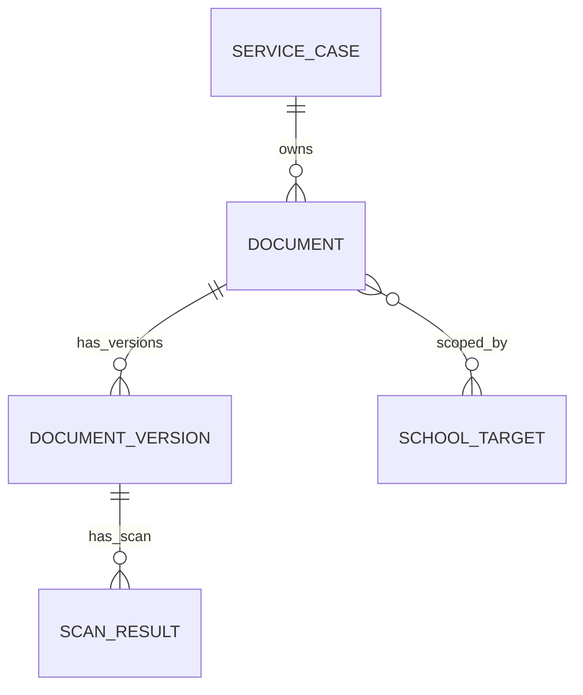

# Documents 领域模型与数据设计

状态：`approved`  
确认依据：项目负责人于 2026-08-25 接受 Documents 的 3 张核心表、1 张技术关联表、Case 授权根、版本扫描和删除治理设计  
设计日期：2026-08-25  
业务基线：`BR-BASELINE-20260825-v32`

返回[领域模型与数据设计索引](README.md)。

业务依据：`BR-050`，并引用 `BR-012`、`BR-013`、`BR-035`、`BR-036`、`BR-039`。  
模块依据：[Documents 模块契约](../10-module-contracts/70-documents.zh-CN.md)。  
现状依据：[Documents 现状分析](../../current-state-analysis/60-documents.zh-CN.md)。  
代码参考：`modules/documents/**`、migration `006`、`034`、`035`。

## 1. 先看结论

Documents Release 1 使用 **3 张核心表 + 1 张技术关联表**：

| 类型 | 目标表 | 负责的事实 |
| --- | --- | --- |
| 核心对象 | `documents_documents` | 文件登记、Case 归属、用途分类、当前版本指针和文件生命周期 |
| 核心对象 | `documents_document_versions` | 每次上传的不可变文件版本、对象存储引用和版本状态 |
| 核心对象 | `documents_scan_results` | 每个版本的扫描政策、尝试次数和扫描结果 |
| 技术关联 | `documents_document_school_target_links` | 一个文件与一个或多个 SchoolTarget 的用途关联及历史 |

这张技术关联表不是新的业务实体：

- 不建立 `Material`、`SubmissionEvidence`、`DocumentApproval`、`LegalHold`、`UploadIntent` 或 `DownloadIntent` 表。
- Task 只保存 Document opaque ID，不复制文件内容或对象地址。
- 上传/下载 capability 使用 Shared 的幂等记录和 Audit 事实，不形成 Documents 长期授权表。

## 2. 领域关系和文件生命周期



```text
Document:
active -> pending_delete -> active       （30 天内恢复）
active -> pending_delete -> deleted      （窗口、retention、legal hold 和 Founder 门禁全部满足）

DocumentVersion:
pending_upload -> quarantined -> scanning -> available
pending_upload -> abandoned
scanning -> rejected
scanning -> scan_failed -> scanning      （有界重试）
```

关键规则：

- 所有 Release 1 客户文件以 `ServiceCase` 为授权根；不再新建脱离 Case 的 Student/Task 文件。
- `active_document_version_id` 只能指向 `available` 且未撤销的版本。
- 新版本不覆盖旧版本；旧的 clean 版本仍保留为 `available`，只是由 active pointer 决定当前版本。
- 未扫描通过的版本不能预览、下载、导出或作为 Task 完成证据。
- 删除先进入 `pending_delete`；最终清理只清对象内容，数据库 metadata、版本、扫描和审计历史保留。

## 3. Document 表

表：`documents_documents`

| 字段 | 必填 | 现状 | 用途 |
| --- | --- | --- | --- |
| `id` | 是 | 已有 | Document opaque UUID 主键；不使用文件名或 Case number 做主键 |
| `organization_id` | 是 | 已有 | 所属 Organization，也是 RLS 租户边界 |
| `service_case_id` | 是 | 已有，但受旧 `owner_kind` 约束 | 文件的唯一业务授权根；必须引用 Cases 的 active ServiceCase |
| `display_name` | 是 | 已有（migration `034`） | 页面显示名称；登记后不可改写，不等于对象存储 key |
| `classification` | 是 | 已有，但当前过于宽泛 | 固定为 `case_evidence`、`application_material`、`submission_evidence`、`operational_attachment` |
| `lifecycle_state` | 是 | 已有 | `active`、`pending_delete`、`deleted` |
| `active_document_version_id` | 否 | 已有 | 当前可用版本指针；只能指向同一 Document 的 clean、available、未撤销版本 |
| `legal_hold` | 是 | 已有 | 是否禁止软删除后的最终清理；默认 `false` |
| `legal_hold_reason` | 条件必填 | 已有 | legal hold 为 `true` 时保存理由；只能由 Founder 设置或解除 |
| `soft_deleted_at` | 条件必填 | 已有 | 进入 `pending_delete` 的时间；30 天恢复窗口起点 |
| `retention_ends_at` | 条件必填 | 已有 | 适用 retention 结束时间；未配置有效 retention 时禁止 purge |
| `purge_approved_by_user_id` | 条件必填 | 已有 | 最终清理批准人；必须是当时 active Founder |
| `purge_approved_at` | 条件必填 | 已有 | Founder 批准最终清理的时间 |
| `purge_reason` | 条件必填 | 已有 | 最终清理理由；不可为空白 |
| `record_version` | 是 | 已有 | 乐观锁；指针、生命周期或治理字段变化必须递增 1 |
| `created_at` | 是 | 已有 | Document 登记时间，UTC |
| `updated_at` | 是 | 已有 | 最近一次允许的 metadata、指针或生命周期变化时间，UTC |

关键约束：

- `(organization_id, id)` 唯一；`service_case_id` 和 `organization_id` 必须匹配 Cases。
- `classification = submission_evidence` 时必须至少有一个 active SchoolTarget link。
- 文件登记后 `service_case_id`、`display_name` 和首次分类不能被普通更新改写；分类纠正走受控命令并留审计。
- `deleted` 是不可变 tombstone；不能恢复为 active，也不能重新写入新版本。
- 不允许跨模块级联删除；Case 结案不物理删除 Document。

## 4. DocumentSchoolTargetLink 技术关联表

表：`documents_document_school_target_links`

这张表只表达“文件在某个学校申请中的用途范围”，不拥有 SchoolTarget 状态，也不代替 Cases 的 Application Assignee 关系。

| 字段 | 必填 | 现状 | 用途 |
| --- | --- | --- | --- |
| `id` | 是 | 新增 | 关联记录 opaque UUID 主键 |
| `organization_id` | 是 | 新增 | 所属 Organization 和 RLS 边界 |
| `service_case_id` | 是 | 新增 | 冗余保存授权根，用于校验 Document、SchoolTarget 属于同一 Case |
| `document_id` | 是 | 新增 | 对应 Documents Document |
| `school_target_id` | 是 | 新增 | 对应 Cases 的 SchoolTarget；不复制学校名称或申请状态 |
| `usage_kind` | 是 | 新增 | `required_material`、`reusable_material` 或 `submission_evidence` |
| `state` | 是 | 新增 | `active` 或 `ended`；移除用途不删除历史 |
| `linked_by_user_id` | 是 | 新增 | 建立用途关联的实际 User；通常为 Primary Advisor |
| `linked_at` | 是 | 新增 | 建立用途关联的时间，UTC |
| `ended_by_user_id` | 条件必填 | 新增 | 结束用途关联的 User |
| `ended_at` | 条件必填 | 新增 | 用途关联结束时间 |
| `end_reason` | 条件必填 | 新增 | 移除学校、材料不再适用或纠正等原因 |
| `record_version` | 是 | 新增 | 关联状态乐观锁 |
| `created_at` | 是 | 新增 | 关联记录创建时间 |
| `updated_at` | 是 | 新增 | 最近一次关联状态变化时间 |

关键约束：

- `(organization_id, document_id, school_target_id, usage_kind)` 的 active 记录最多一条。
- `document_id`、`school_target_id` 和 `service_case_id` 必须属于同一 Organization 和同一 Case。
- `submission_evidence` 必须绑定具体 SchoolTarget；`case_evidence` 可以没有学校关联。
- `ended` 后不复活原记录；再次使用时新建一条 active 关联。
- Application Assignee 的文件权限必须同时检查：当前 Case 授权、当前 SchoolTarget assignment、active link、Document lifecycle 和 active version。

## 5. DocumentVersion 表

表：`documents_document_versions`

| 字段 | 必填 | 现状 | 用途 |
| --- | --- | --- | --- |
| `id` | 是 | 已有 | 文件版本 opaque UUID 主键 |
| `organization_id` | 是 | 已有 | 所属 Organization 和 RLS 边界 |
| `document_id` | 是 | 已有 | 所属 Document；版本不能脱离 Document 存在 |
| `upload_generation` | 是 | 已有（migration `035`） | 同一 Document 内单调递增的上传代次，防止旧上传覆盖新上传 |
| `object_storage_region` | 是 | 已有 | 固定为香港批准区域 `ap-east-1` |
| `object_bucket` | 是 | 已有 | 私有对象存储 bucket；不返回普通查询或日志 |
| `object_key` | 是 | 已有 | opaque key：只由 Document UUID 和 Version UUID 组成，不含姓名、学校名或文件名 |
| `object_version_id` | 条件必填 | 已有 | pending_upload 时为空；对象存储收据确认后绑定且不可改写 |
| `checksum_sha256` | 是 | 已有 | 文件完整性校验；上传后不可改写 |
| `size_bytes` | 是 | 已有，需收敛 | Release 1 为 1 至 10 MiB |
| `detected_content_type` | 是 | 已有，需收敛 | 只允许 `application/pdf`、`image/jpeg`、`image/png` |
| `uploaded_by_user_id` | 是 | 已有 | 发起该版本上传的 User；不代表当前文件访问权 |
| `state` | 是 | 已有，需纠正 | `pending_upload`、`quarantined`、`scanning`、`available`、`rejected`、`scan_failed`、`abandoned`、`pending_delete`、`deleted` |
| `revoked_at` | 条件必填 | 已有 | 版本被撤销的时间；撤销后不可恢复 |
| `revoke_reason` | 条件必填 | 已有 | 撤销理由 |
| `record_version` | 是 | 已有 | 版本状态/撤销变化的乐观锁 |
| `created_at` | 是 | 已有 | 版本登记时间，UTC |
| `updated_at` | 是 | 已有 | 最近一次受控状态变化时间，UTC |

关键约束：

- `(organization_id, document_id, upload_generation)` 唯一；每次上传都创建新 Version。
- 版本对象引用、checksum、大小、内容类型和上传人不可改写。
- `available` 必须有精确对象收据和匹配的 clean ScanResult；`revoked_at` 不为空时不能 available。
- 当前代码中的 `superseded` 只作为历史兼容状态保留，目标模型不再新写入；旧 clean 版本继续保持 `available`。
- 版本内容清理后保留 metadata/tombstone，不允许用同一 Version ID 重新上传。

## 6. ScanResult 表

表：`documents_scan_results`

| 字段 | 必填 | 现状 | 用途 |
| --- | --- | --- | --- |
| `id` | 是 | 已有 | 扫描工作记录 opaque UUID 主键 |
| `organization_id` | 是 | 已有 | 所属 Organization 和 RLS 边界 |
| `document_version_id` | 是 | 已有 | 被扫描的精确 Version |
| `object_bucket` | 是 | 已有（migration `035`） | 扫描时冻结的对象 bucket，必须与 Version 相同 |
| `object_key` | 是 | 已有（migration `035`） | 扫描时冻结的对象 key，必须与 Version 相同 |
| `object_version_id` | 是 | 已有（migration `035`） | 扫描时冻结的 provider object version，防止扫描错对象 |
| `scan_policy_version` | 是 | 已有 | Release 1 固定为 `clamav-release1-v1`；政策升级产生新的受控工作记录 |
| `state` | 是 | 已有 | `queued`、`running`、`clean`、`rejected`、`failed` |
| `engine` | 条件必填 | 已有 | 执行扫描的引擎标识；终态必须有值 |
| `signature` | 否 | 已有 | 受控结果标识；不保存原始病毒报告或文件内容 |
| `attempt_count` | 是 | 已有，需收敛 | `0` 至 `3`；超过上限进入 Operations 告警，不无限重试 |
| `started_at` | 条件必填 | 已有 | Worker 开始处理时间 |
| `completed_at` | 条件必填 | 已有 | clean/rejected/failed 终态完成时间 |
| `record_version` | 是 | 已有 | 扫描状态变化的乐观锁 |
| `created_at` | 是 | 已有 | 扫描工作创建时间 |
| `updated_at` | 是 | 已有 | 最近一次扫描状态变化时间 |

关键约束：

- `(organization_id, document_version_id, scan_policy_version)` 唯一；重复通知只更新同一受控工作，不重复产生业务事实。
- ScanResult 必须绑定 Version 当时的精确对象三元组：bucket、key、provider version。
- `clean` 才能让 Version 进入 `available`；`rejected` 对应恶意文件，`failed` 对应技术失败。
- ScanResult 记录不可删除；状态只能按受控状态机递增 `record_version`，不能把失败改写成 clean。

## 7. 哪些内容不在 Documents 表里

| 内容 | 归属模块/方式 |
| --- | --- |
| Case、SchoolTarget 当前状态 | Cases |
| Primary Advisor、Application Assignee 关系 | Cases / Access |
| Task 状态和完成回执 | Tasks；只保存 Document opaque ID |
| 上传/下载短时 capability | Documents 服务运行时 + Shared 幂等记录；不是长期业务表 |
| AuditEvent、OutboxMessage | Audit / Shared |
| 文件正文 | 私有对象存储；数据库只保存受控引用和校验信息 |

## 8. 权限边界

| 访问者 | Release 1 权限 |
| --- | --- |
| Founder | 查看和下载组织内已授权 Case 文件；不因 Founder 身份自动修改文件 |
| 当前 Primary Advisor | 操作自己 Case 的登记、上传、用途关联、下载、软删除和恢复 |
| 当前 Application Assignee | 只访问自己负责 SchoolTarget 的必要文件；可上传该校 `submission_evidence` |
| 其他 Advisor/Case Collaborator | 默认无文件访问；除非成为当前目标的 Application Assignee |
| Admin 基础角色 | 默认不能查看客户文件 |
| Contractor、Interview Assignee | 不能查看、预览、下载或导出 Case 文件 |
| Guardian、Student、Portal | 不能访问内部 Documents |

每次请求必须在服务端重新检查：Organization、active User/Membership/RoleBinding、Case 授权、SchoolTarget assignment、关联记录、Document 状态、Version 状态和 expected version。客户端携带的 role、Document ID 或旧 capability 不能单独证明权限。

## 9. 当前实现与目标差异

| 优先级 | 当前实现 | 目标处理 |
| --- | --- | --- |
| `P0` | Document 仍允许 `student`、`case`、`task` 三种 owner | 新写入统一以 Case 为授权根；旧 owner 字段只保留历史兼容，不再作为新业务入口 |
| `P0` | 没有 Document 与 SchoolTarget 的用途关联表 | 新增技术关联表，支持一个文件复用到多个学校并保留移除历史 |
| `P0` | 下载主要按 Founder/Primary Advisor 判断 | 增加当前 Application Assignee 的 SchoolTarget 级资源授权 |
| `P0` | 通用 capability 不能证明具体学校职责 | 签发 capability 前事务内重验 Case、Target、assignment、用途、Version 和扫描结果 |
| `P1` | 分类仍包含旧的 `identity_and_case_evidence` 等值 | 收敛到四个 Release 1 分类，并对历史 metadata 做受控映射 |
| `P1` | 旧版本可能进入 `superseded` | 目标不再新写 `superseded`；旧 clean 版本保持 `available`，由 active pointer 区分当前版本 |
| `P1` | Portal/Interview Assignee 主要依靠没有入口来拒绝 | 增加稳定的服务端拒绝测试，不能依赖页面隐藏 |
| `P1` | 对象存储和扫描生产组合尚未完成验证 | 本地、Preview、AWS 生产分别验证；未接通时 fail closed |

本次只冻结目标设计，不修改产品代码、migration 或数据库。

## 10. 设计决策

| ID | 决策 |
| --- | --- |
| `SD-DOC-001` | 核心对象只保留 Document、DocumentVersion、ScanResult |
| `SD-DOC-002` | 以 Case 为文件授权根；SchoolTarget 通过技术关联表表达用途范围 |
| `SD-DOC-003` | 一个文件可以复用到多个 SchoolTarget，不复制文件正文或 Version |
| `SD-DOC-004` | 只有 clean、available、未 revoked 版本可以激活、预览、下载或作为证据 |
| `SD-DOC-005` | 旧 clean 版本保持 available；active pointer 单独表达当前版本 |
| `SD-DOC-006` | 删除先进入 30 天恢复窗口；retention 未配置或 legal hold 存在时禁止最终清理 |
| `SD-DOC-007` | 最终清理只清对象内容，Document、Version、ScanResult metadata 和审计历史永久保留 |

## 11. 本模块确认结果

项目负责人已一次确认下面 7 点：

1. 接受 3 张核心表加 1 张技术关联表；不增加 Material、Approval、LegalHold、UploadIntent 或 DownloadIntent 业务实体。
2. 接受所有新客户文件以 Case 为授权根，旧 Student/Task owner 只保留历史兼容。
3. 接受同一个文件可以关联多个 SchoolTarget，关联移除保留历史，不物理删除。
4. 接受四个固定分类：`case_evidence`、`application_material`、`submission_evidence`、`operational_attachment`。
5. 接受旧 clean 版本保持 `available`，不再依赖 `superseded` 表达当前性。
6. 接受 Application Assignee 只能访问自己 SchoolTarget 范围内的文件，其他角色按服务端规则拒绝。
7. 接受 30 天恢复窗口、legal hold 和 retention 门禁，以及最终清理只清对象内容。

Documents 已标记为 `approved`，下一步进入 Notifications 模块。

> 统一数据原则继续沿用：姓名、生日、邮箱、电话都不是唯一键；Documents 也只使用服务端 opaque UUID 作为主键。 :codex-annotation{index="1"}
