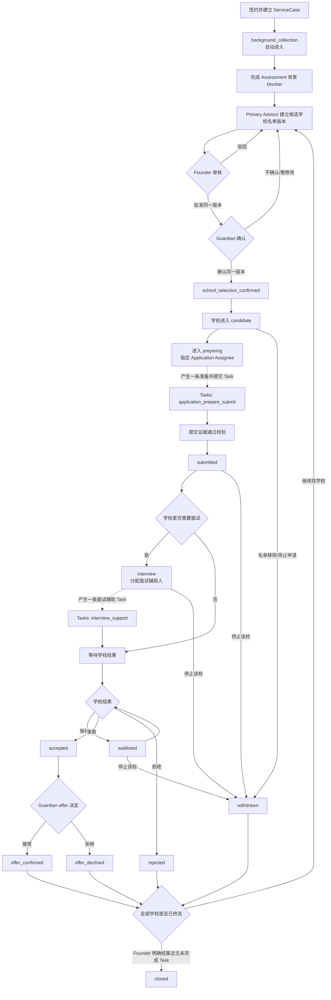

# Cases 案件流程与状态机

状态：`approved`  
确认依据：项目负责人于 2026-08-25 确认 ServiceCase/SchoolTarget 双层状态、名单两层确认、Task 产生点、拒绝后的双分支和 Founder 人工结案规则  
设计日期：2026-08-25  
业务基线：`BR-BASELINE-20260825-v32`

返回[业务流程与状态机索引](README.md)。

业务依据：[Cases 业务需求](../../business-requirements/30-cases.zh-CN.md)、[Tasks 业务需求](../../business-requirements/40-tasks.zh-CN.md)。  
模块依据：[Cases 模块契约](../10-module-contracts/50-cases.zh-CN.md)、[Tasks 模块契约](../10-module-contracts/60-tasks.zh-CN.md)。

## 1. 先看一张总图



理解这张图只需要记住两层：

1. **ServiceCase** 表示案件整体走到哪一个里程碑。
2. **SchoolTarget** 表示每一所学校的申请走到哪一个状态。

一所学校被拒绝，不等于整个案件自动结案；可以建立新名单，也可以由 Founder 明确结案。

## 2. 角色先厘清

| 角色/关系 | 在本流程中的职责 |
| --- | --- |
| Founder | 审核候选学校名单；可操作符合条件的案件暂停/恢复；最终人工结案 |
| Primary Advisor | 日常推进案件；填写 Assessment；建立名单；代录 Guardian 确认；负责案件和学校申请 |
| Case Collaborator | 仅在明确案件范围和 capability 内协作；可担任 Application Assignee 或面试辅助人 |
| Application Assignee | 负责一所学校的“准备并提交申请”Task；只能是 Primary Advisor 或有案件授权的 Case Collaborator |
| Interview Support Assignee | 负责面试辅助 Task；可为 Primary Advisor、Advisor Case Collaborator 或 Contractor |
| Guardian | 通过人工渠道作出名单确认和 offer 决定；Release 1 由 Primary Advisor 代录，不直接写入系统 |
| Contractor | 只访问当前分配的面试辅助 Task 脱敏工作区；不成为案件成员 |
| Admin | 基础角色默认不参与案件流程；只有同时取得 Advisor 角色并满足案件关系时，按 Advisor 关系访问 |

## 3. ServiceCase 全局里程碑

这是案件整体的线性里程碑，不能被逐校状态替代：

```text
signed
  -> background_collection
  -> school_selection_confirmed
  -> application_in_progress
  -> closed
```

| 当前里程碑 | 触发动作 | 下一个里程碑 | 必需条件 | 是否自动 |
| --- | --- | --- | --- | --- |
| 无 | 建立已签约 ServiceCase 并指定 Primary Advisor | `background_collection` | active Student、active Primary Advisor、approved K12 manifest、签约事实 | 是，建案事务内完成 |
| `background_collection` | Assessment 背景 blocker 完成、名单两层确认完成 | `school_selection_confirmed` | Founder 批准与 Guardian 确认绑定同一名单版本 | 是，由名单确认事实触发 |
| `school_selection_confirmed` | 至少一所已确认学校进入 `preparing` | `application_in_progress` | 已指定 Application Assignee，并产生申请 Task 请求 | 是 |
| `application_in_progress` | Founder 提交人工结案 | `closed` | 所有 Target 终态；无未完成 Case Task；结案结果和原因完整 | **否，必须人工** |

补充规则：

- `signed` 不是长期停留状态；建案成功后立即进入 `background_collection`。
- Assessment 的 `background_complete` 是事实，不单独成为 ServiceCase 里程碑。
- `school_selection_confirmed` 表示名单确认完成，不表示任何学校已经提交申请。
- `application_in_progress` 不代表所有学校都已提交，只表示至少一所确认学校进入申请处理。
- `closed` 永远不能重新打开；重新签约必须建立新的 ServiceCase。

## 4. 案件生命周期覆盖状态

`workflow_status` 与上面的里程碑分开保存：

```text
active <-> paused
active -> termination_pending -> closed
active -> closed
```

| 状态 | 进入条件 | 业务效果 |
| --- | --- | --- |
| `active` | 正常案件 | 可以按当前里程碑推进 |
| `paused` | 没有任何 Target 达到 `submitted` 或后续状态；Primary Advisor 或 Founder 执行暂停 | 暂停正常推进；保留原里程碑、Task 和 due_at |
| `termination_pending` | 客户终止整体服务 | 进行中 Target 先转 `withdrawn`，请求取消未完成 Task，等待取消结果 |
| `closed` | Founder 人工结案 | 只读历史；不能重新打开 |

暂停规则：

- 暂停必须记录原因、操作者、时间。
- Guardian 只能提出暂停请求，不能直接改变状态。
- 暂停期间不推进 Assessment、名单或 SchoolTarget。
- 外部截止日期和 Task due_at 继续计算，不自动顺延；逾期提醒继续。
- 已正式提交的单校申请不能通过暂停 Case 停止，必须把该 Target 记为 `withdrawn`。

## 5. SchoolTarget 逐校状态机

```text
candidate -> preparing -> submitted
submitted -> interview                         （需要面试）
submitted / interview -> waitlisted / accepted / rejected
waitlisted -> accepted / rejected
accepted -> offer_confirmed / offer_declined
preparing / submitted / interview / waitlisted -> withdrawn
```

| 当前状态 | 触发动作 | 下一状态 | 前置条件 | 任务/证据 |
| --- | --- | --- | --- | --- |
| `candidate` | 同一名单版本已获 Founder 批准且 Guardian 确认 | `preparing` | 当前 Target 在确认名单内；指定 Application Assignee | 发布申请 Task 请求 |
| `preparing` | Application Task 完成并提交提交事实 | `submitted` | 提交时间、渠道、提交人、材料清单完成；有学校参考号，或“无参考号”声明+替代凭证 | Cases 重验后推进 |
| `submitted` | 学校明确要求面试 | `interview` | 保存面试时间/方式/语言等事实 | 发布面试辅助 Task 请求 |
| `submitted` / `interview` | 学校反馈候补 | `waitlisted` | 保存学校结果事实 | 不自动产生新 Task |
| `submitted` / `interview` / `waitlisted` | 学校发出 offer | `accepted` | 保存 offer 事实 | 等待 Guardian 决定 |
| `submitted` / `interview` / `waitlisted` | 学校拒绝 | `rejected` | 保存拒绝事实 | 终态 |
| `waitlisted` | 学校转为 offer | `accepted` | 保存新的结果版本 | 等待 Guardian 决定 |
| `accepted` | Guardian 接受 offer | `offer_confirmed` | Primary Advisor 代录实际 Guardian、结果、时间、渠道 | 终态；不自动结案 |
| `accepted` | Guardian 拒绝 offer | `offer_declined` | 同上 | 终态；不自动结案 |
| `preparing` / `submitted` / `interview` / `waitlisted` | 停止该校申请或从新名单移除 | `withdrawn` | 保存原因、操作者、时间；取消未完成相关 Task | 终态 |

不需要面试的学校从 `submitted` 直接等待结果。`interview_support` Task 完成只表示辅助工作完成，不代表学校结果。

## 6. 哪些节点会产生 Task

Release 1 自动 Task 只有两类：

| 产生节点 | Task 类型 | 指派对象 | 是否推进业务状态 |
| --- | --- | --- | --- |
| Target 进入 `preparing` | `application_prepare_submit` | Application Assignee：Primary Advisor 或有案件授权的 Case Collaborator | Task 完成后，由 Cases 重验并推进 `submitted` |
| Target 进入 `interview` | `interview_support` | 默认 Primary Advisor；也可为 Advisor Case Collaborator 或 Contractor | Task 完成不改变 Target 状态 |

以下节点不自动生成 Task：

- Assessment 背景收集。
- Founder 审核候选名单。
- Guardian 名单确认。
- 等待学校结果。
- Guardian offer 决定。
- Founder 人工结案。

Primary Advisor 可以按实际需要手工创建 `manual` Task，但手工 Task 不得自动推进 Case 或 SchoolTarget。

## 7. “全部学校拒绝”时的双分支

系统不得自动结案。Founder 和 Primary Advisor 看到两个明确分支：

```text
全部 Target 已终态且都是 rejected
  ├─ 建立新候选学校名单版本
  │    -> Founder 批准
  │    -> Guardian 确认
  │    -> 新学校进入申请流程
  └─ Founder 明确人工结案
       -> 填写结案结果和原因
       -> 检查无未完成 Task
       -> ServiceCase = closed
```

新名单版本只比较 School ID 和申请轮次：

- 未变化的学校保留原 Target、Task 和状态。
- 新增学校在两层确认后创建/启用 Target 并进入 `preparing`。
- 被移除且仍在进行中的学校转为 `withdrawn`，取消未完成 Task。
- 已终态学校保留原结果，不被新名单改写。

## 8. 终止服务与结案

### 8.1 客户终止服务

1. Cases 将所有进行中 Target 转为 `withdrawn`。
2. Cases 发布取消 Task 请求。
3. Tasks 取消未完成 Task 并保留历史。
4. Cases 进入 `termination_pending`。
5. Founder 确认没有未完成 Task 后人工结案。

### 8.2 Founder 人工结案检查清单

- 所有已确认 Target 都是 `offer_confirmed`、`offer_declined`、`rejected` 或 `withdrawn`。
- 不存在 `preparing`、`submitted`、`interview`、`waitlisted`、`accepted`。
- Tasks 权威查询确认没有未完成 Case Task。
- Founder 填写结案结果、原因、操作者和时间。
- 结案后 ServiceCase、Target、Task 和所有历史永久保留。

## 9. 事件与一致性边界

Cases 负责写自己的事实；Tasks 负责写 Task。双方通过可靠事件协作：

| 事件 | 发布者 | 消费者 | 关键规则 |
| --- | --- | --- | --- |
| `cases.application_task_requested` | Cases | Tasks | 同一 Target/申请轮次幂等创建一条准备并提交 Task |
| `cases.interview_required` | Cases | Tasks | 同一 Target/面试版本幂等创建一条辅助 Task |
| `tasks.application_submission_completed` | Tasks | Cases | Cases 重新检查 Target、Assignee 和提交证据后才进入 `submitted` |
| `tasks.interview_support_completed` | Tasks | Cases/Audit | 不直接推进 Target |
| `cases.target_withdrawn` | Cases | Tasks/Notifications/Audit | 请求取消未完成 Task，保留全部历史 |
| `cases.case_closed` | Cases | Tasks/Notifications/Audit/Operations | 只在 Founder 结案事务提交后发布 |

事件只携带 opaque ID、状态、版本、effect code 和受控原因，不携带 Guardian 联系方式、Assessment 原文、文件内容或完整请求。

## 10. 待本次确认的内容

请确认以下 5 点：

1. ServiceCase 全局里程碑与 SchoolTarget 逐校状态分开管理。
2. 候选名单顺序固定为：Primary Advisor 建立 → Founder 批准/驳回 → Guardian 确认 → 进入申请。
3. `preparing` 产生一条“准备并提交申请”Task；需要面试时再产生一条面试辅助 Task。
4. 全部学校拒绝时不自动结案，保留“新建名单”或“Founder 明确结案”两条分支。
5. 只有 Founder 可以人工结案；结案前必须所有 Target 终态且没有未完成 Task。

本文件已确认。下一步进入 Tasks 流程设计。
