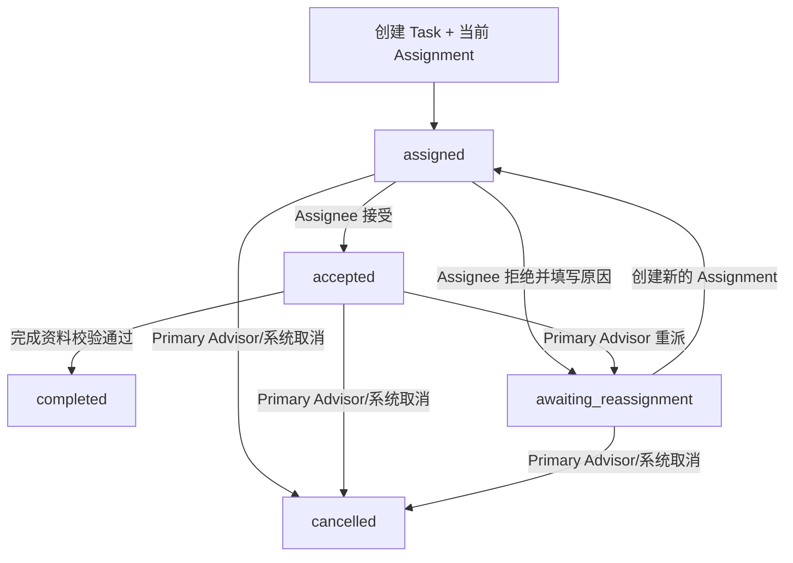

# Tasks 任务流程与状态机

状态：`approved`  
确认依据：项目负责人于 2026-08-25 确认三类 Task、Assignment 生命周期、申请/面试自动任务、逾期与暂停规则及 Cases 重验边界  
设计日期：2026-08-25  
业务基线：`BR-BASELINE-20260825-v32`

返回[业务流程与状态机索引](README.md)。

业务依据：[Tasks 业务需求](../../business-requirements/40-tasks.zh-CN.md)、[Cases 业务需求](../../business-requirements/30-cases.zh-CN.md)。  
模块依据：[Tasks 模块契约](../10-module-contracts/60-tasks.zh-CN.md)、[Cases 模块契约](../10-module-contracts/50-cases.zh-CN.md)。

## 1. 先看结论

Tasks 只回答：

> 谁在什么时候完成哪项工作？当前分派是谁？工作是否已接受、完成、取消或逾期？

Tasks 不决定 Case 或 SchoolTarget 的业务状态。Task 完成后只发布事实，Cases 重新检查后才推进案件或学校申请。

Release 1 只有三类 Task：

| Task 类型 | 创建来源 | 完成后的效果 |
| --- | --- | --- |
| `application_prepare_submit` | SchoolTarget 进入 `preparing` | 发布申请提交完成事实；Cases 重验后才进入 `submitted` |
| `interview_support` | SchoolTarget 进入 `interview` | 只表示面试辅助工作完成，不改变学校结果 |
| `manual` | 当前 Primary Advisor 人工创建 | 只记录工作完成，不自动推进任何业务状态 |

## 2. 任务生命周期



长期 Task 状态只有：

```text
assigned
accepted
awaiting_reassignment
completed
cancelled
```

说明：

- `rejected`、`reassigned` 是 Assignment 的结束事实，不是 Task 长期状态。
- `overdue` 不是状态，而是计算值：当前时间超过 `due_at` 且 Task 不是 `completed/cancelled`。
- `completed` 和 `cancelled` 是终态，不能重新打开。
- Task、Assignment 和 TransitionReceipt 永久保留，不物理删除。

## 3. 自动任务产生点

| 业务节点 | Cases 发布事实 | Tasks 动作 | 幂等边界 |
| --- | --- | --- | --- |
| SchoolTarget 进入 `preparing` | `cases.application_task_requested` | 创建一条“准备并提交申请”Task，并建立第一条 Assignment | 同一 Case、SchoolTarget、申请轮次只能一条 |
| SchoolTarget 进入 `interview` | `cases.interview_required` | 创建一条面试辅助 Task，并建立第一条 Assignment | 同一 SchoolTarget、面试事件/version 只能一条 |

自动任务必须由 Cases 的权威事件创建，不能由页面发现状态后自行补建。重复事件只返回原 Task，不产生第二条副作用。

## 4. 申请准备/提交 Task

### 4.1 创建

SchoolTarget 进入 `preparing` 时：

1. Cases 确定当前 Application Assignee。
2. Application Assignee 只能是当前 Primary Advisor，或有明确案件授权的 Case Collaborator Advisor。
3. Contractor 不能担任 Application Assignee。
4. Tasks 创建一条 `application_prepare_submit` Task。
5. 同一条 Task 同时负责准备和正式提交，不拆成两个 Task。

### 4.2 完成条件

Assignee 完成前必须提交：

- 正式提交时间；
- 提交渠道；
- 实际提交人；
- 当期材料清单完成状态/快照；
- 学校参考号，或明确“学校未提供参考号”；
- 如果无参考号，至少一份确认页、确认邮件 PDF、回执或邮寄凭证等 Case Document 引用。

Tasks 校验完成资料后发布 `tasks.application_submission_completed`。Cases 再检查当前 Target、当前 Assignee、版本和凭证有效性，检查通过才将 Target 设为 `submitted`。

## 5. 面试辅助 Task

SchoolTarget 进入 `interview` 时：

1. Cases 保存学校明确要求面试的事实。
2. Cases 发布 `cases.interview_required`。
3. Tasks 创建一条 `interview_support` Task。
4. 默认指派当前 Primary Advisor。
5. 也可以指派有案件授权的 Advisor Case Collaborator，或 Contractor。

面试辅助 Task 只表示辅助工作完成，不代表面试结果、录取、候补或拒绝。完成后发布 `tasks.interview_support_completed`，Cases 不因该事件自动改变学校结果。

Contractor 只可看到脱敏工作区：

- Task 标题和辅导要求；
- 目标学校；
- 面试时间、方式和语言；
- due_at、当前 Assignment 和允许动作。

不得看到完整 Assessment、Guardian 联系方式、内部备注、Case 文件、其他学校或其他案件。

## 6. Assignment 分派流程

```text
创建 Task
  -> 建立 assigned Assignment
  -> Assignee 接受：accepted
  -> Assignee 拒绝：当前 Assignment 结束，Task = awaiting_reassignment
  -> Primary Advisor 重派：旧 Assignment 结束，新 Assignment = assigned
```

| 动作 | 可执行者 | 必填内容 | 结果 |
| --- | --- | --- | --- |
| 接受 Assignment | 当前 Assignee | expected version | Assignment accepted；Task accepted |
| 拒绝 Assignment | 当前 Assignee | 拒绝原因 | 旧 Assignment ended；Task awaiting_reassignment |
| 重派 Task | 当前 Primary Advisor | 新 Assignee、原因、expected version | 旧 Assignment ended；同一 Task 新建 assigned Assignment |
| 取消 Task | 当前 Primary Advisor，或 Cases 受信取消事件 | 原因 | Task cancelled；保留历史 |
| 完成 Task | 当前 accepted Assignee | 按 task_type 提交完整完成资料 | Task completed；发布完成事实 |

重派不创建新的 Task，不复活旧 Assignment。Assignment 结束后，下一次请求立即重新检查访问权限。

## 7. Manual Task

只有当前 Primary Advisor 可以为自己负责的 active Case 创建 `manual` Task。

必填：

- 明确标题；
- 工作说明；
- `due_at`；
- 合规 Assignee；
- 任务完成时需要的简短完成说明。

Manual Task：

- 不自动推进 Case；
- 不自动推进 SchoolTarget；
- 不能绕过申请提交 Task 的完成证据；
- 指派给 Contractor 时，只能是面试辅助类任务的脱敏范围，不能借此扩大案件访问权。

## 8. 暂停、逾期和取消

### 8.1 案件暂停

- Case 暂停不自动取消 Task。
- 原 Task 和 Assignment 保留原记录。
- `due_at` 不自动顺延。
- `overdue` 继续按当前时间计算。
- 逾期提醒继续，直到 Task completed/cancelled，或有权命令明确修改截止时间。

### 8.2 学校从名单移除

Cases 将仍在进行中的 SchoolTarget 设为 `withdrawn`，并发布取消请求。Tasks 取消该 Target 的未完成 Task；已完成 Task 不回滚、不删除。

### 8.3 整体终止服务

Cases 将所有进行中的 Target 设为 `withdrawn`，发布 Case 级取消请求。Tasks 取消该 Case 的未完成 Task，记录操作者/时间/原因，并保留全部历史。

重复取消事件必须幂等返回原结果。

## 9. 角色边界

| 角色/关系 | 查看范围 | 可执行动作 |
| --- | --- | --- |
| Primary Advisor | 自己负责的 Case Task | 创建 manual、接受、完成、重派、取消 |
| Founder | 组织内授权范围的 Case Task | 查看和必要的治理操作；不逐条审批 completed |
| Advisor Assignee | 当前 Assignment 授权范围 | 接受、拒绝、完成自己的 Task |
| Case Collaborator Advisor | 指定 Case 和当前 Assignment | 仅处理被分派的 Task |
| Contractor | 当前 interview support Assignment | 只能操作当前脱敏 Task |
| Admin 基础角色 | 默认无客户 Task | 只有同时拥有 Advisor 角色和案件关系时按对应关系访问 |
| Guardian、Student、Portal | 不直接访问内部 Task | 无内部 Task 命令 |

每次请求都重新检查 Organization、Case、Task、Assignment、Membership、RoleBinding 和 expected version。客户端传入的角色、Task ID 或缓存状态不能作为授权依据。

## 10. 跨模块事件边界

```text
Cases 写 SchoolTarget
  -> Outbox: application_task_requested / interview_required
  -> Tasks 写 Task + Assignment
  -> Tasks 完成 Task
  -> Outbox: application_submission_completed / interview_support_completed
  -> Cases 重验后决定是否推进 SchoolTarget
```

硬规则：

- Cases 不写 Tasks 私有表。
- Tasks 不写 Cases 私有表。
- Task 完成不能直接修改 Case 或 SchoolTarget。
- Notifications 只消费 reminder facts，不改变 Task 状态。
- 事件只携带 opaque ID、状态、版本、effect code 和受控原因，不携带 PII、Assessment 原文或文件内容。

## 11. 本模块待确认内容

请确认以下 7 点：

1. Tasks 只保留三类 Task：申请准备/提交、面试辅助、manual。
2. Task 长期状态采用 `assigned → accepted → completed`，拒绝进入 `awaiting_reassignment`，取消进入 `cancelled`。
3. 重派复用同一 Task，只新增 Assignment，不创建替代 Task。
4. `preparing` 产生一条准备并提交 Task，完成条件必须包含提交资料和参考号/替代凭证。
5. 面试辅助 Task 完成不推进学校结果。
6. overdue 是计算值；暂停不顺延截止时间，也不自动取消 Task。
7. Task 完成只发布事实，由 Cases 重新校验后推进业务状态。

本文件已确认。下一步进入 Documents 流程设计。
