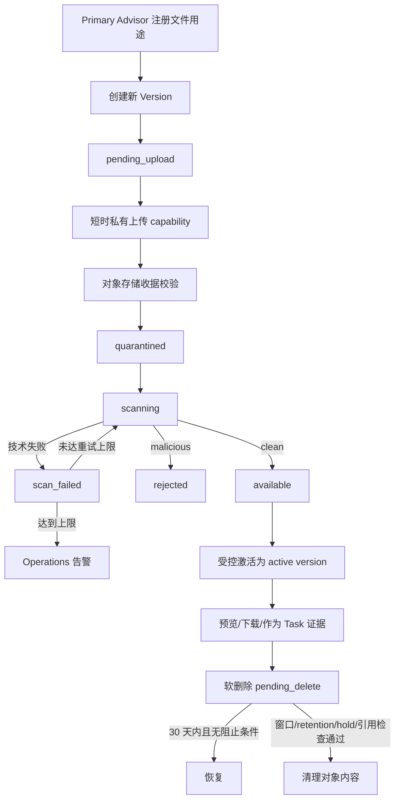

# Documents 文件流程与状态机

状态：`approved`  
确认依据：项目负责人于 2026-08-25 确认 Case 授权根、扫描后可用版本、Application Assignee 学校范围、短时 capability 和文件清理门禁  
设计日期：2026-08-25  
业务基线：`BR-BASELINE-20260825-v32`

返回[业务流程与状态机索引](README.md)。

业务依据：[Documents 业务需求](../../business-requirements/60-documents.zh-CN.md)。  
模块依据：[Documents 模块契约](../10-module-contracts/70-documents.zh-CN.md)、[Tasks 模块契约](../10-module-contracts/60-tasks.zh-CN.md)。

## 1. 先看结论

Documents 只负责文件本身：

- 文件 metadata、用途和 Case/SchoolTarget 关联；
- 不可变版本；
- 隔离、扫描、可用和拒绝状态；
- 上传、下载、预览和删除前的资源级授权；
- 短时 capability 和审计。

Documents 不决定 Case、SchoolTarget 或 Task 是否推进。

文件始终以 Case 为授权根；需要学校范围时，再检查具体 SchoolTarget 和当前 Application Assignee。

## 2. 文件总流程



## 3. Version 状态

### 3.1 上传与扫描状态

```text
pending_upload -> quarantined -> scanning -> available
pending_upload -> abandoned
scanning -> rejected
scanning -> scan_failed -> scanning       （有界重试）
```

| 状态 | 谁能触发 | 含义 | 能否被普通用户读取 |
| --- | --- | --- | --- |
| `pending_upload` | Primary Advisor/Application Assignee | 已注册 Version，等待对象上传 | 只能看上传进度，不可预览/下载 |
| `quarantined` | 服务端收据处理 | 对象已收到但尚未完成扫描 | 否 |
| `scanning` | 受信扫描 Worker | 正在扫描 | 否 |
| `available` | 受信扫描 Worker/服务端 | 扫描 clean 且可供授权使用 | 是，但仍需逐次授权 |
| `rejected` | 受信扫描 Worker | 扫描发现恶意或不允许内容 | 否，不返回文件内容 |
| `scan_failed` | 受信扫描 Worker | 技术失败，等待有界重试 | 否 |
| `abandoned` | 上传流程操作者/系统 | 上传未完成且不再继续 | 否 |

只有 `available`、clean、未 revoked 的 Version 可以成为 active version、预览、下载或作为 Task 完成证据。

### 3.2 Document 删除生命周期

```text
active -> pending_delete -> active       （30 天恢复窗口）
active -> pending_delete -> deleted      （满足清理门禁）
```

- soft-delete 不删除数据库记录，也不立即删除对象内容。
- 30 天是默认恢复窗口，不是自动清理日期。
- `deleted` 只表示对象内容已清理；Document、Version、ScanResult metadata 仍保留为 tombstone。
- legal hold 期间不能进入最终清理；已 pending_delete 的文件也被冻结。
- 文件删除、恢复或清理不改变 Student、Case、Task 或 SchoolTarget 状态。

## 4. 谁可以做什么

| 访问者 | 查看/下载 | 上传新版本 | 删除/恢复 | 限制 |
| --- | --- | --- | --- | --- |
| Founder | 组织内授权 Case 文件 | 按授权流程 | 可设置/解除 legal hold；不因 Founder 身份自动改变业务状态 | 仍需资源级授权 |
| 当前 Primary Advisor | 自己 Case 文件 | 可以 | 可以处理自己 Case 文件 | 必须通过当前 Case 关系 |
| 当前 Application Assignee | 仅负责 SchoolTarget 的必要文件 | 可上传该校 `submission_evidence` | 不得扩大到其他学校 | 职责失效后立即失权 |
| 其他 Case Collaborator | 默认不能访问 | 默认不能上传 | 不能 | 成为当前 Application Assignee 后只获该校范围 |
| Interview Support Assignee/Contractor | 不能 | 不能 | 不能 | 不得进入文件工作区 |
| Admin 基础角色 | 默认不能查看客户文件 | 不能 | 不能 | 只有兼具 Advisor 角色和案件关系时按关系访问 |
| Guardian、Student、Portal | 不能 | 不能 | 不能 | Release 1 无外部文件入口 |

Application Assignee 每次请求必须同时满足：

1. 当前 active Membership、Advisor RoleBinding；
2. Case 当前有效且属于当前组织；
3. 是该 SchoolTarget 当前 Application Assignee；
4. Document 明确关联该 SchoolTarget，或被标记为该校可复用材料；
5. Version 是 clean、available、未 revoked。

## 5. 上传流程

```text
注册 Document/Version
  -> 服务端签发短时私有上传 capability
  -> 对象存储返回收据
  -> 服务端校验固定对象/Version/checksum/size
  -> quarantined
  -> Worker 扫描
```

规则：

- 上传前重验 actor、organization、Case、SchoolTarget 用途和 expected version。
- capability 绑定精确 Version、对象引用、content type、checksum、size 和短 TTL。
- 对象引用只使用 opaque ID，不包含姓名、学校名、Case number 或原始文件名。
- 客户端说“上传成功”不能直接进入 available；必须有服务端对象收据。
- 重复对象收据或 Worker 投递必须幂等，不得重复创建 Version、ScanResult 或激活事件。
- Application Assignee 仅可上传自己负责学校的提交凭证；不能借上传取得其他文件权限。

## 6. 扫描流程

1. 服务端将对象放入隔离状态。
2. 受信 Worker 校验对象引用、Version、scan policy/version 和 attempt。
3. 扫描结果为 clean：Version 进入 `available`，按命令激活。
4. 结果为 malicious：进入 `rejected`，通知 Founder/Primary Advisor 的方式由 Notifications 决定，但不泄露原始扫描输出。
5. 技术失败：进入 `scan_failed`，按固定策略有界重试。
6. 达到重试上限：保留失败记录并产生 Operations 告警；不能静默变为 available。

扫描结果、policy version、attempt 和时间不可改写。后续生产对象存储/扫描 provider 属于独立 adapter 验证，不在本流程中冻结具体云产品实现。

## 7. 激活、预览与下载

### 7.1 激活

只有满足以下条件才允许把 Version 设为 active：

- 状态为 `available`；
- 扫描结果为 clean；
- Version 未 revoked；
- Document 当前 expected version 未变化；
- 发起者具有该 Document 的资源级授权。

新版本激活不会覆盖旧 Version；旧的 clean Version 仍保留 `available`，active 只是 Document 的当前指针。

### 7.2 预览/下载

- 文件没有公开 URL。
- 预览和下载使用相同的文件级授权，预览不降低权限。
- 每次请求重新检查 actor、Case、SchoolTarget 用途、active Version、scan 和 revoke 状态。
- capability 只指向授权当时确认的精确 Version，过期后必须重新申请。
- 批量导出不能扩大单文件权限；每个文件都要重新检查。
- 私有对象引用、capability、Cookie 和文件内容不进入日志、通知或普通 Audit 摘要。

## 8. 与 Task 的关系

Application Task 完成时，Tasks 只提交 Document opaque ID 引用。Documents 必须重新验证：

- 文件属于当前 Case；
- 文件用途属于当前 SchoolTarget；
- Version 为 clean、available、未 revoked；
- 当前 Assignee 在提交时仍有该校权限。

Documents 不因“文件存在”自动完成 Task，也不因 Task 完成自动改变文件生命周期。

## 9. 删除、恢复与最终清理

### 9.1 Soft-delete

- 当前 Primary Advisor 可对自己 Case 的 active Document 发起 soft-delete。
- 理由和 expected version 必填。
- 有 legal hold 时禁止新发起 soft-delete；已 pending_delete 的文件暂停清理计时。

### 9.2 Restore

- 默认只允许在 soft-delete 后 30 天内恢复。
- 恢复时必须重新检查当前 Case、文件授权、clean Version 和 expected version。
- 恢复只移动生命周期状态，不改写 Version 或扫描历史。

### 9.3 最终清理

最终清理必须同时满足：

- 恢复窗口已过；
- 适用 retention 已到期；
- 无 legal hold；
- 无有效业务引用；
- Founder 明确批准。

业务 retention 年限尚未冻结；未配置有效 retention 时必须 fail closed，不得清理。清理只删除对象内容，数据库 metadata、Version、ScanResult、批准和审计历史保留。

## 10. 文件流程中的事件

| 事件 | 发布者 | 消费者 | 作用 |
| --- | --- | --- | --- |
| `documents.document_registered` / `version_created` | Documents | Audit/Operations | 建立文件和版本历史 |
| `documents.object_quarantined` | Documents | 扫描 Worker/Audit | 进入隔离处理 |
| `documents.version_available` | Documents | Tasks/Founder/Primary Advisor | 可进入授权使用流程 |
| `documents.version_rejected` | Documents | Founder/Primary Advisor/Operations | 失败处理和告警 |
| `documents.scan_retry_exhausted` | Documents | Operations | 记录不可自动恢复的技术告警 |
| `documents.active_version_changed` | Documents | Tasks/Audit | 更新可用证据引用 |
| `documents.soft_deleted` / `restored` | Documents | Tasks/Audit/Operations | 文件治理历史 |
| `documents.content_purged` | Documents | Founder/Audit/Operations | 对象内容已清理，metadata 仍保留 |

事件只携带 opaque ID、状态、版本、受控 reason code 和必要关联 ID，不携带文件名、姓名、Case number、对象 key、URL、文件内容或扫描原始输出。

## 11. 本模块待确认内容

请确认以下 7 点：

1. 文件全部以 Case 为授权根，需要学校范围时再检查 SchoolTarget 和 Application Assignee。
2. 文件状态严格经过隔离和扫描；只有 clean、available、未撤销版本才能使用。
3. Application Assignee 只访问自己负责学校的必要文件，并可上传该校提交凭证。
4. Interview Assignee、Contractor、Guardian、Student、Portal 和基础 Admin 均不能访问内部文件。
5. 文件没有公开 URL，每次预览/下载都重新授权并使用短时 capability。
6. 删除先进入 30 天恢复窗口；暂停、legal hold 或 retention 不明确时不得最终清理。
7. 最终清理只清对象内容，数据库 metadata、版本、扫描和审计历史保留。

本文件已确认。下一步进入 Notifications 流程设计。
