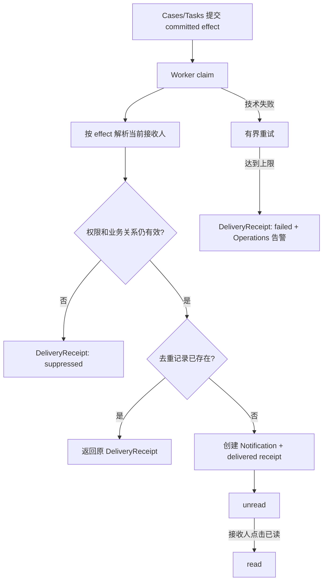

# Notifications 通知流程与状态机

状态：`approved`  
确认依据：项目负责人于 2026-08-25 确认站内唯一渠道、九类 effect、香港业务日期提醒、接收人去重和 suppressed 规则  
设计日期：2026-08-25  
业务基线：`BR-BASELINE-20260825-v32`

返回[业务流程与状态机索引](README.md)。

业务依据：[Notifications 模块契约](../10-module-contracts/80-notifications.zh-CN.md)。

## 1. 先看结论

Release 1 的通知只有一种渠道：**站内通知**。

Notifications 只负责：

- 根据已提交的业务 effect 解析当前接收人；
- 创建站内提醒；
- 标记已读；
- 处理去重、重试、抑制和失败。

Notifications 不负责：

- 创建 Task；
- 修改 Case、SchoolTarget 或审批结果；
- 发送 Email、SMS、WhatsApp 或 Push；
- 把 Guardian、Student 或 Portal 映射成内部通知用户。

## 2. 通知流程



用户可见状态只有：

```text
unread -> read
```

被抑制或最终失败的投递只保留 `DeliveryReceipt`，不创建用户可见 Notification。

## 3. Effect 目录

| Effect | 触发事实 | 接收人 |
| --- | --- | --- |
| `task_assigned` | Task 首次分配 | 当前实际 Assignee |
| `task_reassigned` | 同一 Task 新建 Assignment | 新 Assignee |
| `task_rejected` | Assignee 拒绝当前 Assignment | 当前 Primary Advisor |
| `candidate_list_review_requested` | 候选名单提交 Founder 审批 | 所有 active Founder |
| `candidate_list_reviewed` | Founder 批准或驳回名单 | 当前 Primary Advisor |
| `task_due_in_3_days` | Task 距 due_at 3 天 | 实际 Assignee、当前 Primary Advisor |
| `task_due_in_1_day` | Task 距 due_at 1 天 | 实际 Assignee、当前 Primary Advisor |
| `task_overdue_daily` | Task 逾期且未完成/取消 | 实际 Assignee、Primary Advisor、所有 active Founder |
| `case_closure_choice_required` | 所有 Target 终态且没有未完成 Task | 当前 Primary Advisor、所有 active Founder |

补充规则：

- Founder 审批后 Guardian 确认，由 `candidate_list_reviewed` 提醒 Primary Advisor 跟进。
- Guardian 确认、等待学校结果、offer 决定和 Founder 结案本身不额外生成通知。
- 同一个人同时是 Assignee、Primary Advisor 和 Founder 时，只收到一条去重后的通知。
- 通知不是 Task，任何 effect 都不能自动创建 Task。

## 4. 提醒时间计算

调度器使用组织业务时区 `Asia/Hong_Kong` 计算业务日期：

```text
is_overdue = 当前时间 > due_at
             且 Task 不是 completed/cancelled
```

| 时间点 | 条件 | 行为 |
| --- | --- | --- |
| 到期前 3 天 | Task 仍未 completed/cancelled | 每个 Task/接收人生成一次 `task_due_in_3_days` |
| 到期前 1 天 | Task 仍未 completed/cancelled | 每个 Task/接收人生成一次 `task_due_in_1_day` |
| 到期后每天 | Task 仍未 completed/cancelled | 每个 Task/接收人每天生成一次 `task_overdue_daily` |

- Case 暂停不修改 due_at，也不停止逾期计算和提醒。
- 标记已读不停止未来日期提醒。
- due_at 或 Assignment 被有权命令修改后，下一次调度读取 Tasks 的最新事实。
- Task 完成或取消后，不再生成新的提醒。

## 5. 去重规则

```text
organization_id
  + recipient_user_id
  + effect_type
  + source_opaque_id
  + effect_version 或 Asia/Hong_Kong business_date
```

实际可以将以上内容编码为 `effect_idempotency_key`，但唯一约束必须包含接收人。

- 即时 effect 使用 Assignment ID、候选名单版本 ID 等稳定来源。
- 定时 effect 使用 Task ID + 香港业务日期。
- 同一 effect 重复投递、Worker 重启或并发 claim，都返回原 DeliveryReceipt。
- 不同 Task、不同名单版本或不同接收人不能错误合并。

## 6. 接收人解析与权限

生产者只发布 effect 和 opaque source ID，不直接指定最终通知权限。Notifications 创建通知前必须重新检查：

- User 当前 active；
- Membership 当前 active；
- RoleBinding 当前有效；
- Primary Advisor、Assignee 或 Founder 关系仍符合 effect；
- source Case/Task/名单版本仍然存在且 effect 仍适用。

| 接收人 | 规则 |
| --- | --- |
| 当前 Assignee | 只接收当前有效 Assignment 的 Task effect |
| 当前 Primary Advisor | 只接收自己负责 Case 的相关 effect |
| Founder | 只接收当前 active Founder RoleBinding 的组织内 effect |
| Admin 基础角色 | 不因 Admin 身份自动获得客户通知 |
| Guardian、Student、Portal | 不接收内部 Notifications |

失去权限、目标已失效或 effect 不再适用时，写入 `suppressed` DeliveryReceipt，不能通过旧通知泄露资源是否存在。

## 7. 投递、重试与失败

```text
committed outbox effect
  -> claim lease
  -> resolve recipient
  -> reauthorize
  -> Notification + DeliveryReceipt 同事务提交
```

- Worker 使用短 lease，崩溃后可安全重领。
- 技术失败默认最多重试 3 次。
- 达到上限后写 `failed` DeliveryReceipt，进入 dead letter，并产生 Operations 告警。
- 投递失败不回滚已经提交的 Task、Case 或审批事实。
- 抑制不是系统异常，不需要无限重试。

## 8. 用户已读流程

```text
unread -> read
```

- 只有 Notification 的 recipient 可以标记已读。
- 标记已读保存时间和 expected version。
- 重复标记已读返回原结果，不创建新通知或新业务事实。
- Release 1 不提供用户删除、撤回、静音或关闭必需通知的命令。

点击通知 target 时：

1. 使用当前 Session User，而不是通知中缓存的权限；
2. 重新查询目标对象授权；
3. 有权则进入固定内部路由；
4. 无权或目标失效则返回统一 unavailable，不泄露目标是否存在。

## 9. 可见内容

通知可见文案固定使用 `content_code + i18n`，Release 1 只展示类似：

```text
有待办事项需要处理
```

Notification 不显示：

- 姓名、电话、邮箱；
- Case number；
- 学校名；
- Task 标题；
- 文件名或文件内容；
- 自由文字原因；
- 私有 URL、对象 key、Token。

具体业务内容由点击后进入目标页面，再由 owning module 按当前授权查询。

## 10. 与其他模块的边界

| 事实 | owner | Notifications 的动作 |
| --- | --- | --- |
| Task、Assignment、due_at | Tasks | 消费 effect 或 reminder facts |
| 候选名单审核和 Case 结案选择 | Cases | 消费对应 effect |
| User、Membership、RoleBinding | Identity/Access | 请求时重新查询 |
| Outbox effect | Audit/Operations | 消费已提交事件 |
| 幂等执行记录 | Shared | 使用统一幂等技术原语 |

Notifications 不写这些模块的私有表；Route Handler 也不能直接写 Notification/DeliveryReceipt。

## 11. 本模块待确认内容

请确认以下 7 点：

1. Release 1 只有站内通知，不发送 Email、SMS、WhatsApp 或 Push。
2. 通知只由已确认的九类 effect 产生，不自动创建 Task。
3. 到期前 3 天、1 天和逾期每日提醒按香港业务日期执行。
4. Case 暂停不停止逾期计算和提醒，已读也不停止未来提醒。
5. 同一人兼任多个接收角色时只收到一条，不同 Task 不能错误合并。
6. 权限失效或 effect 失效时只写 suppressed receipt，不创建用户可见通知。
7. 通知只显示“有待办事项”，点击目标时重新授权，通知本身不是业务权限。

本文件已确认。下一步进入 Audit 与 Operations 流程设计。
