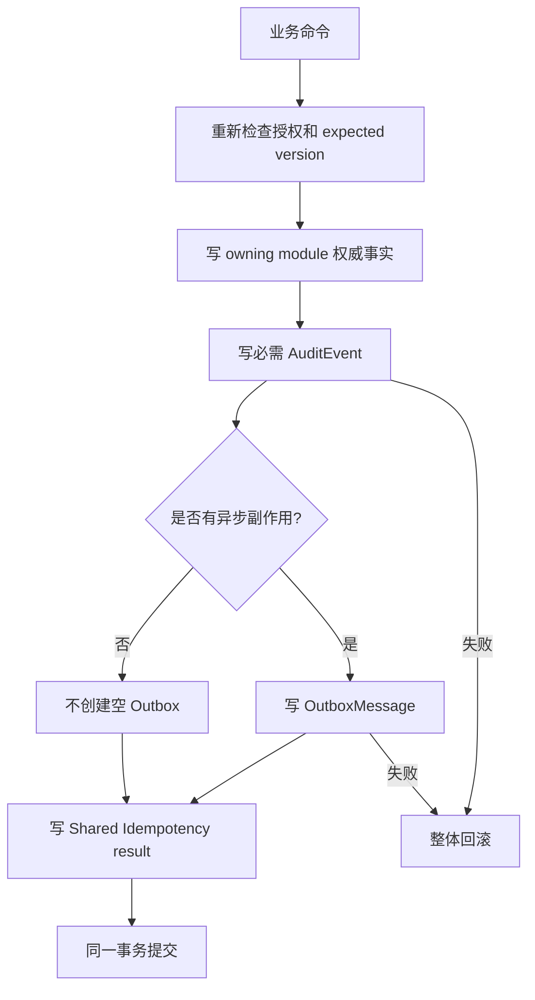
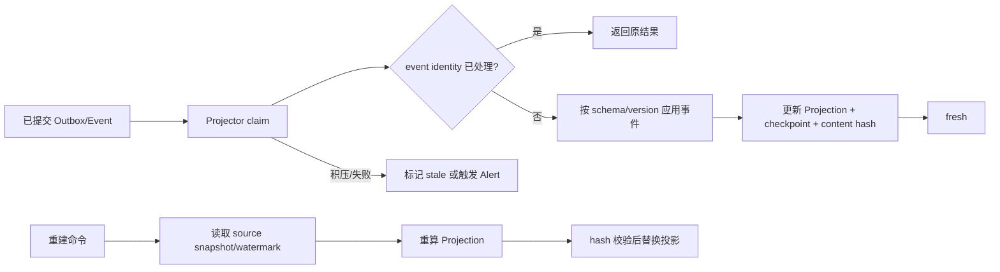

# Audit 与 Operations 流程与状态机

状态：`approved`  
确认依据：项目负责人于 2026-08-25 确认 Audit 永久证据、Outbox 重放、Operations 可重建投影、租户/平台边界和 Release 1 告警范围  
设计日期：2026-08-25  
业务基线：`BR-BASELINE-20260825-v32`

返回[业务流程与状态机索引](README.md)。

业务依据：[Audit 与 Operations 模块契约](../10-module-contracts/90-audit-operations.zh-CN.md)。

## 1. 先看结论

这个模块分成两条线：

```text
Audit      = 永久证据：发生了什么，谁做的，结果如何
Operations = 风险投影：系统哪里积压、失败或不健康
```

Audit 是不可改写证据；Operations 可以删除、重建和重新计算。Operations 不能成为授权来源，也不能直接修改 Case、Task、Document 或其他业务事实。

## 2. 业务写入与审计的原子流程



规则：

- 必需 AuditEvent 写失败，业务修改必须回滚。
- 有异步副作用时，Outbox 写失败也必须回滚。
- 没有异步副作用时只写 AuditEvent，不制造空 Outbox。
- 高风险读取必须先成功写 AuditEvent，再返回资料或 capability。
- 普通 telemetry sink 失败不回滚已经成功的业务，但要产生技术告警。

## 3. 哪些动作必须审计

以下动作必须产生追加式 AuditEvent：

- Case、SchoolTarget、Task、Document 和 Notification 的重要状态变化；
- RoleBinding、Membership、CaseCollaborator、ScopeGrant 等授权变化；
- Founder 批准/驳回、Guardian 代录名单确认、offer 决定和 Founder 人工结案；
- Task 分配、接受、拒绝、重派、完成和取消；
- 文件上传 capability、下载/预览/导出、版本激活、删除、恢复、legal hold 和最终清理；
- Student/Guardian soft-delete、恢复、重复记录处理和主要联系人变化；
- Assessment、客户文件、导出等高风险读取，包括允许和拒绝结果；
- Worker 扫描、通知投递、dead-letter 和人工重放。

普通低风险列表浏览和纯 UI 操作不逐条写 AuditEvent；可以写不含业务内容的 telemetry。

## 4. AuditEvent 规则

AuditEvent 只记录最小证据：

- organization、actor kind、实际 actor opaque ID；
- event/action/resource type 和 resource opaque ID；
- `succeeded`、`denied` 或 `failed`；
- occurred_at、request_id、event version、record version；
- 受控 reason code、before/after hash、causation/correlation opaque ID。

严格禁止：

- 只写“Founder”“管理员”等角色名称而不记录实际 User；
- 保存姓名、邮箱、电话、Assessment answer、文件正文、Cookie、Token、secret；
- 用自由文字理由复制业务模块正文；
- 用 AuditEvent 代替 owning module 的业务事实。

system/worker 动作使用明确的 `actor_kind` 和受控 job/run 或上游事件引用，不能伪装成用户操作。

## 5. Outbox 生命周期

```text
pending -> processing -> delivered
pending -> processing -> pending          （Worker 崩溃/有界重试）
pending -> processing -> dead_letter
```

| 状态 | 含义 | 是否终态 |
| --- | --- | --- |
| `pending` | 等待可领取 | 否 |
| `processing` | 某个 Worker 持有 lease | 否 |
| `delivered` | 已完成本次 effect 投递 | 是 |
| `dead_letter` | 达到重试上限，需要处理 | 是 |

规则：

- Worker 使用 lease、attempt count 和 expected version；崩溃后可以安全重领。
- 每个消费者都必须有自己的幂等；Outbox delivered 不等于消费者可以重复写副作用。
- 默认最多 3 次有界重试；达到上限进入 dead letter，并生成 OperationalAlert。
- dead letter 原记录不改写；人工重放创建新的 Outbox 记录，引用原记录和受控 replay reason。
- Outbox payload 只含 opaque ID、状态、版本、effect code 和受控标量。

## 6. Operations 投影流程



Operations 可以维护：

- Case 当前阶段、下一步 code、负责人 opaque ID、截止时间和异常 count；
- open/overdue Task count、SchoolTarget 状态 count；
- Notification delivery、Document scan、Outbox backlog 和 runtime health；
- projection lag、freshness 和重建结果。

投影只保存 opaque ID、状态 code、计数、截止时间、版本、source checkpoint 和 hash。不得保存姓名、联系方式、Assessment answer、文件名、文件内容或自由文字 next action。

页面需要显示业务名称时，先从投影取得 opaque ID，再向 CRM/Cases 按当前授权查询允许字段。

投影 stale 或 rebuilding 时必须明确显示；写入、审批、提交和结案仍直接查询权威模块，不依赖投影。

## 7. OperationalAlert 告警生命周期

```text
firing -> acknowledged -> mitigated -> closed
firing / acknowledged / mitigated -> needs_human
needs_human -> acknowledged / mitigated
```

| 状态 | 含义 |
| --- | --- |
| `firing` | 检测器确认风险正在发生 |
| `acknowledged` | 已有人接手处理，不代表风险消失 |
| `mitigated` | 已完成缓解动作，并记录 runbook 结果 |
| `closed` | 检测器确认恢复 |
| `needs_human` | 自动重试/缓解不足，必须人工处理 |

Release 1 告警目录只保留：

- Identity/Access 风险；
- Document scan stuck/dead-letter；
- Audit/Outbox stuck/dead-letter；
- Notifications delivery dead-letter、scheduler 落后；
- PII canary 和隐私违规；
- 香港区域/运行时故障；
- Projection lag、hash mismatch、rebuild mismatch。

不建立 budget、billing、import 或 backfill 告警。

告警只记录风险和处理状态，不能自动修改业务事实来“消除”告警。

## 8. 访问边界

| 访问者 | Audit | Operations |
| --- | --- | --- |
| Founder | 查看本组织租户审计脱敏摘要 | 查看组织 Case 风险、告警和 technical health |
| Primary Advisor | 不看全局 Audit | 只看当前授权 Case 的最小工作摘要 |
| Case Collaborator | 不直接看 Audit | 只看当前 scope 的最小投影 |
| Admin 基础角色 | 只看无客户内容的 technical health | 只看 technical health 和运行告警 |
| Contractor | 不可访问 | 不可访问 |
| Guardian、Student、Portal | 不可访问 | 不可访问 |
| Platform operator | 只看独立 platform audit/telemetry | 只看 platform technical health，不看租户内容 |

tenant Audit 与 platform audit 必须使用独立数据路径、查询入口和授权边界。平台人员不能借日志、投影、备份或审计读取租户内容。

## 9. 重放、失败与一致性

- 相同幂等命令重试返回第一次业务结果，不追加重复 AuditEvent、Outbox 或其他副作用。
- Outbox consumer 重复投递由消费者自己幂等；不能以“已经 delivered”代替业务事实校验。
- Projection 丢失可以从 source snapshot/watermark 重建；重建不得修改 AuditEvent 或业务事实。
- dead-letter 人工重放使用新的 replay reference；旧记录保持原状态和历史。
- 必需审计路径失败时 fail closed；普通 telemetry 失败时保留业务结果并生成告警。

## 10. 本模块待确认内容

请确认以下 8 点：

1. Audit 是永久追加式证据；Operations 是可重建投影。
2. 必需 AuditEvent 与业务修改同事务；无异步 effect 时不创建空 Outbox。
3. 高风险读取必须先审计成功再返回资料或 capability。
4. Outbox dead-letter 不改写，人工重放创建新记录并引用旧记录。
5. Operations projection 不保存姓名、联系方式、Assessment、文件内容或自由文字。
6. Founder 看租户审计；Admin 只看 technical health；平台人员不能读取租户内容。
7. Release 1 只保留运行、隐私和投影风险告警，不包含 budget、billing、import、backfill。
8. Operations 不能修改 Case、Task、Document 或其他业务权威事实。

本文件已确认。下一步进入 External Portal 流程设计。
