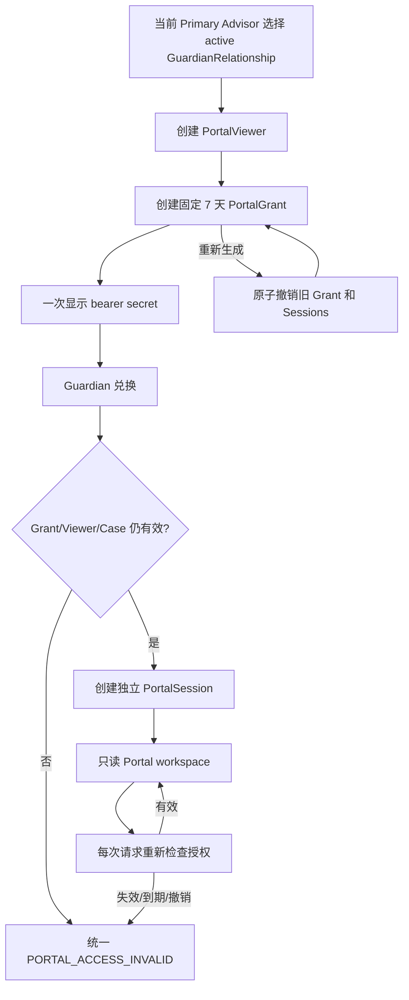

# External Portal 流程与状态机

状态：`approved`  
确认依据：项目负责人于 2026-08-25 确认 Guardian 单 Case 只读入口、Primary Advisor 签发、7 天期限、Session 安全边界和 Portal/内部系统隔离  
设计日期：2026-08-25  
业务基线：`BR-BASELINE-20260825-v32`

返回[业务流程与状态机索引](README.md)。

业务依据：[External Portal 与 Platform Billing 业务边界](../../business-requirements/80-portal-billing.zh-CN.md)。  
模块依据：[External Portal 模块契约](../10-module-contracts/100-external-portal.zh-CN.md)。

## 1. 先看结论

Portal 是一个单 Case、限时、只读的 Guardian 查看入口，不是家长版 ERP，也不是内部账号系统。

```text
GuardianRelationship
  -> PortalViewer
  -> PortalGrant（固定 7 天）
  -> Guardian 兑换
  -> PortalSession（独立会话）
  -> 每次请求重新授权
  -> 对客字段白名单
```

Portal 永远不能：

- 修改 Student、Guardian、Case 或申请资料；
- 确认候选名单或 offer；
- 创建、完成或取消 Task；
- 上传、查看或下载文件；
- 回复消息、完成行动项或访问其他 Case；
- 依赖 Platform Billing、Subscription 或内部员工角色。

## 2. Portal 访问总图



## 3. Viewer、Grant、Session 生命周期

### 3.1 PortalViewer

```text
active -> inactive
```

Viewer 代表“某个 Case 中被明确选中的 Guardian”，不是 User。

- 只有当前 Primary Advisor 可以选择 Viewer。
- Viewer 只保存 GuardianRelationship opaque ID，不复制姓名、邮箱、电话。
- 同一个 Guardian 关联多个 Student/Case 时，每个 Case 分别建立 Viewer，不自动扩展权限。
- GuardianRelationship 结束、Guardian/Student 删除、Case 失效时，Viewer 下一个请求立即失效。
- 更换主要联系人不会自动转移 Portal；新 Guardian 必须重新明确选择。

### 3.2 PortalGrant

```text
active -> revoked
active -> expired
```

- 只有当前 Primary Advisor 可以创建和重新生成。
- Founder 可以紧急撤销，但不能创建、重新生成或延期。
- 有效期由服务端固定为签发时间起 7 天；客户端不能传入期限。
- 到期不能延期或恢复；需要继续访问时，创建全新的 Grant、secret 和 7 天期限。
- 同一 Case + Viewer 最多一个 active Grant；重新生成时旧 Grant 和全部 active Session 原子撤销。

### 3.3 PortalSession

```text
active -> revoked
active -> expired
```

固定参数：

- 每个 Grant 最多 3 个 active Session；
- idle timeout 15 分钟；
- absolute timeout 8 小时；
- Session 的任何期限都不能超过 Grant expires_at。

Session 独立于内部 ERP Session/Cookie，不能兑换成内部 User。Logout、Grant 撤销/到期、Viewer/关系失效或 Case 失效后，下一个请求立即失败。

## 4. 创建 Portal 入口

当前 Primary Advisor 创建入口时必须重新检查：

1. User、Membership 和 Advisor RoleBinding 当前 active；
2. actor 是该 Case 当前 Primary Advisor；
3. Case 是 `active` 或 `paused`，不是 `termination_pending` 或 `closed`；
4. GuardianRelationship 当前 active，且属于该 Case Student；
5. Organization 当前 active；
6. 不读取、不依赖 Platform Billing/Subscription 状态。

流程：

```text
选 GuardianRelationship
  -> ensure PortalViewer
  -> 生成至少 256-bit 随机 bearer secret
  -> 数据库只保存 keyed hash + fingerprint
  -> 创建固定 7 天 Grant
  -> raw secret 只向 Primary Advisor 显示一次
```

Founder 只能查看授权摘要和紧急撤销；其他 Advisor、Case Collaborator、Admin 基础角色和 Contractor 不能创建入口。

## 5. Bearer secret 与兑换

- 建议 raw key 通过 URL fragment 传递，避免进入 HTTP request、Referer 和服务端日志。
- 页面兑换后立即用 `history.replaceState` 清除 fragment，再通过 same-origin POST 兑换 Session。
- raw key 不进入 query string、Cookie、localStorage、analytics、错误、Audit 或页面 HTML。
- 数据库只保存 keyed hash 和非敏感 fingerprint，不保存明文 secret。
- Portal 页面使用 `no-store`、严格 CSP、`Referrer-Policy: no-referrer`，不加载第三方追踪脚本。
- bearer link 被转发即可能被他人使用；怀疑泄露时必须撤销旧 Grant 并重新生成新入口。

兑换入口使用独立限流；unknown、revoked、expired、scope mismatch 和超出 Session 上限统一返回：

```text
PORTAL_ACCESS_INVALID
```

外部响应不能区分 Guardian、Case、Viewer、Grant 或 Session 哪个对象不存在。

## 6. 每次 Portal 请求的授权检查

Portal workspace 每次请求都检查：

- Session secret hash 对应唯一 active Session；
- idle/absolute deadline 和 Grant 7 天 deadline 均未到；
- Grant active，且 organization、Case、Viewer scope 与 Session 完全一致；
- Viewer 和 GuardianRelationship 仍 active，且属于该 Case Student；
- Case 当前为 active 或 paused；
- 当前签发人仍是该 Case 的 active Primary Advisor；
- Organization 当前 active。

任一条件失败，统一拒绝，不返回内部原因，不泄露对象是否存在。

Case 处于 `paused` 时，Portal 入口仍按原 7 天期限有效，只读查看不自动延长。Case 进入 `termination_pending` 或 `closed` 后，Portal 下一个请求立即失效。

## 7. Portal 可见内容

Portal 每次读取时从 Cases 的公开查询构建 DTO，不保存第二份业务真相。

| 区域 | 允许展示 |
| --- | --- |
| Case | 对客阶段 code/label、对客更新时间 |
| 学校 | Founder 已批准且 Guardian 已确认名单中的学校名称、对客申请状态 |
| 消息 | Advisor 明确标记 customer-visible 的纯文本消息、发布时间 |
| 行动项 | Advisor 明确标记 customer-visible 的标题、截止日期、完成状态 |

明确禁止：

- Case number；
- Student/Guardian 姓名、邮箱、电话；
- Assessment、内部备注、内部 Task/Assignee；
- 候选草稿、Founder 驳回理由、AuditEvent；
- 文件、文件名、下载/预览/导出入口；
- 员工信息、内部时间线、crawler/School overlay 信息；
- 未在 allowlist 中的任何字段。

新增对客字段必须先更新业务基线和 capability version，不能因为 DTO 序列化自动暴露。

## 8. Portal 对业务写入的统一拒绝

Portal 服务端没有以下正式命令：

- `confirmCandidateList`；
- `decideOffer`；
- `create/update Student/Guardian/Case`；
- `create/complete/cancel Task`；
- `upload/download Document`；
- `replyMessage`；
- `completeActionItem`。

Guardian 的名单确认、offer 决定和其他业务动作仍由 Primary Advisor 通过人工渠道取得后代录。Portal 只能展示已经发布的对客事实。

## 9. 撤销、重新生成与审计

| 动作 | 可执行者 | 结果 |
| --- | --- | --- |
| 创建 Grant | 当前 Primary Advisor | 新建 7 天 Grant，旧 active Grant 不存在时才允许 |
| 重新生成 Grant | 当前 Primary Advisor | 原子撤销旧 Grant/Session，创建全新 Grant/secret |
| 紧急撤销 Grant | 当前 Primary Advisor 或 Founder | 立即清除可验证 secret hash，全部 Session 失效 |
| Logout | 当前 PortalSession | 当前 Session 失效，其他 Session 不受影响 |

以下动作必须写 tenant AuditEvent：

- Viewer 创建/失效；
- Grant 创建、重新生成、撤销、到期；
- access key 成功/失败兑换、限流；
- Session 创建、退出、失效；
- Portal workspace 高风险读取允许/拒绝结果。

Audit 只保存 organization、Portal/Case/Viewer opaque ID、action、outcome、request ID、reason code 和版本，不保存 raw key、Session secret、Guardian 资料、消息正文或学校名称。

## 10. 与其他模块边界

| 内容 | owner | Portal 行为 |
| --- | --- | --- |
| GuardianRelationship eligibility | CRM | 只读取公开 eligibility |
| Case 对客阶段、学校进度、可见消息/行动项 | Cases | 每次请求读取 allowlist facts |
| 内部 User、Membership、RoleBinding | Identity/Access | 不转换为 Portal User |
| 文件 | Documents | 永久拒绝 |
| 内部通知 | Notifications | 永久拒绝 |
| 审计与幂等 | Audit/Shared | 复用公开技术契约 |
| Platform Billing | 不属于 Release 1 | 不依赖、不读取、不授权 |

Portal 不写任何上述模块的私有表，也不建立 PortalProjection、PortalSecurityEvent 或 PortalIdempotencyRecord。

## 11. 本模块待确认内容

请确认以下 9 点：

1. Portal 只有 Viewer、Grant、Session 三个核心对象，Guardian 不是内部 User。
2. 只有当前 Primary Advisor 能创建/重新生成 7 天入口，Founder 只能紧急撤销。
3. 旧入口不能延期；重新分享必须撤销旧入口并创建全新 secret。
4. 每个 Grant 最多 3 个 Session，15 分钟 idle、8 小时 absolute。
5. Portal 只展示对客阶段、学校进度、可见消息和行动项，不展示 Case number。
6. Portal 不能确认、回复、修改、上传、查看文件或访问其他 Case。
7. Viewer、Grant、Session、关系、Case 或签发人任一失效，下一个请求立即拒绝且不泄露原因。
8. Portal 不依赖 Platform Billing、Subscription 或内部员工角色模型。
9. Case 暂停时入口仍按原期限有效；进入 termination_pending 或 closed 后立即失效。

本文件已确认。下一步进入最后一个模块：Shared 与入口适配层。
