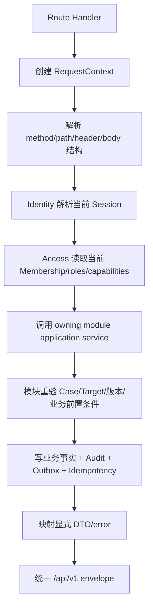
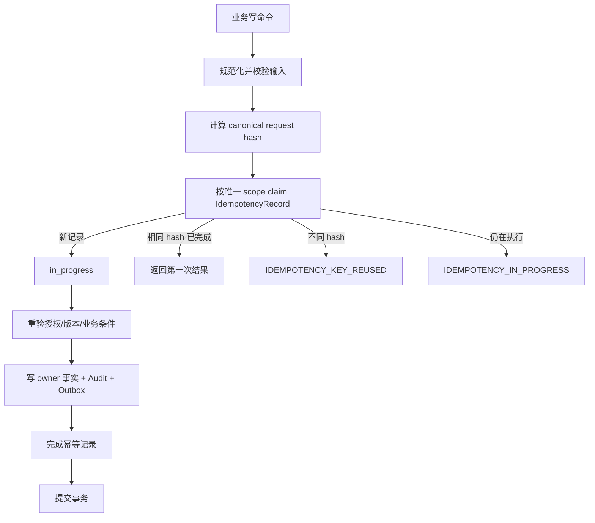

# Shared 与入口适配流程

状态：`approved`  
确认依据：项目负责人于 2026-08-25 确认受信入口流程、统一 `/api/v1/**` envelope、actor-scoped 幂等、显式运行模式和 Release 1 active registry  
设计日期：2026-08-25  
业务基线：`BR-BASELINE-20260825-v32`

返回[业务流程与状态机索引](README.md)。

业务依据：[Shared 与入口适配层模块契约](../10-module-contracts/110-shared-entry-adapters.zh-CN.md)。

## 1. 先看结论

Shared 不拥有业务流程，只提供四类技术原语：

- RequestContext；
- 统一 API envelope 和稳定错误；
- IdempotencyRecord；
- 事务、运行模式和模块边界检查。

入口适配层只负责把 HTTP、页面、Portal 或 Worker 输入翻译成已授权的业务模块命令/查询，再把结果翻译回入口响应。入口适配器不写业务表、不推进状态机、不自行决定权限。

## 2. 内部 HTTP 请求流程



规则：

- organization、actor、role、capability 和 Case scope 不能从 body、query 或客户端自定义 header 信任。
- Route Handler 只做结构校验；业务前置条件必须由 owning module 再判断。
- Route Handler 不写 SQL、不直接调用 repository、不发布业务事件、不创建 Notification。
- UI 隐藏按钮不是安全控制；服务端每次请求都重验授权。

## 3. Portal 请求流程

```text
Portal Route Handler
  -> 创建独立 RequestContext
  -> 兑换或读取 PortalSession
  -> External Portal 重验 Grant/Viewer/Case/issuer
  -> Cases 返回 portal-safe facts
  -> 映射 Portal allowlist DTO
  -> no-store + 统一拒绝响应
```

Portal 入口不调用内部 `requireIdentityActor`，不复用内部 Session Cookie、Access role 或内部业务 DTO。Portal 不能把 Guardian 转换成内部 User。

## 4. Worker 请求流程

```text
Worker entrypoint
  -> 校验 queue/outbox 来源和 schema version
  -> 建立 worker RequestContext + causation/correlation
  -> 按 event/effect identity 幂等 claim
  -> 调用指定消费者 application service
  -> 写业务事实/DeliveryReceipt/Audit（按 owner 契约）
  -> 事务提交后 ack
```

- Worker 不信任消息中的 role、permission 或过期 projection。
- Worker payload 只携带 opaque ID、版本、effect code 和受控标量。
- 重复投递不得重复创建 Task、Notification、Document Version 或其他副作用。
- 消费者失败进入有界重试或 dead-letter；未提交事务前不能 ack。

## 5. RequestContext 生命周期

```text
请求/事件进入
  -> 服务端创建 requestId/receivedAt
  -> 读取受信 correlationId/causationId
  -> 传入 owning module 和 Audit/Outbox
  -> 响应/ack 后失效
```

只包含技术上下文：

| 字段 | 规则 |
| --- | --- |
| `requestId` | 服务端生成的安全 opaque ID；返回响应并用于审计关联 |
| `receivedAt` | 服务端 UTC 时间；客户端不能覆盖 |
| `correlationId` | 跨 outbox/Worker 链路关联；只接受受信传播值 |
| `causationId` | 标识当前命令/事件的受信来源；普通请求可为空 |

RequestContext 不保存 Cookie、Token、IP、User-Agent、完整 URL/query/body、姓名、邮箱或电话。

## 6. 幂等流程



统一作用域：

```text
organization_id
  + actor_kind
  + actor_opaque_id
  + operation
  + idempotency_key
```

- `actor_kind=user`：实际 User；不能只写角色。
- `actor_kind=portal`：Portal Viewer/Grant opaque scope；不保存 Guardian 资料。
- `actor_kind=worker/system`：受控 Worker/Job/Run identity 和 causation。
- key 只是重试身份，不是授权凭证；每次重试仍重新检查授权和业务前置条件。
- 相同 scope/key + 相同 hash 重放第一次结果；不同 hash 必须冲突。
- 业务 facts、Audit、Outbox 和 Idempotency result 同一事务提交。

## 7. 统一 API envelope

正式业务 API 只使用：

```text
/api/v1/**
```

成功：

```json
{
  "api_version": "v1",
  "request_id": "opaque-id",
  "data": {}
}
```

失败：

```json
{
  "api_version": "v1",
  "error": {
    "code": "STABLE_MACHINE_CODE",
    "message": "Safe generic message",
    "request_id": "opaque-id",
    "retryable": false,
    "details": {}
  }
}
```

规则：

- `data` 和 `error` 不能同时出现。
- 私有 API 默认 `Cache-Control: no-store`，并返回 `X-Request-Id`。
- DTO 使用正向字段 allowlist；不能直接 spread domain、database row、provider response 或 Error。
- details 默认空，只允许安全的版本、diff token 或 readiness code。
- 不返回 stack、SQL、provider output、路径、环境变量、Cookie、Token、secret 或 PII。

通用分类：`INVALID_REQUEST`、`UNAUTHENTICATED`、`FORBIDDEN`、`NOT_FOUND`、`METHOD_NOT_ALLOWED`、`CONFLICT`、`STALE_VERSION`、`VALIDATION_FAILED`、`RATE_LIMITED`、`INTERNAL_ERROR`、`SERVICE_UNAVAILABLE`。

## 8. 事务与 RLS 边界

Shared 可以提供 server-only transaction runner，但必须满足：

- 每个租户事务显式设置 organization、实际 actor 和 request/correlation context；
- PostgreSQL RLS context 只在当前事务有效，连接归还池前必须清理；
- 页面、组件、浏览器 client 永远不能取得 Pool、Client 或原始 SQL；
- 一个同步事务只修改一个 owning module 的权威事实，并可同时写 Shared Idempotency、Audit、Outbox；
- 另一个模块的副作用使用公开 command 或 outbox consumer，不在 Shared 中做跨模块 SQL。

## 9. 运行模式

运行模式必须显式组合：

| 模式 | 允许 adapter | 证明范围 |
| --- | --- | --- |
| `local-synthetic` | 本地 PostgreSQL、LocalStack、ClamAV、合成数据 | Local Dev |
| `test-database` | 隔离测试数据库和测试依赖 | 测试环境 |
| `production-aws` | 批准的香港 AWS/Cognito/RDS/S3/Queue adapter | 生产部署 |

- composition root 缺配置、依赖不可用或组合不完整时 fail closed。
- 禁止静默回退到 memory、JSON、preview、mock、legacy API、其他 region 或开发凭证。
- Local、Preview 和 AWS Production 证据分别记录，不能互相替代。

## 10. 模块与入口边界

### 10.1 模块根入口

| 文件 | 用途 | 限制 |
| --- | --- | --- |
| `public.ts` | runtime-neutral types、稳定 code、公开 command/query contract | 不依赖数据库、Next.js、secret 或 `server-only` |
| `server.ts` | server-only application service 和 composition factory | 浏览器不能导入，不提供无授权通用 repository |
| `client.ts` | typed `/api/v1/**` client、输入 normalization、响应 decoder | 不含业务状态机、server secret 或数据库 |
| `app/**`、`components/**`、`workers/**` | 入口适配器 | 只能调用模块根级公开入口，不拥有业务实体 |

### 10.2 Active registry

Release 1 active registry 只包含：`shared`、`identity`、`access`、`crm`、`schools`、`cases`、`tasks`、`documents`、`notifications`、`audit`、`operations`、`external_portal`。

`Platform Billing`、`Future`、旧 Subscription/Merge/重建入口不进入 Release 1 runtime、权限、导航或正式 API。

架构门禁至少阻止：跨模块导入内部文件、browser 导入 server、Route 直接导入 repository、非 owner 写业务表、Shared 出现角色/审批/业务状态迁移。

## 11. 本模块待确认内容

请确认以下 6 点：

1. Shared 不拥有业务流程，只提供 RequestContext、API envelope、幂等、事务和边界检查。
2. 内部 HTTP、Portal、Worker 都必须先建立受信上下文，再调用 owning module；入口不直接写业务表。
3. 幂等作用域使用 organization + actor kind + opaque actor + operation + key，并与业务/Audit/Outbox 原子提交。
4. 正式 API 只使用 `/api/v1/**` 和统一 envelope；错误不泄露内部细节。
5. 运行模式显式选择，未接通或组合不完整时 fail closed，不静默回退 mock/preview/legacy。
6. active registry 不包含 Platform Billing、Future 或旧 DEC/跨模块业务状态实体。

本文件已确认。业务流程与状态机阶段全部完成，下一步进入权限与安全设计。
