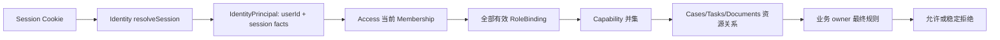

# 内部认证与授权模型

状态：`approved`  
确认依据：项目负责人于 2026-08-25 确认四个基础角色、兼容多角色、Session/角色分离、Capability 包含关系和 Contractor 单任务边界  
设计日期：2026-08-25  
业务基线：`BR-BASELINE-20260825-v32`

返回[权限与安全设计索引](README.md)。

业务依据：[Identity 与 Access 业务需求](../../business-requirements/10-identity-access.zh-CN.md)。  
模块依据：[Identity 模块契约](../10-module-contracts/10-identity.zh-CN.md)、[Access 模块契约](../10-module-contracts/20-access.zh-CN.md)。

## 1. 先看结论

授权不是“用户有某个角色就全部能看”，而是五层组合：

```text
Identity User/Session
  -> OrganizationMembership
  -> 全部有效 RoleBinding
  -> Workspace Capability
  -> Case/Task/SchoolTarget/Document 具体关系
  -> owning module 最终业务规则
```

两个模块职责必须分开：

- **Identity**：证明“这是哪个内部 User，Session 是否有效”。
- **Access**：证明“这个 User 在组织中有哪些角色、工作区能力和限时协作授权”。
- **Cases/Tasks/Documents 等 owner**：最终判断具体业务资源是否允许这次操作。

Portal、Guardian、Student 和 Contractor 不能通过内部 User 或通用角色绕过这条链。

## 2. 身份链与请求时判断



规则：

- Session 只证明 User，不携带单一“当前角色”。
- 登录时不选择角色；所有兼容角色自动合并。
- 每个服务端请求重新读取 Membership、RoleBinding、ScopeGrant、Case 关系和 TaskAssignment。
- 前端按钮、Cookie role、客户端缓存和 URL 参数都不是授权依据。
- User、Session、Membership、RoleBinding 任一失效，默认拒绝。

## 3. Release 1 基础角色

Release 1 只有四个基础角色：

| 基础角色 | 负责什么 | 默认不能做什么 |
| --- | --- | --- |
| `Founder` | 公司级决策、名单审批、高风险授权、人工结案、组织内业务监督 | 不能绕过 owning module 的资源规则；不能代替系统自动判断 |
| `Admin` | 内部账号、成员和日常系统配置 | 单独拥有 Admin 时不能查看 Case、Assessment、客户文件或客户 Task |
| `Advisor` | 学生、Case、选校、申请、Task 和文件的日常业务 | 不能脱离 Case 关系访问全组织客户数据；敏感 Scope 不能自批 |
| `Contractor` | 只处理被明确分配的单一面试辅助 Task | 不能成为 Case 成员、Application Assignee、Primary Advisor 或读取其他 Task |

不建立 `Data Reviewer` 基础角色；学校资料变更 Release 1 由 Founder 审核。

## 4. 角色组合与员工类型

### 4.1 组合规则

| 组合 | 结果 |
| --- | --- |
| Founder + Admin | 允许；同时拥有决策和账号管理能力，仍按各自 capability 使用 |
| Founder + Advisor | 允许；案件内仍需按具体 Case 关系和 owner 规则 |
| Admin + Advisor | 允许；取得 Advisor 后才按 Advisor 关系参与客户业务 |
| Founder + Admin + Advisor | 允许；权限取兼容角色并集，不需切换角色 |
| Contractor + 任意其他基础角色 | 禁止；Contractor 必须单独存在 |

### 4.2 EmployeeProfile 只限制资格，不自动授予角色

| `employment_type` | 可以分配 | 不能据此推断 |
| --- | --- | --- |
| `FULL_TIME` | Founder、Advisor；也可按管理规则拥有 Admin | 自动拥有任何角色或客户权限 |
| `PART_TIME` | Contractor；Admin 不受该字段限制 | 自动拥有 Contractor 或任何 Case 权限 |

修改员工类型时，如果与已有 RoleBinding 冲突，拒绝修改；不能静默删除角色。

## 5. Workspace Capability

Scope 固定为：

```text
case_summary
education_profile
school_targets
task_workspace
communications
identity_contact
internal_notes
```

Capability 固定为：

```text
view
comment
edit
```

包含关系：

```text
edit -> comment -> view
```

规则：

- `edit` 自动包含 `comment` 和 `view`。
- `comment` 自动包含 `view`。
- `export` 永远不是可授予 capability；默认拒绝。
- 普通 ScopeGrant 最长 7 天，可提前撤销或到期。
- `identity_contact`、`internal_notes` 属于敏感 Scope，必须 Founder 批准且禁止申请人自批。
- Scope、Capability、Case、Membership、RoleBinding 任一失效，下一请求立即拒绝。

## 6. 业务关系如何叠加

| 资源 | Founder | Admin 单独登录 | Primary Advisor | Case Collaborator | Contractor |
| --- | --- | --- | --- | --- | --- |
| Case 摘要 | 组织授权范围内查看 | 拒绝 | 自己负责 Case | 仅获授权 Case | 拒绝 |
| Assessment | 只读，按 Case 规则 | 拒绝 | 查看/编辑自己 Case | 仅按 `education_profile` scope | 拒绝 |
| Candidate List | 按 Founder 审核规则 | 拒绝 | 建立/提交自己 Case | 按授权范围 | 拒绝 |
| SchoolTarget | 组织监督和业务规则允许范围 | 拒绝 | 自己 Case | 授权 Case/Scope | 拒绝 |
| Application Task | 组织授权范围内查看 | 拒绝 | 自己 Case 和关系范围 | 当前分派范围 | 不能担任 |
| Interview Task | 组织授权范围内查看 | 拒绝 | 当前分派/案件关系 | 当前分派范围 | 仅当前 Task 脱敏 DTO |
| Case Document | 按业务规则查看 | 拒绝 | 自己 Case | 默认拒绝 | 永久拒绝 |
| ReferralSource 目录 | 创建、修改、停用并查看历史 | 拒绝 | 只读 active 目录；可为自己 Case 选择或变更来源 | 拒绝 | 拒绝 |
| 成员/角色管理 | 允许 | 允许 | 拒绝 | 拒绝 | 拒绝 |

表格只是默认边界；每个 owner 还必须重新验证资源状态、Case 关系、Assignment、expected version 和自身业务规则。

## 7. Primary Advisor、Collaborator 和 Assignee 的区别

这些都不是基础角色：

| 名称 | 本质 | 权限来源 |
| --- | --- | --- |
| Primary Advisor | Case 当前负责人关系 | Cases 当前 assignment + Advisor RoleBinding |
| Case Collaborator | 指定 Case 的限时协作关系 | Access ScopeGrant + Advisor RoleBinding + Case 校验 |
| Application Assignee | 一所学校申请 Task 的责任关系 | Tasks TaskAssignment；只能是 Primary Advisor 或有案件授权的 Advisor Collaborator |
| Interview Support Assignee | 面试辅助 Task 的责任关系 | Tasks TaskAssignment；可为 Primary Advisor、Advisor Collaborator 或 Contractor |

失去基础角色、Case 关系、ScopeGrant 或 TaskAssignment 后，访问立即失效；不能靠旧 Session 或缓存继续使用。

## 8. Contractor 的特殊边界

Contractor 的访问必须同时满足：

1. active User、Membership 和唯一 Contractor RoleBinding；
2. 当前 active TaskAssignment；
3. Task 类型为 `interview_support`；
4. Task 未完成、取消或重派；
5. 返回固定 `task_only` 脱敏 DTO。

Contractor 不会因此成为 Case Collaborator、Application Assignee、Primary Advisor 或案件成员。

Task 拒绝、完成、取消、重派或 Case 结案后，下一请求立即拒绝 Contractor 工作区。

## 9. 高风险操作与默认拒绝

以下操作必须使用更严格的 server-side use case，并成功写 AuditEvent：

- 分配或撤销 Founder/Admin/Advisor/Contractor 角色；
- 禁用 Membership 或撤销全部 Session；
- 授予/批准/撤销 `identity_contact`、`internal_notes` 等敏感 Scope；
- Founder 名单审批、Guardian 代录确认、offer 决定和人工结案；
- 文件下载/导出、legal hold、最终清理；
- Portal Grant 创建/撤销；
- 高风险读取和批量查询。

默认拒绝规则：

- 无法确认组织、User、Membership、RoleBinding、Case 关系或当前 Assignment 时拒绝；
- expected version 不匹配时返回稳定 `STALE_VERSION`；
- 不为“方便页面显示”增加全局读取能力；
- 不因用户同时拥有多个角色而跳过资源 owner 的最终判断。

## 10. 撤销与失效传播

```text
disable User / Membership / RoleBinding / ScopeGrant / Assignment
  -> 下一请求重新读取当前事实
  -> 拒绝旧 Session 的业务访问
  -> 必要时撤销 Session / capability / active PortalSession
  -> 写 AuditEvent 和受控 Operations effect
```

失效不是后台清理完成后才生效；请求时判断必须立即看到撤销结果。

## 11. Portal 与内部授权完全分离

| 对象 | 内部系统 | Guardian Portal |
| --- | --- | --- |
| 身份 | Identity User + Session | PortalViewer + PortalGrant + PortalSession |
| 角色 | Founder/Admin/Advisor/Contractor | 无内部角色 |
| 数据范围 | Organization + Case/Task/Document 关系 | 单一 Case + 对客 allowlist |
| 写入 | 按 owner 命令 | 永久拒绝业务写入 |
| 审计 | tenant AuditEvent | 同样写 AuditEvent，但使用 Portal actor kind |

Portal 不能兑换成内部 User，也不能使用内部 Cookie、Access role 或 ScopeGrant。

## 12. 本模块待确认内容

请确认以下 6 点：

1. Release 1 只有 Founder、Admin、Advisor、Contractor 四个基础角色，不增加 Data Reviewer。
2. Founder、Admin、Advisor 可以兼容组合；Contractor 与任何其他基础角色互斥。
3. 登录不选择角色；所有有效兼容角色自动合并，Session 只证明 User 身份。
4. Admin 单独登录不能访问 Case、Assessment、客户文件或客户 Task。
5. `edit > comment > view`，export 永远拒绝；敏感 Scope 需要 Founder 批准且禁止自批。
6. Contractor 只能通过当前 interview support TaskAssignment 获得单任务脱敏访问。

本文件已确认。下一步进入高风险操作、审计、限流和数据泄露防护设计。
